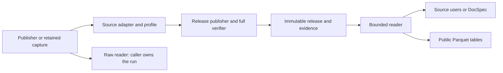

# Find the code that owns a change

Publisher bytes enter a source adapter. Its profile supplies scope, parsing,
identity and selection rules. The release engine publishes evidence and records;
readers open that release, or optional table profiles produce Parquet.

Paths below are relative to `src/spicy_docs/`.

## Sources

| Change | Start here |
| --- | --- |
| Federal Register pages and date windows | `sources/federal_register/native.py` |
| XML-first body fetching; pure identity checks | `sources/federal_register/body_acquisition.py`; `body_sources.py`; `body_xml.py` |
| Publisher text and printed List of Subjects | `sources/federal_register/body_text.py` checks text identity; `list_of_subjects.py` owns shared XML/text block and atom reading |
| Explicit CFR/eCFR captures and native identity | `sources/cfr/acquisition.py`; `ecfr.py`; `annual.py` |
| GovInfo MODS package/constituent metadata | `sources/govinfo/mods.py`; CFR edition checks in `sources/cfr/edition.py` |
| GovInfo package bodies by package id (reports, hearings, the Record, documents, directories, bills) | `sources/govinfo/body_acquisition.py` captures; `bodies.py` holds the one package-id grammar, the keyless rendition locators and the body identity rules; `error_page.py` is the leaf module holding the publisher's error page and its two witnesses, which the Federal Register granule route also calls |
| Which CRPT package is a committee activity report | `sources/govinfo/activity_reports.py` holds the title rule, the bare-word alternative it rejects and its version. The rule is a selection over a `published` listing row, not an interpretation of a body, and it lives here rather than in `tools/` because the wheel does not ship `tools/`: spicy-regs and both analysis tools import it |
| USLM documents (GovInfo laws and compilations, OLRC U.S. Code) | `sources/govinfo/uslm.py` holds `UslmScan`, bound per publisher by namespace and body sections; `reading/zip_archive.py` is the one bounded zip reader; `uslm_acquisition.py` and `uscode/acquisition.py` capture |
| Publisher list pages | `reading/paged_json.py` one traversal rule, including each family's reach bounds; `sources/congress/listing.py`, `sources/govinfo/discovery.py`, `sources/lda.py`, `sources/courtlistener/search.py`, `sources/sam.py`, `sources/usaspending.py`, `sources/fcc_ecfs.py` state each publisher's contract; `sources/gao/rss.py` reads the feed; `cli/list_pages.py` walks any family from the command line |
| Unified Agenda editions | `sources/unified_agenda/` |
| U.S. Code, Supreme Court, CBO | `sources/uscode/` (release points, archives, Popular Name Tool, Table III); `sources/supreme_court.py`; `sources/cbo.py` |
| Document files beside listings | `sources/congress/crs_files.py`; `sources/gao/files.py`; `sources/regulations_gov/api.py` and `attachments.py`; PDF checks in `reading/pdf_bytes.py` |
| Explicit bill status and selected text XML | `sources/congress/bill_acquisition.py`; `bill_status.py`; `bill_text.py`; `bulk_status.py` reads one Congress/type BILLSTATUS zip through `reading/zip_archive.py` |
| One House committee meeting's agenda, keyless by event id | `sources/congress/house_committee_repository.py` reads docs.house.gov's per-event XML and builds its static locator; `interpretation/hearing_bill_links.py` holds the two hearing-to-bill link rules and checks the committee-and-date identity before joining either to a CHRG package |
| House executive communications the Congressional Record printed | `sources/congress/record_communications.py` reads one CREC `EXECUTIVE COMMUNICATIONS, ETC.` granule's text into one record per printed entry, with the publisher's three normalizations, a versioned rule identity and the per-issue contiguity witness |
| GAO pages | `sources/gao/native.py` |
| Captured public comments | `sources/public_comments/native.py` |
| Raw streams | `sources/mirrulations.py`, `sources/courtlistener/bulk.py` |
| Shared S3 listing grammar | `reading/s3_listing.py`; `sources/courtlistener/listing.py` adds source facts |
| FEC metadata, source routes and selected originals | `sources/fec/` |

Each native source's `profile.py` connects its rules to `SourceNativeProfile`
in `releases/profile.py`. For Regulations.gov, use
`sources/regulations_gov/`: `acquisition.py` fetches, `evidence.py` packs captures,
`records.py` classifies, `scope.py` checks coverage, and `validation.py` checks
structures. `definitions.py` and `schemas.py` declare the data shapes.

## Releases and storage

| Change | Start here |
| --- | --- |
| Index and select observations | `releases/indexing.py`, `observations.py` |
| Stage, verify and publish | `releases/publish.py` |
| Independently reconstruct and compare evidence | `releases/replay.py`, `verify.py` |
| Open and read records, outcomes or evidence | `releases/admission.py`, `reader.py` |
| Retain refused-response diagnostics | `releases/refusals.py` |
| Format, partitions and path checks | `releases/format.py`, `partitions.py`, `paths.py` |
| Map shared storage to source references | `storage/blobs.py`, `publication.py` |

Rulespec owns canonical encoding, artifact admission, atomic publication and
bounded physical blob writes. SpicyDocs owns source meanings and references.
[Choose the right check](releases.md#choose-the-right-check): ordinary opening
checks integrity with bounded memory; full verification also replays source meaning.

## Tables, commands and helpers

- **PDF/image extraction:** `extraction/api.py` composes injected page strategies;
  `model.py` declares results and interfaces, `pages.py` decodes retained bytes,
  and `ocr.py`/`gemini.py` adapt optional recognition providers. `tests/extraction/`
  checks data retention, coordinates, errors and injection. No source adapter depends
  on extraction and no model package loads through core imports.
- **Reconstruction:** `reconstruction/` builds a publisher's own vocabulary from
  a rendition that has none, behind the `reconstruct` extra. `profiles.py` holds
  the per-family rule table and the schema bundle pinned by digest, `evidence.py`
  the evidence-linked document model built from `extraction`'s retained pages or
  the markup reader's events, `parse.py` the deterministic parser and the model
  seam, `serialize.py` the target XML plus a sidecar source map, `validate.py` the
  five findings and the gates. It depends on `extraction` and `reading`, never the
  other way round, and no source adapter depends on it. See
  [reconstruction](reconstruction.md).
- **Document capture schemas:** `schemas/document_capture/1.0/` ships the
  family profiles that compose Rulespec's `DocumentCapture v1` parent schema,
  with four Rulespec files vendored beside them and pinned in `PINS.json`: the
  parent, the profile meta-schema that states the composition rule as data,
  the invariant validator (`rulespec/document_capture.py`) and the
  `SourceFragment` schema. The three new ones are copies only until the
  `rulespec-artifacts` pin moves; nothing here re-implements them. Package
  data plus one vendored module: the converter that produces captures is the
  diagnostic `tools/analysis/document_capture.py`, and
  `tests/test_document_capture.py` re-validates the committed captures
  offline, resolves their fragments against the inputs and refuses a mutated
  capture. See the [design record](research/document-capture-schema-2026-09-19.md).
- **Tables:** `public_tables/profiles.py` declares columns and ordering through
  `PublicTableProfile`; `publish.py`, `verify.py` and `reader.py` implement the
  operations exported by `public_tables/api.py`.
- **Commands:** `cli/arguments.py` defines syntax, `sources.py` registers source
  composition, and `source_native.py` runs it. `cli/campaign.py` owns campaigns;
  `cli/fec.py` exposes independent raw FEC acquisition.
- **Transport:** `transport/source_acquirer.py` is the shared acquirer shape (budget checks, lifecycle, capture then validate); `transport/acquisition.py` composes clients, `http.py` implements
  HTTPX calls, and `download.py` streams bounded assets to the shared blob writer.
  `capture.py` retains bounded regulation/bill captures and refused bytes;
  `retry.py` and `credentials.py` hold shared request rules.
- **Source helpers:** `reading/json_input.py`, `media_types.py` and `evidence_zip.py`
  share parsing/encoding; `source_domains.py` owns documented-value comparisons.
- **Maintenance tools:** [scripts](../scripts/README.md) check repository inputs;
  [tools](../tools/README.md) investigate retained corpus evidence.

## Imports and tests

Use the [supported public entry points](decisions.md#supported-entry-points)
from other applications. Internal code imports the implementation owner directly.
Commands depend on sources and releases; these depend on shared format/storage
primitives. Keep package initializers and reader imports lightweight.

`tests/releases/` covers publication, selection, failures, bounds and storage.
`tests/regulations_gov/` covers that source's records, scope and evidence. Their
`fixtures.py` files and `tests/source_fixtures.py` share routine setup; malformed
artifact construction stays independent in `tests/source_native_release_fixtures.py`.
See [focused checks](../CONTRIBUTING.md#run-focused-checks) for source tests.
