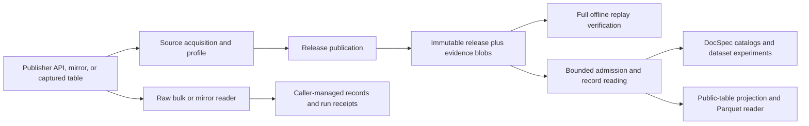

# Architecture and change ownership

A raw reader yields source records for a caller that owns its run. Source-native
acquisition additionally retains accepted evidence and bounded refused-response diagnostics,
checks source coverage for a named scope, publishes immutable artifacts, and supports independent replay.

## Two profiles with distinct jobs

| Type | What it describes | What it does not own |
| --- | --- | --- |
| `SourceNativeProfile` in `releases/profile.py` | Source scope, evidence decoding, schema, identity, observation selection, and completeness | Generic artifact hashing or downstream interpretation |
| `PublicTableProfile` in `public_tables/profiles.py` | Flat columns, projection, partitioning, and ordering | Acquiring source evidence |

Rulespec Artifacts owns canonical byte identity, manifests, and structural
artifact admission. Reuse its functions; a second canonical encoder would make
identity depend on the caller.

## Module map

| Responsibility | Implementation |
| --- | --- |
| Source profiles | `sources/federal_register/profile.py`, `sources/regulations_gov/profile.py`, `sources/gao/profile.py`, `sources/public_comments/profile.py` |
| Federal Register acquisition | `sources/federal_register/native.py` |
| Regulations.gov | `sources/regulations_gov/`: `definitions.py` declares fields and data shapes; `validation.py` checks source structures; `records.py` classifies records; `schemas.py` declares schemas; `scope.py` checks scope and completeness; `evidence.py` packs/decodes captures; `acquisition.py` captures pages. |
| GAO exact-page capture | `sources/gao/native.py` |
| Captured public comments | `sources/public_comments/native.py` |
| Raw readers | `sources/mirrulations.py`, `sources/courtlistener_bulk.py` |
| Shared source mechanics | `sources/json_input.py`, `sources/media_types.py` |
| Public release API and source profile interface | `source_native.py` exports the current reader/publisher API; implementations and `profile.py` live in `releases/` |
| Release format and payloads | `releases/format.py`, `releases/partitions.py`; blob access in `storage/blobs.py` |
| Observation selection and publication | `releases/observations.py`, `releases/indexing.py`, `releases/publish.py`; path preflight in `releases/paths.py`; immutable filesystem publication in `storage/publication.py` |
| Full offline verification | `releases/replay.py` reconstructs evidence; `releases/verify.py` compares published output |
| Bounded admission and reading | `releases/admission.py`, `releases/reader.py` |
| Public-table output | `public_tables/format.py` defines layout; `publish.py` indexes and writes; `verify.py` owns admission and the full row gate. `public_tables/profiles.py` owns source projections. |
| Public-table consumption | `public_tables/api.py` exports the library API; `reader.py` owns admitted locations and exact Parquet member reading. |
| Publisher-domain drift | `sources/source_domains.py` owns pinned document parsing and exact-value comparisons. |
| Shared evidence encoding | `sources/evidence_zip.py` defines deterministic ZIP member metadata. |
| Transport | `transport/acquisition.py`, `transport/retry.py`, `transport/credentials.py`, `sources/zyte.py` |
| Operator commands | `cli/source_native.py` handles commands; `cli/arguments.py` defines syntax; `cli/sources.py` registers scope, acquisition, errors, and optional tables |
| Campaigns and source-specific operational acquisition | `cli/campaign.py`, `sources/federal_register/replay.py`, and `sources/congress/crs_summaries.py`; see [operator commands](cli.md#campaigns-replay-and-source-tools) |
| Repository checks and receipt analysis | [scripts](../scripts/README.md) update/check repository inputs; [tools/analysis](../tools/README.md) answers bounded questions about retained evidence. |

Dependencies point from commands to sources and release operations, then to
format definitions, stores, and Rulespec. Package initializers stay lightweight.
Directly importing a source-owned profile avoids unrelated sources. Federal
Register's profile and offline replay also avoid live transport imports, as
checked by the reader dependency tests. GAO imports its own Zyte response type;
that import does not perform a request. The package root keeps `__init__.py`
and five export modules
used by current downstream consumers: `federal_register_source_native.py`,
`regulations_gov_source_native.py`, `source_native.py`,
`source_native_profiles.py`, and `source_native_store.py`. These are import
surfaces; source, release, and storage packages own the implementation. New
internal code imports the owner directly. See the
[supported entry points](maintenance-decisions.md#supported-entry-points).

## Checks have distinct purposes

Publication verifies its staged result before making a new directory visible
once. Full verification reconstructs successful observations from retained
evidence; bounded admission checks an artifact for opening under an accepted
verifier identity. The [release guide](releases.md#choose-the-right-check)
explains each check and its limits. Reader dependency tests protect the bounded
opening path for DocSpec.

Source tests own publisher-specific meaning. Shared release tests own selection,
tampering, failure records, bounds, and publication. Independently constructed
malformed artifacts remain independent of the publisher under test.

## Test map

`tests/releases/` groups publication, selection, acquisition, failures, storage,
reading, and compatibility. `tests/regulations_gov/` groups record rules, scope,
evidence, release integration, and observation selection. Each has a focused
`fixtures.py`. Routine cross-source encoding and inspection live in
`tests/source_fixtures.py`; independent malformed artifact construction remains
in `tests/source_native_release_fixtures.py`. Other source, CLI, and import-boundary
tests remain directly under `tests/`.

See [maintenance decisions](maintenance-decisions.md) for public API dispositions,
preserved historical rules, and the review of remaining long functions.
