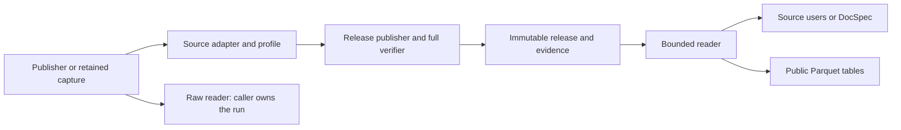

# Find the code that owns a change

Publisher bytes enter a source adapter. Its profile supplies scope, parsing,
identity and selection rules. The release engine publishes evidence and records;
readers open that release, or optional table profiles produce Parquet.

Paths below are relative to `src/spicy_docs/`.

## Sources

| Change | Start here |
| --- | --- |
| Federal Register pages and date windows | `sources/federal_register/native.py` |
| XML-first body fetching; pure identity checks | `sources/federal_register/body_acquisition.py`; `body_sources.py`; `body_xml.py` |
| Explicit CFR/eCFR captures and native identity | `sources/cfr/acquisition.py`; `ecfr.py`; `annual.py` |
| GovInfo MODS package/constituent metadata | `sources/govinfo/mods.py`; CFR edition checks in `sources/cfr/edition.py` |
| GAO pages | `sources/gao/native.py` |
| Captured public comments | `sources/public_comments/native.py` |
| Raw streams | `sources/mirrulations.py`, `sources/courtlistener_bulk.py` |
| CourtListener listing grammar | `sources/courtlistener_listing.py` |

Each native source's `profile.py` connects its rules to `SourceNativeProfile`
in `releases/profile.py`. For Regulations.gov, use
`sources/regulations_gov/`: `acquisition.py` fetches, `evidence.py` packs captures,
`records.py` classifies, `scope.py` checks coverage, and `validation.py` checks
structures. `definitions.py` and `schemas.py` declare the data shapes.

## Releases and storage

| Change | Start here |
| --- | --- |
| Index and select observations | `releases/indexing.py`, `observations.py` |
| Stage, verify and publish | `releases/publish.py` |
| Independently reconstruct and compare evidence | `releases/replay.py`, `verify.py` |
| Open and read records, outcomes or evidence | `releases/admission.py`, `reader.py` |
| Retain refused-response diagnostics | `releases/refusals.py` |
| Format, partitions and path checks | `releases/format.py`, `partitions.py`, `paths.py` |
| Map shared storage to source references | `storage/blobs.py`, `publication.py` |

Rulespec owns canonical encoding, artifact admission, atomic publication and
bounded physical blob writes. SpicyDocs owns source meanings and references.
[Choose the right check](releases.md#choose-the-right-check): ordinary opening
checks integrity with bounded memory; full verification also replays source meaning.

## Tables, commands and helpers

- **Tables:** `public_tables/profiles.py` declares columns and ordering through
  `PublicTableProfile`; `publish.py`, `verify.py` and `reader.py` implement the
  operations exported by `public_tables/api.py`.
- **Commands:** `cli/arguments.py` defines syntax, `sources.py` registers source
  composition, and `source_native.py` runs it. `cli/campaign.py` owns campaigns.
- **Transport:** `transport/acquisition.py` composes clients, `http.py` implements
  HTTPX calls, and `retry.py` and `credentials.py` hold shared request rules.
- **Source helpers:** `sources/json_input.py`, `media_types.py` and `evidence_zip.py`
  share parsing/encoding; `source_domains.py` owns documented-value comparisons.
- **Maintenance tools:** [scripts](../scripts/README.md) check repository inputs;
  [tools](../tools/README.md) investigate retained corpus evidence.

## Imports and tests

Use the [supported public entry points](decisions.md#supported-entry-points)
from other applications. Internal code imports the implementation owner directly.
Commands depend on sources and releases; these depend on shared format/storage
primitives. Keep package initializers and reader imports lightweight.

`tests/releases/` covers publication, selection, failures, bounds and storage.
`tests/regulations_gov/` covers that source's records, scope and evidence. Their
`fixtures.py` files and `tests/source_fixtures.py` share routine setup; malformed
artifact construction stays independent in `tests/source_native_release_fixtures.py`.
See [focused checks](../CONTRIBUTING.md#run-focused-checks) for source tests.
