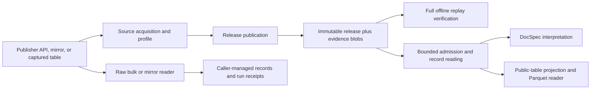

# Architecture and change ownership

A raw reader yields source records for a caller that owns its run. Source-native
acquisition additionally retains exact evidence, establishes completeness for a
named scope, publishes immutable artifacts, and supports independent replay.

## Three profiles with distinct jobs

| Type | What it describes | What it does not own |
| --- | --- | --- |
| `SourceProfile` in `source_profiles.py` | Declared fields, source capabilities, access scope, and observed drift | Release publication and record selection |
| `SourceNativeProfile` in `source_native_profile.py` | Source scope, evidence decoding, schema, identity, observation selection, and completeness | Generic artifact hashing or downstream interpretation |
| `PublicTableProfile` in `public_table_profiles.py` | Flat columns, projection, partitioning, and ordering | Acquiring source evidence |

Rulespec Artifacts owns canonical byte identity, manifests, and structural
artifact admission. Reuse its functions; a second canonical encoder would make
identity depend on the caller.

## Module map

| Responsibility | Implementation |
| --- | --- |
| Source profiles | `sources/federal_register/profile.py`, `sources/regulations_gov/profile.py`, `sources/gao/profile.py`, `sources/public_comments/profile.py` |
| Federal Register acquisition | `federal_register_source_native.py` |
| Regulations.gov acquisition | `regulations_gov_source_native.py` |
| GAO exact-page capture | `gao_product_pages_source_native.py` |
| Captured public comments | `spicy_regs_public_tables_source_native.py` |
| Raw readers | `sources/mirrulations.py`, `sources/courtlistener_bulk.py` |
| Shared source mechanics | `sources/json_input.py`, `sources/media_types.py` |
| Shared release machinery | `source_native.py`; blob access in `source_native_store.py`; immutable filesystem publication in `publication.py` |
| Public-table output and reading | `public_table.py`, `public_table_profiles.py` |
| Transport | `transport/retry.py`, `sources/zyte.py`; source-specific I/O selected at the CLI boundary |
| Operator commands | `source_native_cli.py` |

Dependencies point from commands to sources and release operations, then to
format definitions, stores, and Rulespec. Package initializers stay lightweight.
Directly importing a source-owned profile must not import unrelated sources or
live transports. `source_native_profiles.py` remains a compatibility re-export
for callers that compose all supported sources.

## Checks have distinct purposes

Publication indexes observations on disk, selects according to source policy,
stages members, verifies the staged result, then makes a new directory visible
once. A destination is never overwritten.

Full verification reconstructs records from retained evidence and compares the
result to published data. Consumer admission performs bounded opening checks
under an accepted verifier identity; it does not replay the corpus on each open.
Reader dependency tests protect this distinction for DocSpec.

Source tests own publisher-specific meaning. Shared release tests own selection,
tampering, failure records, bounds, and publication. Independently constructed
malformed artifacts remain independent of the publisher under test.
