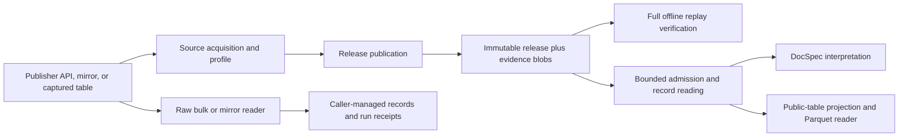

# Architecture and change ownership

A raw reader yields source records for a caller that owns its run. Source-native
acquisition additionally retains exact evidence, establishes completeness for a
named scope, publishes immutable artifacts, and supports independent replay.

## Three profiles with distinct jobs

| Type | What it describes | What it does not own |
| --- | --- | --- |
| `SourceProfile` in `source_profiles.py` | Declared fields, source capabilities, access scope, and observed drift | Release publication and record selection |
| `SourceNativeProfile` in `source_native_profile.py` | Source scope, evidence decoding, schema, identity, observation selection, and completeness | Generic artifact hashing or downstream interpretation |
| `PublicTableProfile` in `public_table_profiles.py` | Flat columns, projection, partitioning, and ordering | Acquiring source evidence |

Rulespec Artifacts owns canonical byte identity, manifests, and structural
artifact admission. Reuse its functions; a second canonical encoder would make
identity depend on the caller.

## Module map

| Responsibility | Implementation |
| --- | --- |
| Source profiles | `sources/federal_register/profile.py`, `sources/regulations_gov/profile.py`, `sources/gao/profile.py`, `sources/public_comments/profile.py` |
| Federal Register acquisition | `federal_register_source_native.py` |
| Regulations.gov | `sources/regulations_gov/`: `definitions.py` declares fields and data shapes; `validation.py` checks source structures; `records.py` classifies records; `schemas.py` declares schemas; `scope.py` checks scope and completeness; `evidence.py` packs/decodes captures; `acquisition.py` captures pages. `regulations_gov_source_native.py` preserves public imports. |
| GAO exact-page capture | `gao_product_pages_source_native.py` |
| Captured public comments | `spicy_regs_public_tables_source_native.py` |
| Raw readers | `sources/mirrulations.py`, `sources/courtlistener_bulk.py` |
| Shared source mechanics | `sources/json_input.py`, `sources/media_types.py` |
| Public release API | `source_native.py` preserves existing imports; implementations live in `releases/` |
| Release format and payloads | `releases/format.py`, `releases/partitions.py`; blob access in `source_native_store.py` |
| Observation selection and publication | `releases/observations.py`, `releases/indexing.py`, `releases/publish.py`; immutable filesystem publication in `publication.py` |
| Full offline verification | `releases/replay.py` reconstructs evidence; `releases/verify.py` compares published output |
| Bounded admission and reading | `releases/admission.py`, `releases/reader.py` |
| Public-table output | `public_tables/format.py` defines layout; `publish.py` indexes and writes; `verify.py` owns admission and the full row gate. `public_table_profiles.py` owns source projections. |
| Public-table consumption | `public_tables/reader.py` owns locations and reading; `iceberg.py` adopts exact files through an injected table. `public_table.py` preserves public imports. |
| Transport | `transport/acquisition.py`, `transport/retry.py`, `sources/zyte.py` |
| Operator commands | `source_native_cli.py` handles commands; `cli/arguments.py` defines syntax; `cli/sources.py` registers scope, acquisition, errors, and optional tables |

Dependencies point from commands to sources and release operations, then to
format definitions, stores, and Rulespec. Package initializers stay lightweight.
Directly importing a source-owned profile must not import unrelated sources or
live transports. `source_native_profiles.py` remains a compatibility re-export
for callers that compose all supported sources.

## Checks have distinct purposes

Publication indexes observations on disk, selects according to source policy,
stages members, verifies the staged result, then makes a new directory visible
once. A destination is never overwritten.

Full verification reconstructs records from retained evidence and compares the
result to published data. Consumer admission performs bounded opening checks
under an accepted verifier identity; it does not replay the corpus on each open.
Reader dependency tests protect this distinction for DocSpec.

Source tests own publisher-specific meaning. Shared release tests own selection,
tampering, failure records, bounds, and publication. Independently constructed
malformed artifacts remain independent of the publisher under test.

## Test map

`tests/releases/` groups publication, selection, acquisition, failures, storage,
reading, and compatibility. `tests/regulations_gov/` groups record rules, scope,
evidence, release integration, and observation selection. Each has a focused
`fixtures.py`. Routine cross-source encoding and inspection live in
`tests/source_fixtures.py`; independent malformed artifact construction remains
in `tests/source_native_release_fixtures.py`. Other source, CLI, and import-boundary
tests remain directly under `tests/`.
