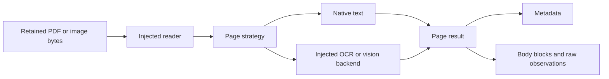

# Extract PDF and image content through injected components

SpicyDocs exposes one page-streaming Python API for retained PDF and image bytes.
The caller supplies a strategy and can replace the document reader or recognition
backend. SpicyDocs owns these optional, reusable extraction adapters; DocSpec
continues to own document lifecycle, retained stages, retries and dataset execution.
This is a Python library API; it does not start an HTTP service.

For pypdf's exact embedded page strings, use the smaller
[page-text reader](../pdf-page-text.md). Its optional dependency and output stay
separate from the rendering and recognition backends below.

Dependency injection means passing these objects into constructors. There is no
global registry: a source-specific caller constructs the extractor it needs.



```python
from spicy_docs.extraction import DocumentExtractor, FullPage, NativeText, NativeWithRegions, Box
from spicy_docs.extraction.ocr import RapidOCR, AppleVision, MLX
from spicy_docs.extraction.gemini import Gemini, GeminiClient

native = DocumentExtractor(NativeText())
local_ocr = DocumentExtractor(FullPage(RapidOCR()))
apple_ocr = DocumentExtractor(FullPage(AppleVision()))
local_vision = DocumentExtractor(FullPage(MLX.lighton()))
tables = DocumentExtractor(FullPage(MLX.glm(task="table")))

with GeminiClient(api_key=key) as client:
    regional = DocumentExtractor(
        NativeWithRegions(
            Gemini(client),
            regions={1: [Box(0, 0, 1, 0.15)]},
        )
    )
    thorough = DocumentExtractor(FullPage(Gemini(client, mode="multiturn")))
    for result in thorough.extract(pdf_bytes, media_type="application/pdf", pages=[1]):
        print(result.text)
        # Metadata, observations, rendered inputs and raw responses remain separate.
```

The same `extract` call accepts an image media type. A native-only strategy refuses
image input because an empty native layer would not establish an empty image.

## Install and configure

Install `[pdf]` for the default PDF/image reader and add the provider you use:
`[pdf,pdf-rapidocr]`, `[pdf,pdf-apple]`, `[pdf,pdf-mlx]`, or `[pdf,pdf-gemini]`.
See [installation](../installation.md). Apple Vision requires macOS; MLX requires
Apple Silicon. The MLX backend downloads the selected pinned model on first use.
Core imports and injected readers/backends require no rendering or model packages.

| Component | Caller controls |
| --- | --- |
| `DefaultReader` | `dpi`, `max_pixels` |
| `DocumentExtractor` | strategy, reader, `max_input_bytes`, `tables`, selected pages, per-page overrides |
| `RapidOCR` | injected engine or ONNX engine keyword options, including thread counts |
| `AppleVision` | accurate/fast recognition, languages, injected engine factory |
| `MLX` | model, revision, prompt, token limit, temperature, seed; `lighton()` and `glm(task=...)` supply saved defaults |
| `Gemini` | injected generation client, model, single/multi-turn mode, generation settings, single-call and multi-turn prompts, covering strips |
| `GeminiClient` | credential, injected HTTP client, timeout, response byte limit |

`GeminiClient` closes only an HTTP client it created. `MLX.close()` releases its
references to the loaded model. Share a local engine across pages in one serial
worker; create separate instances for concurrent workers. Callers own injected
components and their cleanup. Iterate page results to exhaustion or explicitly
close the generator when stopping early.

An ordinary extractor remains the document default; override only selected pages:

```python
extractor = DocumentExtractor(NativeText())
for page in extractor.extract(
    pdf_bytes,
    media_type="application/pdf",
    overrides={3: FullPage(MLX.lighton())},
):
    retain(page)  # Application-owned storage.
```

The [offline example](../../examples/pdf_extraction.py) demonstrates the same pattern
with an injected test backend and a known native document.

## Small interfaces, explicit choices

- `DocumentReader.open(bytes, media_type)` returns an owned document supporting
  page count and page access. The default uses PyMuPDF for PDFs and Pillow for images.
- A `Page` provides native blocks and a rendered image on demand. Native extraction
  does not render the page. Full-page and regional strategies render once per page.
- A `PageStrategy.extract(page)` produces blocks and separately retained observations.
  `NativeText`, `FullPage` and `NativeWithRegions` implement it. An injected strategy
  can implement source-specific routing; built-ins never guess the best model.
- An `ImageBackend.recognize(image)` returns text, optional boxes, effective
  configuration and raw outputs. RapidOCR, Apple Vision, MLX and Gemini implement it.
  Gemini accepts an injected client; OCR backends retain their loaded engine across pages.

These interfaces are structural Python `Protocol`s. A new backend only implements
`recognize`; it need not inherit a base class or change the extractor:

```python
from spicy_docs.extraction import Raster, Recognition


class MyOCR:
    def __init__(self, client):
        self.client = client

    def recognize(self, image: Raster) -> Recognition:
        raw = self.client.read_image(image.data)
        return Recognition(raw["text"], {"backend": "my-ocr"}, raw)
```

When supplying blocks, their joined text must preserve the complete recognition
text. Backend boxes describe the supplied image; SpicyDocs maps them back to the
page. A model's region reference describes the image it inspected, not exact glyph
coordinates or proof that its transcription is correct.

`DocumentExtractor` validates input size, media type and page selection before
recognition. It yields one page result at a time. Explicit per-page strategy
overrides support mixed PDFs without a registry, service container or second
processing framework. Optional dependencies are imported only when used.

The API holds the source bytes and one page result at a time unless the caller
collects results. Rendering and remote responses have explicit size bounds.
Multi-turn extraction retains each complete request and response; history storage
and transmitted image bytes grow quadratically with strip count, bounded to eight
strips. Native extraction makes no model calls; regional extraction makes one
backend invocation per selected region. Regional overlap checks are quadratic in
region count, capped at 64 per page; native-to-region checks are linear in native
blocks times region count. No automatic retries multiply that work.

Every result identifies original source bytes and page/frame number. Boxes use
normalized displayed-page coordinates with a top-left origin. Renderer metadata
records PDF rotation/crop geometry or image orientation; raw provider coordinates
remain available. Regional extraction keeps native text outside reviewed regions,
retains replaced native observations, and refuses overlapping regions or clipped
nonblank native lines. It does not vote competing amounts into source facts.

Multi-turn Gemini keeps the full conversation and raw continuation signatures:
full page, covering strips, then final JSON. References must name supplied images.
A malformed, truncated, refused or blocked response raises an extraction error
with retained diagnostic data; it is never converted to an empty successful page.
If a later region fails, the error retains the earlier regional observations and
the failed image. Credential scrubbing applies before retaining remote responses.
Credential refusals remain `CredentialRefusedError`. Input selection/configuration
errors raise `ValueError`; renderer and local SDK errors can propagate directly.
A yielded page is complete for its requested strategy. Earlier yielded pages do
not establish completion when a later page fails or the caller stops early.
Raw generated HTML, including `input` value attributes, remains intact. Generated
image filenames are text, not proof that an asset exists.

Source bytes remain caller-owned. SpicyDocs does not publish an extraction as a
source-native release, choose a source's default processor or establish financial
correctness. The [saved choices](pdf-extraction-choices.md) record the evidence
and quality limitations behind each backend.

## Table geometry

`DocumentExtractor(strategy, tables=True)` runs PyMuPDF's `page.find_tables()`
on each retained PDF page and attaches the result to `PageResult.tables`, a
tuple of frozen `TableObservation` records (`page`, `bbox`, `row_count`,
`column_count`, `cells` as a tuple of rows of cell text (`None` where PyMuPDF
finds no cell region at that position, not just an empty ruled cell),
per-cell `cell_boxes` in the same normalized displayed-page coordinates as
`TextBlock.box` (`None` at the same positions as `cells`), and `confidence`,
always `None` for PyMuPDF's table finder, which states none).
It is independent of `strategy` and never merged into `PageResult.text` or
`content.blocks`: B5 of `docs/research/closing-the-gaps-2026-09-19.md`
measured PyMuPDF's line-by-line native text destroying real appropriations
account rows (every label, then every amount, in column order), so a table
observation is the row PyMuPDF's own ruling found, or nothing -- never a
text-side guess folded back into the line-by-line output. `tables` defaults
to `False`; no existing caller's output or per-page cost changes.

```python
extractor = DocumentExtractor(NativeText(), tables=True)
for page in extractor.extract(pdf_bytes, media_type="application/pdf"):
    for table in page.tables:
        print(table.row_count, table.column_count, table.cells[0])
```

PyMuPDF finds a table only where the PDF carries a ruled grid, and reports
one row per ruled band, not one row per printed line: a committee report
often rules only a table's header, its whole account block and its total, so
one `TableObservation` row can hold many newline-joined account lines in one
cell rather than one account per row (see the pinned real-page test in
`tests/extraction/test_api.py` and its fixture's README). [The measured
row-recovery rate on two real committee reports](../sources/govinfo-bodies.md#table-geometry-recovered-from-the-pdf),
and the verdict on when reaching for it is worth the cost, are in the GovInfo
bodies doc. Image input and a PDF page with no ruled table both leave
`PageResult.tables` empty; that is not an error.

The adapter checks cover known text/geometry, blank controls, raw output retention,
invalid responses, credential scrubbing and optional-import boundaries. Small live
and local smoke checks use retained FEC pages; their receipts are under
`~/Work/corpora/supply-2026-09-02/receipts/spicydocs-extraction-api-2026-09-14/`.
They check integration, not a new quality ranking or production throughput.
