# Legislative-branch data map: coverage, candidates, sequencing

Status: reference + proposal, not started. Written 2026-09-18 against the
[BillTrax port plan](billtrax-port-2026-09-15.md) (`a6b685f`/`2cc2f4e` pins);
the spicy-docs revision measured against is stated in the generated block.
The tables below are generated: `tools/analysis/legislative_data_map.py`
measures three machine-readable inventories (the Congress.gov API, the
GovInfo API and bulkdata, the CDTF Legislative Branch Data Map at
<https://usgpo.github.io/innovation/data.json>) plus one keyless sample per
publisher XML candidate, and writes
[`legislative-data-map-2026-09-18.json`](legislative-data-map-2026-09-18.json).
The judgments (status, note) are data in that tool, and every `have` or
`port` row must name a repo path that exists or the run refuses. Candidates
are proposals; nothing here is a commitment until it has a
`docs/decisions.md` record.

Regenerate with:

```sh
uv run --frozen python -m tools.analysis.legislative_data_map --env-file .env \
  --output docs/research/legislative-data-map-2026-09-18.json \
  --map docs/research/legislative-data-map-2026-09-18.md
```

Add `--offline` to rewrite the tables from the last measurement without the
network.

Scope: US Congress (House + Senate), legislative-branch support agencies
(CRS, CBO, GAO, JCT, Architect/Clerk-side offices), and the bill→law→code
pipeline. Judicial (CourtListener, Supreme Court), regulatory (FR, eCFR,
CFR annual editions, Unified Agenda), executive-branch spending
(USAspending, SAM) and FEC sources exist in this repo but are out of scope
here; their CDTF entries were skipped on that boundary, not on merit.

## How to read the tables

Rows are grouped by **route family**, not by subject, because the family
decides the work: every route in Table A shares one credential, one
pagination contract and one reader, so a new route is a URL builder and a
records key. If a subject has a Table A row, it is API-first and any
Table C alternative needs a measured reason.

| Tag | Meaning |
|---|---|
| `have` | Integrated in spicy-docs today; the note names the module |
| `port N` | Arrives with BillTrax port phase N |
| `candidate` | Genuine gap; proposal only |
| `rejected` | Deliberate no, reason retained; `(here)` means it stays BillTrax-side |

Regenerating: a full run measures everything; `--freshness`, `--floors`,
`--samples`, `--compare` and `--flow --sample N` each re-measure one part and
merge it into the same JSON; `--diff PREVIOUS.json` prints what moved. A
fixture test renders the saved measurement and proves every `have` or
`port` row against the text of the file it names.

Columns: **Credential** is what the route needs (`api.data.gov key`,
`none`, `Zyte`, an optional token). **Coverage** is measured publisher
availability, never what this repo holds: the earliest populated Congress,
volume or year the publisher answered for, a lower bound, followed by the
newest update date it reports. That date is measured by asking the most
specific list in both sort orders: where the two differ the sort is
honored and the date is the newest update; where they agree the API ignored
the sort and the cell says `updated ≥`, a floor. `(cap)` means the walk
ended at its request cap before finding the floor. Catalog-only rows show the catalog's stated
cadence in the sample column instead. **Count / sample** is the publisher's declared total, the bulkdata
folder range and zip sizes, or for a keyless XML candidate the size and root
element of one sample plus the identity elements it carries (Congress,
session, number), which answers whether the payload states its own
identity.

<!-- generated by tools/analysis/legislative_data_map.py: start -->

Measured 2026-09-18 by `tools/analysis/legislative_data_map.py` at spicy-docs `c9b8579`; 734 requests. Coverage is the earliest populated Congress, volume or year the publisher answered for, a lower bound; `(cap)` means the walk ended at its request cap and `(error)` that it stopped on repeated publisher errors, both detailed in the JSON. Latest is the newest update date the publisher reports for the route.

### Table A: Congress.gov API. One credential family, one pagination contract, one reader; a route is a URL builder and a records key.

| Subject | Data | Route | Status | Credential | Coverage | Count / sample | Note |
|---|---|---|---|---|---|---|---|
| bills | Bill metadata, status, text versions | `bill` | `have` | api.data.gov key | 82nd Congress+; latest 2026-09-18 | 430,236 | `congress/bill_acquisition.py`, `bill_status.py`, `bill_text.py` |
| bills | CRS bill summaries | `summaries` | `have` | api.data.gov key | 119th Congress+; latest 2026-09-18 | 6 | a typed field of bill acquisition (`congress-bills.md:48`); the list route declared 6 records, all 119th, so it is no inventory |
| bills | Amendments listing | `amendment` | `have` | api.data.gov key | 97th Congress+; latest 2026-09-18 | 128,800 | route table in `congress/listing.py` (landed 2026-09-19); BillTrax's `fetchAmendments` retires against it, carrying the real `amendment.status` (ledger #7) |
| bills | Committee-referred bills | `committee/{chamber}/{code}/bills` | `have` | api.data.gov key |  |  | route table in `congress/listing.py`; the list nests its array under a wrapper, which the shared reader now reads by path; sort ignored, date window honored (measured 2026-09-19) |
| bills | Amendment text | `amendment/.../text` where present | `candidate` | api.data.gov key |  |  | the listing port carries no text; amendment text otherwise lives in the Record and on rules.house.gov |
| laws | Enacted bills list | `law/{c}` | `candidate` | api.data.gov key | 82nd Congress+; updated ≥ 2026-09-18 (sort ignored) |  | the one cheap enumeration of enacted bills per Congress (108 rows for the 119th, each with the bill and its law number); law bodies are PLAW USLM (Table B) |
| votes | Vote references on bill actions (`recordedVotes`) | `bill/{c}/{type}/{n}/actions` | `have` | api.data.gov key |  |  | route table in `congress/listing.py`; sort and date window both ignored by the publisher (measured 2026-09-19); BillTrax's `sync-roll-call-votes.ts` retires against it |
| votes | House member-level votes | `house-vote/{c}/{session}/{roll}/members` | `candidate` | api.data.gov key | 115th Congress+; updated ≥ 2025-09-09 (sort ignored) | 5,079 | not in the port plan; bioguide-keyed; names the Clerk XML as `sourceDataURL`; the list ignores sort and its default order is not by update date, so freshness is a floor |
| committees | Committee reports | `committee-report` (+ `/text`) | `have` | api.data.gov key | 103rd Congress+; latest 2026-09-18 | 20,319 | listing route landed in `congress/listing.py` 2026-09-19; report bodies come from the GovInfo body fetch (Table B) |
| committees | Hearings | `hearing` | `have` | api.data.gov key | 104th Congress+; updated ≥ 2026-09-18 (sort ignored) | 35,483 | listing route landed in `congress/listing.py` 2026-09-19; transcript bodies come from the GovInfo body fetch (Table B) |
| committees | Committee meetings (scheduled) | `committee-meeting` | `candidate` | api.data.gov key | 111th Congress+; updated ≥ 2026-09-18 (sort ignored) | 18,133 | overlaps docs.house.gov and the Senate hearings calendar; API-first |
| committees | Committee prints | `committee-print` | `candidate` | api.data.gov key | 101st Congress+ (populated again at 94: a gap wider than the walk's stop); updated ≥ 2026-09-18 (sort ignored) | 1,884 | low volume; take with reports |
| committees | Committee rosters | `committee` | `candidate` | api.data.gov key | ≥ 60th Congress (cap) (continues below the cap: 53, 54, 55, 56, 57 populated); latest 2026-09-08 | 818 | API-first over the Clerk and Senate XML rosters |
| members | Members | `member` | `candidate` | api.data.gov key | 68th Congress+; updated ≥ 2026-09-18 (sort ignored) | 2,696 | bioguide-keyed; API-first over Bioguide bulk and the House/Senate XML |
| nominations | Nominations | `nomination` | `have` | api.data.gov key | 97th Congress+; updated ≥ 2026-09-18 (sort ignored) | 45,481 | listing route landed in `congress/listing.py` 2026-09-19; the first coverage of nominations in the repo; the nine Senate LIS feeds stay a cross-check |
| treaties | Treaties | `treaty` | `candidate` | api.data.gov key | 86th Congress+ (populated again at 81: a gap wider than the walk's stop); updated ≥ 2026-09-15 (sort ignored) | 786 | not previously mapped |
| record | Daily Congressional Record | `daily-congressional-record` | `candidate` | api.data.gov key | vol. 141+; updated ≥ 2026-09-18 (sort ignored) | 5,868 | the primary floor record and the legislative-day calendar: one issue per day either chamber met, pro forma days included, with House and Senate sections saying which; the Clerk floor summary is its digest |
| record | Bound Congressional Record | `bound-congressional-record` | `candidate` | api.data.gov key | ≥ 2014 (error); updated ≥ 2025-04-18 (sort ignored) | 93,290 | historical only; take on a historical-reach need |
| communications | House executive communications | `house-communication` (+ detail) | `have` | api.data.gov key | 114th Congress+; updated ≥ 2026-09-18 (sort ignored) | 41,709 | listing route landed in `congress/listing.py` 2026-09-19; typed: isRulemaking, CRA authority, committee referral with systemCode and date, matching requirement, RIN in reportNature (17 of 25 sampled are rulemakings with a RIN); the RIN resolves in the Federal Register API by its structured filter, so this is the bridge from this repo's regulatory sources to Congress |
| communications | Senate executive communications | `senate-communication` | `candidate` | api.data.gov key | 96th Congress+; updated ≥ 2026-09-18 (sort ignored) | 175,597 | abstract, committee referral and Record date only; no rulemaking flag, authority or RIN field (sampled) |
| reference | House reporting requirements | `house-requirement` (+ `/matching-communications`) | `candidate` | api.data.gov key | updated ≥ 2021-11-05 (sort ignored) | 3,226 | 3,226 requirements, each with legal authority, frequency, agency and its matching communications (92,450 for the CRA one, unordered by Congress, and the older rows have no detail record); every record's update date is 2021-11-05, so the list is a snapshot; the index of the agency reports to Congress that BillTrax takes as uploads, entered from the communication side |
| crs | CRS report metadata and summaries | `crsreport/{id}` | `have` | api.data.gov key | updated ≥ 2026-09-18 (sort ignored) | 14,127 | `crs_summaries.py`; the port plan names its query-param key (`:54`) as the legacy exception, not the pattern to clone |

### Table B: GovInfo API and bulkdata. Discovery and MODS already reach any collection; what differs per collection is the body fetch.

| Subject | Data | Route | Status | Credential | Coverage | Count / sample | Note |
|---|---|---|---|---|---|---|---|
| bills | BILLSTATUS bulk ZIP | `bulkdata/BILLSTATUS` | `have` | none | API 2021+; bulk 108–119 | 172,703 pkgs; 119th zips 52 MB, 18,956 files, zip modified 18-Sep-2026 08:28 | `congress/bulk_status.py` (landed 2026-09-19): one Congress and one bill type per call, per-member outcomes with digests, bounds from the measured sizes; the parser now reads both publisher summary placements and 0 of 1,566 H.Res. files refuse |
| bills | Bill text bulk ZIP | `bulkdata/BILLS` | `rejected` | none | API 1993+; bulk 113–119 | 290,720 pkgs; 119th bulk nested one level deeper (1, 2); unsized | derived re-export of the routes in use; revisit only as a resync optimization |
| bills | Bill summaries bulk | `bulkdata/BILLSUM` | `rejected` | none | API 2019+; bulk 113–119 | 9,343 pkgs; 119th zips 8 MB, 5,662 files, zip modified 31-Jul-2026 08:04 | CRS bill summaries already arrive as a typed bill field (Table A) |
| bills | Bill PDFs | `content/pkg/BILLS-…/pdf` | `port 5` | none |  |  | decision 1 (PDF identity semantics) first; the slug map is a sealed vocabulary (port contract) |
| laws | Public and private laws (PLAW) | `bulkdata/PLAW` USLM | `have` | none | API 1995+; bulk 113–119 | 5,999 pkgs; 119th zips 3 MB, 104 files, zip modified 23-Jul-2026 14:14 | `govinfo/uslm.py` |
| laws | Statute compilations (COMPS) | `bulkdata/COMPS` USLM | `have` | none | API 1862+; bulk, flat | 2,685 pkgs; bulk 2,682 files, 718 MB | `govinfo/uslm_acquisition.py` |
| laws | Statutes at Large | `bulkdata/STATUTE` | `candidate` | none | API 1845+; bulk 1–137 | 137 pkgs | one XML per volume; the only XML route for every law before PLAW bulk begins |
| committees | Committee report bodies | `CRPT` packages and granules | `candidate` | api.data.gov key | API 1817+ | 162,737 pkgs | discovery and MODS already reach any collection; the body fetch is missing and the FR body acquisition is its template |
| committees | Hearing transcript bodies | `CHRG` | `candidate` | api.data.gov key | API 1896+ (1 inventory packages undated) | 47,793 pkgs | same extension as CRPT |
| committees | Committee prints, congressional documents | `CPRT`, `CDOC` | `candidate` | api.data.gov key | API 1923+ | 7,784 pkgs | same extension; CDOC carries treaty documents |
| record | Congressional Record bodies | `CREC` (daily), `CRECB` (bound) | `candidate` | api.data.gov key | API 1994+ | 6,020 pkgs | same extension; granules are the daily sections |
| reference | Congressional Directory | `CDIR` | `candidate` | api.data.gov key | API 1869+ | 239 pkgs | org and staff reference; XML granules |
| reference | Government Manual | `bulkdata/GOVMAN` | `candidate` | none | API 1935+; bulk 2011–2025 | 98 pkgs | clean org XML |
| reference | House Rules and Manual | `bulkdata/HMAN` | `candidate` | none | API 1896+; bulk 112–117 | 25 pkgs | clean XML |
| reference | Privacy Act Issuances | `bulkdata/PAI` | `rejected` | none | API 1995+ (42 inventory packages undated); bulk 2007–2025 | 1,685 pkgs | biennial SOR descriptions; no consumer |
| reference | Congressional Pictorial Directory | GovInfo collection | `rejected` | api.data.gov key |  |  | Bioguide and `member` cover it |
| reference | MODS, PREMIS, discovery | `packages`, `granules`, `published`, `collections` | `have` | api.data.gov key |  |  | `govinfo/mods.py`, `premis.py`, `discovery.py` |
| committees | House committee activity reports | search over doctype `HRPT`; CHA monthly PDFs | `rejected` | api.data.gov key |  |  | end-of-Congress PDF cadence; low value now |

### Table C: publisher XML, feeds and sites. Keyless; the sample column shows what the payload states about itself.

| Subject | Data | Route | Status | Credential | Coverage | Count / sample | Note |
|---|---|---|---|---|---|---|---|
| votes | House per-vote XML | `clerk.house.gov/evs/{year}/roll{N}.xml` | `candidate` | none |  | sample 82,515 B, root `rollcall-vote`, 2 children; names congress, session, rollcall-num | the `house-vote` API names this file as its source; bioguide-keyed |
| votes | Senate per-vote XML | `senate.gov/legislative/LIS/roll_call_votes/vote{c}{s}/vote_{c}_{s}_{n}.xml` | `candidate` | none |  | sample 28,670 B, root `roll_call_vote`, 18 children; names congress, congress_year, document_congress, session | LIS-keyed, not bioguide; no Congress.gov route exists, so this is the only source |
| members | House MemberData.xml | `clerk.house.gov/xml/lists/MemberData.xml` | `candidate` | none |  | sample 556,936 B, root `MemberData`, 3 children; names congress-num, congress-text, session | members plus committee assignments with codes; only for fields the `member` API lacks |
| members | House members.xml extras | `member-info.house.gov/members.xml` | `candidate` | none |  | sample 397,944 B, root `Members`, 441 children; dated only (last_updated) | photos and social; only if the API lacks a needed field |
| members | Senate committee XML | `senate.gov/legislative/LIS_MEMBER/cvc_member_data.xml` | `candidate` | none |  | sample 67,616 B, root `senators`, 101 children; dated only (date, lastUpdate) | bioguide⇄LIS crosswalk, needed to join Senate votes to members |
| members | Senate contact XML | `senate.gov/general/contact_information/senators_cfm.xml` | `rejected` | none |  | sample 52,541 B, root `contact_information`, 101 children; dated only (last_updated) | cvc covers it |
| members | Bioguide bulk JSON | `bioguide.congress.gov` | `rejected` | none |  | CDTF #67, irregular | the `member` route is bioguide-keyed and tier-1 but its floor measured at the 68th Congress; Bioguide holds the earlier members, so take it only for them or for biography text |
| nominations | Senate LIS nomination feeds (9) | `senate.gov/legislative/LIS/nominations/Nom{Category}.xml` | `candidate` | none |  | sample 48,536 B, root `Nominations`, 76 children; names Congress, SessionNumber, NominationDisplayNumber | alternative to the `nomination` API; take only for fields the API lacks |
| proceedings | House committee and floor repositories | `docs.house.gov/committee`, `/floor` (weekly XML + RSS) | `candidate` | none |  | sample refused: Body source response exceeds its byte bound | documents behind scheduled items; the `committee-meeting` API links here; the RSS measured 38.9 MB on 2026-09-18, so the weekly XML is the route |
| proceedings | House Rules Committee | `rules.house.gov` | `candidate` | none |  | CDTF #85, irregular | amendment text and rules for floor bills; fills part of the amendment-text gap |
| proceedings | House floor summary | `clerk.house.gov/floorsummary/floor-download.aspx` + RSS | `candidate` | none |  | CDTF #78, continuous | timestamped floor chronology; unsampled |
| proceedings | Senate hearings calendar | `senate.gov/general/committee_schedules/hearings.xml` | `candidate` | none |  | sample 23,853 B, root `css_meetings_scheduled`, 19 children; dated only (date, date_iso_8601) | forward-looking only |
| proceedings | Senate session calendar | `senate.gov/legislative/{year}_schedule.xml` | `rejected` | none |  | sample 4,304 B, root `schedule`, 10 children; names congress, session | lists recess periods and one convene date only (the sample's `dates` holds 15 `date` entries for 2025), never legislative days; actual days derive from Record issues |
| lobbying | Senate LDA filings | `lda.gov/api/v1/filings` | `have` | optional token |  | sample 2,521 B, declares 1,977,043 records | `lda.py` |
| lobbying | LDA contributions, registrants, clients, lobbyists | `lda.gov/api/v1/{contributions,…}` | `candidate` | optional token |  | sample 1,680 B, declares 675,045 records | URL builders on the existing family |
| lobbying | House LDA filings | `lobbyingdisclosure.house.gov` | `candidate` | none |  | CDTF #81, continuous | the other half of LDA |
| ethics | House Clerk disclosures (financial, travel, mass comms, post-employment) | clerk microsites | `rejected` | none |  | CDTF #70, daily | search-site PDFs; take per collection when a need names one |
| ethics | Senate financial disclosure and gifts | `efdsearch.senate.gov` | `rejected` | none |  | CDTF #108, daily | agreement-gated search; not worth a driver |
| spending | House Statement of Disbursements | `house.gov`, CSV since 2016 | `candidate` | none |  | CDTF #86, quarterly | USAspending excludes Congress |
| spending | Report of the Secretary of the Senate | `senate.gov`, PDF since 2011 | `rejected` | none |  | CDTF #104, irregular | PDF-only; revisit if XML or CSV appears |
| spending | PLUM report | `opm.gov`, annual | `candidate` | none |  | CDTF #64, annual | "thousands" of filled and vacant senior positions per the catalog; no count verified |
| gao | GAO reports and testimony feed, files | `gao.gov` RSS, `files.gao.gov` | `have` | none |  | CDTF #19, continuous | `gao/rss.py`, `gao/files.py` |
| gao | GAO product pages | `gao.gov` | `have` | Zyte |  |  | gated pages via `gao/native.py` |
| gao | GAO legal products and the restricted-reports list | `gao.gov/legal/...`; `gao.gov/reports-testimonies/restricted` | `candidate` | none |  | CDTF #14, irregular | appropriations-law decisions, bid protests and docket, other opinions |
| cbo | CBO cost-estimate feeds | `cbo.gov/rss/{c}congress-cost-estimates.xml` | `have` | none |  | CDTF #6, continuous | the one keyless route; every document route is a DataDome wall (`cbo.md`) |
| jct | Joint Committee on Taxation estimates and publications | `jct.gov` | `candidate` | none |  |  | support agency absent from the catalog and the map; unsampled |
| uscode | US Code, Popular Names, Table III | OLRC `uscode.house.gov` | `have` | none |  | CDTF #62, irregular | `uscode/` |
| uscode | OLRC classification tables (per Congress) | `uscode.house.gov/classification` | `candidate` | none |  |  | which Code sections each new public law touched; Table III is the historical act-section view |
| crs | CRS report PDFs | `congress.gov/crs_external_products` | `have` | none |  |  | `crs_files.py` |
| reference | CISA .gov domain registry | `github.com/cisagov/dotgov-data` | `candidate` | none |  | CDTF #11, continuous | agency-entity resolution CSV |
| reference | Appropriations status table | `crsreports.congress.gov` HTML | `rejected` | none |  | sample refused: HTTP 301 | low structure; a keyless request is redirected (301) and the redirect target answers HTTP 403 |
| reference | President's Budget Appendix, CBJs | OMB, agencies | `rejected` | none |  | CDTF #63, annual | PDF-heavy; OMB non-compliant on format |

### Table D: civil society, BillTrax-side and interpretation.

| Subject | Data | Route | Status | Credential | Coverage | Count / sample | Note |
|---|---|---|---|---|---|---|---|
| crs | EveryCRSReport bulk | `everycrsreport.com` (AmericaLabs) | `candidate` | none |  | CDTF #4, continuous | versioned and broader than congress.gov; verify maintenance cadence first |
| members | Community legislators JSON (current + historical) | `unitedstates.github.io/congress-legislators/legislators-*.json` | `have` | none |  | sample 13,483,039 B, 12,231 records; ids bioguide 12,231, fec 995, govtrack 12,231, icpsr 11,979, lis 228, opensecrets 919 | `sources/legislators.py` (landed 2026-09-19): keyless, byte-bounded, shape-checked, pinned by capture digest; an identifier hub keyed by bioguide with LIS, FEC candidate, ICPSR, GovTrack and OpenSecrets ids; presidential FEC ids carry no state letters, which the shape rule accepts |
| press | Press releases (member and committee RSS) | varied | `port 2` | none |  |  | lands in Phase 2 beside the feed-URL unification it depends on (decision 5), as a clone of `gao/rss.py` |
| reports | Agency uploaded-report PDFs | BillTrax uploads | `port 5` | none |  |  | `report-parser` ports; extraction channel |
| votes | Bill⇄vote matching | BillTrax | `rejected (here)` | n/a |  |  | interpretation; stays BillTrax-side |
| members | Member matching | BillTrax | `rejected (here)` | n/a |  |  | interpretation |

### Comparisons: overlapping routes on one bounded scope

Measured 2026-09-19 in 62 requests; the differing identifiers and the per-pair detail are in the JSON.

| Pair | Scope | A | B | Both | Only A | Only B | Result | Verdict |
|---|---|---|---|---|---|---|---|---|
| Congress.gov bill list vs GovInfo BILLSTATUS bulk zip | 119th H.Res. | 1,566 | 1,453 | 1,453 | 113 | 0 | 1,453 parsed, 113 refused by the parser; API newer on 144, bulk never | Bulk first: every parsable file matches the API on identity and action; the parser's one-text-element rule is the gap |
| Congress.gov committee-report vs GovInfo CRPT | 118th Congress | 1,316 | 1,316 | 1,316 | 0 | 0 | only A 0, only B 0 | API index, GovInfo bodies; identical, so either checks the other |
| Congress.gov daily-congressional-record vs GovInfo CREC | volume 171 within 2025 | 216 | 217 | 216 | 0 | 1 | only A 0, only B 1 | API for the index (volume, issue); GovInfo for bodies; never key the Record on a date |
| Congress.gov hearing vs GovInfo CHRG | 118th Congress | 2,234 | 2,229 | 2,224 | 10 | 5 | only A 10, only B 5 | GovInfo package id is the key; API is the index; treat short API jacket numbers as invalid |
| Congress.gov house-vote members vs Clerk roll XML | roll 240, session 1, 119th | 430 | 430 | 430 | 0 | 0 | 0 position disagreements; totals equal | API for the index from the 115th Congress; Clerk XML for history and as the stated source file |
| Congress.gov law vs GovInfo PLAW bulkdata | 119th Congress | 108 | 104 | 104 | 4 | 0 | only A 4, only B 0 | API for links and freshness, bulk for USLM bodies; carry the bulk lag in the schedule |
| Congress.gov member/congress vs House members.xml + MemberData + Senate cvc XML | 119th Congress | 555 | 541 | 541 | 14 | 0 | API-only 14, 14 with ended terms | API is the roster of record; the chamber files only for committee assignments and the LIS crosswalk |
| Congress.gov nomination vs Senate LIS nomination feeds (union of 9) | 119th Congress | 1,315 | 1,316 | 1,315 | 0 | 1 | feed-only 1, 1 served by the API detail route | API for acquisition and history; feeds as a keyless status cross-check, current Congress only |

Why each verdict:

- **Congress.gov bill list vs GovInfo BILLSTATUS bulk zip.** One Congress and one bill type, the status zip against the bill list. Every file the parser accepts is in the API and agrees on the latest action except the handful the API updated after the zip was built; the API is newer on about a tenth of the bills by day and bulk is never newer, which is the delta an API pass must carry. The files the zip holds and the comparison could not use were refused by this repo's parser for one reason, its rule that a bill carries exactly one text element; that is port decision 4, measured.
- **Congress.gov committee-report vs GovInfo CRPT.** Identical sets for the 118th Congress. The API is the cheaper index and carries typed fields and text links; GovInfo holds the bodies and reaches 1817.
- **Congress.gov daily-congressional-record vs GovInfo CREC.** Issue for issue the same once scoped alike; the leftovers are a volume running past the calendar year and days with two issues. The API's identity is volume and issue, GovInfo's is date and part.
- **Congress.gov hearing vs GovInfo CHRG.** Near-identical, but the API carries jacket numbers that cannot be real (1, 2, 3, an eight-digit value) and GovInfo holds a few jackets the API lacks.
- **Congress.gov house-vote members vs Clerk roll XML.** Every member, every position and the totals agree. The API is tier-1 and indexes votes with bill links but reaches only the 115th Congress; the Clerk XML is keyless, one document per vote, reaches 1990, and the API names it as its source.
- **Congress.gov law vs GovInfo PLAW bulkdata.** Agree on every law both hold. The API runs ahead by the newest laws and bulk lags by several numbers, so neither is complete at any instant; the lag is the number an acquisition schedule has to carry.
- **Congress.gov member/congress vs House members.xml + MemberData + Senate cvc XML.** The API lists everyone who served in the Congress; the chamber files list only the seats filled today, which is why the API-only members all have ended terms. The files add committee assignments and the Senate LIS id, and the LIS id is what joins Senate votes to members.
- **Congress.gov nomination vs Senate LIS nomination feeds (union of 9).** Equal for the current Congress except one nomination the feeds list and the API list omits while the API detail route serves it, so the list lags its own detail. The feeds partition by status and overlap: their counts sum past the union, so a nomination can sit in two feeds.

### Data flow: what references what, validated on one real item per edge

Measured 2026-09-18 in 712 requests: 51 of 55 edges resolved. Solid arrows resolved; dotted did not, and the table says why. `id` is an identifier the target keys on, `derived` an id built by a stated rule, `url` a URL the source states, `text` a mention in free text with no structured field. Each sampled edge shows resolved-of-tried over 20 items.

```mermaid
graph LR
    GIbills["GovInfo BILLS"]
    GIrelated["GovInfo related service"]
    CGbill["Congress.gov bill"]
    CGamendment["Congress.gov amendment"]
    CBOpage["CBO estimate page"]
    ClerkVote["Clerk vote XML"]
    CGcommittee["Congress.gov committee"]
    CGvote["Congress.gov house-vote"]
    CGlaw["Congress.gov law"]
    CGmember["Congress.gov member"]
    CGreport["Congress.gov committee-report"]
    SenVote["Senate vote XML"]
    CBOfeed["CBO cost-estimate feed"]
    CGhcomm["Congress.gov house-communication"]
    FR["Federal Register document"]
    CGreq["Congress.gov house-requirement"]
    CGcrs["Congress.gov crsreport"]
    CRSpdf["congress.gov CRS PDF"]
    CVC["Senate cvc XML"]
    NomFeed["Senate nomination feed"]
    CGnomination["Congress.gov nomination"]
    Floor["docs.house.gov weekly floor XML"]
    CGhearing["Congress.gov hearing"]
    CGmeeting["Congress.gov committee-meeting"]
    GIchrg["GovInfo CHRG package"]
    PL["Public law number"]
    OLRCclass["OLRC classification tables"]
    OLRCt3["OLRC Table III"]
    LDAfilings["LDA filings"]
    LDAregistrants["LDA registrants"]
    LegJSON["Legislators JSON"]
    FEC["FEC candidate"]
    Docs["docs.house.gov / congress.gov documents"]
    MemberData["House MemberData.xml"]
    HouseMembers["House members.xml"]
    GIplaw["GovInfo PLAW"]
    GIstatute["GovInfo STATUTE volume"]
    USC["US Code section"]
    CGrecord["Congress.gov daily-congressional-record"]
    LegDay["Legislative day per chamber"]
    GIcrec["GovInfo CREC package"]
    GIcrpt["GovInfo CRPT package"]
    CGscomm["Congress.gov senate-communication"]
    SenHearings["Senate hearings.xml"]
    CGtreaty["Congress.gov treaty"]
    GIcdoc["GovInfo CDOC package"]
    GIbills -->|related| GIrelated
    CGbill -->|amendment| CGamendment
    CGbill -.->|cbo| CBOpage
    CGbill -->|clerk-xml| ClerkVote
    CGbill -->|committee| CGcommittee
    CGbill -->|house-vote| CGvote
    CGbill -->|law| CGlaw
    CGbill -->|member| CGmember
    CGbill -->|related-bill| CGbill
    CGbill -->|report| CGreport
    CGbill -->|senate-xml| SenVote
    CGbill -->|text-package| GIbills
    CBOfeed -->|bill| CGbill
    CGhcomm -->|communication-typing| CGhcomm
    CGhcomm -->|committee| CGcommittee
    CGhcomm -->|federal-register| FR
    CGhcomm -->|requirement| CGreq
    CGcrs -->|law-or-bill| CGlaw
    CGcrs -->|pdf| CRSpdf
    CVC -->|committee| CGcommittee
    CVC -->|member| CGmember
    NomFeed -->|committee| CGcommittee
    NomFeed -->|nomination| CGnomination
    Floor -->|bill| CGbill
    CGhearing -->|meeting| CGmeeting
    CGhearing -->|package| GIchrg
    CGvote -->|bill| CGbill
    CGvote -->|member| CGmember
    PL -->|classification| OLRCclass
    PL -->|table3| OLRCt3
    LDAfilings -.->|bill| CGbill
    LDAfilings -->|registrant| LDAregistrants
    LegJSON -->|fec| FEC
    LegJSON -->|former-senator| CGmember
    CGmeeting -->|bill| CGbill
    CGmeeting -->|documents| Docs
    CGmeeting -->|hearing| CGhearing
    MemberData -->|committee| CGcommittee
    CGmember -->|bill| CGbill
    CGmember -->|house-file| HouseMembers
    CGnomination -->|committee| CGcommittee
    CGnomination -.->|hearing| CGhearing
    GIplaw -->|related| GIrelated
    GIplaw -->|statute| GIstatute
    GIplaw -->|usc| USC
    CGrecord -->|legislative-day| LegDay
    CGrecord -->|package| GIcrec
    CGreport -->|bill| CGbill
    CGreport -->|package| GIcrpt
    CGreq -.->|communications| CGhcomm
    CGscomm -->|committee| CGcommittee
    SenHearings -->|committee| CGcommittee
    SenVote -->|document| CGbill
    SenVote -->|member| CGmember
    CGtreaty -->|cdoc| GIcdoc
    subgraph unjoined ["In the tables, no probed edge yet"]
        U0["BILLSTATUS, BILLS, BILLSUM bulk zips: file name BILLSTATUS-119hr1.xml is the bill key (derived); unprobed"]
        U1["Statutes at Large volume: each volume states the public laws it holds; reached only as a target"]
        U2["Statute compilations (COMPS): currency statement names the last public law folded in; unprobed"]
        U3["Bill PDFs, committee prints, bound Record: package ids by the same stem rule; unprobed"]
        U4["Congressional Directory, Government Manual, House Manual: names of members, committees and agencies; no key"]
        U5["House Rules Committee, House floor summary: bill numbers in page text; unprobed"]
        U6["House LDA filings: Senate API registrant.house_registrant_id names the House record; unprobed"]
        U7["LDA contributions, clients, lobbyists: registrant and client ids on the same API; unprobed"]
        U8["Statement of Disbursements, Secretary of the Senate report: member office names, no bioguide"]
        U9["PLUM report: agency and position codes; no legislative key"]
        U10["GAO products and legal decisions: public laws and bills cited in text; unprobed"]
        U11["JCT estimates: bill numbers in titles; unprobed"]
        U12["CISA .gov registry: agency names; no legislative key"]
        U13["EveryCRSReport: CRS report ids in its index; unprobed"]
        U14["Press releases: bill mentions in text; interpretation stays BillTrax-side"]
    end
```



| Edge | From | To | How | Kind | Resolved | Evidence |
|---|---|---|---|---|---|---|
| bills→related | GovInfo BILLS | GovInfo related service | related/BILLS-{c}{type}{n}{version} | id | yes | BILLS-119hr1enr related collections ['BILLSTATUS', 'BILLS', 'HOB', 'CREC', 'CRPT', 'CHRG', 'CPD', 'PLAW'] |
| bill→amendment | Congress.gov bill | Congress.gov amendment | amendments[] → amendment/{c}/{type}/{n}; amendedBill back | id | yes | SAMDT 2851 → amendedBill HR 1 |
| bill→cbo | Congress.gov bill | CBO estimate page | cboCostEstimates[].url | url | no | https://www.cbo.gov/publication/61461 → refused keyless: Body source answered HTTP 403; stopping acquisition (bot wall) |
| bill→clerk-xml | Congress.gov bill | Clerk vote XML | recordedVotes[].url (clerk.house.gov/evs) | url | yes · 5/5 | https://clerk.house.gov/evs/2025/roll190.xml legis-num 'H R 1' |
| bill→committee | Congress.gov bill | Congress.gov committee | committees[].systemCode → committee/{chamber}/{code} | id | yes · 20/20 | hsbu00 → Committee on the Budget |
| bill→house-vote | Congress.gov bill | Congress.gov house-vote | actions[].recordedVotes → house-vote/{c}/{session}/{roll} | id | yes · 5/5 | roll 190 → house-vote → HR 1 |
| bill→law | Congress.gov bill | Congress.gov law | laws[].number → law/{c}/pub/{n} | id | yes · 1/1 | Public Law 119-21 → law/119/pub/21 → HR 1 |
| bill→member | Congress.gov bill | Congress.gov member | sponsors[].bioguideId → member/{id} | id | yes · 20/20 | sponsor A000375 → Jodey C. Arrington |
| bill→related-bill | Congress.gov bill | Congress.gov bill | relatedBills[] → bill/{c}/{type}/{n} | id | yes | bill/119/hr/10072 → 'Hardworking Seniors Act' |
| bill→report | Congress.gov bill | Congress.gov committee-report | committeeReports[].citation → committee-report/{c}/{type}/{n} | derived | yes · 1/1 | bill/119/hres/53 committeeReports ['H. Rept. 119-1'] ↔ H. Rept. 119-1 |
| bill→senate-xml | Congress.gov bill | Senate vote XML | recordedVotes[].url (senate.gov roll_call_votes) | url | yes | https://www.senate.gov/legislative/LIS/roll_call_votes/vote1191/vote_119_1_00372.xml document_number '1' |
| bill→text-package | Congress.gov bill | GovInfo BILLS package | textVersions[].formats[].url → package id BILLS-{c}{type}{n}{version} | derived | yes · 20/20 | www.congress.gov/119/bills/hr1/BILLS-119hr1enr.htm → GovInfo BILLS-119hr1enr |
| cbo→bill | CBO cost-estimate feed | Congress.gov bill | item Bill_Number → bill/{c}/{type}/{n} | id | yes | item Bill_Number 'S. 2801' → bill/119/s/2801 |
| communication-typing | Congress.gov house-communication | Congress.gov house-communication | detail fields on the 25 newest: isRulemaking, RIN, committees, matchingRequirements, congressionalRecordDate | id | yes | of the 25 newest: 17 rulemakings, 17 with a RIN, 25 with a committee referral, 21 naming a requirement, 25 with a Record date |
| communication→committee | Congress.gov house-communication | Congress.gov committee | committees[].systemCode + referralDate → committee/house/{code} | id | yes · 20/20 | EC 4752 referred hsba00 on 2026-09-17 → Committee on Financial Services |
| communication→federal-register | Congress.gov house-communication | Federal Register document | reportNature `RIN: nnnn-XXnn` → federalregister.gov/api/v1/documents?conditions[regulation_id_number]=RIN | id | yes | EC 4752 RIN 3133-AF97 → Federal Register API regulation_id_number filter: 2 documents, each carrying the RIN as a structured field [(None, ['3133-AF97']), (None |
| communication→requirement | Congress.gov house-communication | Congress.gov house-requirement | matchingRequirements[].number → house-requirement/{n} | id | yes | EC 4752 → requirement 8070: 'Congressional review of agency rulemaking.' |
| crs→law-or-bill | Congress.gov crsreport | Congress.gov law | relatedMaterials[].URL (laws and bills) → law/{c}/pub/{n} | url | yes · 14/14 | IF12853 relatedMaterials type PUB 98-369 → /v3/law/98/pub/369 → bill |
| crs→pdf | Congress.gov crsreport | congress.gov CRS PDF | formats[].url (keyless) | url | yes | IF12853 → /crs_external_products/IF/PDF/IF12853/IF12853.10.pdf → 200 application/pdf 409,240 B |
| cvc→committee | Senate cvc XML | Congress.gov committee | committee code → systemCode `{code}00` | derived | yes | cvc SPAG00 → spag00 → Special Committee on Aging |
| cvc→member | Senate cvc XML | Congress.gov member | senator.bioguide_id → member/{id}; carries lis_member_id | id | yes | cvc bioguideId A000382 + @lis_member_id S428 → member |
| feed→committee | Senate nomination feed | Congress.gov committee | Senate committee code → systemCode `{code}00` | derived | yes | feed code SSBK00 → ssbk00 → Committee on Banking, Housing, and Urban Affairs |
| feed→nomination | Senate nomination feed | Congress.gov nomination | PN number → nomination/{c}/{n} | id | yes | feed PN1255 → nomination/119/1255 |
| floor→bill | docs.house.gov weekly floor XML | Congress.gov bill | floor-item.legis-num → bill/{c}/{type}/{n} | derived | yes | 20260914 legis-num 'S. 283' → bill/119/s/283 |
| hearing→meeting | Congress.gov hearing | Congress.gov committee-meeting | associatedMeeting.eventId → committee-meeting/{c}/{chamber}/{eventId} | id | yes · 4/4 | eventId 119003 → committee-meeting (Hearing) |
| hearing→package | Congress.gov hearing | GovInfo CHRG package | formats[].url → package id CHRG-{c}{chamber}hrg{jacket} | derived | yes · 19/20 | jacket 64431 → CHRG-119hhrg64431; sampled failures: hearing/119/senate/1: ProbeUnavailableError HTTP 404 |
| house-vote→bill | Congress.gov house-vote | Congress.gov bill | legislationType + legislationNumber → bill | id | yes · 20/20 | roll 240 → bill/119/hr/3424 |
| house-vote→member | Congress.gov house-vote | Congress.gov member | members[].bioguideID → member/{id} | id | yes | voter A000055 → member |
| law→classification | Public law number | OLRC classification tables | tables.shtml → per-Congress table → law number | derived | yes | https://uscode.house.gov/classification/tbl119pl_2nd.htm states 119-1: True |
| law→table3 | Public law number | OLRC Table III | `table3_act_locator` (117-58) → act page stating the number | derived | yes | https://uscode.house.gov/table3/117_58.htm → 414,521 B; page states act 117–58, Congress 117th Cong., 135 Stat. Stat. |
| lda→bill | LDA filings | Congress.gov bill | lobbying_activities[].description free text | text | no | 0 of 25 filings name a bill in free text []; no structured bill field exists |
| lda→registrant | LDA filings | LDA registrants | registrant.id → registrants/{id} | id | yes | filing a934e791 → registrant 61414 'NEXXUS CONSULTING, LLC' |
| legislators→fec | Legislators JSON | FEC candidate | id.fec[] → api.open.fec.gov/v1/candidate/{id} | id | yes | A000355 id.fec S4MI00165 → FEC API candidate 'ABRAHAM, SPENCER SENATOR' |
| legislators→former-senator | Legislators JSON | Congress.gov member | id.lis (absent from cvc) → id.bioguide → member/{id} | id | yes | 4 of 4 absent LIS ids resolve via the JSON; S293 → G000359 → member |
| meeting→bill | Congress.gov committee-meeting | Congress.gov bill | relatedItems.bills[] → bill | id | yes · 6/6 | eventId 119565 relatedItems.bills → bill/119/hr/1653 |
| meeting→documents | Congress.gov committee-meeting | docs.house.gov / congress.gov documents | witnessDocuments[].url, meetingDocuments[].url | url | yes | www.congress.gov → 200 application/pdf 1,036,104 B |
| meeting→hearing | Congress.gov committee-meeting | Congress.gov hearing | hearingTranscript[].jacketNumber → hearing/{c}/{chamber}/{jacket} | id | yes | eventId 119003 hearingTranscript ['63019', '64431'] ↔ jacket 64431 |
| memberdata→committee | House MemberData.xml | Congress.gov committee | committee-assignment@comcode → systemCode `hs{code}` | derived | yes | comcode II00 → hsii00 → Committee on Natural Resources |
| member→bill | Congress.gov member | Congress.gov bill | sponsored-legislation[] → bill | id | yes | A000375 sponsored → bill/119/hr/8781 |
| member→house-file | Congress.gov member | House members.xml | bioguideId ↔ Member@bioguide_id | id | yes | A000375 in members.xml (441 ids) |
| nomination→committee | Congress.gov nomination | Congress.gov committee | nomination/{c}/{n}/committees[].systemCode | id | yes · 6/6 | PN1187 → ssga00 → Committee on Homeland Security and Governmental Affairs |
| nomination→hearing | Congress.gov nomination | Congress.gov hearing | nomination/{c}/{n}/hearings[].jacketNumber | id | no | none of the twelve newest nor five confirmed nominations counts a hearing |
| plaw→related | GovInfo PLAW | GovInfo related service | related/{packageId} → BILLS, CREC, … package ids | id | yes | related collections ['BILLS', 'HOB', 'CPD']; BILLS → ['BILLS-119s5pcs', 'BILLS-119s5es', 'BILLS-119s5enr'] |
| plaw→statute | GovInfo PLAW USLM | GovInfo STATUTE volume | meta citableAs `NNN Stat. NNN` → bulkdata/STATUTE/{volume} | derived | yes | rule proved on 117-58 → STATUTE/135 ['STATUTE-135.xml']; 139 Stat. 3 → STATUTE/139 not in bulk yet (newest volume 137) |
| plaw→usc | GovInfo PLAW USLM | US Code sections | <ref href="/us/usc/t…/s…"> in the law text | id | yes | PLAW-119publ1: 8 refs to /us/usc/…; citableAs ['Public Law 119–1', '139 Stat. 3'] |
| record→legislative-day | Congress.gov daily-congressional-record | Legislative day per chamber | issue fullIssue.sections names (House Section, Senate Section) | derived | yes | chamber sections per issue: 2026-01-02 H+S, 2026-01-03 H, 2025-12-30 H+S, 2025-12-26 H+S, 2025-12-23 H+S |
| record→package | Congress.gov daily-congressional-record | GovInfo CREC package | issue links → package id CREC-{date} | derived | yes · 18/20 | vol 171 issue 219 entireIssue www.congress.gov → GovInfo CREC-2026-01-02; sampled failures: 208: ProbeUnavailableError HTTP 404; 205: ProbeUnavailableError HTTP 404 |
| report→bill | Congress.gov committee-report | Congress.gov bill | associatedBill[] → bill/{c}/{type}/{n} | id | yes · 17/17 | associatedBill → bill/119/hres/53 |
| report→package | Congress.gov committee-report | GovInfo CRPT package | text[].formats[].url → package id CRPT-{c}{type}{n} | derived | yes · 20/20 | /119/crpt/hrpt1/generated/CRPT-119hrpt1.htm → GovInfo CRPT-119hrpt1 |
| requirement→communications | Congress.gov house-requirement | Congress.gov house-communication | house-requirement/{n}/matching-communications[] → house-communication/{c}/{type}/{n} | id | no | requirement 8070 (CRA) lists 92,450 communications, unordered by Congress; 112th EC 2 detail 404; 105th EC 2353 detail 404 |
| senate-communication→committee | Congress.gov senate-communication | Congress.gov committee | committees[].systemCode → committee/senate/{code} | id | yes | EC 4712 → ssaf00 → Committee on Agriculture, Nutrition, and Forestry; typed fields ['abstract', 'chamber', 'committees', 'communicationType', 'congress', 'congr |
| senate-hearings→committee | Senate hearings.xml | Congress.gov committee | meeting.cmte_code → systemCode | derived | yes | cmte_code SSAS00 → ssas00 → Committee on Armed Services |
| senate-vote→document | Senate vote XML | Congress.gov bill or nomination | document_type + document_number → bill or nomination | derived | yes · 19/19 | S. 5 → bill/119/s/5 |
| senate-vote→member | Senate vote XML | Congress.gov member | member.lis_member_id → cvc bioguide_id → member/{id} | derived | yes · 1859/1899 | LIS S428 → cvc → A000382 → member; 4 of 99 voters' LIS ids are absent from today's cvc ['S293', 'S419', 'S350', 'S421'] |
| treaty→cdoc | Congress.gov treaty | GovInfo CDOC package | treaty number → package id CDOC-{c}tdoc{n} | derived | yes · 2/2 | treaty 2 → CDOC-119tdoc2 (TAX CONVENTION WITH CROATIA AND PROTOCOL) |
| law→plaw-bulk | Congress.gov law | GovInfo PLAW bulkdata | law number → PLAW-{c}publ{n}.xml present in the bulk folder | derived | 102/106 | 119-110 not in bulk yet; 119-109 not in bulk yet |
| house-vote→source-xml | Congress.gov house-vote | Clerk vote XML | sourceDataURL answers and names the same roll | url | 20/20 |  |

Senate roster gap across the session: 1,859 of 1,899 voter ids on 19 sampled votes resolve through today's cvc, and 40 more through the legislators JSON. Absent from cvc per vote: vote 1 (January 9, 2025) 4, vote 36 (February 5, 2025) 2, vote 71 (February 20, 2025) 2, vote 106 (March 5, 2025) 2, vote 141 (March 25, 2025) 2, vote 176 (April 4, 2025) 2, vote 211 (April 11, 2025) 2, vote 246 (May 13, 2025) 2, vote 281 (May 22, 2025) 2, vote 316 (June 17, 2025) 2, vote 351 (June 30, 2025) 2, vote 386 (July 15, 2025) 2, vote 421 (July 22, 2025) 2, vote 456 (July 30, 2025) 2, vote 491 (August 2, 2025) 2, vote 526 (September 18, 2025) 2, vote 561 (October 9, 2025) 2, vote 596 (October 29, 2025) 2, vote 631 (December 3, 2025) 2.

### Catalog measurements

- CDTF entries: 119; with `accrualPeriodicity`: 119; with any format or temporal field: 0.
- `distribution.accessURL`: 115 bare homepage roots, 3 deep links, 1 missing. The real URL is `landingPage.accessURL`, nested in an object.
- Duplicate landing pages: `https://www.senate.gov/legislative/LIS/nominations/NomCivilianPendingCommittee.xml` ×2.

<!-- generated by tools/analysis/legislative_data_map.py: end -->

## Data flow: the identifiers that carry the joins

The generated data-flow block above is the measured version of this section:
one real item per edge, followed from the field that carries the reference
to the route that resolves it, and then twenty items per edge where the
source is a list, with the resolved-of-tried count in the table. What it
establishes:

- **Six identifiers join everything.** Bills are Congress, type and number.
  Members are bioguide ids. Committees are Congress.gov system codes, and
  the Clerk and Senate codes map onto them by rule (`II00` → `hsii00`,
  `SSBK00` → `ssbk00`), which the run validated in both chambers.
  Nominations are PN numbers, hearings are jacket numbers, meetings are
  event ids, House votes are session and roll number. Every one of these is
  reachable from a bill record: sponsors, committees, reports, laws,
  recorded votes, amendments, related bills and text versions all carry
  the target's own key.
- **Every body is one derived package id away.** The text, report,
  hearing, Record and treaty routes state congress.gov URLs whose file
  stems are GovInfo package ids (`BILLS-119hr1enr`, `CRPT-119hrpt1`,
  `CHRG-119hhrg63127`, `CREC-2026-01-02`, `CDOC-119tdoc2`), and the GovInfo
  related service links a bill package to its status, text, Record, report,
  hearing and law packages in one call. The API is the index; GovInfo holds
  the bodies; the join is a string rule, not a lookup.
- **Law to statute to Code is three stated citations.** A PLAW USLM file
  names its own `NNN Stat. NNN` citation and its `/us/usc/` section
  references; the Statutes at Large bulk volume resolves from that citation
  (proved on an older law; the newest volume lags); Table III and the
  per-Congress classification tables resolve from the public law number,
  and the Table III page states the act, its Congress and its statute
  volume back.
- **The regulatory bridge.** A House executive communication is typed: a
  rulemaking flag, the Congressional Review Act authority, the committee
  referral with its system code and date, the matching reporting
  requirement, and the rule's RIN in its report nature. The RIN resolves in
  the Federal Register API to the proposed and final rule, and the
  requirement route lists every communication filed under the same
  authority. That joins this repo's regulatory sources, all keyed by RIN and
  document number, to the committee that received the rule. The Senate
  side carries only the abstract, the referral and the Record date.
- **The requirement route is a count, not yet an index.** Requirement
  8070's matching-communications list is the whole Congressional Review
  Act submission history, 92,450 rows keyed by Congress, type and number,
  reaching back to the 105th Congress, and a full walk is cheap: 370 pages,
  about five minutes. But the rows are unordered by Congress and the ones
  at both ends have no detail record, while the per-Congress communication
  route only answered from the 114th. So a walk would join fully, with RIN,
  referral and requirement, only for the detail era, and yield bare numbers
  before it. Not run. Two bounded measurements decide whether it earns a
  row: walk the list once and histogram it by Congress, and probe one
  detail per Congress from the 105th to the 119th to pin the detail floor.
  Until then, the entry point is the communication, which names its own
  requirement, not the requirement.
- **The identifier hub.** The community legislators JSON keys every member
  by bioguide and carries the LIS id, FEC candidate ids, ICPSR, GovTrack
  and OpenSecrets ids on one record. It is the only published source of LIS
  ids for senators who have left, so it closes the Senate-vote join below,
  and its FEC ids are the member-to-candidate join the FEC work needs.
- **Where the joins break.** Senate votes carry LIS ids and the only
  publisher crosswalk is today's roster: on the first vote of the Congress,
  four of ninety-nine voters were already absent, and the Congress.gov
  member record carries no LIS id, so the join through publisher files
  alone fails for anyone who has left; the legislators JSON above resolved
  all four. CBO estimate pages are named by
  bills but walled. Lobbying filings name no bill in any structured field,
  and none of twenty-five sampled filings did so in free text either.
  Committee rosters from the publisher files are current-only snapshots
  that carry no Congress of their own, and the Senate schedule lists
  recesses, never legislative days; the Record's daily issues, with their
  House and Senate sections, are the legislative-day calendar.
- **What twenty items per edge add.** The bill spine holds at twenty of
  twenty for sponsors, committees and text packages, and House votes
  resolve to their bills and to the Clerk file twenty of twenty. The
  failures are the publisher's, not the join's: a hearing listed under
  jacket number 1 has no detail, two Record issues have no package under
  the plain-date id, which is the split-day problem again, and the newest
  public laws are not in bulk yet. Across nineteen Senate votes spread over
  the session, the roster gap is four voters on the first vote and a
  steady two after it, and every one of the forty absent ids resolves
  through the legislators JSON. Senate votes name their document three
  ways: a bill, an amendment number carried in its own element, or a
  nomination that may be an en bloc range, so a joiner has to read all
  three.
- **Below the floors.** Probing five Congresses under each measured floor
  found committee prints again at the 94th and treaties at the 81st, so
  those floors are gaps in the walk, not the publisher's start; committees
  simply continue below the walk's cap. Every other floor held.

## Sequencing against the port

- **Bills and laws: bulk backfill, API delta.** GovInfo publishes bulkdata
  for bills, status, summaries, laws, compilations and the Statutes at
  Large, and among the reference collections for the Government Manual,
  the House Manual and Privacy Act issuances; for nothing else on this map.
  One status zip per Congress and
  bill type carries the bill, its actions, amendments, committees, summaries,
  law numbers and vote references, which is most of what the plan's Phase 4
  would fetch route by route. Backfill from bulk, one Congress and one type
  per run under a stated byte budget (decision 2's record names the bound),
  then take deltas from the API list route by update date. Same identity on
  both sides; the newer update date is the current observation, both
  captures are kept. This is what BillTrax's bulk status sync already does,
  so it ports rather than invents. The bulk-status comparison above is the
  parity run: for the 119th House resolutions every file the parser accepts
  is in the API and agrees on the latest action, the API is newer by day on
  about a tenth and bulk never, and the files the comparison could not use
  were refused by this repo's own parser for one rule, which is port
  decision 4 measured rather than a bulk defect.
- **Everything without bulk: API index, GovInfo body.** Nominations,
  hearings, committee reports, meetings, treaties, the Record, House votes
  and members have no bulkdata. Each is a row in the Congress.gov listing
  family (a URL builder and a records key, with a fixture and a live
  pagination check) and, where a body exists, a GovInfo package fetch keyed
  on the package id, cloned from the Federal Register body acquisition. The
  comparisons above are the evidence that the two sides agree wherever both
  hold an item. Land nominations, hearings and committee reports first: the
  first fills a gap nothing covers, the other two fulfil the port's
  re-hydration contract (`hearing_transcripts.text`, `committee_reports.text`
  in BillTrax `catalog-tables.ts:54-59`), which today has no fetch route in
  either repo.
- **Publisher files only for what the API lacks.** The comparisons found
  exactly three things: House and Senate committee assignments, the Senate
  bioguide⇄LIS crosswalk, and Senate member-level votes, for which no API
  route exists. Take those files when Senate votes are needed, plus the
  legislators JSON for the LIS ids of senators who have left, and nothing
  else from Table C until a route proves it cannot supply a field. No HTML
  scraping; every site that would need it is already `rejected`.
- **Communications and requirements are the regulatory bridge**, not a
  legislative afterthought: they are two more rows in the Congress.gov
  family, and the RIN they carry is the key the Federal Register,
  regulations.gov and Unified Agenda sources in this repo already use.
- **One decision record, not one per candidate.** Adopted 2026-09-19 as
  "Congress.gov and GovInfo collections are each one family" in
  `docs/decisions.md`, with the per-crawl bound rule. The port plan changed
  with it the same day: Phase 6 runs ahead of Phase 4 for bills, Phase 4 is
  table-driven and shrinks to the routes bulk cannot supply, the
  press-release source lands in Phase 2. Port conventions apply to every
  candidate: tier-1 first, credentials header-only, one `docs/sources/*.md`
  page per family.

## Catalog caveats (when citing the CDTF map)

- `CDTF-DATASET-97` ("Civilian Pending in Committee") has a copy-pasted
  description about presidential papers 2009–2016 and duplicates
  `CDTF-DATASET-102`'s URL. Its metadata is unreliable.
- `distribution.accessURL` is a bare publisher homepage on all but a few
  entries, sometimes the wrong publisher (USAspending's → oversight.gov);
  the counts are in the generated block above. The real URL is
  `landingPage.accessURL`, nested in an object rather than the DCAT string.
- Most entries are landing pages; `accrualPeriodicity` is present but
  format and coverage fields are absent throughout, which is why coverage
  here is measured rather than quoted.
