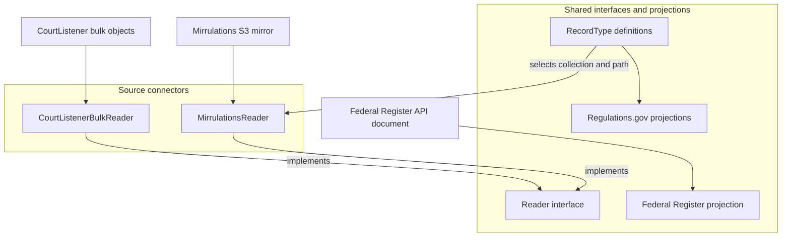
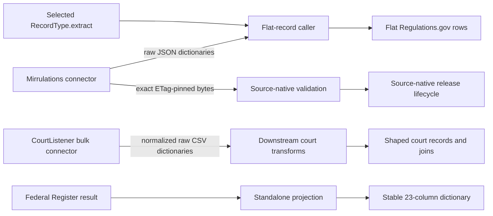

> Generated reference snapshot; see [current architecture](../docs/architecture.md),
> [operator commands](../docs/cli.md), and [reference maintenance](../docs/documentation.md).

# Connector ingestion and record projection

## Purpose

This module defines the boundary between external-source acquisition and downstream record processing. It is a logical module, not a single runtime pipeline.

Its connectors retrieve source-shaped data:

- `MirrulationsReader` reads Regulations.gov objects from the public Mirrulations S3 mirror.
- `CourtListenerBulkReader` streams CourtListener bulk CSV dumps.

The shared `Reader` interface defines raw iteration, while `RecordType` values describe Regulations.gov record families and their flat projections. A separate function projects Federal Register API documents into stable columns.

The module does not persist, join, deduplicate, enrich, or publish records. Callers own those steps. Source-native processing also remains separate and bypasses the flat projections when it must preserve exact source evidence.

## Architecture

### Processing paths

The flat Regulations.gov path requires an explicit call to `RecordType.extract`; selecting a record type does not make the reader flatten its output. CourtListener records also leave this module as source-shaped dictionaries. Its record shaping and joins occur downstream.

## Core component documentation

- [Source connector contracts and projections](source_connector_contracts_and_projections.md) — documents `Reader`, `RecordType`, the Regulations.gov record definitions, and the Federal Register projection.
- [Mirrulations connector](mirrulations_connector.md) — documents S3 discovery, filtering, concurrent downloads, retries, key accounting, and exact-object acquisition.
- [CourtListener bulk connector](courtlistener_bulk_connector.md) — documents bulk-object discovery, object pinning, streaming bzip2 decompression, CSV parsing, transfer resumption, bounds, and run measurements.