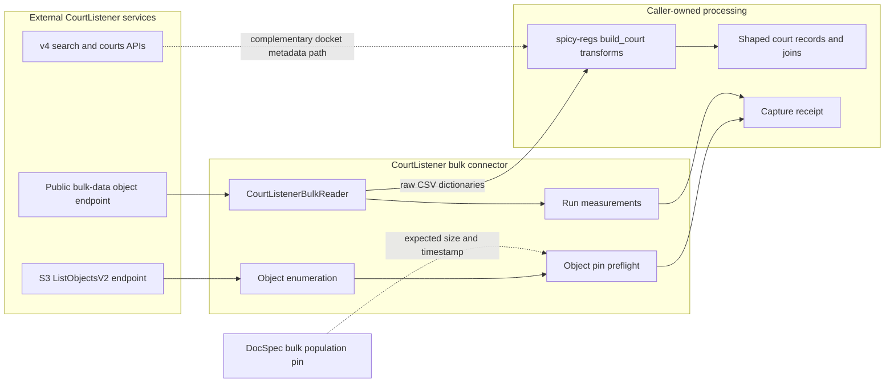
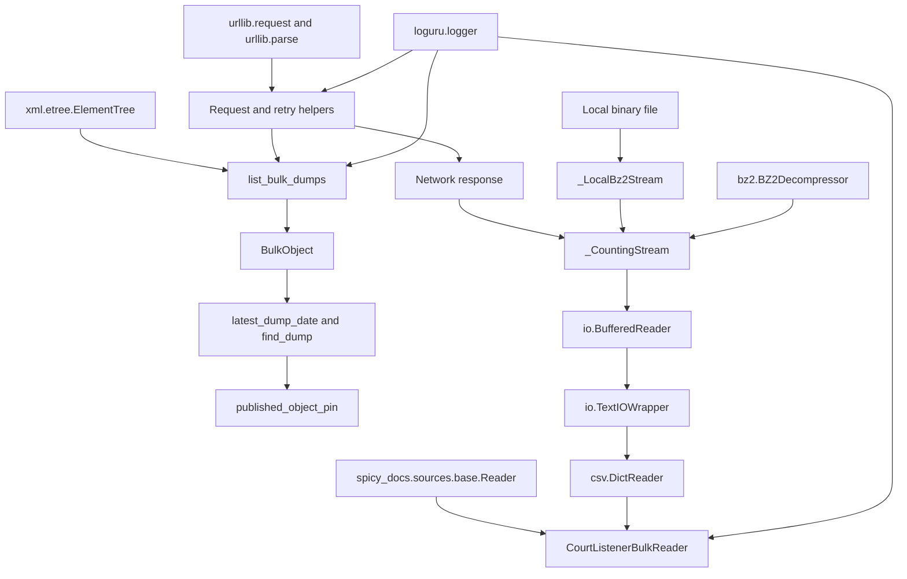
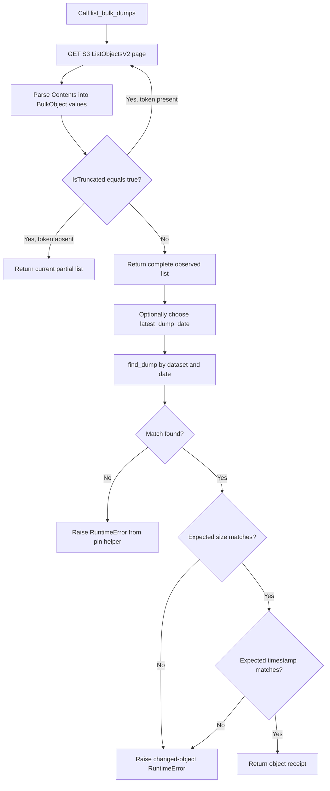
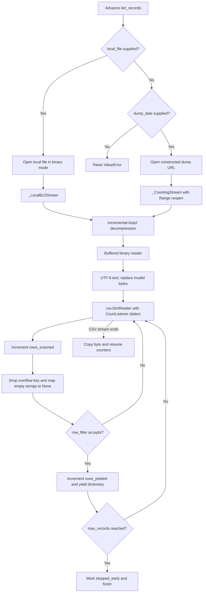
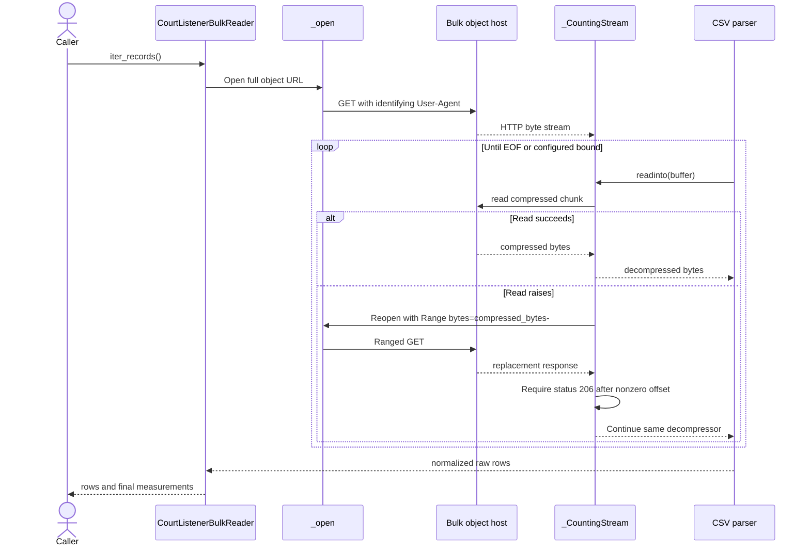

# CourtListener bulk connector

The CourtListener bulk connector enumerates CourtListener's published bulk-data
objects and streams one dated bzip2 CSV dump as raw dictionaries. It exists
because the `/opinions/` and `/clusters/` REST endpoints require a token; the
bulk exports are the keyless source of opinion text.

The connector owns acquisition mechanics: publisher listing, object selection,
bounded sequential transfer, inline decompression, CSV parsing, filtering, and
run measurements. It does not shape court records, join opinions to clusters or
dockets, write checkpoints, or publish a source-native release.

## Purpose and system role

| Question | Answer |
| --- | --- |
| What goes in? | A dataset name and either a dump date for network access or a local `.bz2` path. Optional row and compressed-byte bounds limit a pass; an optional predicate selects rows. |
| What happens? | Listing helpers can identify and pin a published object. The reader then pulls compressed bytes through one connection, resumes dropped network transfers by byte offset, decompresses bzip2 data, parses the publisher's CSV dialect, normalizes empty fields, and applies the predicate. |
| What comes out? | `iter_records()` yields source-shaped `dict` values. After normal iterator completion, the reader exposes scan, yield, byte, stop, source, and resume measurements. |
| How do we check it? | `tests/test_courtlistener_bulk.py` checks filename parsing, object pinning, row parsing, the record bound, filtering, escaped quotes, embedded newlines, exact-offset resume, refusal of restarted streams, concatenated bzip2 streams, and local read failures. |

This module is one child of [connector ingestion and record
projection](connector_ingestion_and_record_projection.md). Its only shared code
interface is `Reader`; see [source connector contracts and
projections](source_connector_contracts_and_projections.md) for that interface.
The sibling [Mirrulations connector](mirrulations_connector.md) handles a
different bulk source and has different concurrency, identity, and failure
rules.

The implementation lives in
[`src/spicy_docs/sources/courtlistener_bulk.py`](../src/spicy_docs/sources/courtlistener_bulk.py),
with focused tests in
[`tests/test_courtlistener_bulk.py`](../tests/test_courtlistener_bulk.py).

## System placement and ownership



The listing path and byte path use different hosts. `BULK_LIST_URL` points to
the S3 bucket because the public alias does not implement the S3 list API.
`BULK_BASE_URL` points to the public `bulk-data` alias and serves the compressed
objects.

The module complements, rather than replaces, the CourtListener v4 search
connector retained in `spicy-regs`. That connector reads docket metadata. This
connector reads periodic full-table exports, including opinion bodies and
opinion-cluster relationships. The downstream `build_court_*` transformations
also remain in `spicy-regs`; no production transformation imports this module
inside the current repository.

DocSpec owns the versioned population listing under
`fixtures/courtlistener-bulk-v1/`. `published_object_pin()` checks one selected
object against that external expectation. It does not reproduce DocSpec's
population-level digest or withdrawal rules.

The connector has no direct path into the source-native release lifecycle. A
future adapter would need to define source evidence, identity, scope, and
release checks before passing data to the [source-native release
engine](source_native_release_engine.md).

## Architecture and dependencies



### Direct dependencies

| Dependency | Use |
| --- | --- |
| `spicy_docs.sources.base.Reader` | Defines the raw dictionary iterator implemented by `CourtListenerBulkReader`. |
| `urllib.request` and `urllib.parse` | Build identified HTTP requests, open byte streams, add `Range` headers, and encode listing queries. |
| `xml.etree.ElementTree` | Parses S3 `ListObjectsV2` XML pages. |
| `bz2` | Decompresses each stream and rolls across concatenated bzip2 members. |
| `io` | Adapts the decompressor to buffered binary and UTF-8 text streams. |
| `csv` | Parses headers, embedded newlines, large fields, and CourtListener's backslash escape convention. |
| `loguru` | Reports listing counts, retries, resumes, progress, and final measurements. |
| Other standard-library modules | Represent dates and immutable objects, inspect paths, sleep between retries, and define iterator and callback types. |

The connector opens one download connection at a time. It deliberately has no
thread pool or parallel range downloader. Import it directly from
`spicy_docs.sources.courtlistener_bulk`; the package does not re-export these
symbols.

### Runtime constants

| Constant | Current value and effect |
| --- | --- |
| `BULK_BASE_URL` | `https://storage.courtlistener.com/bulk-data`; serves object bytes. |
| `BULK_LIST_URL` | `https://com-courtlistener-storage.s3.amazonaws.com/`; serves S3 listing XML. |
| `BULK_PREFIX` | `bulk-data/`; default listing scope. |
| `USER_AGENT` | Identifies the client as the `spicy-regs/0.1` CourtListener bulk ingest and provides the project URL. |
| `_TIMEOUT` | 180 seconds for each `urlopen` attempt. |
| `_MAX_RETRIES` | Five attempts for initial requests and each nested reopen operation. |
| `_CHUNK` | 4 MiB maximum compressed read size. |
| `_PROGRESS_EVERY` | One progress event per 50,000 scanned rows. |

## Public API and internal components

### Published object model

`BulkObject` is an immutable listing entry with these source values:

| Field or property | Meaning |
| --- | --- |
| `key` | Full object key returned by S3, normally under `bulk-data/`. |
| `size` | Exact compressed byte count reported by the listing. |
| `last_modified` | Publisher timestamp text as returned by S3. The class does not parse or normalize it. |
| `filename` | Final path segment of `key`. |
| `dataset` | Filename without a recognized suffix and, when present, the final ISO date. Undated exports retain their unsuffixed name. |
| `dump_date` | Parsed final `YYYY-MM-DD`, or `None` for undated or unrecognized names. |
| `url` | `BULK_BASE_URL` joined to `filename`. |

The parser recognizes `.csv.bz2`, `.sql`, `.sh`, `.csv`, and `.zip` suffixes.
It strips only one suffix. `find_dump()` then returns the first object whose
derived dataset and date match; it does not require `.csv.bz2` or resolve
multiple matching formats. These rules fit the current publisher naming
scheme. A naming or format change requires focused tests before callers rely on
the derived fields.

### Discovery and selection helpers

| Component | Responsibility |
| --- | --- |
| `list_bulk_dumps(prefix=BULK_PREFIX)` | Paginates S3 `ListObjectsV2`, preserves response order, and returns every parsed `Contents` entry as a `BulkObject`. |
| `latest_dump_date(objects, dataset)` | Returns the maximum dated entry for the named dataset, or `None`. |
| `find_dump(objects, dataset, dump_date)` | Returns the first exact dataset/date match, or `None`. |
| `published_object_pin(...)` | Resolves one match, optionally compares its size and last-modified text with expected values, and returns a receipt dictionary. |

`list_bulk_dumps()` requests at most 1,000 keys per page and follows
`NextContinuationToken` while S3 reports `IsTruncated=true`. It accepts a
different prefix for tests or specialized discovery. `BulkObject.url`, however,
uses only the final filename under `BULK_BASE_URL`; nested custom prefixes do
not change the download URL.

If S3 reports a truncated page without a continuation token, the current code
stops and returns the partial list. It does not raise an incomplete-enumeration
error. Callers that use the listing as coverage evidence should treat this as a
known gap and reject unexpectedly small or unsealed listings outside this
module.

`published_object_pin()` calls `list_bulk_dumps()` unless the caller supplies
an already captured list. Its receipt contains:

```text
dataset
dump_date
filename
url
bytes
last_modified
listing_object_count
listing_host
```

The optional `expect_bytes` and `expect_last_modified` checks run before a
large download and fail on exact inequality. The receipt identifies an object
by its publisher filename, compressed size, and timestamp. It does not include
an ETag or content digest, and it does not lock the object against changes made
after the listing request.

### `CourtListenerBulkReader`

`CourtListenerBulkReader` implements `Reader` for one dataset. Construction
stores configuration only. Network and file access start when a caller advances
`iter_records()`.

| Constructor option | Meaning |
| --- | --- |
| `dataset` | Names the dump and labels progress messages. For network reads it becomes part of `{dataset}-{date}.csv.bz2`. |
| `dump_date` | Selects the dated network object. Required when `local_file` is absent. |
| `local_file` | Reads this compressed file instead of the network. Its filename and contents are not checked against `dataset` or `dump_date`. |
| `max_records` | Stops after this many accepted rows. The count applies after `row_filter`. |
| `max_compressed_bytes` | Stops requesting compressed chunks once the running byte count has reached the cap. |
| `row_filter` | Receives each normalized row and returns truthy to yield it. |

The reader is intended for one pass. It does not reset counters at the start of
a second `iter_records()` call, so reuse would mix row totals from multiple
passes.

After normal completion, inspect these public measurements:

| Field | Meaning |
| --- | --- |
| `rows_scanned` | Parsed data rows seen before filtering. The CSV header is excluded. |
| `rows_yielded` | Rows accepted and yielded. |
| `compressed_bytes` | Compressed bytes returned to the counting stream in this pass. |
| `decompressed_bytes` | Bytes produced by the bzip2 decompressor in this pass. |
| `stopped_early` | `True` after a record-bound stop or when a compressed-byte cap was configured and the stream became exhausted. |
| `source_url` | Network URL or local path selected by `_stream()`. |
| `resumes` | Successful response replacements after read failures. Local reads remain zero. |

These values become final only when the iterator ends normally or reaches a
configured bound. If the caller closes the generator while it is suspended at
a yielded row, or parsing or filtering raises, the `finally` block closes the
source handle but the byte and resume fields may retain their initial values.
The row counters already incremented before the last yield may still be
partial.

`Reader.last_keys` and `Reader.failed_keys` do not apply here. A bulk dump is
one sequential object rather than a collection of independently retried keys;
use the selected object pin and run measurements for accounting.

### Stream adapters and resume sentinel

| Component | Responsibility |
| --- | --- |
| `_CountingStream` | Presents decompressed bytes through `io.RawIOBase`, counts compressed and decompressed bytes, enforces the byte budget, and can replace a failed HTTP response. |
| `_LocalBz2Stream` | Uses `_CountingStream` with a local binary handle and no reopen callback. |
| `_UnrangeableResume` | Stops a network resume when a nonzero range request returns a status other than HTTP 206 Partial Content. |

These underscore-prefixed types are implementation details. Tests import them
to pin failure behavior, but application code should use
`CourtListenerBulkReader`.

`_CountingStream` retains one `BZ2Decompressor` across HTTP responses. When a
decompressor reaches the end of one bzip2 member and reports `unused_data`, the
adapter starts another decompressor and feeds it the unused bytes. This permits
both current single-stream dumps and concatenated streams produced by tools
such as `pbzip2`.

## Listing and pin process



Discovery and pinning never start the dump read. Conversely, constructing or
iterating a network reader never calls the listing helpers. A reliable caller
performs the pin preflight explicitly and then compares final run measurements
with that selected object.

## Record data flow



The layered stream is important:

1. `_CountingStream` reads up to `_CHUNK`, currently 4 MiB, of compressed data.
2. `BZ2Decompressor` expands that chunk and retains output until the buffered
   reader consumes it.
3. `TextIOWrapper` decodes UTF-8 with `errors="replace"` and preserves newline
   handling for the CSV parser.
4. `csv.DictReader` uses the first row as field names and supports embedded
   newlines in quoted opinion text.
5. The reader changes every empty string value to `None`, drops entries whose
   key is `None`, applies `row_filter`, and yields accepted rows.

All nonempty values remain strings. The connector performs no numeric, date,
Boolean, identity, or schema conversion. Invalid UTF-8 bytes become the Unicode
replacement character, so this output is source-shaped rather than byte-exact.

At import time, the module calls `csv.field_size_limit(sys.maxsize)` because one
opinion body can exceed Python's default field limit. This changes the process's
global CSV field limit, not only this reader.

### CourtListener CSV dialect

CourtListener escapes embedded quotes with a backslash. `CSV_DIALECT` therefore
sets `escapechar="\\"` and retains `doublequote=True`. Using the standard CSV
dialect can silently move text into the wrong columns instead of raising a
parse error. Any parser change must preserve both backslash-escaped quotes and
embedded newlines.

If a row has more values than the header, `DictReader` stores the overflow under
a `None` key and the dictionary comprehension drops it. If a row has fewer
values, `DictReader` supplies `None` for missing columns. The connector does not
reject either width mismatch, so downstream code cannot treat successful CSV
parsing as schema validation.

### Bounds and filtering

`max_records` counts yielded rows, not scanned rows. A selective predicate may
scan the complete dump before it yields the requested number of rows.
`row_filter` reduces downstream work and retained output; it does not reduce
network transfer, decompression, or CSV parsing before the matching row.

The compressed-byte bound is a chunk boundary, not an exact byte cutoff. The
stream checks the cap before each compressed read, then reads as much as one
full `_CHUNK`. `compressed_bytes` can therefore exceed the configured value by
up to one chunk. The parser consumes all decompressed bytes already produced by
that last chunk.

The constructor does not validate either bound as positive. In particular,
`max_records=0` still yields the first accepted row because the reader checks
the bound after `yield`. Callers should supply positive limits. A
`max_compressed_bytes` value at or below zero ends the compressed stream before
the first read.

When any compressed-byte cap is configured, the current `stopped_early`
calculation cannot distinguish a budget stop from natural end-of-file. It marks
the run early even when a small object ends below the cap. Use the pin's exact
object size and the final `compressed_bytes` value when this distinction
matters.

## Component interaction and resume process



Every request includes the fixed `USER_AGENT`. `_open()` uses a 180-second
timeout, makes at most five attempts, and sleeps 2, 4, 8, then 16 seconds after
successive failures. It catches the broad `Exception` family, so it retries
permanent HTTP responses as well as transient network failures. After the fifth
failure it raises `RuntimeError` with the last exception as its cause.

If a read fails after transfer begins, `_CountingStream` calls its reopen
callback with the number of compressed bytes already returned. A nonzero resume
must return HTTP 206. HTTP 200 indicates that the server restarted from byte
zero, so `_UnrangeableResume` aborts rather than splicing duplicate compressed
data into the existing decompressor. Other reopen failures receive up to five
outer resume attempts with the same 2, 4, 8, and 16-second delays. Each outer
attempt calls `_open()`, which has its own five-attempt budget.

The resume check verifies only the status code. It does not validate the
`Content-Range` start, bind subsequent requests to an ETag with `If-Range`, or
recheck size and last-modified metadata. Pinning immediately before the read
narrows this risk but does not create an immutable snapshot.

Local reads omit the reopen callback. A local file read error therefore
propagates immediately, and `resumes` remains zero.

## Completion, coverage, and failure semantics

A successful iterator exhaustion proves that the connector reached the end
reported by its current byte source and parsed every row that the resulting
text stream exposed. It does not by itself prove that the publisher's expected
object remained unchanged or that the decompressed CSV contains an expected
number of records.

For a network capture, record at least two groups of evidence:

| Evidence | Fields |
| --- | --- |
| Published object pin | `dataset`, `dump_date`, `filename`, `url`, `bytes`, `last_modified`, `listing_object_count`, and `listing_host` |
| Completed reader pass | `source_url`, `rows_scanned`, `rows_yielded`, `compressed_bytes`, `decompressed_bytes`, `stopped_early`, and `resumes` |

For an intended full pass, exhaust the iterator, require no exception, require
`stopped_early=False`, and compare `compressed_bytes` with the pinned object
size. Do not describe a record-bound, byte-bound, or prematurely closed pass as
full coverage. A filter can still scan the full object, but its yielded rows are
an intentional subset rather than the complete row population.

Current limits remain:

- The connector records no content digest or S3 ETag.
- The decompressor does not explicitly require `BZ2Decompressor.eof` after the
  underlying source returns no more bytes. A truncated source can therefore
  require an external byte-count check to detect incompleteness.
- CSV decoding replaces invalid UTF-8 and tolerates row-width mismatches.
- `list_bulk_dumps()` can return a partial list if a truncated page omits its
  continuation token.
- Reader state is finalized after normal loop completion, not after an
  exception or caller-initiated generator close.
- The module writes no receipt, checkpoint, manifest, rows, or release. The
  caller owns persistence.

These limits distinguish transport success from source-preservation proof. The
[source-native profile API](source_native_profile_api.md) and [source-native
release engine](source_native_release_engine.md) describe the stronger checks
used by source-native pipelines; this connector does not implement them for
CourtListener.

## Capacity and performance

Let `C` be compressed bytes read, `D` decompressed bytes produced, `R` parsed
rows, and `F` the largest CSV field.

| Operation | Work | Working memory |
| --- | --- | --- |
| `list_bulk_dumps()` | One request per page plus `O(N)` XML parsing for `N` listed objects | `O(N)` because it materializes all `BulkObject` values |
| `latest_dump_date()` | `O(N)` scan plus a list of matching dates | `O(M)` for `M` dated matches |
| `find_dump()` | Up to `O(N)` and stops at the first match | `O(1)` |
| `published_object_pin()` | Listing cost when no objects are injected, then one `O(N)` lookup | Listing storage plus a small receipt |
| `iter_records()` | `O(C + D + R)` sequential work | One compressed chunk, its decompressed output, stream buffers, the current parsed row, and up to `O(F)` for a large field |

The 4 MiB compressed chunk can expand substantially, and `_CountingStream`
retains the decompressed result until the buffered reader consumes it. Memory
therefore depends on the compression ratio of one chunk and the largest current
CSV record, not only `_CHUNK`. The design avoids landing or holding an entire
dump.

Progress logs appear every 50,000 scanned rows and report scanned rows, kept
rows, and compressed GiB. The final log adds the resume count. A selective
filter can produce long periods with no yielded rows while scan progress still
advances.

## Usage

### Pin and read a network dump

```python
from datetime import date

from spicy_docs.sources.courtlistener_bulk import (
    CourtListenerBulkReader,
    list_bulk_dumps,
    published_object_pin,
)

dump_date = date(2026, 6, 30)
objects = list_bulk_dumps()

# Expected values come from the separately preserved population listing.
object_pin = published_object_pin(
    "opinions",
    dump_date,
    objects=objects,
    expect_bytes=54_561_543_156,
    expect_last_modified="2026-06-30T09:56:48.000Z",
)

reader = CourtListenerBulkReader("opinions", dump_date=dump_date)
for raw_row in reader.iter_records():
    consume_raw_opinion(raw_row)

assert reader.stopped_early is False
assert reader.compressed_bytes == object_pin["bytes"]

run_measurements = {
    "source_url": reader.source_url,
    "rows_scanned": reader.rows_scanned,
    "rows_yielded": reader.rows_yielded,
    "compressed_bytes": reader.compressed_bytes,
    "decompressed_bytes": reader.decompressed_bytes,
    "stopped_early": reader.stopped_early,
    "resumes": reader.resumes,
}
```

`consume_raw_opinion()` and receipt persistence are caller-owned. The reader
does not invoke a `RecordType` extractor or a `build_court_*` transformation.

### Run a bounded filtered pass

```python
from datetime import date

from spicy_docs.sources.courtlistener_bulk import CourtListenerBulkReader

wanted_clusters = {"64278691", "64278692"}
reader = CourtListenerBulkReader(
    "opinions",
    dump_date=date(2026, 6, 30),
    max_records=10_000,
    max_compressed_bytes=8 * 1024**3,
    row_filter=lambda row: (row.get("cluster_id") or "") in wanted_clusters,
)

rows = list(reader.iter_records())
assert reader.stopped_early is True
```

This run is a deliberate slice. The byte cap can end the text stream between
CSV records, and the row cap applies only to matches. Preserve both scan and
byte measurements with the output.

### Read a cached local dump

```python
from pathlib import Path

from spicy_docs.sources.courtlistener_bulk import CourtListenerBulkReader

reader = CourtListenerBulkReader(
    "courts",
    local_file=Path("cache/courts-2026-06-30.csv.bz2"),
)
court_rows = list(reader.iter_records())
```

The local path takes precedence over `dump_date`. The reader trusts the path;
the caller must verify that the cached bytes match the intended published
object.

## Contribution guide

### Change listing or object identity behavior

1. Preserve paginated S3 enumeration and exact `size` and `last_modified`
   values.
2. Decide whether new publisher filenames can create more than one match for a
   dataset and date. If so, make format selection explicit rather than relying
   on first match.
3. Fail closed if an enumeration page claims truncation without a continuation
   token.
4. Coordinate population-level pin changes with DocSpec rather than copying
   its fixtures or rules into this module.
5. Add hermetic XML pagination tests; the current focused suite does not
   exercise live listing or malformed pagination.

### Change streaming or resume behavior

1. Keep the compressed offset separate from decompressed byte counts.
2. Continue the same decompressor only after proving that the replacement
   response starts at the requested compressed offset.
3. Retain the refusal of HTTP 200 after a nonzero range request.
4. Consider `Content-Range` validation and `If-Range` or ETag binding before
   strengthening resume guarantees in documentation.
5. Preserve source-handle closure on success, failure, and generator close.
6. Test exact recovered bytes, resume counts, concatenated bzip2 members,
   corrupted or truncated input, retry exhaustion, and local error propagation.

### Change CSV behavior

1. Treat the CSV column names and all nonempty string values as publisher data.
2. Preserve `escapechar="\\"`, embedded-newline handling, and large opinion
   fields unless new publisher evidence supports a change.
3. Decide explicitly whether empty-string-to-`None`, invalid UTF-8 replacement,
   or row-width tolerance changes. Each affects downstream data meaning.
4. Keep record shaping, joins, and enrichment in the downstream
   `build_court_*` code rather than adding dataset-specific transformations to
   this reader.
5. Add fixtures for every parser edge case because malformed quoting can
   produce plausible but misaligned rows without raising.

### Change bounds or measurements

1. Define whether each limit is exact or chunk-granular and whether it applies
   before or after filtering.
2. Validate nonpositive values if the API should reject them; retain regression
   tests for any compatibility decision.
3. Keep `rows_scanned`, `rows_yielded`, bytes, `stopped_early`, and `resumes`
   sufficient to describe a partial pass.
4. Test natural end-of-file below a configured byte cap, exact-cap boundaries,
   filtered record bounds, exceptions, and early generator close.

## Verification

Run the focused unit suite from the repository root:

```bash
uv run pytest -q tests/test_courtlistener_bulk.py
```

Run repository static checks after code changes:

```bash
uv run ruff check .
uv run ruff format --check .
```

The focused tests are hermetic and do not verify current publisher availability,
the live listing's completeness, throughput, or HTTP range behavior. A live
acquisition check should use a small published dump, an explicit object pin,
and a recorded comparison between the pinned size and final compressed bytes.

## Related module documentation

- [Connector ingestion and record
  projection](connector_ingestion_and_record_projection.md) — parent workflow
  and responsibility boundaries.
- [Source connector contracts and
  projections](source_connector_contracts_and_projections.md) — `Reader` and
  downstream flat-projection interfaces.
- [Mirrulations connector](mirrulations_connector.md) — sibling bulk connector
  with key-level S3 acquisition and different concurrency and evidence rules.
- [Source-native profile API](source_native_profile_api.md) — source validation
  callbacks that a future CourtListener source-native adapter would need.
- [Source-native release engine](source_native_release_engine.md) — immutable
  admission, publication, and replay responsibilities outside this connector.
