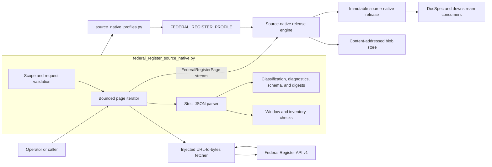
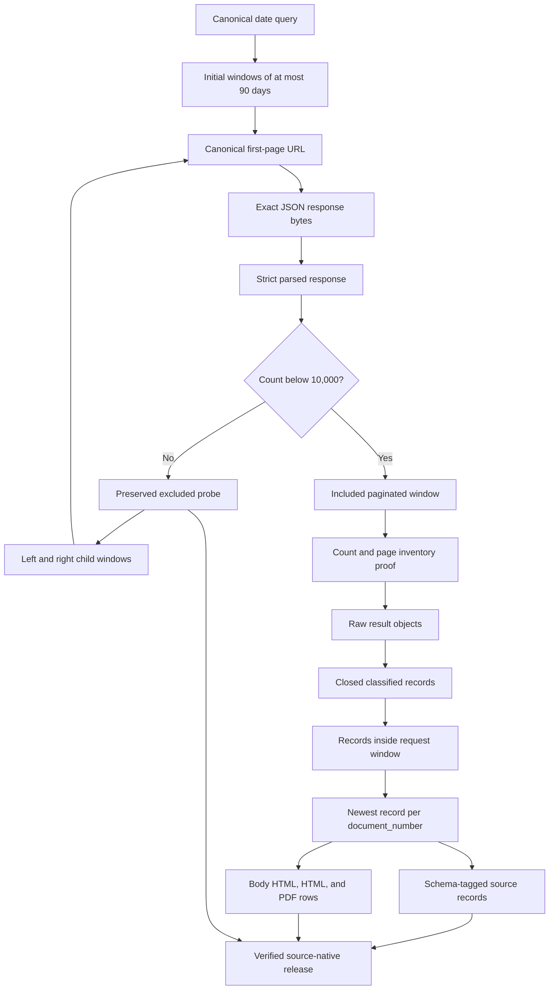
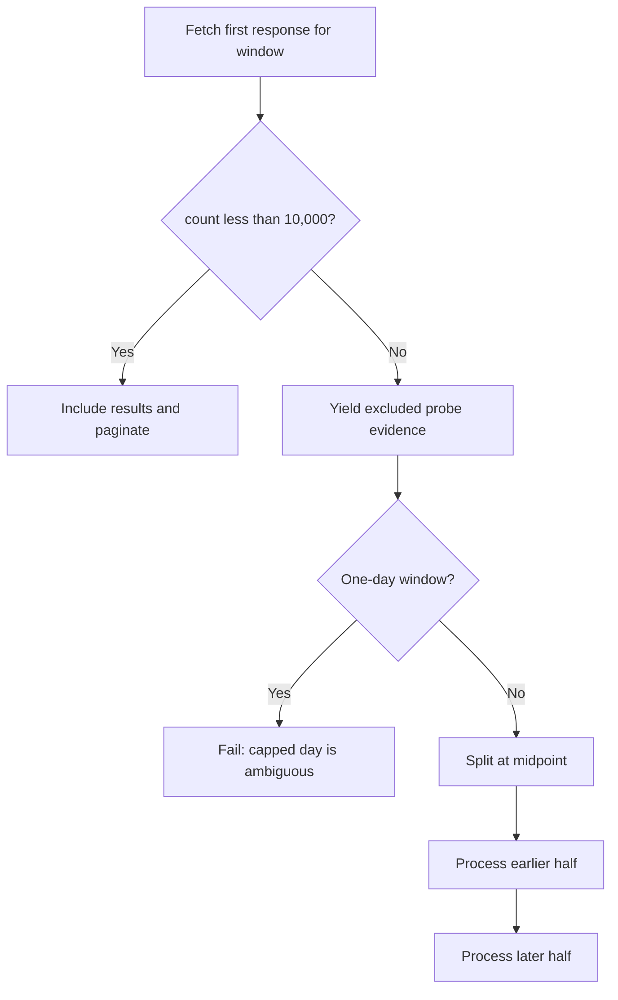
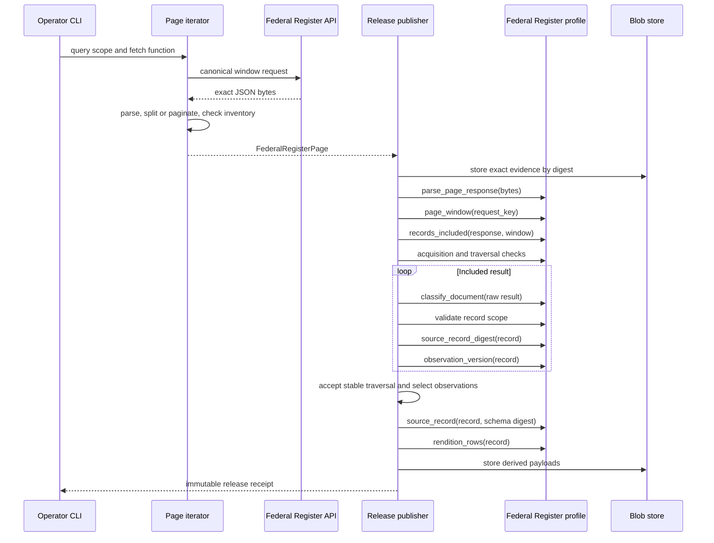
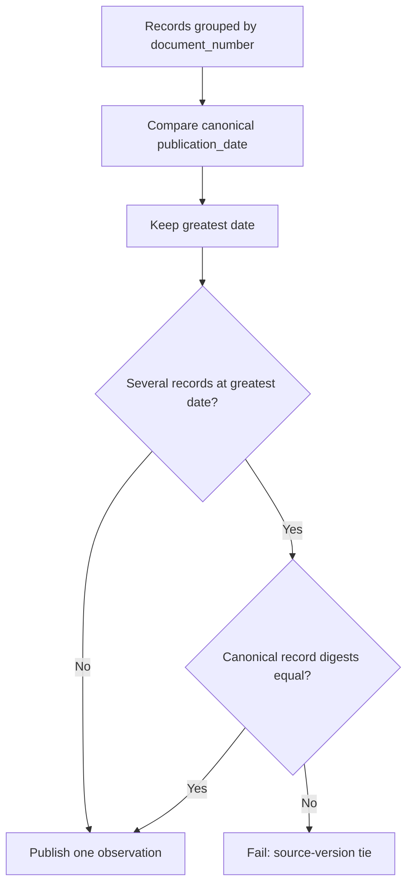

# Federal Register source-native acquisition

The Federal Register source-native module turns a closed publication-date query into replayable Federal Register API evidence and source-owned document records. It builds deterministic requests, divides large date ranges into bounded windows, follows trusted page cursors, preserves every response byte, rejects unexplained source changes, and derives schema-tagged records and rendition locators.

The module does not publish release directories, store blobs, retry HTTP requests, or flatten documents for search. It supplies Federal Register behavior to the shared [source-native profile API](source_native_profile_api.md); the [source-native release engine](source_native_release_engine.md) applies that behavior during publication and independent replay.

## Purpose and system role

| Question | Answer |
| --- | --- |
| What goes in? | A query with canonical `publishedFrom` and `publishedThrough` dates and an injected fetch function that returns exact response bytes for a URL. |
| What happens? | The iterator makes deterministic requests, splits capped date windows, paginates each publishable window, checks source-declared inventory, and repeats the crawl for reconciliation. Profile callbacks then parse, classify, scope-check, select, wrap, and digest the records. |
| What comes out? | Ordered `FederalRegisterPage` values containing exact JSON evidence. The release engine derives one source record and three rendition rows for each selected document. |
| How do we check it? | The publisher and verifier replay canonical request parsing, the cap-split tree, page inventory, record scope, schema classification, observation selection, record digests, and rendition derivation from saved evidence. |

This path preserves source-native evidence. It is separate from `project_federal_register_document`, which produces a flat dictionary for the connector/projection path. See [source connector contracts and projections](source_connector_contracts_and_projections.md) for that projection and [connector ingestion and record projection](connector_ingestion_and_record_projection.md) for the wider connector boundary.

## Architecture and boundaries



[`federal_register_source_native.py`](../src/spicy_docs/federal_register_source_native.py) owns source-specific meaning:

- Federal Register identity, scope, policy, bounds, field lists, and schema;
- initial request construction and validation of initial requests and continuation cursors;
- the date-window split algorithm and evidence page stream;
- strict parsing, inventory checks, and record classification;
- observation versions, source-record wrappers, rendition rows, and source digests.

The surrounding modules own shared or operational behavior:

| Module | Responsibility |
| --- | --- |
| [`source_native_profiles.py`](../src/spicy_docs/source_native_profiles.py#L45-L108) | Composes the Federal Register functions into `FEDERAL_REGISTER_PROFILE` and checks each record's `publication_date` against its request window. |
| [Source-native profile API](source_native_profile_api.md) | Defines the page shape, callback signatures, profile metadata, and valid traversal-acceptance modes. |
| [Source-native release engine](source_native_release_engine.md) | Consumes pages, selects a stable traversal and one observation per identity, writes release members, and replays saved evidence. |
| [Source-native storage and publication](source_native_storage_and_publication.md) | Stores evidence and payloads by digest and publishes an immutable directory. |
| [Source-native operator CLI](source_native_operator_cli.md) | Creates the `httpx` transport, applies retry policy, selects the profile, and invokes publication or verification. |

The source module depends on Python's standard library and three `rulespec_artifacts` primitives: `canonical_json_bytes`, `schema_bundle_digest`, and `framed_section_digest`. It has no dependency on DocSpec, RefSpec, a storage backend, `httpx`, or the flat Federal Register projection.

## Profile composition

[`FEDERAL_REGISTER_PROFILE`](../src/spicy_docs/source_native_profiles.py#L71-L108) connects this module to the generic release engine.

| Profile declaration | Federal Register value | Practical meaning |
| --- | --- | --- |
| `source_system_id` | `https://www.federalregister.gov/api/v1` | Names the source API. |
| `source_system_version` | `v1` | Pins the interface family. |
| `scope_id` | `federal-register-documents` | Names the document collection. |
| `source_schema_key` | `schemas/federal-register-document-1.0.schema.json` | Gives the schema its release-relative key. |
| `record_stem` | `federal-register` | Declares the source record family. |
| `source_state_scope` | `observed-crawl` | Claims only what the accepted bounded crawl observed. |
| `traversal_acceptance` | `stable-consecutive-traversals` | Requires two adjacent traversals with the same derived observations. |
| `max_traversals` | `3` | Caps the number of traversals a caller may supply. |
| `observation_version` | Canonical `publication_date` | Selects the newest observation for a repeated `document_number`. |
| `refuse_equal_observation_versions` | `False` | Collapses equal-date observations only when their canonical record digests match; differing digests fail. |

The API does not expose an immutable, authoritative enumeration. Two matching crawls therefore remain an `observed-crawl`; reconciliation does not upgrade the result to a complete snapshot.

## End-to-end data flow



The parser creates a normalized in-memory mapping for validation, but the page retains the original `response_bytes`. Replay therefore uses the bytes that the source returned, not reserialized JSON.

## Acquisition model

### Closed query scope

[`federal_register_query_scope`](../src/spicy_docs/federal_register_source_native.py#L159-L174) accepts exactly two fields:

```json
{
  "publishedFrom": "2026-04-13",
  "publishedThrough": "2026-04-14"
}
```

Both values must parse as ISO calendar dates. The function returns canonical `YYYY-MM-DD` strings and rejects extra fields, missing fields, invalid dates, and a range whose end precedes its start.

### Deterministic initial requests

[`federal_register_documents_url`](../src/spicy_docs/federal_register_source_native.py#L177-L194) creates the first URL for each date window. The URL always contains:

- HTTPS and the fixed `/api/v1/documents.json` endpoint;
- `order=newest`;
- inclusive `publication_date` lower and upper bounds;
- `per_page`, from `1` through `1,000`; and
- one `fields[]` parameter for every sorted member of `DOCUMENT_FIELDS`.

Sorting the closed field set and using `urlencode` makes the initial request a reproducible part of the evidence. [`federal_register_request_window`](../src/spicy_docs/federal_register_source_native.py#L197-L239) performs the inverse operation during publication and replay. It validates the scheme, host, path, authority, complete query shape, field order, and page policy, rebuilds the URL, and requires an exact match. This round trip detects request-policy drift.

### Date windows and the result cap

The iterator divides the requested interval into consecutive windows of at most `90` calendar days. The Federal Register API caps a query at `10,000` results, so a first response with `count >= 10_000` cannot prove record coverage.

The iterator handles a capped window in pre-order:

1. It yields the capped response as a `FederalRegisterPage` so the evidence survives.
2. `federal_register_records_included` marks the probe's records as excluded.
3. It splits a multi-day window at its midpoint.
4. It processes the earlier half, then the later half, by the same rule.
5. It refuses a capped one-day window because no smaller date partition can remove the ambiguity.



[`FederalRegisterAcquisitionCheck`](../src/spicy_docs/federal_register_source_native.py#L283-L310) records the window and inclusion decision from each first page. At traversal end, [`validate_federal_register_window_partition`](../src/spicy_docs/federal_register_source_native.py#L242-L280) replays the expected pre-order split tree. It rejects missing branches, extra windows, overlap, reordering, a split inconsistent with `count`, and a capped leaf day.

### Pagination and per-window inventory

For a publishable window, [`iter_federal_register_pages`](../src/spicy_docs/federal_register_source_native.py#L381-L485) follows `next_page_url` until the source returns `null`. [`federal_register_next_page_url`](../src/spicy_docs/federal_register_source_native.py#L346-L378) accepts only a nonempty HTTPS URL on `www.federalregister.gov`, on `/api/v1/documents` or `/api/v1/documents.json`, with a query and no credentials, port, or fragment. The mutable `seen_urls` set rejects cycles.

[`FederalRegisterTraversalCheck`](../src/spicy_docs/federal_register_source_native.py#L126-L156) runs once per included window despite its broader class name. It requires:

- nonnegative integer `count` and positive integer `total_pages` values;
- the same declarations on every page in the window;
- contiguous zero-based `window_page_index` values;
- an observed result count equal to `count`; and
- an observed page count equal to `total_pages`.

The iterator checks this inventory while acquiring pages. The release engine checks it again through the profile during publication and replay.

### Reconciliation traversals

The page iterator defaults to two complete traversals and accepts an explicit value from `1` through `3`. Each traversal restarts the window sequence and its page and window indexes. The generic release engine accepts the second traversal in the first adjacent stable pair; it fails if the supplied traversals contain no stable adjacent pair. See [source-native profile API](source_native_profile_api.md#source-state-and-traversal-fields) for the exact shared comparison rule.

The default command-line path requests two traversals. A caller that asks the iterator for three permits comparisons of traversal `0` with `1` and traversal `1` with `2`; it does not weaken the stability requirement.

### Page representation

[`FederalRegisterPage`](../src/spicy_docs/federal_register_source_native.py#L99-L123) is a frozen, slotted implementation of `SourceNativePage`.

| Field | Meaning |
| --- | --- |
| `traversal_index` | Zero-based full-crawl pass. |
| `page_index` | Zero-based page position across every window in the traversal. |
| `window_index` | Zero-based position in the pre-order window sequence, including capped probes. |
| `window_page_index` | Zero-based position inside the current window. |
| `request_key` | Exact initial request or continuation URL that produced the bytes. |
| `source_cursor` | Prior page's cursor on continuation pages; `None` at every window boundary. |
| `response_bytes` | Nonempty exact API response bytes. |
| `evidence_media_type` | Always `application/json`. |

Construction rejects negative indexes, empty request keys, empty evidence, and disagreement between a window boundary and cursor presence. The release engine enforces relationships between consecutive page values; see [source-native profile API](source_native_profile_api.md#sourcenativepage-preserved-acquisition-evidence).

## Component interaction during publication



Independent verification repeats the profile calls from stored evidence. It does not trust the previously derived rows merely because their files and digests are internally consistent.

## Response parsing and source drift

[`parse_page_response`](../src/spicy_docs/federal_register_source_native.py#L488-L537) applies a narrow JSON policy before any record processing.

| Check | Accepted form | Refusal |
| --- | --- | --- |
| Encoding | UTF-8 | Invalid byte sequences fail. |
| JSON object keys | Unique keys | Duplicate keys fail instead of taking the first or last value. |
| Numbers | Integers | Floating-point and non-finite values fail anywhere in the response. |
| Top-level value | Object | Arrays and scalar roots fail. |
| Response members | Closed `API_RESPONSE_FIELDS` set | Unknown members fail as unclassified drift. |
| `count` | Nonnegative integer, excluding `bool` | Missing, Boolean, negative, or noninteger values fail. |
| `results` | Array with at most 1,000 members | Missing results are allowed only when `count == 0`; oversized pages fail. |
| `next_page_url` | `null` or a trusted Federal Register cursor | Empty, off-origin, credentialed, fragment-bearing, or otherwise unsafe URLs fail. |

The parser supplies `next_page_url=None` when absent and `total_pages=1` for an empty response when absent. Inventory validation still requires a valid `total_pages` declaration for every included nonempty window.

## Document classification and scope

[`classify_document`](../src/spicy_docs/federal_register_source_native.py#L540-L597) preserves the source mapping without renaming or dropping known fields. It rejects unknown fields and validates enough shape to publish the record safely.

### Required identity and version fields

- `document_number` must be nonempty ASCII text containing only letters, digits, `.`, `_`, or `-`.
- `publication_date` must be a canonical ISO calendar date.

The registry's [`_federal_register_record_scope`](../src/spicy_docs/source_native_profiles.py#L52-L68) then requires the publication date to fall inside the date window parsed from that page's initial request. The check uses the page window rather than only the overall query, so a record cannot move silently between split branches.

### Field groups

| Group | Fields | Rule |
| --- | --- | --- |
| Nullable text | `abstract`, `body_html_url`, `comments_close_on`, `effective_on`, `executive_order_number`, `html_url`, `pdf_url`, `signing_date`, `subtype`, `title`, `type` | Each present value is text or `null`. |
| Nullable integers | `end_page`, `start_page`, `volume` | Each present value is an integer other than `bool`, or `null`. |
| Nullable text arrays | `agency_names`, `docket_ids`, `topics` | Each present value is an array of text or `null`. |
| Nested arrays | `agencies`, `cfr_references` | Each member uses only its closed nested field set; nested values are integers, text, or `null`, never `bool`. |
| Diagnostic field | `regulation_id_numbers` | Any JSON value is preserved. Malformed shapes or values produce diagnostics rather than record loss. |

After these checks, `canonical_json_bytes(record)` confirms that the mapping belongs to the canonical JSON data model used by release digests.

## Observation identity and selection

The source identity is `document_number`, but the Federal Register has reused a document number for unrelated records. The shipped example is `00-111`, which appears with different records on `2000-01-14` and `2000-01-18`.

[`federal_register_observation_version`](../src/spicy_docs/federal_register_source_native.py#L600-L618) returns the canonical `publication_date` for comparison without changing the date stored in the record. The release engine groups records by `sourceRecordId` and selects the greatest date.



Older and duplicate observations remain discoverable in acquisition evidence, and the release receipt counts them as discarded observations. Selection changes only the published record set; it never erases the captured source responses.

[`federal_register_acquisition_policy`](../src/spicy_docs/federal_register_source_native.py#L324-L343) records this grouping, date order, and tie disposition beside the window and traversal bounds. A change to identity, ordering, or tie behavior changes acquisition meaning and requires an explicit compatibility decision.

## Published record, diagnostics, and renditions

### Source-record wrapper

[`source_record`](../src/spicy_docs/federal_register_source_native.py#L648-L660) produces this shape after observation selection:

```json
{
  "fieldDiagnostics": [],
  "record": {"document_number": "2026-07034", "publication_date": "2026-04-13"},
  "schemaDigest": "sha256:...",
  "schemaName": "federal-register-document",
  "schemaVersion": "1.0",
  "scopeId": "federal-register-documents",
  "sourceRecordId": "2026-07034"
}
```

The `record` member contains the complete classified source mapping, not only the two fields shown in the abbreviated example.

### RIN diagnostics preserve evidence

[`field_diagnostics`](../src/spicy_docs/federal_register_source_native.py#L621-L645) treats a Regulation Identifier Number (RIN) as well-formed when it matches `^[0-9]{4}-[A-Z][A-Z0-9]{3}$`.

- A non-array `regulation_id_numbers` value adds `malformed-rin-container`.
- Each nontext or nonmatching array member adds `malformed-rin`.
- `null` or an absent field adds no diagnostic.

The original value stays in `record` in every case. This policy distinguishes a known malformed source value from uncertainty about record identity, membership, or structure. The first remains publishable with a diagnostic; the latter conditions fail.

### Rendition index rows

[`rendition_rows`](../src/spicy_docs/federal_register_source_native.py#L663-L688) always returns three rows per selected record:

| `renditionId` | Source field | Media type |
| --- | --- | --- |
| `body-html` | `body_html_url` | `text/html` |
| `html` | `html_url` | `text/html` |
| `pdf` | `pdf_url` | `application/pdf` |

Every row preserves the source field name and `sourceRecordId`. A missing locator remains an explicit `null` row. `expectedByteSize` and `expectedSha256` also remain `null` because this module records source-stated locators; it does not fetch or attest to rendition bytes.

## Schema and digest identities

[`FEDERAL_REGISTER_DOCUMENT_SCHEMA`](../src/spicy_docs/federal_register_source_native.py#L697-L754) is a closed JSON Schema 2020-12 document. It requires `document_number` and `publication_date`, describes the known field groups, allows the diagnostic RIN field to carry any JSON value, and declares record order by `/document_number` with UTF-16 code-unit comparison.

Digest functions delegate to the installed `rulespec_artifacts` implementation:

| Function | Input | Result |
| --- | --- | --- |
| [`source_schema_digest`](../src/spicy_docs/federal_register_source_native.py#L757-L760) | `{SCHEMA_PATH: FEDERAL_REGISTER_DOCUMENT_SCHEMA}` | Stable digest for the one-schema bundle. |
| [`source_schema_declaration`](../src/spicy_docs/federal_register_source_native.py#L763-L768) | No input | Schema name, version, and computed digest. |
| [`source_record_digest`](../src/spicy_docs/federal_register_source_native.py#L771-L777) | One classified source mapping | Framed digest under `spicyregs-federal-register-record/1`. |

Callers must not replace these with ad hoc JSON serialization or hashing. The release verifier uses the same installed implementation to reproduce the identities.

## Bounds and failure behavior

| Bound | Value | Enforced by |
| --- | ---: | --- |
| Results per page | 1,000 | Request builder and response parser |
| Results per unsplit query | Below 10,000 | Inclusion decision and acquisition check |
| Initial window length | 90 days | Iterator and acquisition policy |
| Traversals | 1 through 3; default 2 | Iterator and profile |
| Evidence pages per traversal | 10,000; configurable downward or upward by direct callers but always positive | Iterator |

The module fails closed when it cannot prove source membership, order, identity, or evidence safety.

| Situation | Outcome |
| --- | --- |
| Invalid scope, request policy, initial URL, or continuation cursor | Raise `FederalRegisterSourceError`. |
| Empty or non-byte fetch result | Raise before constructing a page. |
| Invalid JSON, duplicate keys, floats, unknown response fields, or oversized results | Reject the response. |
| Count or page declarations change or disagree with observed inventory | Reject the window. |
| Result cap reached for a multi-day window | Preserve the probe, exclude its records, and split. |
| Result cap reached for one day | Reject the acquisition as ambiguous. |
| Split windows are missing, extra, overlapping, or reordered | Reject the traversal. |
| Unknown document fields, invalid identity, changed field types, or out-of-window dates | Reject the record and release. |
| Malformed RIN content | Preserve the record and attach diagnostics. |
| Stable consecutive traversals are absent | The shared release engine rejects publication. |
| Same identity and date have different record digests | The shared release engine rejects the source-version tie. |

`FederalRegisterSourceError` extends `ValueError`. The [source-native operator CLI](source_native_operator_cli.md) reports it as `acquisition-failed` and leaves the immutable destination unpublished.

## Complexity and resource use

Let `P` be the total pages across all traversals, `R` the total returned result objects, and `B` the largest response body.

- Acquisition performs `O(P)` fetches and parses `O(P + R)` JSON structure.
- The iterator holds one response body and one parsed page at a time, plus the current recursion stack and the `seen_urls` set for one window. Its working memory is `O(B + cursors + split depth)` before the release engine's own storage and selection work.
- Midpoint splitting has logarithmic depth in the window's day count. A capped branch can still create many evidence windows, so `MAX_PAGES_PER_TRAVERSAL` provides the final acquisition bound.
- Every traversal repeats the same source requests. This repetition is intentional evidence for stability, not a transport retry.

## Developer guide

### Use the iterator through an injected fetcher

The narrow `FederalRegisterFetch` type is `Callable[[str], bytes]`. This keeps transport concerns outside source semantics and makes exact response fixtures easy to test.

```python
import httpx

from spicy_docs.federal_register_source_native import iter_federal_register_pages

scope = {
    "publishedFrom": "2026-04-13",
    "publishedThrough": "2026-04-13",
}

with httpx.Client(timeout=60.0, follow_redirects=True) as client:
    def fetch(url: str) -> bytes:
        response = client.get(url)
        response.raise_for_status()
        return response.content

    pages = iter_federal_register_pages(fetch, query_scope=scope)
    # Pass pages to SourceNativeReleasePublisher with FEDERAL_REGISTER_PROFILE.
```

Production callers should normally use the [source-native operator CLI](source_native_operator_cli.md), which supplies headers, retries transient failures, builds release metadata, and prevents release and blob-store path overlap.

### Change checklist

Treat a change to this module as a change to a replayed source definition.

1. When adding or removing an API field, update `DOCUMENT_FIELDS`, its field-type group or nested field set, `FEDERAL_REGISTER_DOCUMENT_SCHEMA`, request-shape tests, classification tests, and schema-version compatibility decisions together.
2. When changing request parameters, update both `federal_register_documents_url` and `federal_register_request_window`. Preserve exact round-trip validation so replay detects policy drift.
3. When changing window size, result-cap handling, traversal count, or selection, update `federal_register_acquisition_policy`, the profile's versioned acquisition identity when required, and split-tree or reconciliation tests.
4. When changing `document_number`, `publication_date`, or tie behavior, add fixtures for older observations, identical duplicates, and differing same-date records. These changes affect published membership.
5. Keep raw response bytes unchanged. Parsing may return a validation mapping, but it must not replace the evidence stored on `FederalRegisterPage`.
6. Keep HTTP clients, retry timing, credentials, storage, partitioning, and publication outside this module. Add those changes to their owning modules and link their documentation.
7. Preserve the distinction between fatal uncertainty and nonfatal diagnostics. Add a diagnostic only when the original source value and record membership remain unambiguous.

### Focused tests

From the repository root, run the deterministic Federal Register and operator coverage:

```bash
uv run pytest -q \
  tests/test_source_native_release.py \
  tests/test_source_native_cli.py \
  tests/test_source_native_cli_retry.py
```

The suite covers request construction, stable traversal acceptance, exact evidence retention, cursor chains, inventory reconciliation, cap splitting, missing or reordered windows, schema drift, record scope, rendition rows, observation selection, tie refusal, immutable publication, and replay.

The live pinned-day test is optional because it calls `federalregister.gov` and can reveal current source drift:

```bash
uv run pytest -q -m integration tests/test_source_native_release_real.py
```

Finish with the repository gates:

```bash
uv run pytest -q
uv run ruff check .
uv run ruff format --check .
```

## Component reference

| Component | Role |
| --- | --- |
| `FederalRegisterPage` | Carries one exact response and its traversal, window, request, and cursor coordinates. |
| `FederalRegisterTraversalCheck` | Reconciles one included window's declared and observed page inventory. |
| `FederalRegisterAcquisitionCheck` | Records first-page split decisions and validates the complete window tree. |
| `federal_register_query_scope` | Validates and canonicalizes the closed publication-date query. |
| `federal_register_documents_url` | Builds a deterministic initial request for one window. |
| `federal_register_request_window` | Parses and round-trips a canonical initial request into a date tuple. |
| `validate_federal_register_window_partition` | Replays exact initial windows and recursive cap splits. |
| `federal_register_records_included` | Excludes capped probe results from record processing. |
| `federal_register_acquisition_policy` | Declares scope, bounds, split strategy, and observation selection. |
| `federal_register_next_page_url` | Validates continuation cursors and refuses cycles. |
| `iter_federal_register_pages` | Acquires bounded, repeated, cap-safe page traversals. |
| `parse_page_response` | Parses strict JSON while leaving source evidence bytes unchanged. |
| `classify_document` | Preserves known source fields and rejects unsafe shape or schema drift. |
| `_federal_register_record_scope` | Requires each record's publication date to fall inside its page window. |
| `federal_register_observation_version` | Returns canonical publication date for deterministic observation selection. |
| `field_diagnostics` | Reports malformed RIN containers and members without dropping source values. |
| `source_record` | Adds source identity, scope, schema, and diagnostics around a classified record. |
| `rendition_rows` | Derives three stable source-stated locator rows. |
| `source_schema_digest` | Digests the Federal Register schema bundle. |
| `source_schema_declaration` | Returns the schema name, version, and digest. |
| `source_record_digest` | Computes the framed canonical digest used for comparison and release identity. |

## Related documentation

- [Source-native profile API](source_native_profile_api.md) — callback interfaces, page invariants, traversal acceptance, and profile composition.
- [Source-native release engine](source_native_release_engine.md) — common selection, partitioning, publication, verification, and replay behavior.
- [Source-native operator CLI](source_native_operator_cli.md) — HTTP retry policy and operator commands.
- [Source-native storage and publication](source_native_storage_and_publication.md) — content-addressed blobs and immutable directory publication.
- [Source connector contracts and projections](source_connector_contracts_and_projections.md) — the separate flat Federal Register projection.
- [Regulations.gov source native](regulations_gov_source_native.md), [GAO product page source native](gao_product_page_source_native.md), and [SpicyRegs public table source native](spicy_regs_public_table_source_native.md) — sibling source profiles with different enumeration and evidence models.
