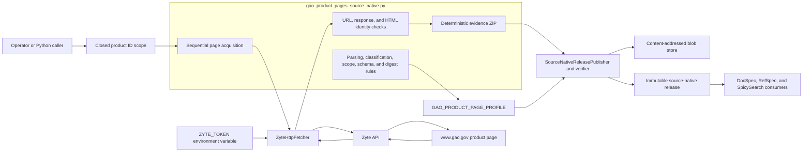
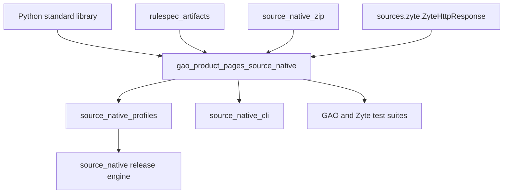
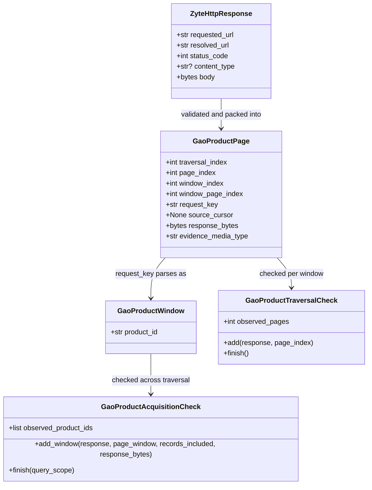
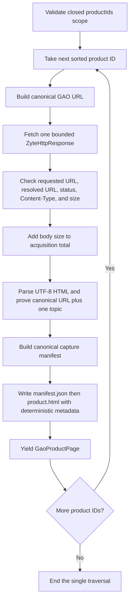
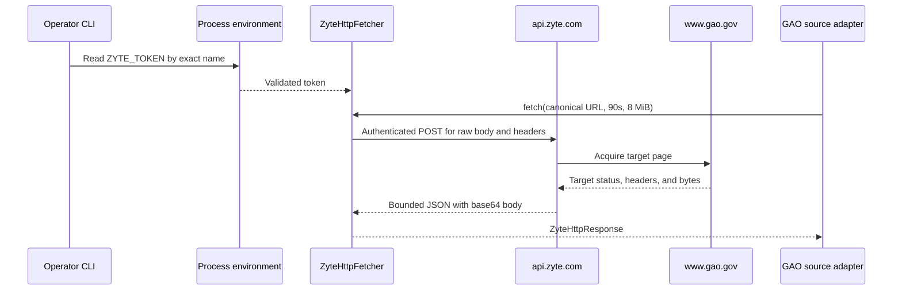
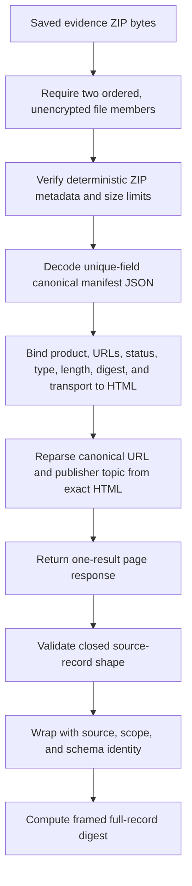
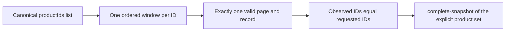
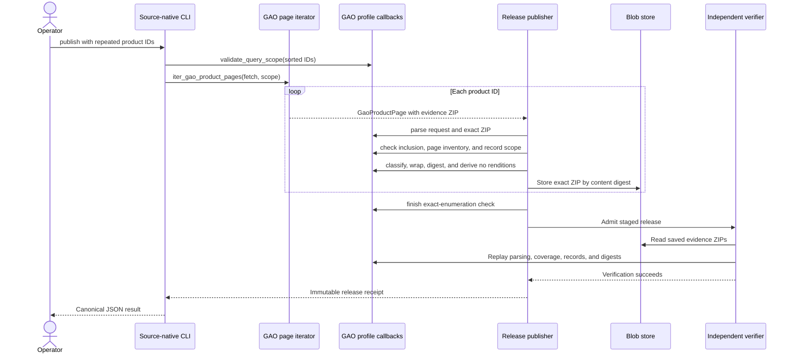

# GAO product page source native

The GAO product-page source-native module captures exact HTML for a closed list of U.S. Government Accountability Office (GAO) product IDs. It proves that each requested page has the expected identity, preserves the page bytes in deterministic ZIP evidence, and publishes one structured record containing capture metadata and GAO's one literal publisher topic.

The module deliberately stops at source evidence. It does not interpret the topic as a RefSpec concept, create a search tag, extract a report body, or discover the complete GAO catalog. Its `complete-snapshot` claim means that one release covers every product ID in its explicit query scope exactly once.

## Purpose and system role

| Question | Answer |
| --- | --- |
| What goes in? | A closed mapping of sorted, distinct GAO product IDs and an injected `GaoProductFetch` function. The production command supplies a bounded `ZyteHttpFetcher`. |
| What happens? | The iterator fetches each canonical product URL sequentially, validates the target response and the two publisher identity fields, creates deterministic ZIP evidence, and yields one `GaoProductPage` per ID. Profile callbacks replay the ZIP, classify the record, prove exact scope coverage, and derive release values. |
| What comes out? | One source-native record and one preserved HTML evidence object per requested product ID. The record contains the canonical URL, exact HTML digest and size, transport metadata, and the literal GAO topic link, slug, and visible label. It produces no rendition rows. |
| How do we check it? | Acquisition validates the live response before yielding it. Publication and independent verification parse the saved ZIP again, recompute its digest, re-read the HTML fields, compare every window with the requested ID list, and replay the shared release checks. |

The [source-native profile API](source_native_profile_api.md) defines the callbacks implemented here. The [source-native release engine](source_native_release_engine.md) consumes those callbacks, stores evidence, publishes the immutable release, and independently replays it. The [source-native operator CLI](source_native_operator_cli.md) supplies the production transport and release metadata.

## Architecture and ownership boundaries



SpicyDocs owns acquisition, exact evidence, and literal source fields. This module therefore preserves GAO's topic text without importing DocSpec, RefSpec, or SpicySearch. Downstream products may interpret the record only after they consume the admitted source-native release.

The production path uses Zyte because the migrated capture campaign observed GAO refusing the ordinary direct client. Zyte is a transport adapter, not a source of record. The module accepts only a response whose requested URL, resolved URL, canonical HTML URL, and product ID all identify the same GAO page.

### Direct dependencies and consumers



| Dependency | Use |
| --- | --- |
| Python standard library | URL parsing, strict HTML parsing, SHA-256 hashing, JSON decoding, ZIP reading and writing, immutable data classes, and bounded in-memory byte streams. |
| `rulespec_artifacts` | Canonical JSON, framed record digests, and source schema-bundle digests. |
| [`source_native_zip.py`](../src/spicy_docs/source_native_zip.py) | Creates deterministic ZIP entries and verifies their metadata during replay. |
| [`sources/zyte.py`](../src/spicy_docs/sources/zyte.py) | Defines the `ZyteHttpResponse` boundary and the production raw-HTTP fetcher. |
| [`source_native_profiles.py`](../src/spicy_docs/source_native_profiles.py#L21-L49) | Binds the module's functions and check classes into `GAO_PRODUCT_PAGE_PROFILE`. |
| [`source_native_cli.py`](../src/spicy_docs/source_native_cli.py) | Validates command arguments, creates the live Zyte fetcher, invokes the page iterator, and hands the stream to the release publisher. |

The source adapter does not import the release engine. Profile composition keeps the dependency direction from source rules to the generic publisher, while an injected fetch function keeps network access outside deterministic parsing and verification.

## Stable identities and resource bounds

The constants near the top of [`gao_product_pages_source_native.py`](../src/spicy_docs/gao_product_pages_source_native.py#L42-L63) define the durable source, schema, policy, and evidence identities.

| Concern | Value |
| --- | --- |
| Source system | `https://www.gao.gov/products` |
| Source-system version | `html-product-page-v1` |
| Scope ID | `gao-product-pages` |
| Schema | `gao-product-page-raw` version `1.0` |
| Acquisition policy | `urn:spicy-docs:acquisition:gao-product-page-zyte-enumeration`, version `1.0` |
| Evidence type | `gao-product-page-evidence-v1` |
| Evidence media type | `application/zip` |
| Transport ID | `zyte-raw-http-v1` |
| Traversals | Exactly one |

| Bound | Current value | Enforcement point |
| --- | ---: | --- |
| Product IDs per release | 1 to 1,000 | Query-scope validation before acquisition |
| Product ID length | 128 characters | Scope, URL, manifest, and record validation |
| HTML bytes per product | 8 MiB | Zyte adapter, capture validation, and ZIP replay |
| Total HTML bytes | 1 GiB | Acquisition iterator across the complete requested list |
| Evidence manifest | 64 KiB | ZIP creation and replay |
| Topic slug | 128 characters | HTML extraction, record classification, and JSON Schema |
| Topic label | 512 characters | HTML extraction, record classification, and JSON Schema |
| Live fetch timeout | 90 seconds | Operator-created `ZyteHttpFetcher` call |

These limits form part of the acquisition policy and replay behavior. Review a changed limit as a compatibility decision, even when it appears to be an operational tuning value.

## Component map

[`gao_product_pages_source_native.py`](../src/spicy_docs/gao_product_pages_source_native.py) groups its components by responsibility:

| Group | Main components | Responsibility |
| --- | --- | --- |
| Scope and locators | `_product_id`, `gao_product_url`, `gao_product_query_scope`, `parse_gao_product_request`, `GaoProductWindow` | Define a closed, canonical product set and bind each request URL to one validated ID. |
| Transport boundary | `GaoProductFetch`, `ZyteHttpResponse`, `ZyteHttpFetcher` | Separate source-specific interpretation from the production browser-backed acquisition mechanism. |
| Evidence pages | `GaoProductPage`, `_capture_manifest`, `_evidence_zip` | Carry one deterministic, bounded ZIP and its source-native page coordinates. |
| HTML interpretation | `_GaoHtmlFields`, `_publisher_fields` | Read only the exact canonical URL and one literal publisher topic from bounded UTF-8 HTML. |
| Replay and classification | `_decode_manifest`, `parse_gao_product_page_response`, `classify_gao_product_page` | Prove ZIP integrity, bind metadata to the saved HTML, and validate the closed record shape. |
| Coverage | `GaoProductTraversalCheck`, `GaoProductAcquisitionCheck`, `gao_product_records_included`, `validate_record_scope`, `gao_product_next_page_url` | Prove one page per window and exact ordered coverage of the requested product IDs. |
| Release derivation | `source_record_id`, `source_record`, `source_record_digest`, `rendition_rows` | Create the source-native wrapper and digest; explicitly produce no renditions. |
| Declarations | `GAO_PRODUCT_PAGE_SCHEMA`, `source_schema_digest`, `source_schema_declaration`, `gao_product_acquisition_policy` | Define the record schema and the claims sealed into a release. |

`GaoProductSourceError` is the fail-closed exception for source, evidence, identity, and scope failures. It subclasses `ValueError`. `ZyteTransportError` separately reports transport and provider-response failures.

### Core data types



## Query scope and request identity

The public Python query shape is deliberately small:

```python
scope = {
    "productIds": [
        "gao-26-107693",
        "gao-26-107694",
    ]
}
```

`gao_product_query_scope` accepts only the `productIds` field. It requires a nonempty list with at most 1,000 members. Every member must:

- be a string no longer than 128 characters;
- match `^[a-z0-9]+(?:-[a-z0-9]+)*$`; and
- appear in strictly increasing ASCII order with no duplicate.

The validator returns a new mapping containing the validated list. Direct Python callers must supply canonical ordering. The operator command rejects duplicates and sorts repeated `--product-id` arguments before it calls this validator.

`gao_product_url` maps an ID to exactly `https://www.gao.gov/products/<product-id>`. `parse_gao_product_request` reverses that mapping and rejects every variation: a different scheme or authority, extra path segments, a port, credentials, a query string, a fragment, an unsafe ID, or a noncanonical serialization. The returned `GaoProductWindow` gives later checks an O(1) identity comparison without rescanning the full scope list.

## Acquisition flow

`iter_gao_product_pages` processes the canonical ID list in order and yields each page before fetching the next. It never accumulates the full HTML corpus.



For each ID, acquisition enforces these rules before any evidence page reaches the publisher:

1. The fetcher returns a `ZyteHttpResponse` rather than an arbitrary compatible object.
2. `requested_url` and `resolved_url` both equal the canonical product URL. Redirects therefore fail instead of silently changing identity.
3. The target status is exactly `200`.
4. The media type before any `;` parameter is `text/html`, compared case-insensitively.
5. The target body is nonempty `bytes` and no larger than 8 MiB.
6. The running total stays at or below 1 GiB.
7. The exact body is strict UTF-8 and contains the required canonical URL and topic structure.

The iterator intentionally fetches sequentially. For `N` product IDs, `H` total HTML bytes, and largest page `B`, its work is `O(N + H)` after scope ordering, and its working space is `O(N + B)`. The operator's initial sorting adds `O(N log N)` work. Network latency remains `O(N)` requests, which avoids burst-loading the provider or publisher.

## Zyte transport boundary

[`sources/zyte.py`](../src/spicy_docs/sources/zyte.py) provides one bounded raw-HTTP adapter shared at the acquisition layer. `ZyteHttpFetcher.fetch` asks Zyte for the target response body and headers, decodes the returned base64, and produces a `ZyteHttpResponse` with public target metadata.



### Credential handling

The live path reads only `ZYTE_TOKEN` from the process environment. It does not search for or parse dotenv files. Validation rejects an empty token, surrounding whitespace, dotenv quote characters, and characters that cannot be encoded for Basic authentication.

The token is excluded from `repr`, request payload JSON, exceptions, target URLs, request keys, evidence ZIPs, records, and releases. It exists in process memory and in the outbound `Authorization` header sent to Zyte. Callers must not wrap the fetcher with logging that records request headers.

### Provider-response bounds

The adapter validates both the provider response and the decoded target:

- the Zyte API URL must be credential-free HTTPS without a query or fragment;
- target and resolved URLs must be absolute, credential-free HTTP or HTTPS URLs;
- the provider JSON read is capped at `max(1 MiB, max_bytes * 2 + 64 KiB)`, with one extra byte read to detect overflow;
- duplicate provider JSON fields fail;
- target status must be an integer rather than a Boolean;
- response headers must contain well-typed name/value objects and at most one nonempty `Content-Type`;
- the body must be nonempty valid base64 in the provider response; and
- decoded target bytes must stay within the caller's `max_bytes` limit.

The general Zyte adapter permits public HTTP or HTTPS targets. The GAO module narrows that boundary to one canonical HTTPS authority and path before it accepts evidence.

## Evidence ZIP

Every `GaoProductPage.response_bytes` value is an `application/zip` archive with exactly two members in this order:

```text
manifest.json
product.html
```

`manifest.json` uses canonical JSON bytes and contains exactly these fields:

```json
{
  "byteLength": 12345,
  "contentType": "text/html; charset=UTF-8",
  "entry": "product.html",
  "evidenceType": "gao-product-page-evidence-v1",
  "productId": "gao-26-107693",
  "requestedUrl": "https://www.gao.gov/products/gao-26-107693",
  "resolvedUrl": "https://www.gao.gov/products/gao-26-107693",
  "sha256": "sha256:<64 lowercase hexadecimal characters>",
  "targetStatus": 200,
  "transport": "zyte-raw-http-v1"
}
```

`product.html` contains the exact target bytes. The writer uses DEFLATE compression at level 6 and `deterministic_zip_entry` for fixed member metadata. Given the same validated response, repeated acquisition produces the same evidence ZIP bytes.

The manifest duplicates important target metadata intentionally. During replay, it binds the product identity, transport result, and digest to the exact HTML member. The content-addressed blob store separately binds the whole ZIP to the release; see [source-native storage and publication](source_native_storage_and_publication.md).

## HTML interpretation

`_GaoHtmlFields` extends Python's `HTMLParser` and reads only two publisher statements:

1. one `<link rel="canonical" href="...">` whose URL exactly equals the requested product URL; and
2. one topic `<a>` inside one `<div>` whose `class` tokens include `views-field-field-topic`.

The topic anchor must have an exact relative href of `/topics/<slug>`. The slug uses the same bounded lowercase ASCII pattern as a product ID. The visible label must contain text, and its raw text must not exceed 512 characters. `HTMLParser(convert_charrefs=True)` converts character references such as `&amp;` to visible characters, and the module trims only leading and trailing whitespace from the final label.

The parser rejects ambiguous relevant markup, including:

- missing, repeated, or changed canonical links;
- missing, repeated, or nested topic fields;
- repeated relevant attributes;
- a non-topic link inside the topic field;
- multiple or nested topic anchors;
- nested markup inside the active topic label;
- unsafe, empty, or noncanonical topic slugs;
- an empty, oversized, or unterminated label; and
- invalid tracked `<div>` nesting.

Unrelated page markup remains outside the source rule. A change elsewhere in the HTML does not alter the structured record except for `htmlByteLength` and `htmlSha256`. The exact changed page still remains visible in `product.html` evidence.

## Evidence replay and record construction

`parse_gao_product_page_response` replays one ZIP in `O(B)` time and `O(B)` working space, where `B` is the bounded HTML size.



Replay fails unless:

- member names and order are exactly `manifest.json`, `product.html`;
- neither member is a directory or encrypted;
- both members use the deterministic metadata required for their names;
- uncompressed manifest and HTML sizes stay within their bounds;
- the manifest is UTF-8 canonical JSON with unique names and the exact field set;
- typed manifest values use the expected JSON/Python types, with Boolean values refused for integers;
- product ID, requested URL, resolved URL, status, content type, evidence type, entry name, and transport have their fixed relationships;
- `byteLength` equals the actual HTML length;
- `sha256` equals a fresh SHA-256 digest of the actual HTML; and
- the HTML still yields the exact canonical URL and one valid topic.

The parser returns the common page-response shape expected by the profile API:

```python
{
    "_evidenceType": "gao-product-page-evidence-v1",
    "_productId": "gao-26-107693",
    "count": 1,
    "next_page_url": None,
    "results": [record],
    "total_pages": 1,
}
```

The underscore-prefixed values are replay details used to bind the evidence to the request window. They are not fields in the published source record.

## Published record and schema

`classify_gao_product_page` accepts exactly ten top-level record fields and exactly three topic fields:

```json
{
  "canonicalUrl": "https://www.gao.gov/products/gao-26-107693",
  "contentType": "text/html; charset=UTF-8",
  "htmlByteLength": 12345,
  "htmlSha256": "sha256:<64 lowercase hexadecimal characters>",
  "productId": "gao-26-107693",
  "publisherTopic": {
    "href": "/topics/information-security",
    "label": "Information Security",
    "slug": "information-security"
  },
  "requestedUrl": "https://www.gao.gov/products/gao-26-107693",
  "resolvedUrl": "https://www.gao.gov/products/gao-26-107693",
  "targetStatus": 200,
  "transport": "zyte-raw-http-v1"
}
```

The classifier rechecks the URL equalities, HTTP result, transport identifier, media type, byte and digest shapes, and topic relationship. It also verifies that the mapping can be represented as canonical JSON. It returns a shallow dictionary copy; the topic values remain the literal values derived from the evidence.

`GAO_PRODUCT_PAGE_SCHEMA` is a closed JSON Schema Draft 2020-12 description of this record. Its `x-spicy-record-order` extension declares `/productId` as the non-null string ordering field under UTF-16 code-unit comparison. Runtime classification remains the admission rule; changing only the JSON Schema does not broaden accepted records.

### Wrapper, identity, digest, and renditions

`source_record_id` returns `productId`. `source_record` wraps the classified value as:

```python
{
    "fieldDiagnostics": [],
    "record": record,
    "schemaDigest": schema_digest,
    "schemaName": "gao-product-page-raw",
    "schemaVersion": "1.0",
    "scopeId": "gao-product-pages",
    "sourceRecordId": record["productId"],
}
```

The module emits no field diagnostics because every accepted field is unambiguous; an invalid field causes refusal. `source_record_digest` uses the framing domain `spicydocs-gao-product-page-record/1` and covers the complete canonical record. Any accepted record-field change therefore changes the digest.

`rendition_rows` always returns an empty tuple. The exact HTML remains acquisition evidence, not a downstream document rendition or user-facing locator.

`source_schema_digest` computes the schema-bundle digest under `sources/gao-product-page-raw-1.0.schema.json`. The profile installs the schema in a release under `schemas/gao-product-page-raw-1.0.schema.json`. Keep the digest path and installed member key distinct and stable when reviewing schema changes.

## Page, window, and coverage model

Each requested product is one explicit, one-page window within one traversal.

| `GaoProductPage` field | Required value |
| --- | --- |
| `traversal_index` | `0` |
| `page_index` | Position of the product ID in the sorted scope |
| `window_index` | Equal to `page_index` |
| `window_page_index` | `0` |
| `request_key` | Exact canonical GAO product URL |
| `source_cursor` | `None` |
| `response_bytes` | Nonempty deterministic evidence ZIP |
| `evidence_media_type` | `application/zip` |

`GaoProductPage.__post_init__` checks page coordinates, the no-cursor rule, canonical request syntax, and nonempty evidence. ZIP structure and meaning are checked later by `parse_gao_product_page_response`, during both publication and replay.

Coverage uses several independent checks:

| Check | Proof |
| --- | --- |
| `gao_product_next_page_url` | The parsed response has no continuation URL. |
| `GaoProductTraversalCheck` | One window has page index `0`, one result, `count == 1`, and exactly one observed page. |
| `gao_product_records_included` | The parsed evidence type and product ID match the validated `GaoProductWindow`; every valid GAO page contributes its record. |
| `validate_record_scope` | The record's `productId` equals the window's product ID. |
| `GaoProductAcquisitionCheck.add_window` | Windows remain strictly ordered, unrepeated, included, and bound to their parsed evidence. |
| `GaoProductAcquisitionCheck.finish` | The complete observed ID list equals the canonical query-scope list. |

These checks detect missing, extra, reordered, repeated, paginated, or identity-swapped pages. They also explain the profile's state claim:



The claim does not say that the scope lists every product on `gao.gov`. The caller, not this module, supplies the closed set.

## Profile and release interaction

[`GAO_PRODUCT_PAGE_PROFILE`](../src/spicy_docs/source_native_profiles.py#L21-L49) sets:

- `source_state_scope="complete-snapshot"`;
- `traversal_acceptance="source-enumeration"`;
- `max_traversals=1`;
- the query, page, record, schema, digest, scope, and coverage callbacks from this module; and
- no observation-version callback, because the explicit acquisition admits one observation per product identity.

The shared engine controls artifact staging, blob storage, record partitioning, publication, admission, and independent replay. Those mechanics are documented in the [source-native release lifecycle](source_native_release_lifecycle.md) and [source-native release engine](source_native_release_engine.md).



Any source or transport exception stops publication. The module has no warning, partial-release, or best-effort path.

## Operator usage

Live acquisition requires `ZYTE_TOKEN` in the process environment. From the repository environment, publish one or more products with repeated `--product-id` arguments:

```sh
ZYTE_TOKEN='<provider token>' spicy-docs-source-native publish \
  --source gao-product-pages \
  --product-id gao-26-107693 \
  --product-id gao-26-107694 \
  --destination /new/immutable/gao-release \
  --blob-store /persistent/source-native-blobs \
  --implementation-id 'git+https://example/spicy-docs@<commit>'
```

The command sorts product IDs, rejects duplicates before fetching, and refuses `--agency`, `--since`, or `--until` for this source. It also requires separate, nonoverlapping release and blob-store paths and refuses to replace an existing destination.

The GAO CLI path makes one bounded Zyte call per product. It does not add a GAO-specific retry, concurrent fetch, or resume layer. A transport or source refusal aborts the run. Operators should treat a retry as a new immutable publication attempt with a new unused destination and should confirm the intended closed ID list before starting a large run.

Use the `verify` subcommand with the logical ID, artifact digest, accepted verifier implementation ID, release directory, and the same persistent blob store reported by publication. The [source-native operator CLI](source_native_operator_cli.md) documents the common verification command and output.

## Failure model

The module refuses evidence when it cannot prove identity or completeness.

| Failure group | Examples |
| --- | --- |
| Query scope | Unknown field, empty or oversized list, repeated or unsorted ID, uppercase or unsafe ID, overlong ID. |
| Request identity | Non-HTTPS URL, wrong host or path, credentials, query, fragment, port, or noncanonical spelling. |
| Transport | Missing or malformed token, invalid provider JSON or base64, duplicate target `Content-Type`, provider payload overflow, target body overflow, or network/HTTP failure. |
| Target response | Redirected resolved URL, non-`200` target status, non-HTML content type, empty body, per-page overflow, or total-corpus overflow. |
| Publisher markup | Invalid UTF-8, wrong canonical URL, missing or repeated topic field, unsafe topic href, nested topic markup, empty or oversized label. |
| Evidence integrity | Invalid ZIP, wrong member order, encrypted or directory member, nondeterministic metadata, oversized member, noncanonical or duplicate-field manifest, HTML length or digest mismatch. |
| Record shape | Extra or missing field, changed fixed URL or transport value, malformed digest, invalid topic relationship, or noncanonical JSON value. |
| Coverage | More than one page in a window, cursor present, missing or reordered window, repeated product, record/window mismatch, or observed list different from requested list. |

Refusal messages identify the failed rule without including credentials or full provider payloads. Callers may catch `GaoProductSourceError`, `ZyteTransportError`, or the broader `ValueError`, but normal publication should let the command produce its structured failure output. The CLI reports GAO source refusals as `acquisition-failed`, Zyte failures as `transport-failed`, invalid release or argument relationships as `release-invalid`, and an occupied destination as `destination-exists`.

## Contribution guide

### Preserve the product boundary

- Keep exact source acquisition and literal GAO fields in SpicyDocs.
- Do not resolve `publisherTopic.slug` through RefSpec or derive SpicySearch tags here.
- Do not treat the page HTML as a DocSpec document representation. Preserve it as evidence and add downstream processing through the appropriate released-record consumer.
- Keep network and credential handling in `sources/zyte.py` or another acquisition transport. Keep HTML meaning and GAO identity rules in this module.
- Preserve the injected `GaoProductFetch` boundary so unit and verification paths remain deterministic and network-free.

### Keep creation and replay symmetric

Changes to evidence must update both sides of the proof:

1. Add or remove manifest fields in `_capture_manifest`, `_MANIFEST_FIELDS`, `_decode_manifest`, and `parse_gao_product_page_response` together.
2. Keep manifest member names, ZIP order, compression settings, deterministic metadata, and size checks aligned in `_evidence_zip` and the replay parser.
3. Recompute and compare body length and SHA-256 during replay; never trust the manifest alone.
4. Run `_publisher_fields` before yielding new evidence and again while parsing saved evidence.
5. Add a tampering test that changes the new value in isolation and proves replay refusal.

### Handle GAO markup drift explicitly

When a live page changes:

1. Save a minimal representative HTML fixture showing the changed source structure without credentials or unrelated personal data.
2. Decide whether GAO still states one unambiguous canonical product URL and one literal topic.
3. Narrowly update `_GaoHtmlFields` and `_publisher_fields`; avoid broad selectors that accept unrelated anchors.
4. Retain tests for missing, repeated, nested, unsafe, and mismatched neighboring structures.
5. Review whether the change alters `SOURCE_SYSTEM_VERSION`, `EVIDENCE_TYPE`, the acquisition policy version, the raw schema version, or digest framing.

Do not weaken an identity check merely to make one changed page pass. If the source no longer makes the required statement, fail the acquisition until the product decision changes.

### Change the record schema as one unit

For any accepted record-field change, update:

- `_RECORD_FIELDS` and any nested field set;
- extraction or manifest binding;
- `classify_gao_product_page` runtime validation;
- `GAO_PRODUCT_PAGE_SCHEMA` and its `required` list;
- wrapper and digest expectations;
- valid-record, unknown-field, and tampered-evidence tests; and
- schema, source-system, policy, or digest-domain versions when meaning changes.

Runtime classification and JSON Schema serve different checks. A schema-only change does not make the parser or classifier accept a field.

### Review identity and policy changes

Treat these changes as release-compatibility decisions:

- product-ID grammar or canonical URL construction;
- query ordering, list bounds, or the meaning of `complete-snapshot`;
- redirect, status, media-type, canonical-link, or topic acceptance;
- transport provider or `TRANSPORT_ID`;
- evidence membership, canonical manifest, ZIP metadata, or byte bounds;
- source-record identity, digest framing, or rendition behavior; and
- schema bundle path, installed schema key, schema fields, or ordering declaration.

Renaming an internal helper without changing behavior needs no version change. Changing what old evidence means or what a release claims usually does.

## Testing and verification

Run the focused deterministic suites from the repository root:

```sh
uv run pytest -q \
  tests/test_gao_product_pages_source_native.py \
  tests/test_gao_source_native_cli.py \
  tests/test_zyte_transport.py
```

These tests cover deterministic ZIP bytes, exact HTML replay, literal topic preservation, character references and edge whitespace, tampered HTML, changed ZIP metadata, O(1) per-window scope checks, sibling-product import boundaries, unsafe scopes, redirect and publisher drift, per-page and total bounds, end-to-end publication and independent verification, duplicate CLI IDs before fetch, secret-safe errors and representations, bounded provider responses, and exact target bytes.

The focused suites use injected responses and local storage. They do not require `ZYTE_TOKEN` or live network access. A future live drift test should use the `integration` marker and retain hermetic regression evidence for every discovered source shape.

Finish with the repository gates:

```sh
uv run pytest -q
uv run ruff check .
uv run ruff format --check .
uv run ty check
```

## Public API reference

### Acquisition and page APIs

| API | Summary |
| --- | --- |
| `GaoProductFetch` | Callable boundary from a canonical URL to `ZyteHttpResponse`. |
| `GaoProductPage` | One validated source-native page carrying deterministic ZIP evidence. |
| `GaoProductWindow` | Parsed request identity for one explicit product window. It is public by module definition but absent from `__all__`. |
| `gao_product_url` | Builds one canonical GAO product URL after validating its ID. |
| `gao_product_query_scope` | Validates and copies the closed, ordered `productIds` scope. |
| `parse_gao_product_request` | Parses and round-trips one canonical product request into `GaoProductWindow`. |
| `iter_gao_product_pages` | Sequentially acquires, validates, packages, and yields every requested product. |
| `parse_gao_product_page_response` | Replays one bounded evidence ZIP into the common one-result response shape. |

### Validation and coverage APIs

| API | Summary |
| --- | --- |
| `classify_gao_product_page` | Applies closed runtime validation to one derived capture record. |
| `gao_product_next_page_url` | Enforces the no-pagination rule and returns `None`. |
| `GaoProductTraversalCheck` | Proves that one product window has one page and one record. |
| `gao_product_records_included` | Binds evidence identity to the parsed request and always includes a valid result. |
| `validate_record_scope` | Requires the record identity to equal the window identity. |
| `GaoProductAcquisitionCheck` | Proves exact ordered coverage of the canonical product-ID list. |
| `gao_product_acquisition_policy` | Declares scope, transport, evidence, bounds, traversal count, strategy, and publisher field. |

### Release-derivation APIs

| API | Summary |
| --- | --- |
| `source_record_id` | Returns the validated `productId`; it is public by module definition but absent from `__all__`. |
| `source_record` | Wraps the classified record with scope and raw-schema identity. |
| `source_record_digest` | Computes a framed digest over the complete record. |
| `rendition_rows` | Returns no renditions. |
| `source_schema_digest` | Computes the raw schema-bundle digest. |
| `source_schema_declaration` | Returns the schema name, version, and digest. |

### Zyte transport APIs

| API | Summary |
| --- | --- |
| `ZyteHttpResponse` | Immutable exact target bytes plus requested URL, resolved URL, target status, and content type. |
| `ZyteHttpFetcher` | Secret-safe bounded provider client used by the production command. |
| `validate_zyte_token` | Validates credential shape without echoing the token. |
| `require_zyte_token_from_environment` | Reads and validates only `ZYTE_TOKEN`. |

## Related documentation

- [Source-native acquisition profiles](source_native_acquisition_profiles.md) — parent module and comparison of source-specific acquisition models.
- [Source-native profile API](source_native_profile_api.md) — page properties, callbacks, check lifecycles, and profile composition.
- [Source-native release lifecycle](source_native_release_lifecycle.md) — shared publication, evidence storage, verification, and operator path.
- [Source-native release engine](source_native_release_engine.md) — callback invocation, source-enumeration acceptance, artifact construction, and independent replay.
- [Source-native storage and publication](source_native_storage_and_publication.md) — deterministic ZIP helpers, content-addressed evidence, and immutable directory publication.
- [Source-native operator CLI](source_native_operator_cli.md) — full publish and verify command behavior.
- [Federal Register source native](federal_register_source_native.md) — a contrasting paginated observed crawl with stable consecutive traversals.
- [Regulations.gov source native](regulations_gov_source_native.md) — a contrasting complete mirror enumeration with packed JSON evidence and observation versions.
- [SpicyRegs public table source native](spicy_regs_public_table_source_native.md) — a contrasting complete partition enumeration over captured Parquet objects.
