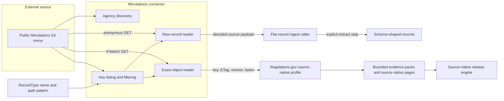
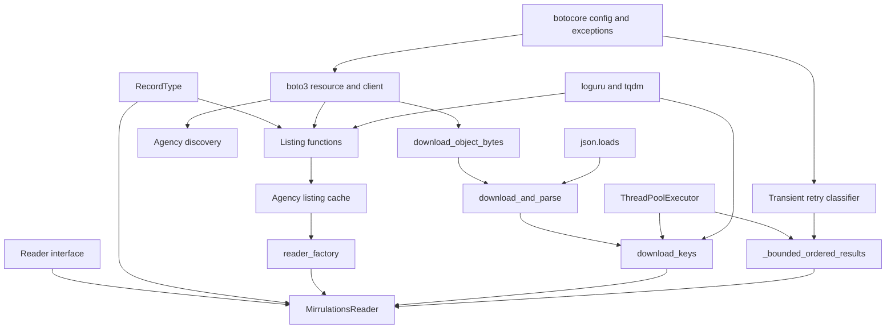
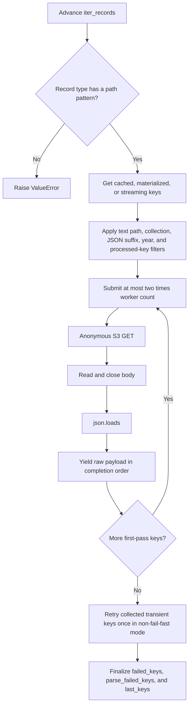
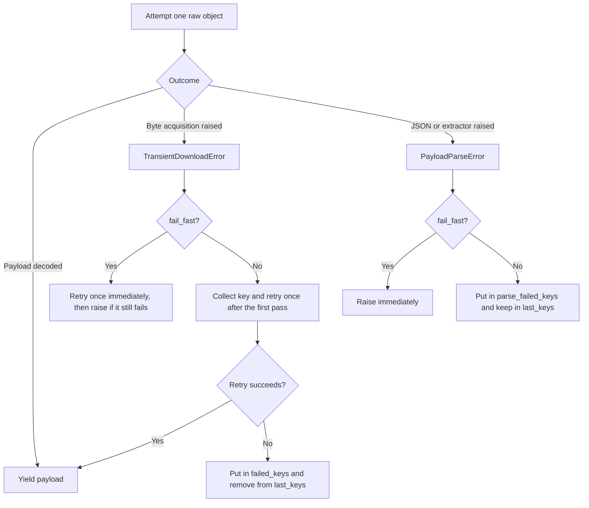
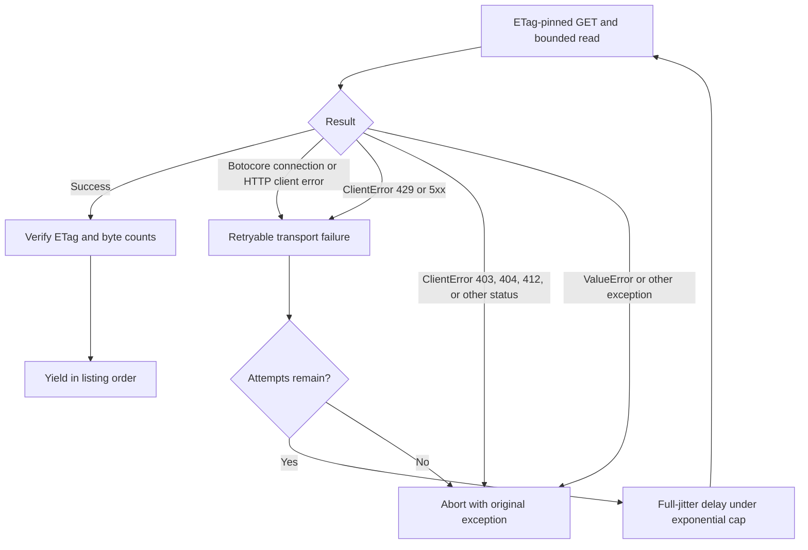
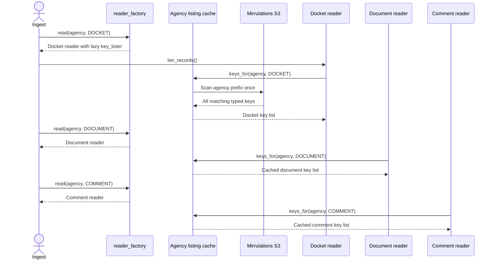

> Generated reference snapshot; see [current architecture](../docs/architecture.md),
> [operator commands](../docs/cli.md), and [reference maintenance](../docs/documentation.md).

# Mirrulations connector

The Mirrulations connector reads Regulations.gov records from the public
`s3://mirrulations/raw-data` mirror. It discovers agency prefixes, selects one
record family by its `RecordType.path_pattern`, downloads objects concurrently,
and exposes either decoded JSON or exact, ETag-pinned bytes.

The connector owns acquisition only. It does not flatten records, validate the
full Regulations.gov source shape, deduplicate records, or publish a release.
Those responsibilities belong to the components linked in [Related
documentation](#related-documentation).

## Purpose and system role

| Question | Answer |
| --- | --- |
| What goes in? | An agency code, a path-addressable `RecordType`, optional year and processed-key filters, and an anonymous S3 resource. |
| What happens? | The connector lists matching mirror keys, performs bounded concurrent S3 GETs, closes response bodies, and either decodes JSON or verifies exact bytes against listing metadata. |
| What comes out? | `iter_records()` yields raw decoded payloads. `iter_source_objects()` yields `MirrulationsSourceObject` values containing a key, ETag, optional version ID, and exact bytes. |
| How do we check it? | Hermetic tests use fake S3 resources to check selection, concurrency bounds, ordering, retries, body closure, failure bookkeeping, ETag pinning, size checks, and factory caching. |

The connector supports two different acquisition needs:

1. The raw-record path favors incremental ingest. It can skip processed keys,
   continue past individual failures, and retain a manifest candidate list.
2. The exact-object path favors replayable source evidence. It preserves listing
   order, pins each GET to the listed ETag, enforces byte limits, and aborts when
   it cannot prove a complete filtered enumeration.

Do not treat these paths as interchangeable. Their ordering, retry, output, and
failure rules differ by design.

## System placement



The flat-record caller must invoke the selected `RecordType.extract` function
explicitly. `MirrulationsReader.iter_records()` uses the record type only to
select a path; it yields the mirror's raw JSON payload. See [source connector
contracts and projections](source_connector_contracts_and_projections.md) for
the `Reader` and `RecordType` APIs and the Regulations.gov projections.

The source-native path bypasses those flat projections. The [Regulations.gov
source-native module](regulations_gov_source_native.md) validates identity and
scope, groups exact objects into evidence packs, and builds source-native pages.
The [source-native release engine](source_native_release_engine.md) admits,
stores, publishes, and verifies the resulting release.

## Source layout and key selection

The connector assumes this mirror layout:

```text
raw-data/{agency}/{agency}-{year}-.../text-.../{collection}/{record}.json
```

The built-in Regulations.gov record types use these mutually exclusive path
fragments:

| Record type | `RecordType.name` | `RecordType.path_pattern` |
| --- | --- | --- |
| Docket | `dockets` | `/docket/` |
| Document | `documents` | `/documents/` |
| Comment | `comments` | `/comments/` |

`iter_json_files()` and `list_agency_files_by_type()` accept a key only when it:

- starts under `{prefix}/{agency}/`, because the S3 listing applies that prefix;
- contains `/text-`;
- contains the selected path pattern; and
- ends with `.json`.

When `since_year` is truthy, the connector extracts a four-digit year from the
leading docket segment `{prefix}/{agency}/{agency}-{YYYY}-...`. It rejects a key
only when that pattern matches and the extracted year is older than
`since_year`. A key whose year does not match the pattern passes the filter.

When `processed_keys` is truthy, membership in that collection removes a key
from the raw-record listing. The exact-object path rejects any truthy
`processed_keys` value because omitted keys would invalidate a complete
enumeration. An empty collection is allowed because it omits nothing.

### Agency discovery

`get_agencies()` calls `list_objects_v2` with `Delimiter="/"`, extracts the
second path segment from each `CommonPrefixes` entry, removes empty values, and
sorts the result. `discover_agencies()` supplies the module's anonymous client,
bucket, and prefix.

This helper makes one `list_objects_v2` request; it does not follow a
continuation token. It also assumes the configured prefix occupies one path
segment. The built-in `raw-data` prefix satisfies that assumption. A change that
can produce more than one response page or a nested prefix must add pagination
and update the extraction rule.

## Architecture and dependencies



### Direct dependencies

| Dependency | Use |
| --- | --- |
| `spicy_docs.sources.base.Reader` | Defines the raw dictionary iterator implemented by `MirrulationsReader`. |
| `spicy_docs.schemas.RecordType` | Supplies the record-family name and S3 path fragment. Its extractor is not called by `iter_records()`. |
| `boto3` | Creates anonymous S3 clients and resources and performs listing and GET operations. |
| `botocore` | Configures unsigned requests, timeouts, connection pooling, SDK retries, and exact-path transient-error classification. |
| `concurrent.futures` | Bounds concurrent, I/O-bound GET operations. |
| `loguru` | Reports retries, per-key failures, and periodic download progress. |
| `tqdm` | Writes optional listing summaries without corrupting an active progress display. |
| Python standard library | Handles JSON decoding, regex year parsing, timing, jitter, data classes, locking, and iterators. |

This is an acquisition-heavy module. Import readers directly from
`spicy_docs.sources.mirrulations`; `spicy_docs.sources` intentionally does not
re-export them. That boundary keeps `boto3`, `botocore`, `loguru`, and `tqdm`
out of the installed release read-and-verify path.

## Component guide

### Connection configuration

| Component | Responsibility |
| --- | --- |
| `BUCKET` | Names the public `mirrulations` bucket. |
| `PREFIX` | Selects the `raw-data` object tree. |
| `s3_client()` | Creates an unsigned `us-east-1` client for agency discovery. |
| `s3_resource(max_pool_connections=16)` | Creates an unsigned `us-east-1` resource for listing and GETs. It sets 30-second connect and 120-second read timeouts, Botocore standard retries with `max_attempts=5`, and an explicit connection-pool size. |

Each reader created by the production factory receives a fresh resource and
shares it across that reader's download threads. The default pool and worker
counts are both 16. If a caller raises `download_workers` above 16, it should
inject a matching resource:

```python
workers = 32
read = reader_factory(
    [DOCKET, DOCUMENT, COMMENT],
    download_workers=workers,
    resource_factory=lambda: s3_resource(max_pool_connections=workers),
)
```

Without that adjustment, download threads can outnumber available HTTP
connections.

### Discovery and listing

| Component | Responsibility and output |
| --- | --- |
| `get_agencies(client, bucket_name, prefix)` | Returns sorted top-level agency names from one delimited S3 response. |
| `discover_agencies()` | Calls `get_agencies()` with the built-in anonymous connection settings. |
| `iter_json_files(...)` | Streams matching keys for one agency and record type with optional year and processed-key filters. |
| `list_json_files(...)` | Materializes `iter_json_files()` as a reusable list. |
| `list_agency_files_by_type(...)` | Scans one agency prefix once and returns a list for each requested `RecordType.name`. |
| `_AgencyListingCache` | Lazily retains one `list_agency_files_by_type()` result per agency for readers created by one default factory. |

`list_agency_files_by_type()` assigns a key to the first requested path pattern
that it contains. Record types passed together must therefore have unique names
and mutually exclusive path patterns. The function does not check either rule.

The cache protects map access with a lock, but it performs an uncached S3 scan
outside the lock. Its intended caller processes one agency's record types
sequentially, which yields one scan per agency. Concurrent first access for the
same agency can perform redundant scans; `setdefault()` then retains one result.

### Download values and primitives

| Component | Responsibility and fields |
| --- | --- |
| `DownloadedObject` | Internal immutable GET result: `content`, `etag`, `version_id`, `last_modified`, and `content_length`. |
| `MirrulationsSourceObject` | Public immutable exact-object result: `key`, required listed `etag`, optional `version_id`, and `content`. |
| `download_object_bytes(...)` | Reads one body, applies optional `IfMatch` and `max_bytes` checks, checks returned length and ETag, and returns `DownloadedObject`. |
| `download_and_parse(...)` | Calls `download_object_bytes()`, decodes JSON with `json.loads`, and passes the decoded value to `extract_fn`. |

`download_object_bytes()` enforces `max_bytes` twice: it rejects a declared
`ContentLength` above the cap before reading, then reads at most `max_bytes + 1`
and rejects an oversized body when the declared length is missing or wrong. It
also rejects a body whose byte count differs from `ContentLength` and an ETag
that differs from `if_match`.

After the function enters its body-read block, `finally` closes the streaming
body on both success and read failure. The current preflight branch that rejects
an already-oversized `ContentLength` runs before that close block. Contributors
who change size handling should add a focused closure test for that branch.

`download_and_parse()` treats every exception raised while obtaining bytes as a
`TransientDownloadError`, including low-level validation errors. It treats JSON
decode and extractor errors as `PayloadParseError`. This broad classification
applies only to the raw-record path. The exact-object path calls
`download_object_bytes()` directly and distinguishes transport failures from
evidence failures.

The raw-record path passes no `max_bytes` value to `download_object_bytes()`.
Its memory bound controls the number of queued objects, not the size of each
object. The exact-object path supplies the 16 MiB default cap.

An `extract_fn` supplied to `download_and_parse()` must be deterministic. The
failure model assumes that fetching the same bytes again cannot repair an
extractor failure.

### Concurrent download helpers

| Component | Responsibility |
| --- | --- |
| `DownloadFailures` | Collects `transient` and `parse` key lists with fresh lists per instance. |
| `download_keys(...)` | Downloads and decodes a key iterable with one worker or a thread pool. It yields results in completion order and keeps at most `2 * workers` futures submitted. |
| `_bounded_ordered_results(...)` | Runs exact-object GETs concurrently with at most `window` futures pending, but yields `(item, result)` pairs in input order. |
| `_retry_transient(...)` | Retries only recognized transport failures with capped exponential backoff and full jitter. |

`download_keys()` accepts both sized and streaming iterables. For a non-empty
sized input, it reduces the thread count to the item count. Any worker count
below one becomes one. With one worker, it uses a serial loop instead of a
thread pool. A negative `transient_retries` value raises `ValueError`; each
configured raw retry starts immediately without backoff.

When `failures` is omitted and `raise_failures=False`, recognized per-key
failures are logged and dropped from the result without a retained summary.
When `raise_failures=True`, the helper records the failure when a collector is
present and then raises it.

The unordered helper submits at most twice the active worker count. The ordered
helper uses one worker-width window so that waiting for an early key cannot
cause unbounded completed results to accumulate behind it. When an ordered GET
failure becomes visible, it stops submitting new work. Generator closure
cancels work that has not started; already-running GETs finish under their S3
timeouts before the executor shuts down.

### `MirrulationsReader`

`MirrulationsReader` implements `Reader` for one agency and one record type.
Construction stores configuration only; listing and network work begin when a
consumer advances an iterator.

| Constructor option | Meaning |
| --- | --- |
| `s3_resource`, `bucket`, `prefix` | Inject the S3 connection and source location. |
| `agency`, `record_type` | Select one agency and one path-addressable record family. |
| `processed_keys` | Omit known keys from raw-record listing; incompatible with exact complete enumeration when non-empty. |
| `since_year` | Omit matching docket paths with an older year. |
| `verbose` | Emit listing counts through `tqdm.write`. |
| `download_workers` | Bound concurrent GETs; values below one become one at execution. |
| `key_lister` | Override the reader's default materialized listing, usually with a factory cache or streaming iterator. |
| `retain_keys` | Retain manifest candidates in `last_keys`. |
| `fail_fast` | Make the raw-record iterator raise on the first reported download or parse failure. |

Both iterator methods reject a `RecordType` whose `path_pattern` is `None`.
See [source connector contracts and projections](source_connector_contracts_and_projections.md)
for the record-type definition and the built-in Regulations.gov types.

### `reader_factory`

`reader_factory(record_types, ...)` binds shared options and returns this
callable:

```python
read(agency: str, record_type: RecordType) -> MirrulationsReader
```

The factory resolves `s3_resource` when it creates each reader. Tests can inject
`resource_factory`, and monkeypatches applied after factory construction still
work when no explicit factory was supplied.

The `bounded` flag selects two coherent raw-record configurations:

| Factory mode | Key listing | Key retention | Failure behavior | Intended use |
| --- | --- | --- | --- | --- |
| `bounded=False` | One cached, materialized, multi-type scan per agency in sequential use | `last_keys` retained | Continue, then retry transient keys once | Incremental ingest that writes a processed-key manifest |
| `bounded=True` | Stream one record type through `iter_json_files()` | `last_keys` remains empty | Retry a transient failure once, then raise | Bounded-memory ingest that must fail closed |

The exact-object method does not use the factory's raw-path cache or
`key_lister`; it performs its own metadata-aware listing.

`retain_keys`, `fail_fast`, `key_lister`, and `verbose` do not change
`iter_source_objects()`. That method always follows its exact-path rules and
does not update the reader's three raw-path key lists.

## Raw-record data flow



`iter_records()` passes an identity function to `download_and_parse()`. It does
not call `record_type.extract`. It also does not check that `json.loads()`
returned a dictionary; a valid JSON list or scalar can pass through despite the
iterator's dictionary annotation. Downstream flat extraction or source-native
classification must enforce the shape it needs.

### Raw-path failure and manifest rules



After a complete non-fail-fast iteration, the public state means:

| Field | Meaning |
| --- | --- |
| `last_keys` | Listed keys minus transient failures that remained after the retry pass. It includes parse-failed keys to prevent endless automatic retries. |
| `failed_keys` | Keys with a remaining `TransientDownloadError`; the next incremental run should list them again. |
| `parse_failed_keys` | Keys whose downloaded bytes failed JSON decoding or extraction; an operator can inspect and deliberately replay them after a fix. |

Parse failures are a source-specific exception to the base `Reader` convention
that `last_keys` contains successfully consumed keys. Callers must preserve the
Mirrulations meaning when they write a processed-key manifest.

`last_keys` preserves listing order after it removes remaining transient
failures. Raw payloads, `failed_keys`, and `parse_failed_keys` follow task
completion order when more than one worker runs; callers must not rely on their
order.

These lists become final only when the caller exhausts `iter_records()`. If a
caller stops early, closes the generator, or receives a fail-fast exception, the
assignments after `yield from download_keys(...)` may not run. Treat all three
lists as incomplete after partial iteration.

## Exact source-object data flow

`iter_source_objects()` exists for source-native acquisition. It lists serially,
requires strictly increasing matching keys and a non-empty listing ETag, and
downloads up to `download_workers` objects concurrently. It yields objects in
listing order even when later GETs finish first.

```mermaid
sequenceDiagram
    actor Caller
    participant Reader as MirrulationsReader
    participant S3 as Mirrulations S3
    participant Pool as GET worker pool
    participant Profile as Regulations.gov source-native profile

    Caller->>Reader: iter_source_objects(max_bytes)
    Reader->>S3: List agency prefix serially
    S3-->>Reader: key, ETag, listed size
    Reader->>Reader: Filter and check strict key order
    Reader->>Pool: Submit at most worker-count entries
    Pool->>S3: GET key with IfMatch=listed ETag
    S3-->>Pool: body, ETag, version ID, ContentLength
    Pool->>Pool: Read bounded bytes and close body
    Pool-->>Reader: DownloadedObject
    Reader->>Reader: Check returned ETag, length, and listed size
    Reader-->>Caller: MirrulationsSourceObject in listing order
    Caller->>Profile: Validate identity and scope; build evidence pack
```

For each accepted object, the method checks:

- the key matches the text, record-type, JSON-suffix, and optional year rules;
- matching keys are strictly increasing;
- the listing ETag is a non-empty string;
- an available listed size is a non-negative integer and not a Boolean;
- the GET honors the listed ETag through `IfMatch` and returns the same ETag;
- the body does not exceed `max_bytes`;
- `ContentLength`, when present, equals the bytes read; and
- the listed size, when present, equals the bytes read.

The default object cap is 16 MiB. `max_bytes <= 0` raises `ValueError` when the
first GET reaches `download_object_bytes()`.

The method returns exact bytes without decoding JSON. It carries the GET's
optional S3 version ID into `MirrulationsSourceObject`; it does not expose the
GET's `LastModified`, `ContentLength`, or returned ETag separately because the
listed and returned ETags must already agree.

The ETag precondition closes the time gap between listing one key and fetching
its bytes. It does not create a transactionally frozen S3 listing. The method
proves each yielded object's relationship to the metadata observed during that
enumeration.

### Exact-path retry process



`_retry_transient()` permits 14 outer attempts. Before attempts 2 through 14,
it draws a delay uniformly from zero to an exponential ceiling: 2, 4, 8, 16,
32, then 60 seconds for the remaining retries. The maximum sum of outer sleep
ceilings is 542 seconds. Actual wall time also includes each nested Botocore
operation and its configured timeouts and SDK retries.

Only Botocore connection errors, Botocore HTTP-client errors, HTTP 429, and HTTP
5xx responses enter this outer retry loop. A changed object, missing metadata,
length mismatch, cap violation, 403, 404, or 412 is evidence that the requested
enumeration cannot be proved; the method aborts without retrying it. After the
retry budget, it re-raises the original transport exception without wrapping
it.

## Factory interaction

The default factory reduces three full agency scans to one when a caller reads
dockets, documents, and comments sequentially.



With `bounded=True`, each reader skips this cache and streams its own record
type. This reduces retained key memory but scans the agency prefix once per
record type.

## Capacity and performance

Let:

- `K` be all objects under one agency prefix;
- `M` be matching JSON objects;
- `W` be the active worker count; and
- `B` be the largest downloaded body.

| Operation | Time or requests | Connector working memory |
| --- | --- | --- |
| `get_agencies()` | One delimited S3 request plus sorting returned agencies | Proportional to returned agency names |
| `iter_json_files()` | One `O(K)` prefix scan | `O(1)` beyond S3 iterator state and caller-held values |
| `list_json_files()` | One `O(K)` scan | `O(M)` keys |
| `list_agency_files_by_type()` | One `O(K)` scan for all requested types | `O(M)` keys across result lists |
| `download_keys()` | `M` GET attempts plus configured retries | At most `2W` submitted results, or `O(W * B)`, plus any retained key list; object bytes have no raw-path size cap |
| `iter_source_objects()` | One serial `O(K)` listing and concurrent GETs | One worker-width result window, or `O(W * B)` |
| Default factory cache | One scan per agency in sequential use | Retains all matching keys for every cached agency for the factory's lifetime |

Network time dominates these operations. Increasing workers can improve
throughput until the connection pool, local bandwidth, or public S3 endpoint
becomes the limit. Raise the HTTP pool with the worker count and retain the
existing timeouts and retry tests when tuning.

Progress logging occurs every 25,000 completed tasks within each
`download_keys()` call when a non-empty label is present; the count includes
failed tasks and starts over for a retry pass. Listing summaries require
`verbose=True`. The module does not expose metrics, persist checkpoints, or
write manifests itself.

## Usage

### Incremental raw-record ingest

```python
from spicy_docs.schemas import COMMENT, DOCKET, DOCUMENT
from spicy_docs.sources.mirrulations import reader_factory

read = reader_factory(
    [DOCKET, DOCUMENT, COMMENT],
    processed_keys=processed_keys,
    since_year=2024,
)

reader = read("EPA", DOCUMENT)
for payload in reader.iter_records():
    row = DOCUMENT.extract(payload)
    consume(row)

# Read these only after full iterator exhaustion.
append_to_manifest(reader.last_keys)
report_retryable(reader.failed_keys)
report_for_replay(reader.parse_failed_keys)
```

The connector neither defines nor calls `consume`, `append_to_manifest`, or the
reporting functions. They represent caller-owned processing and persistence.

### Exact source-native input

```python
from spicy_docs.schemas import DOCUMENT
from spicy_docs.sources import mirrulations

reader = mirrulations.MirrulationsReader(
    mirrulations.s3_resource(),
    mirrulations.BUCKET,
    mirrulations.PREFIX,
    "EPA",
    DOCUMENT,
    processed_keys=None,
    retain_keys=False,
    fail_fast=True,
)

for source_object in reader.iter_source_objects(max_bytes=16 * 1024 * 1024):
    preserve_exact_object(source_object)
```

The source-native operator CLI constructs this reader shape, then the
Regulations.gov source-native profile performs the source checks and evidence
packing. See [source-native operator CLI](source_native_operator_cli.md) for the
operator workflow rather than reproducing it here.

No AWS credentials are required. Both built-in connection factories use
unsigned, read-only S3 access.

## Contribution guide

### Change key selection

1. Preserve the `/text-`, path-pattern, and `.json` rules unless the mirror
   layout has changed and tests capture that change.
2. Apply equivalent selection rules to `iter_json_files()`,
   `list_agency_files_by_type()`, and `iter_source_objects()`.
3. Keep multi-type path patterns mutually exclusive, or replace first-match
   classification with an explicit ambiguity error.
4. Test processed-key filtering, year filtering, ignored binary objects, and
   every supported record family.

Add or change a Regulations.gov `RecordType` in the [source connector contracts
and projections](source_connector_contracts_and_projections.md) module. Keep
source-native classification rules in [Regulations.gov source
native](regulations_gov_source_native.md).

### Change concurrency or retries

1. Keep submitted work bounded for streaming listings.
2. Preserve unordered raw output and ordered exact output unless every caller
   accepts a behavior change.
3. Match `max_pool_connections` to the greatest worker count.
4. Close every acquired response body on success, validation failure, read
   failure, and early iterator closure.
5. Retry only failures that cannot change the meaning or completeness of exact
   evidence. Never retry past an ETag precondition failure as though it were a
   network delay.
6. Patch `time.sleep` and `random.uniform` in retry tests so the suite stays
   deterministic and fast.

### Change failure bookkeeping

1. Exercise both the serial and thread-pool branches of `download_keys()`.
2. Prove which keys remain in `last_keys`, `failed_keys`, and
   `parse_failed_keys` after a full run.
3. Preserve next-run retry behavior for transport failures and deliberate replay
   behavior for parse failures.
4. Check fail-fast exceptions separately; state lists may remain unfinished
   when iteration aborts.
5. Keep unexpected exceptions visible. Do not turn an incomplete exact
   enumeration into apparent success.

### Keep dependency boundaries intact

Do not re-export this connector from `spicy_docs.sources`. The release reader
must import without acquisition-only dependencies. Run the reader-closure test
when changing package imports.

Use injected resources and in-memory bodies for unit tests. A fake resource
needs only the Boto3 surface used by the code: `Bucket(...).objects.filter(...)`
for listing and `Object(...).get(...)` for downloads.

## Verification

Run the focused connector tests first:

```sh
uv run pytest -q tests/test_mirrulations_reader.py
```

Before merging connector or import-boundary changes, run:

```sh
uv run pytest -q tests/test_mirrulations_reader.py tests/test_reader_closure.py
uv run ruff check src/spicy_docs/sources/mirrulations.py tests/test_mirrulations_reader.py
uv run ruff format --check src/spicy_docs/sources/mirrulations.py tests/test_mirrulations_reader.py
```

The focused suite verifies these behaviors without contacting S3:

| Area | Evidence in tests |
| --- | --- |
| Raw output | Payloads remain unflattened; processed keys and year filters work. |
| Concurrency | Multiple GETs run together; streaming submission stops at `2 * workers`. |
| Listing cache | Dockets, documents, and comments share one sequential agency scan. |
| Resource safety | Response bodies close after read errors; connection pool size covers default workers. |
| Failure state | Serial and parallel downloads report transient and parse failures consistently. |
| Exact evidence | GETs use listed ETags, preserve listing order, enforce size and metadata checks, and stop after evidence failures. |
| Retry policy | Recognized timeouts use deterministic backoff in tests; parse, ETag, and size failures do not enter exact-path retries. |
| Early closure | Exact enumeration stops dispatching new keys and cancels pending work. |

The default Pytest configuration excludes tests marked `integration`. A live S3
run, when separately authorized, proves external availability and current
mirror behavior; the hermetic suite proves the connector's local decisions.

## Related documentation

- [Connector ingestion and record projection](connector_ingestion_and_record_projection.md)
  explains the parent acquisition area and the sibling connector boundary.
- [Source connector contracts and projections](source_connector_contracts_and_projections.md)
  defines `Reader`, `RecordType`, and the flat Regulations.gov record shapes.
- [CourtListener bulk connector](courtlistener_bulk_connector.md) documents the
  other bulk-source reader; it has different resume and compression behavior.
- [Regulations.gov source native](regulations_gov_source_native.md) validates and
  packs exact Mirrulations objects as source-native evidence.
- [Source-native profile API](source_native_profile_api.md) defines the shared
  acquisition, traversal, record, and validation hooks.
- [Source-native release engine](source_native_release_engine.md) handles
  admission, selection, replay, and release verification.
- [Source-native operator CLI](source_native_operator_cli.md) selects the
  Mirrulations collection and starts acquisition and publication commands.
