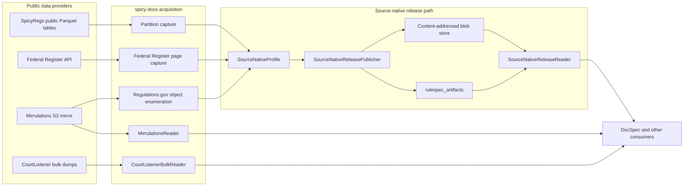
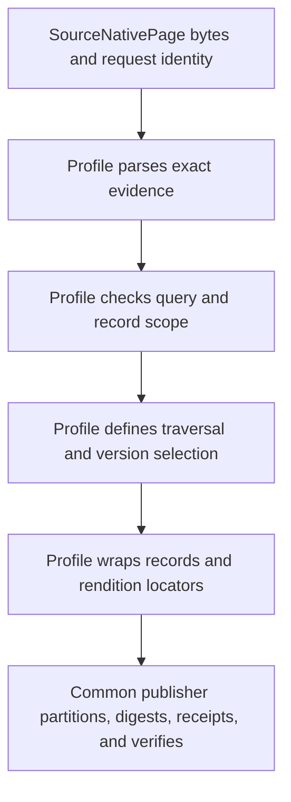
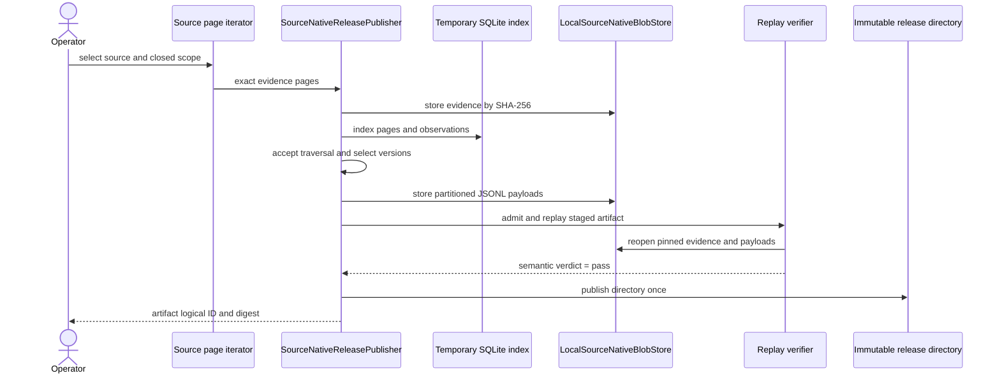

# `spicy-docs`

`spicy-docs` is the acquisition and source-publication layer for the regulatory-search platform. It reads public government and community data, preserves the publisher's source-native fields, records the evidence used for each release, and publishes immutable, digest-identified artifacts. It does not interpret document meaning, join records across publishers, or choose preferred document text. DocSpec owns those later processing decisions.

The package has two output paths:

- Profile-backed sources produce a verified `spicyregs-source-native-release` with records, rendition locators, acquisition evidence, schemas, and receipts.
- Bulk connectors such as `CourtListenerBulkReader` stream raw source rows for a caller that owns the next processing step.

## System context



The community tables are the preferred supply source when they already carry the required public facts. An origin API or mirror supplies facts the tables cannot provide. This ordering affects acquisition only: every selected source still passes through its own evidence capture, schema checks, and release verification.

## Architecture

### Source adapters

Source adapters turn external bytes into bounded evidence pages or raw record streams.

- `federal_register_source_native.py` fetches exact JSON pages from closed date windows. It splits windows when the Federal Register's 10,000-result cap makes a response ambiguous and repeats the crawl until two consecutive traversals agree.
- `regulations_gov_source_native.py` treats Regulations.gov documents, dockets, and comments as separate collections. It consumes a complete, ordered Mirrulations object enumeration and seals exact object bytes plus S3 metadata into bounded ZIP evidence packs.
- `spicy_regs_public_tables_source_native.py` captures whole agency-partitioned Parquet files. It pins the partition bytes and freshness metadata, preserves every declared column, and rejects schema or partition drift.
- `sources/mirrulations.py` provides reusable S3 listing, download, retry, failure-classification, and exact-object functions. The Regulations.gov adapter uses its fail-fast exact-object path.
- `sources/courtlistener_bulk.py` enumerates the publisher's bulk objects and decompresses CSV rows while downloading. It supports byte and row bounds, early row filtering, and exact HTTP range resume after a dropped connection.

Source-native adapters preserve source values. Connector projections may flatten records into declared table shapes, but cross-source joins, body-text selection, and semantic interpretation belong downstream.

### Injected source semantics

`SourceNativeProfile` is the seam between source-specific rules and the common release engine. A profile supplies closed query validation, page parsing, cursor handling, source-field classification, scope checks, record and schema digests, rendition rows, and acquisition-completeness checks.



The profile constructor rejects inconsistent source-state claims. In particular, a `complete-snapshot` profile must use a source-enumeration proof. Current profiles cover Federal Register documents, Regulations.gov documents, dockets, and comments, and SpicyRegs public comments.

### Immutable publication

`SourceNativeReleasePublisher` indexes evidence and observations in a temporary SQLite database, selects the accepted traversal, and writes four kinds of JSON Lines payload partitions: records, renditions, acquisition records, and acquisition pages. It assigns rows to 64 stable buckets with `sha256(UTF-8 identity) modulo 64`, which lets successor releases reuse unchanged content.

Large payloads and evidence live in `LocalSourceNativeBlobStore`, an append-only SHA-256 content-addressed store. The release directory carries the root object, member manifest, source and release schemas, scope, and publication receipt. `rulespec_artifacts` supplies canonical byte identity, manifest construction, structural admission, and artifact pins.



Publication fails before the destination appears if acquisition stops early, page chains fork, source fields drift, counts disagree, digests change, or replay produces different records. Existing destination paths are never replaced.

### Reading and independent verification

`SourceNativeReleaseReader` admits the release, checks its artifact pin, validates its profile and verifier identity, and streams globally ordered records or rendition rows across the fixed partitions. Consumer open performs bounded structural and receipt checks. The `verify` operator command runs the full semantic replay: it reopens exact evidence, repeats profile classification and selection, compares every published row, and recomputes the release digests and counts.

### Source definitions and drift gates

Three smaller definition layers support acquisition and downstream processing:

- `RecordType` describes a flat record shape for connector pipelines. It binds a schema, deduplication key, extractor, and optional Mirrulations path pattern.
- `SourceProfile` declares how a published table maps to a source subject: identity columns, text columns, permitted concept schemes, document mode, and access basis. `source_profile_artifacts.py` emits sealed, experimental profile and resource-applicability catalogs without importing another product's runtime.
- `sources/source_domains.py` parses controlled value lists from digest-pinned publisher documents, compares them with a checked-in observation, and requires every difference to appear in a closed accepted-findings ledger with a reason.

## Component map

| Area | Main code | Purpose |
| --- | --- | --- |
| Connector interfaces | `sources/base.py`, `schemas/base.py` | Define raw reader/writer behavior and reusable record shapes. |
| Bulk and mirror readers | `sources/mirrulations.py`, `sources/courtlistener_bulk.py` | List, stream, retry, pin, and account for external source bytes. |
| Source-native engine | `source_native.py`, `source_native_store.py`, `publication.py` | Build, store, admit, replay, and read immutable releases. |
| Profile interface and composition | `source_native_profile.py`, `source_native_profiles.py` | Inject source rules into the common engine and bind the supported sources. |
| Source-specific capture | `federal_register_source_native.py`, `regulations_gov_source_native.py`, `spicy_regs_public_tables_source_native.py` | Capture publisher evidence, validate source fields and scope, and define schemas. |
| Operator interface | `source_native_cli.py` | Publish or independently verify one named source release. |
| Source metadata | `source_profiles.py`, `source_profile_artifacts.py`, `sources/source_domains.py` | Declare downstream source handling and detect documented-value drift. |

## Detailed sub-module documentation

| Document | Detailed scope |
| --- | --- |
| [Source connectors](spicy-docs_source-connectors.md) | `Reader`, `Writer`, `RecordType`, Mirrulations listing and download modes, CourtListener streaming, retries, bounds, failure accounting, and connector extension guidance. |
| [Source-native release engine](spicy-docs_source-native-release.md) | Profile injection, SQLite observation indexing, traversal acceptance, 64-bucket payloads, content-addressed storage, immutable publication, admission, full replay, reader behavior, and CLI operations. |
| [Source-native profiles](spicy-docs_source-native-profiles.md) | Federal Register, Regulations.gov documents/dockets/comments, SpicyRegs public comments, evidence formats, completeness claims, scope rules, version selection, schemas, renditions, and source-specific failure behavior. |
| [Source definitions and domain drift](spicy-docs_source-definitions.md) | Flat connector schemas, downstream `SourceProfile` declarations, sealed profile artifacts, RefSpec applicability, documented publisher value lists, observed snapshots, and the accepted-findings gate. |

## End-to-end behavior

### What goes in?

- A named source profile and a closed query scope.
- Exact API responses, S3 objects, Parquet partitions, or compressed bulk files.
- A producer identity, persistent blob-store path, and new release destination.

### What happens?

1. The source adapter validates the request and captures bounded evidence.
2. The source profile parses exact bytes, rejects unknown shapes, and checks source scope.
3. The common publisher records every page and observation, applies the profile's traversal and version rules, and creates stable payload partitions.
4. The blob store writes each payload under its SHA-256 identity; the release directory records local metadata and external blob references.
5. The producer gate admits and replays the staged release before an atomic, create-only publication.

### What comes out?

- An immutable release directory and a separate content-addressed blob store for profile-backed sources.
- An artifact pin containing the logical artifact ID and root digest.
- Streaming raw dictionaries plus run measurements for connector-only paths.

### How do we check it?

- Run the hermetic unit suite, lint, and formatting checks.
- Use the CLI's independent `verify` command with the expected artifact pin and an explicit verifier-implementation allowlist.
- Run integration tests separately when live publisher access is intended; the default test command excludes them.
- Inspect the publication receipt for source-state scope, row and evidence counts, traversal count, byte accounting, partition membership, and all digest identities.

## Contribution guide

Choose the narrowest extension point:

- Add a `Reader` when a caller needs a raw stream and owns later storage or transformation.
- Add a source-native adapter and `SourceNativeProfile` when the module must publish replayable source evidence and immutable records.
- Add a `SourceProfile` when the change only declares how an existing table becomes a downstream document or subject.

For a new source-native profile, keep acquisition functions pure where practical and inject I/O at the outer edge. Define a closed source schema, canonical query scope, bounded page type, completeness checks, scope validation, record identity and digest, rendition extraction, and an explicit source-state claim. Add tests that prove successful replay and refusal of missing pages, changed bytes, unknown fields, invalid types, scope leaks, repeated identities, and inconsistent counts.

Keep source-native code free of DocSpec processing imports. Preserve source values even when malformed; attach diagnostics when the value remains publishable, and reject the release when the evidence cannot support a complete or unambiguous claim.

## Development checks

From the repository root:

```bash
uv sync
uv run pytest -q
uv run ruff check .
uv run ruff format --check .
```

The default `pytest` configuration excludes tests marked `integration`.

## Related project documentation

- [Repository README](../README.md)
- [Source-native release 1.0 specification](../docs/superpowers/specs/2026-08-25-source-native-release-spec.md)
