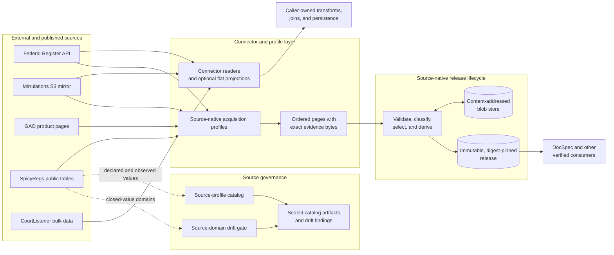
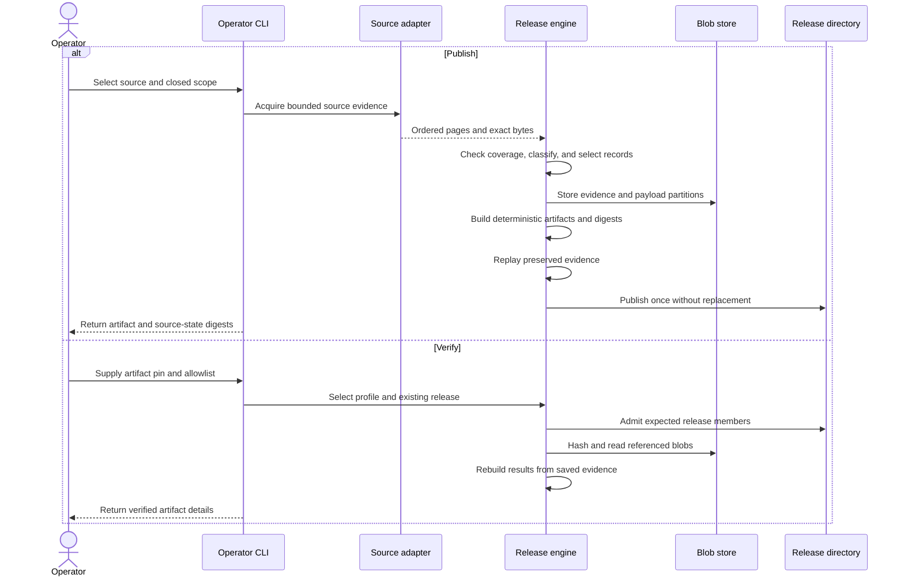

# `spicy-docs` repository overview

## Purpose

`spicy-docs` is the acquisition layer of the regulatory-search platform. It retrieves source-shaped government data, preserves exact source evidence, and publishes immutable, digest-pinned releases.

The repository acquires data from the Federal Register, Regulations.gov through Mirrulations, GAO product pages, SpicyRegs public tables, and CourtListener bulk exports. It does not interpret documents, enrich records, build search indexes, or assign semantic meaning. Downstream products such as DocSpec consume and interpret its outputs.

## End-to-end architecture

Connector readers return source-shaped dictionaries; callers must explicitly apply flat projections and own later persistence or joins. Source-native profiles instead preserve exact bytes, prove coverage, classify records without flattening them, and pass ordered evidence to the shared release engine.

### Publication and offline verification

Publication may contact live sources. Verification remains offline: it checks the artifact identity, hashes stored content, and reconstructs the release from preserved evidence.

## Core module documentation

- [Connector ingestion and record projection](connector_ingestion_and_record_projection.md)  
  Shared reader interfaces, source-shaped connector output, and optional flat projections.
  Components: [connector interfaces and projections](source_connector_contracts_and_projections.md), [Mirrulations](mirrulations_connector.md), and [CourtListener bulk](courtlistener_bulk_connector.md).

- [Source-native acquisition profiles](source_native_acquisition_profiles.md)  
  Source-specific acquisition, exact-byte preservation, coverage proof, identity, selection, schemas, and renditions.
  Components: [profile API](source_native_profile_api.md), [Federal Register](federal_register_source_native.md), [Regulations.gov](regulations_gov_source_native.md), [GAO product pages](gao_product_page_source_native.md), and [SpicyRegs public tables](spicy_regs_public_table_source_native.md).

- [Source-native release lifecycle](source_native_release_lifecycle.md)  
  Shared storage, deterministic artifact construction, publication, admission, and replay verification.
  Components: [release engine](source_native_release_engine.md), [storage and publication](source_native_storage_and_publication.md), and [operator CLI](source_native_operator_cli.md).

- [Source definition governance and validation](source_definition_governance_and_validation.md)  
  Deterministic source-profile catalogs and bidirectional checks between documented and observed source values.
  Components: [catalog artifacts](source_profile_catalog_artifacts.md) and [source-domain drift gate](source_domain_drift_gate.md).