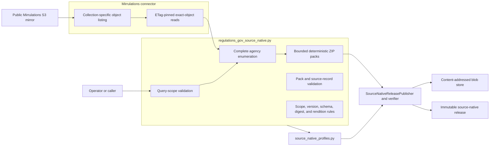
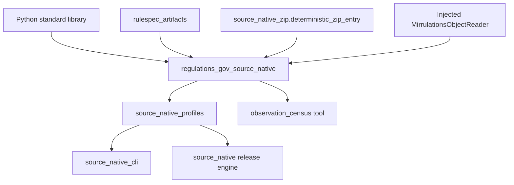
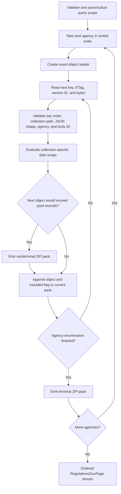
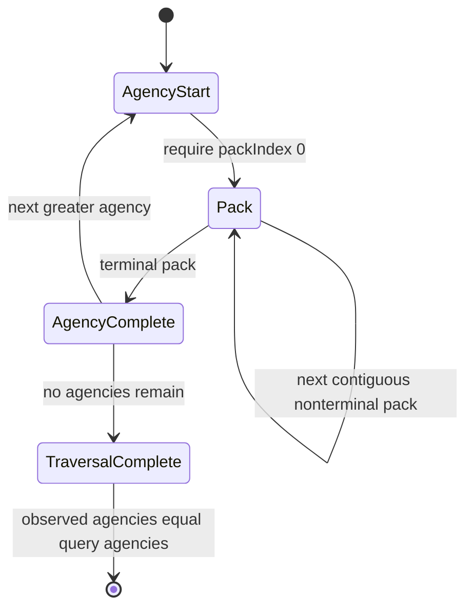
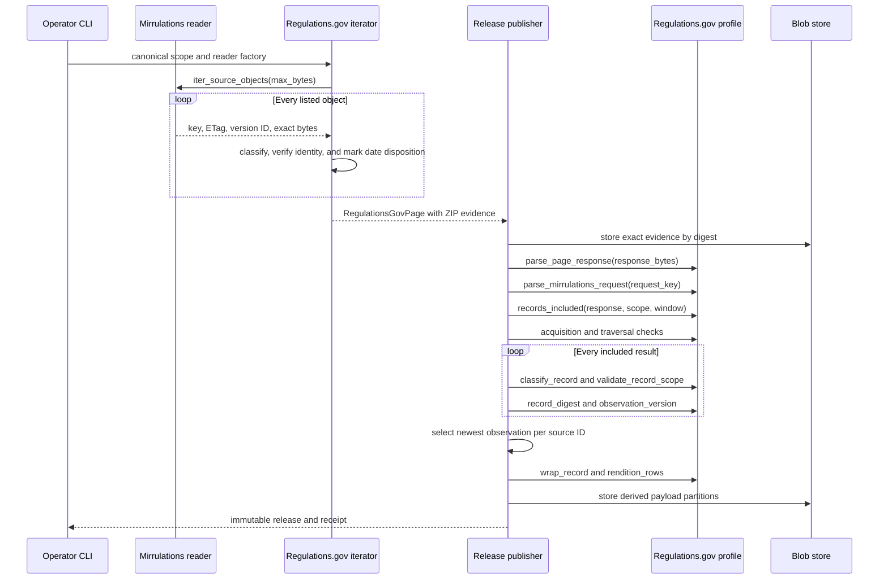

# Regulations.gov source-native acquisition

The Regulations.gov source-native module turns a closed agency-and-date request into replayable evidence from the Mirrulations S3 mirror. It enumerates every source object for each requested agency and collection, validates the object's key and JSON body, preserves the exact bytes with the S3 listing metadata, and marks which records fall inside the requested date range.

Documents, dockets, and comments remain separate source collections. The module preserves source join keys such as `docketId`, but it never joins or flattens the records. The shared [source-native release engine](source_native_release_engine.md) later selects one observation per source ID and publishes the records, renditions, acquisition ledger, and evidence references.

## Purpose and system role

| Question | Answer |
| --- | --- |
| What goes in? | A closed query scope with sorted agency codes and inclusive dates, plus an injected function that returns a `MirrulationsObjectReader` for each agency. |
| What happens? | The iterator performs one complete collection enumeration per agency, validates every exact object, applies the date rule after acquisition, and groups the objects into bounded deterministic ZIP evidence packs. Profile callbacks parse the packs, prove exact agency and pack coverage, classify records, derive observation versions, wrap records, and list attachment renditions. |
| What comes out? | Ordered `RegulationsGovPage` values containing `application/zip` evidence. When the release engine consumes them, the release contains separate source-native document, docket, or comment records and any derived rendition rows. |
| How do we check it? | The publisher and verifier replay the synthetic request locators, ZIP manifests, exact object inventory, collection schema, key-to-body identity, date disposition, agency coverage, pack order, observation selection, record digests, and rendition derivation. |

The module proves a `complete-snapshot` for the requested agencies and one collection. The proof covers every matching mirror object returned by the exact-object reader, including objects outside the requested dates. Date filtering changes which records enter the release; it does not reduce the evidence acquisition.

## Architecture and boundaries



The [Mirrulations connector](mirrulations_connector.md) owns anonymous S3 access, listing, bounded concurrent downloads, transport retries, response-body closure, ETag pinning, and content-length checks. This module owns Regulations.gov meaning: collection identity, closed JSON shapes, date scope, complete-enumeration proof, version rules, and source-native outputs.

The [source-native profile API](source_native_profile_api.md) defines the callbacks that this module implements. The [source-native release engine](source_native_release_engine.md) applies those callbacks, stores evidence through [source-native storage and publication](source_native_storage_and_publication.md), selects observations, writes the release, and replays it during verification. The [source-native operator CLI](source_native_operator_cli.md) selects the collection profile and creates the production Mirrulations reader.

This source-native path bypasses the flat `RecordType.extract` projections. See [source connector contracts and projections](source_connector_contracts_and_projections.md) and [connector ingestion and record projection](connector_ingestion_and_record_projection.md) for the separate flat-record path.

### Dependency direction



Direct dependencies stay narrow:

| Dependency | Use |
| --- | --- |
| `rulespec_artifacts` | Canonical JSON bytes, framed record digests, and schema-bundle digests. |
| `spicy_docs.source_native_zip.deterministic_zip_entry` | Reproducible ZIP member metadata for generated evidence packs. |
| Python standard library | Dates, URL parsing, JSON decoding, ZIP handling, data classes, protocols, and byte streams. |
| Injected `MirrulationsObjectReader` | Ordered source keys, listed ETags, optional S3 version IDs, and exact bytes. |

The module does not import `boto3`, the Mirrulations connector, the release engine, or sibling products. That dependency direction keeps source interpretation usable in hermetic tests and independent verification.

## Three independent collections

The implementation shares mechanics but assigns each collection its own durable identity, schema, query dates, and release profile.

| Concern | Documents | Dockets | Comments |
| --- | --- | --- | --- |
| Collection value | `documents` | `dockets` | `comments` |
| Mirror path fragment | `/documents/` | `/docket/` | `/comments/` |
| Query date fields | `publishedFrom`, `publishedThrough` | `modifiedFrom`, `modifiedThrough` | `postedFrom`, `postedThrough` |
| Scope date in each record | `postedDate` | `modifyDate` | `postedDate` |
| Observation version | `modifyDate`, then `postedDate` | `modifyDate` | `modifyDate` |
| Direct renditions | `data.attributes.fileFormats` | None | `data.attributes.fileFormats` |
| Attachment renditions | Every included attachment format | None | Every included attachment format |
| Source-system ID suffix | `documents` | `dockets` | `comments` |
| Scope ID | `regulations-gov-documents` | `regulations-gov-dockets` | `regulations-gov-comments` |

The module does not prejoin a document to its docket or a comment to its document. Source values such as `docketId`, `commentOnDocumentId`, `frDocNum`, and relationship links remain inside the preserved record for downstream consumers.

## Component map

[`regulations_gov_source_native.py`](../src/spicy_docs/regulations_gov_source_native.py) contains six groups of components:

| Group | Main components | Responsibility |
| --- | --- | --- |
| Reader boundary | `MirrulationsObject`, `MirrulationsObjectReader`, `RegulationsGovRead` | Describe the exact objects required from acquisition without importing the S3 implementation. |
| Evidence pages | `RegulationsGovPage`, `MirrulationsWindow`, `_pack_bytes`, `_parse_page_response`, `parse_mirrulations_request` | Create and replay one bounded object pack. |
| Coverage proof | `RegulationsGovTraversalCheck`, `MirrulationsAcquisitionCheck`, `_records_included`, `_validate_record_scope` | Prove each pack, agency, and in-scope record belongs to the declared acquisition. |
| Record classification | `classify_document`, `classify_docket`, `classify_comment` and nested validators | Reject unknown or malformed source shapes while preserving accepted source data unchanged. |
| Release derivation | source-record wrappers, observation-version functions, record digests, and rendition functions | Produce deterministic values used by the shared release engine. |
| Profile declarations | query validators, acquisition policies, JSON Schemas, schema digests, and collection constants | Define durable source identities and source-specific release rules. |

`RegulationsGovSourceError` is the module's fail-closed exception. It subclasses `ValueError`, so callers may handle a specific acquisition failure or a broader invalid-input failure.

## Query scopes

The public query validators call `_date_scope` with collection-specific field names:

```python
documents = {
    "agencies": ["ACF", "EPA"],
    "publishedFrom": "1990-01-01",
    "publishedThrough": "2026-09-02",
}

dockets = {
    "agencies": ["EPA"],
    "modifiedFrom": "2024-01-01",
    "modifiedThrough": "2024-12-31",
}

comments = {
    "agencies": ["EPA"],
    "postedFrom": "2026-08-24",
    "postedThrough": "2026-08-24",
}
```

Validation enforces all of these rules:

- The mapping contains exactly `agencies` and the two collection-specific date fields.
- `agencies` is a nonempty list of strict ASCII identifiers that is already sorted and distinct.
- Each date is accepted by `date.fromisoformat` after string conversion, and the returned scope uses canonical `YYYY-MM-DD` form.
- The end date is on or after the start date.
- The inclusive range contains at most `MAX_QUERY_DAYS`, currently 14,640 days. The code rejects a date difference of 14,640 days or more.

The long bound supports a single request spanning roughly 40 years because every query reacquires the full collection enumeration for each agency. Splitting one desired history into many date requests would repeat the same source reads and create several independent releases rather than make the acquisition cheaper.

The command-line interface sorts and deduplicates repeated `--agency` arguments before it builds the scope. Direct Python callers must supply canonical order themselves.

## Exact-object reader boundary

[`MirrulationsObject`](../src/spicy_docs/regulations_gov_source_native.py#L286) is a structural interface with four read-only properties:

| Property | Requirement |
| --- | --- |
| `key` | Printable non-space ASCII S3 key under the requested agency and collection path. |
| `etag` | Nonempty ETag from the authoritative listing. |
| `version_id` | Nonempty version ID or `None`. |
| `content` | Nonempty exact object bytes, no larger than 16 MiB. |

[`MirrulationsObjectReader.iter_source_objects(max_bytes=...)`](../src/spicy_docs/regulations_gov_source_native.py#L300) must yield objects in strict S3-key order. The iterator passes `MAX_OBJECT_BYTES`, currently 16 MiB. The production CLI builds a `MirrulationsReader` with no processed-key filter, no year filter, `retain_keys=False`, and `fail_fast=True`; those settings prevent an incremental-ingest shortcut from weakening the complete enumeration.

The reader is responsible for proving that the downloaded bytes match the listed ETag and size. This module preserves that metadata and refuses missing or malformed values, but it does not recompute an S3 ETag from the content.

## Acquisition and evidence-pack creation

The collection-specific iterator functions delegate to `_iter_pages`:

- `iter_regulations_gov_document_pages`
- `iter_regulations_gov_docket_pages`
- `iter_regulations_gov_comment_pages`

Each returns an iterator of `RegulationsGovPage`. The optional `scratch_directory` parameter matches the shared caller shape but is currently unused; the implementation streams one bounded pack in memory.

### Acquisition data flow



For each object, `_iter_pages` checks:

1. The key uses printable ASCII, starts with `raw-data/{agency}/`, contains the correct collection path, and is greater than every prior key across the traversal.
2. The ETag is nonempty, and the optional version ID is either nonempty text or `None`.
3. The exact content is nonempty `bytes` and no larger than `MAX_OBJECT_BYTES`.
4. The bytes decode as accepted JSON and pass the collection classifier.
5. The filename's claimed identity equals `/data/id` in the body.
6. The record's `agencyId` equals the agency named by its object path.
7. The collection's date rule decides whether the record is included, without removing its evidence.

Mirrulations can keep several fetches of one record as `NAME.json`, `NAME(1).json`, or a name with several stacked numeric suffixes. `_key_claimed_identity` removes `.json` and every trailing `(N)` group before comparing the filename with the body ID. It does not treat a refetch suffix as a new record identity.

### Pack bounds

| Bound | Current value | Effect |
| --- | --- | --- |
| `MAX_OBJECT_BYTES` | 16 MiB | Refuses any individual source object above the cap. |
| `MAX_EVIDENCE_PACK_OBJECTS` | 1,000 | Starts a new pack before adding object 1,001. |
| `MAX_EVIDENCE_PACK_RAW_BYTES` | 16 MiB | Starts a new pack before aggregate uncompressed object bytes cross the cap. |
| `MAX_TRAVERSALS` | 1 | Requires one authoritative source enumeration, not repeated crawl reconciliation. |

The object-count and raw-byte bounds apply together. An agency with no matching objects still emits an empty terminal pack. This proves that the agency was visited and that its collection enumeration ended.

### Evidence-pack format

`_pack_bytes` writes a deterministic ZIP in this order:

```text
manifest.json
objects/000000.json
objects/000001.json
...
```

The canonical `manifest.json` has this shape:

```json
{
  "agency": "EPA",
  "collection": "documents",
  "evidenceType": "mirrulations-evidence-pack-v1",
  "objects": [
    {
      "byteSize": 1234,
      "entry": "objects/000000.json",
      "etag": "\"listed-etag\"",
      "included": true,
      "key": "raw-data/EPA/.../documents/EPA-2026-0001-0001.json",
      "versionId": null
    }
  ],
  "packIndex": 0,
  "terminal": true
}
```

`included` records the date-scope decision made during acquisition. Both included and excluded objects remain byte-for-byte in the ZIP. The release engine stores the ZIP in the content-addressed blob store; it does not need to copy evidence under the release directory.

## Page and window model

[`RegulationsGovPage`](../src/spicy_docs/regulations_gov_source_native.py#L312) implements the shared `SourceNativePage` interface. Each evidence pack is an explicit one-page window:

| Field | Regulations.gov rule |
| --- | --- |
| `traversal_index` | Always `0`. |
| `page_index` | Increases across every pack and agency. |
| `window_index` | Equals `page_index`. |
| `window_page_index` | Always `0`. |
| `request_key` | Canonical synthetic `mirrulations://` pack locator. |
| `source_cursor` | Always `None`; exact-object packs do not paginate. |
| `response_bytes` | Nonempty ZIP evidence. |
| `evidence_media_type` | `application/zip`. |

The synthetic request has this canonical form:

```text
mirrulations://regulations-gov/documents/pack?agency=EPA&packIndex=0&terminal=true
```

`parse_mirrulations_request` validates the scheme, authority, collection, path, exact query fields, ASCII agency, nonnegative integer pack index, Boolean terminal value, and canonical serialization. It returns a `MirrulationsWindow` that binds `collection`, `agency`, `pack_index`, and `terminal` to the page bytes.

`regulations_gov_next_page_url` always returns `None`. It raises if a parsed response contains a non-null `next_page_url`, because each ZIP pack is a complete one-page window and continuation happens through the next explicit pack request.

## Evidence parsing and validation

`parse_document_page_response`, `parse_docket_page_response`, and `parse_comment_page_response` call `_parse_page_response` with the collection's classifier.

The parser rejects a pack unless all of these statements hold:

- The input is a ZIP whose first member is `manifest.json`.
- Member names are unique and appear in exact manifest order.
- The manifest has only the six declared fields and a valid collection, evidence type, agency, pack index, and terminal flag.
- The manifest lists no more than 1,000 objects.
- Each object descriptor has exactly the required fields and names `objects/{index:06d}.json`.
- The ZIP member's uncompressed size equals the declared `byteSize`, and the aggregate stays within 16 MiB.
- Reading each member returns exactly its declared byte count.
- Each object's JSON passes the selected collection classifier.
- Each record's `agencyId` equals the manifest agency.
- The ZIP contains no extra, missing, or reordered members.

The parser returns a release-engine response mapping. Its private fields retain the full evidence interpretation:

| Field | Meaning |
| --- | --- |
| `_agency`, `_collection`, `_packIndex`, `_terminal` | Identity recovered from the manifest. |
| `_evidenceType` | Required `mirrulations-evidence-pack-v1` marker. |
| `_objects` | Listing metadata for every packed object, augmented with the manifest agency. |
| `_packedRecords` | Every classified record paired with its saved `included` disposition. |
| `results` | Only records whose manifest disposition is `included: true`. |
| `count` | Length of `results`. |
| `next_page_url`, `total_pages` | Always `None` and `1`. |

Callers should treat underscore-prefixed members as profile-internal replay data, not a general Regulations.gov response API.

## Source JSON classification

Classification is loss-preserving validation. Each `classify_*` function returns a shallow dictionary copy whose nested source values remain unchanged; it does not flatten fields, resolve relationships, normalize source text, or repair dates.

### JSON decoding rules

`_decode_json` accepts UTF-8 JSON with unique object keys and no floating-point values. It refuses:

- invalid UTF-8 or invalid JSON syntax;
- duplicate names in any JSON object;
- decimal or exponential numbers; and
- non-finite constants such as `NaN` and `Infinity`.

Integer, string, Boolean, null, array, and object values remain available, subject to the collection validators. `canonical_json_bytes` provides a final canonical-JSON compatibility check for each accepted top-level record.

### Closed source shapes

`_source_data` requires a JSON:API-like record:

- The top level contains only `data`, `included`, and `meta`; `data` is required.
- `data` contains only `attributes`, `id`, `links`, `relationships`, and `type`.
- `data.id` is a strict ASCII identifier, and `data.type` equals the active collection.
- Link, relationship, attachment, file-format, display-property, topic, and metadata objects use explicit field allowlists.
- Included resources, when present, have `type: "attachments"` and their own closed attribute shape.

Each collection also has a closed attribute allowlist: `DOCUMENT_ATTRIBUTE_FIELDS`, `DOCKET_ATTRIBUTE_FIELDS`, or `COMMENT_ATTRIBUTE_FIELDS`. Unknown source fields fail as unclassified drift. Accepted nullable fields still undergo type checks; for example, Boolean fields reject integers, integer fields reject Boolean values, and text arrays reject mixed item types.

### Collection-specific date behavior

| Collection | Required classification fields | Scope behavior | Version behavior |
| --- | --- | --- | --- |
| Documents | `agencyId`, `postedDate` | The first ten characters of `postedDate` must form a canonical date inside the publish range. A null or unusable date prefix remains evidence but falls outside every date scope. | Use valid `modifyDate`; otherwise use valid `postedDate`; otherwise return `None`. A malformed non-null `modifyDate` refuses. |
| Dockets | `agencyId`, `modifyDate` | The first ten characters of `modifyDate` must be a canonical date inside the modify range. Null or malformed values refuse. | Use the exact nonempty, timezone-aware `modifyDate`. |
| Comments | `agencyId`, `postedDate` | The first ten characters of `postedDate` must be a canonical date inside the posted range. Null or malformed values refuse. | Use timezone-aware `modifyDate` when present; `None` is an accepted version. |

Document `postedDate` receives a deliberate exception. Real mirror records can contain null or unusable values, so the module preserves those objects as evidence and excludes them from all date-bounded releases. It does not extend that exception to docket `modifyDate`, comment `postedDate`, or a malformed document `modifyDate` used for observation ordering.

## Generated raw schemas

`_raw_schema` builds one JSON Schema Draft 2020-12 declaration per collection:

- `REGULATIONS_GOV_DOCUMENT_SCHEMA`
- `REGULATIONS_GOV_DOCKET_SCHEMA`
- `REGULATIONS_GOV_COMMENT_SCHEMA`

Each schema closes the top-level, data, attribute, link, relationship, attachment, and metadata objects with `additionalProperties: false`. It also declares source-record order by `/data/id` with UTF-16 code-unit comparison and forbids a null identity.

The runtime classifier remains stricter than JSON Schema where source meaning requires code. Examples include strict ASCII identity, canonical date parsing, digit-only numeric strings, timezone-aware observation instants, key-to-body identity, and agency/path agreement. Passing JSON Schema alone does not prove that a record can enter a release.

The schema helpers serve two different release paths:

| Helper or constant | Purpose |
| --- | --- |
| `*_source_schema_digest()` | Computes `schema_bundle_digest` over one `sources/regulations-gov-*-raw-1.0.schema.json` entry. |
| `*_source_schema_declaration()` | Returns the schema name, version `1.0`, and computed digest. |
| `*_SOURCE_SCHEMA_KEY` | Names the installed schema object under `schemas/` in the source-native release. |

Schema names, versions, paths, and digests form durable release identity. A source-field change therefore requires coordinated validator, schema, profile, test, and version review.

## Date disposition and coverage proof

The saved `included` flag is a claim, not a trusted shortcut. During publication and replay, `_records_included` recomputes every object's disposition from its classified body, canonical query scope, and parsed `MirrulationsWindow`. It requires the recomputed values to equal both `_packedRecords[*].included` and the ordered `results` list.

`_validate_record_scope` then checks each included result again before the release engine indexes it. This layered check prevents a changed manifest flag, changed query, wrong agency, or wrong collection from moving a record into the release.

### Pack and traversal checks

`RegulationsGovTraversalCheck` validates one included pack window. It requires page index `0`, a results list of at most 1,000 records, and an exact `count`. Its `finish` method requires exactly one observed page.

`MirrulationsAcquisitionCheck` validates the complete traversal across all pack windows:

- The parsed request collection matches the active profile.
- Request agency, pack index, and terminal status equal the values recovered from the ZIP.
- `records_included` agrees with whether the pack has any results.
- Agencies appear once in strict ASCII order and equal the query scope exactly.
- Each agency starts at pack `0`, pack indexes are contiguous, and no pack follows a terminal pack.
- A new agency cannot begin before the previous agency's terminal pack.
- Object keys stay globally sorted and distinct and remain under `raw-data/{agency}/`.
- The last agency has a terminal pack.



A missing pack, changed request locator, reordered key, repeated agency, absent terminal marker, or unrequested agency breaks the complete-snapshot proof and refuses the release.

## Observation versions and selection

The module exposes both the exact source value and a normalized comparison value:

- `source_issued_version` returns the source's original timezone-aware timestamp string, or `None` when allowed.
- `observation_version` converts that instant to UTC with six fractional-second digits and a trailing `Z`.
- `comment_source_issued_version` and `comment_observation_version` bind those shared rules to comments.

Normalization exists only to compare instants deterministically. It does not rewrite the timestamp inside the published source record.

The collection profiles ask the shared release engine to group observations by `/data/id` and keep the greatest normalized version. Selection behavior differs by collection:

| Collection | Newest-version rule | Same normalized instant |
| --- | --- | --- |
| Documents | Greatest `modifyDate`; fall back to `postedDate`; null sorts last. | Equal canonical record digests collapse. Differing digests refuse unless all differences are confined to `openForComment` and `withinCommentPeriod`; for that volatile-only group, the last-listed observation wins. |
| Dockets | Greatest `modifyDate`; null sorts last, although valid docket classification requires a date. | Equal canonical record digests collapse; differing digests refuse. |
| Comments | Greatest `modifyDate`; a non-null version wins over null. | Any repeated `(source ID, normalized version)` refuses, even when the records are identical or both versions are null. |

Documents treat `openForComment` and `withinCommentPeriod` as read-time-derived values. Regulations.gov can calculate them from fixed dates against the day of retrieval, so two mirror fetches of one unchanged document version can disagree. `document_tie_comparison_digest` removes only those two fields for tie judgment. The published `document_source_record_digest` still covers the complete accepted record, and every observation remains in evidence.

### Selection process

```mermaid
flowchart TD
    Records["All in-scope observations"]
    Group["Group by data.id"]
    Version["Normalize the collection's source instant"]
    Max["Choose greatest version; null last"]
    Tie{"Several observations at winning version?"}
    Kind{"Collection and record comparison"}
    Same["Select one canonical-record-equivalent observation"]
    Volatile["Documents only: select last-listed volatile-only observation"]
    Refuse["Refuse unresolved source-version tie"]
    Publish["Wrap and publish one record"]

    Records --> Group --> Version --> Max --> Tie
    Tie -->|No| Publish
    Tie -->|Yes| Kind
    Kind -->|Document or docket, equal record digest| Same --> Publish
    Kind -->|Document, only volatile fields differ| Volatile --> Publish
    Kind -->|Comment repeat or substantive difference| Refuse
```



The release engine performs selection in a disk-backed SQLite index. This module defines the version and digest functions; it does not select records itself. See [source-native release engine](source_native_release_engine.md) for indexing, counts, accepted traversal handling, and release ordering.

## Source-record wrappers and digests

The three public wrapper functions call `_source_record` and return:

```json
{
  "fieldDiagnostics": [],
  "record": {"data": {}},
  "schemaDigest": "...",
  "schemaName": "regulations-gov-document-raw",
  "schemaVersion": "1.0",
  "scopeId": "regulations-gov-documents",
  "sourceRecordId": "EPA-2026-0001-0001"
}
```

The collection chooses `schemaName` and `scopeId`; `sourceRecordId` always comes from `/data/id`. `fieldDiagnostics` is empty because the classifier either accepts the source shape unchanged or raises an error. It does not publish partial coercion warnings.

Record-digest functions use separate framed domains:

- `spicyregs-regulations-gov-document-record/1`
- `spicyregs-regulations-gov-docket-record/1`
- `spicyregs-regulations-gov-comment-record/1`

Each digest covers the complete canonical classified record inside a single `record` section. JSON whitespace and object-member order do not change the digest. Source value changes do.

`document_tie_comparison_digest` is a narrower, selection-only digest. The release never stores or publishes it, and contributors must not use it as record identity.

## Rendition derivation

Documents and comments can identify downloadable files in two places:

1. `data.attributes.fileFormats`
2. `included[*].attributes.fileFormats` for attachments

`_rendition_rows` emits every entry in source order. It does not download the file.

| Output field | Derivation |
| --- | --- |
| `sourceRecordId` | `/data/id` of the parent record. |
| `sourceField` | Exact indexed path to the `fileFormats` entry. |
| `renditionId` | `document-NNNN`, `comment-NNNN`, or `attachment-NNNN-NNNN`. |
| `locator` | Required source `fileUrl`. |
| `mediaType` | Lowercased source format when it is already a media type; known extension alias; URL suffix fallback; otherwise `application/octet-stream`. |
| `expectedByteSize` | Nonnegative integer, digit string converted to integer, or `None`. |
| `expectedSha256` | Always `None`; Regulations.gov does not supply the digest here. |

Known aliases include `doc`, `docx`, `htm`, `html`, `pdf`, `txt`, and `xml`. Dockets emit an empty tuple because this source shape has no docket file-format path.

## Interaction with publication and replay



Independent verification repeats the profile calls against stored evidence. It compares the replayed records, dispositions, digests, renditions, policies, schemas, and source-state claim with the release instead of trusting the previously derived payloads.

## Profile registry and CLI integration

[`source_native_profiles.py`](../src/spicy_docs/source_native_profiles.py#L110) builds three `SourceNativeProfile` values from this module:

| Profile | CLI source | Profile-specific selection setting |
| --- | --- | --- |
| `REGULATIONS_GOV_DOCUMENT_PROFILE` | `regulations-documents` | Versioned; identical same-instant records may collapse; uses the document volatile-field tie digest. |
| `REGULATIONS_GOV_DOCKET_PROFILE` | `regulations-dockets` | Versioned; identical same-instant records may collapse. |
| `REGULATIONS_GOV_COMMENT_PROFILE` | `regulations-comments` | Versioned; every repeated same-instant observation refuses. |

All three declare:

- `source_state_scope="complete-snapshot"`;
- `traversal_acceptance="source-enumeration"`;
- `max_traversals=1`;
- a collection-specific schema, source ID, scope ID, policy ID, wrapper, digest, rendition function, and scope validator; and
- `MirrulationsAcquisitionCheck` bound to the collection.

A typical document publication command is:

```sh
spicy-docs-source-native publish \
  --source regulations-documents \
  --since 1990-01-01 \
  --until 2026-09-02 \
  --agency ACF \
  --agency EPA \
  --destination /new/immutable/regulations-documents \
  --blob-store /persistent/source-native-blobs \
  --implementation-id 'git+https://example/spicy-docs@<commit>'
```

Use `regulations-dockets` or `regulations-comments` to publish the other collections. Publish them to different destinations; their source-system IDs, schemas, scope IDs, and records are intentionally incompatible. The operator CLI maps `RegulationsGovSourceError` to an `acquisition-failed` result. Selection and release-integrity failures come from the release engine and map to `release-invalid`.

## Complexity and resource use

For `N` exact objects with `B` total raw bytes across the requested agencies, page creation performs `O(N + B)` validation and packing work after the reader's listing and download work. It retains one bounded raw pack and its generated ZIP bytes while emitting a page. The exact-object reader may use bounded concurrency internally, but it must yield in source-key order.

Date width does not reduce `N`: the iterator acquires the complete collection enumeration and applies dates afterward. Choosing a narrower date range reduces released records, not S3 listing or object reads.

The release engine uses disk-backed storage and indexing for the complete observation set. See [source-native release engine](source_native_release_engine.md) for its resource model.

## Failure model

The module favors refusal over inferred repair. Common failure groups are:

| Group | Examples |
| --- | --- |
| Query identity | Unknown scope fields, repeated or unsorted agencies, invalid dates, reversed range, excessive range. |
| Source enumeration | Wrong agency or collection path, non-ASCII key, missing ETag, oversized or empty object, reordered or repeated key. |
| Record identity | Filename/body ID mismatch, body `agencyId` mismatch, wrong `data.type`, invalid ASCII ID. |
| Source drift | Unknown top-level, attribute, attachment, link, relationship, topic, or metadata field; invalid field type. |
| Evidence integrity | Invalid ZIP, duplicate or reordered members, descriptor mismatch, wrong byte size, extra members, changed included flag. |
| Coverage | Missing pack, skipped pack index, pack after terminal, incomplete agency list, absent final terminal pack. |
| Version selection | Invalid timezone-bearing version or unresolved same-instant tie. The release engine raises the final tie error. |

The document `postedDate` exception is narrow: null and malformed values remain in evidence and contribute no record. It is not a general permissive parsing mode.

## Contribution guide

### Preserve source ownership

- Keep documents, dockets, and comments as separate profiles and releases. Preserve their join keys; do not join them here.
- Keep network access in the [Mirrulations connector](mirrulations_connector.md). Add source interpretation here and shared publication mechanics to the release engine only when every profile needs them.
- Do not import `docspec`, `refspec`, or `spicysearch`. A boundary test enforces that this source-native path remains acquisition-only.
- Preserve exact source values. Normalize only comparison values such as `observation_version`, never the record body.

### Handle source drift explicitly

When Regulations.gov adds or changes a field:

1. Capture a minimal real or representative record that demonstrates the new shape.
2. Decide whether the field belongs to a document, docket, comment, attachment, link, relationship, topic, or metadata object.
3. Update the relevant runtime allowlist and type validator.
4. Update the generated JSON Schema shape and review whether the schema version or durable identity must change.
5. Add an acceptance test and retain a failure test for an unknown neighboring field.
6. Confirm that canonical record digests and any selection rule still cover the intended data.

Do not add a field only to the JSON Schema. Runtime classification controls admission and will continue to refuse it.

### Preserve evidence invariants

- Keep ZIP member names, order, deterministic metadata, canonical manifest bytes, and pack bounds stable unless the evidence type and policy version change.
- Keep the saved `included` flag replayable from record data and the query scope.
- Keep key-to-body identity checks compatible with stacked Mirrulations refetch suffixes, but do not strip other filename text.
- Never omit out-of-scope, older, redundant, or volatile-only observations from evidence. Selection happens after evidence capture.
- Treat changes to terminal-pack rules, agency coverage, ordering, or maximum sizes as acquisition-policy changes.

### Change selection rules cautiously

Selection behavior spans this module, `source_native_profiles.py`, and the shared release engine. A change must keep these values consistent:

- the acquisition policy's `observationSelection` declaration;
- `source_issued_version` and `observation_version`;
- `refuse_equal_observation_versions` in the collection profile;
- the full record digest;
- any selection-only tie digest; and
- receipt counts for input, published, and discarded observations.

Never broaden `DOCUMENT_TIE_VOLATILE_FIELDS` without evidence that every added field is computed at read time rather than stored as a source fact. A substantive difference at one normalized instant must continue to refuse.

### Adding a collection

A fourth collection requires more than another classifier. Add and review:

- collection, source-system, scope, schema, record-stem, and policy identities;
- mirror path mapping and key validation;
- query field names and record date scope;
- attribute validators and the closed raw schema;
- source-issued and normalized observation-version rules;
- wrappers, digests, and renditions;
- parser and iterator entry points;
- acquisition-check binding in a new `SourceNativeProfile`;
- CLI source selection and production reader mapping; and
- focused publication and independent-replay tests.

## Testing and verification

The focused hermetic suites are:

```sh
uv run pytest -q \
  tests/test_regulations_gov_source_native.py \
  tests/test_regulations_gov_comments_source_native.py
```

They cover exact-byte preservation, manifest metadata, out-of-scope evidence, null and malformed document dates, schema drift, ASCII ordering, refetch filenames, key/body mismatch, query bounds, missing terminal packs, separate releases, rendition enumeration, newest-observation selection, identical-record collapse, document volatile-only collapse, substantive ties, strict comment ties, CLI injection, and sibling-product import boundaries.

Run the repository checks before merging:

```sh
uv run pytest -q
uv run ruff check .
uv run ruff format --check .
uv run ty check
```

The default Pytest configuration excludes tests marked `integration`, so the focused suites use injected readers and local blob stores rather than the public S3 mirror. Add a live integration check only when a change depends on current mirror behavior, and keep a hermetic regression fixture for the discovered shape.

## Public API reference

### Acquisition and page APIs

| API | Summary |
| --- | --- |
| `MirrulationsObject` | Structural value for one key, listed ETag, optional version ID, and exact body. |
| `MirrulationsObjectReader` | Structural reader that yields a complete ordered object enumeration under a byte cap. |
| `RegulationsGovPage` | Validated one-pack source-native evidence page. |
| `iter_regulations_gov_*_pages` | Collection-specific exact-object acquisition entry points. |
| `parse_*_page_response` | Collection-specific ZIP replay entry points. |
| `parse_mirrulations_request` | Parses and canonicalizes a synthetic pack locator. |
| `regulations_gov_next_page_url` | Enforces the no-cursor rule and returns `None`. |

### Validation and coverage APIs

| API | Summary |
| --- | --- |
| `regulations_gov_*_query_scope` | Validates and canonicalizes agency/date scope. |
| `classify_document`, `classify_docket`, `classify_comment` | Apply closed runtime source-shape validation. |
| `*_records_included` | Replay and verify every packed date-disposition flag. |
| `validate_*_record_scope` | Require one released record to match its agency and date window. |
| `RegulationsGovTraversalCheck` | Proves one included pack has one valid page. |
| `MirrulationsAcquisitionCheck` | Proves exact agency coverage, pack continuity, terminal markers, and global key order. |

### Release-derivation APIs

| API | Summary |
| --- | --- |
| `source_record_id` | Returns `/data/id`. |
| `source_issued_version` | Returns the collection's exact source instant. |
| `observation_version` | Returns the normalized UTC comparison instant. |
| `comment_source_issued_version`, `comment_observation_version` | Comment-bound version helpers. |
| `*_source_record` | Wraps a classified record with schema and scope identity. |
| `*_rendition_rows` | Derives file locator rows; dockets return none. |
| `*_source_record_digest` | Computes a framed digest over the complete canonical record. |
| `document_tie_comparison_digest` | Compares document ties after removing only two read-time-derived fields. |
| `*_source_schema_digest`, `*_source_schema_declaration` | Declare the installed raw source schema identity. |
| `*_acquisition_policy` | Seals scope, evidence bounds, enumeration strategy, and observation-selection claims. |

## Related documentation

- [Source-native profile API](source_native_profile_api.md) — shared page and callback interfaces.
- [Mirrulations connector](mirrulations_connector.md) — S3 listing, exact-object downloads, retries, and ETag pinning.
- [Source-native release engine](source_native_release_engine.md) — publication, selection, admission, replay, and verification.
- [Source-native storage and publication](source_native_storage_and_publication.md) — blob storage, deterministic ZIP support, and immutable writes.
- [Source-native operator CLI](source_native_operator_cli.md) — command arguments, production adapter selection, publishing, and verification.
- [Source connector contracts and projections](source_connector_contracts_and_projections.md) — separate flat-record interfaces and Regulations.gov projections.
- [Federal Register source native](federal_register_source_native.md) — a contrasting paginated source profile that uses stable consecutive traversals rather than an authoritative object enumeration.
