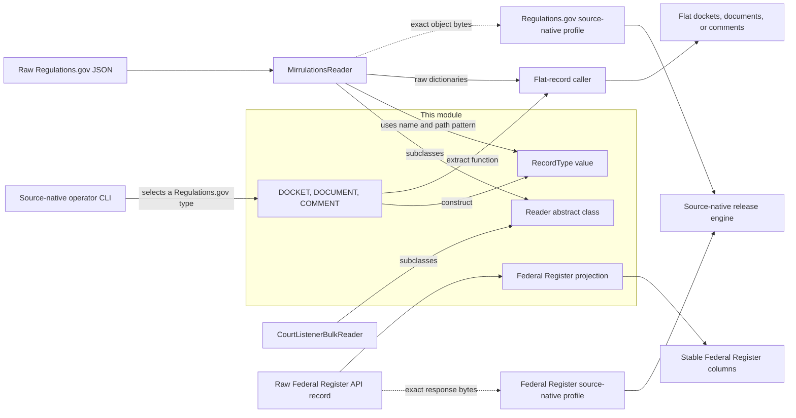
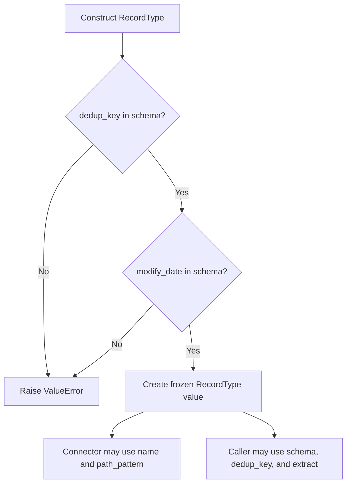
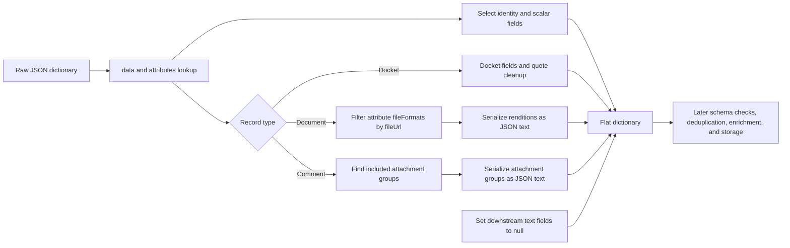
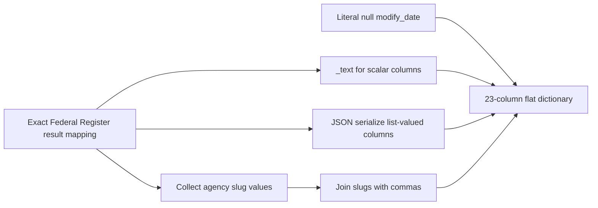
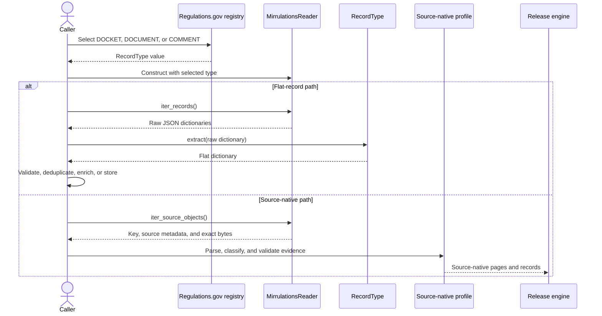
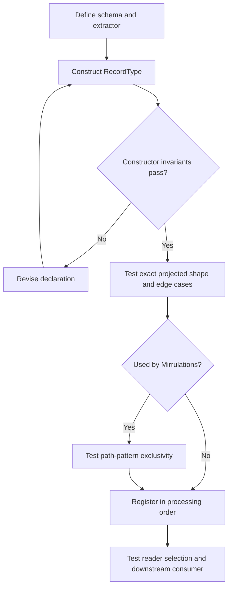

# Source connector contracts and projections

This module defines the small interfaces between source acquisition and flat-record processing. It supplies the abstract `Reader` API, the `RecordType` description used to name and locate record families, three Regulations.gov flat-record definitions, and a stable Federal Register document projection.

The module describes records; it does not fetch, persist, merge, enrich, or publish them. Concrete readers own transport behavior, and source-native profiles own replayable source validation. See [connector ingestion and record projection](connector_ingestion_and_record_projection.md) for the parent workflow.

## Purpose and system role

| Question | Answer |
| --- | --- |
| What goes in? | External-source dictionaries, plus a selected `RecordType` when a connector addresses records by type. |
| What happens? | A reader yields raw dictionaries. An explicit projection step can flatten a dictionary into stable columns. |
| What comes out? | Raw dictionaries from `Reader.iter_records()` or flat dictionaries from a `RecordType.extract` function or `project_federal_register_document()`. |
| How do we check it? | Constructor checks reject two invalid `RecordType` declarations. Connector tests check raw-reader integration; projection changes need focused shape and edge-case tests. |

The code supports two distinct paths:

1. The flat-record path reads a raw dictionary and then calls an extractor explicitly.
2. The source-native path captures exact source evidence and delegates classification to a `SourceNativeProfile`.

Neither `Reader` nor `MirrulationsReader.iter_records()` calls `RecordType.extract`. Callers must not assume that selecting a record type also flattens the returned data.

## Architecture and dependencies



The solid flat-record routes use this module's projections. The dotted source-native routes bypass them. The source-native profiles preserve source records and apply stricter, replayable checks described in [Regulations.gov source native](regulations_gov_source_native.md), [Federal Register source native](federal_register_source_native.md), and the [source-native profile API](source_native_profile_api.md).

### Direct dependency map

| Component | Direct code dependencies | Main consumers |
| --- | --- | --- |
| `sources.base.Reader` | Python `abc`, `collections.abc`, and `typing` | `MirrulationsReader`, `CourtListenerBulkReader` |
| `schemas.base.RecordType` | Python `dataclasses`, `collections.abc`, and `typing` | Regulations.gov record definitions and the Mirrulations connector |
| `schemas.regulations` | `RecordType` and `json.dumps` | Schema-package exports, Mirrulations configuration, and the source-native CLI's collection selection |
| `schemas.federal_register` | Python `json`, `Mapping`, and `Any` | Optional flat-record consumers; no in-repository runtime caller currently imports it |

These files use only the Python standard library. Keep that property when changing the interfaces: lightweight imports let read and verification code load without pulling acquisition-only packages into the process. The concrete transport and retry dependencies belong in the [Mirrulations connector](mirrulations_connector.md) and [CourtListener bulk connector](courtlistener_bulk_connector.md).

## `Reader`: raw acquisition interface

[`Reader`](../src/spicy_docs/sources/base.py) is an abstract base class with one required method:

```python
def iter_records(self) -> Iterator[dict]: ...
```

A concrete reader configures its source through `__init__` and yields one raw record dictionary at a time. The concrete class owns pagination, batching, retry policy, ordering, and deduplication. The base class imposes no schema validation and performs no projection.

### Key-accounting fields

Keyed sources use two public lists to report the final disposition of source addresses:

| Field | General meaning after complete iteration |
| --- | --- |
| `last_keys` | Keys successfully consumed and eligible for a caller's processed-key manifest |
| `failed_keys` | Attempted keys that were not consumed and must remain outside that manifest |

The base definitions are mutable class-level defaults. Every stateful reader should assign fresh instance lists during construction before it mutates them. `MirrulationsReader` follows this rule.

Iteration is lazy. A caller must exhaust the iterator before treating key lists, counters, or failure summaries as final. Closing an iterator early may release resources, but any run summary then describes only partial work. A reader should also document its output order because the abstract interface makes no ordering promise.

The Mirrulations implementation adds `parse_failed_keys` and deliberately treats deterministic parse failures differently from transient transport failures. That source-specific exception appears in [Mirrulations connector](mirrulations_connector.md); it is not a general `Reader` guarantee.

### Related `Writer` interface

The same source file defines `Writer.write(records)`, an abstract sink interface. No component in this module implements it, and the supplied module tree does not include a writer. A connector that reads and writes can inherit from both interfaces.

## `RecordType`: flat-record description

[`RecordType`](../src/spicy_docs/schemas/base.py) is a frozen dataclass instance, not a class hierarchy. Contributors define a new record family by constructing a value.

| Field | Purpose |
| --- | --- |
| `name` | Stable record-family name used by registries and downstream paths |
| `schema` | Mapping from output column names to expected Python types |
| `dedup_key` | Output column that identifies records during later deduplication |
| `extract` | Callable that maps one raw dictionary to one flat dictionary |
| `path_pattern` | Optional source-specific path fragment; Mirrulations requires it |

Construction enforces only two invariants:

- `dedup_key` must be a key in `schema`.
- `schema` must contain `modify_date`.

`frozen=True` prevents field reassignment, but it does not recursively freeze the `schema` dictionary or the extractor's behavior. The class also does not check the record-type name, path pattern, extracted key set, output types, non-null identity, or date format. Tests and downstream validation must enforce those properties.



### Responsibilities around the type

`RecordType` groups metadata but does not execute a pipeline:

- A connector may use `name` and `path_pattern` to select source objects.
- A flat-record caller may invoke `extract(raw)`.
- A table builder may use `schema` to construct columns and `dedup_key` to select one record.
- Each consumer must check the guarantees it needs; constructing the value proves only the two invariants above.

## Regulations.gov record definitions

[`schemas/regulations.py`](../src/spicy_docs/schemas/regulations.py) defines three record types and publishes them through `RECORD_TYPES`.

| Value | `name` | `path_pattern` | `dedup_key` | Output columns |
| --- | --- | --- | --- | --- |
| `DOCKET` | `dockets` | `/docket/` | `docket_id` | `docket_id`, `agency_code`, `title`, `docket_type`, `modify_date`, `abstract`, `rin` |
| `DOCUMENT` | `documents` | `/documents/` | `document_id` | Identity, docket and agency fields, dates, attachment fields, Federal Register number, withdrawal fields, additional RINs, and text-extraction fields |
| `COMMENT` | `comments` | `/comments/` | `comment_id` | Identity, docket and submitter fields, comment metadata and text, attachments, and text-extraction fields |

Every declared Regulations.gov column has `str` as its expected Python type, although an extractor can return `None` for a missing value. The exact schemas are:

- `DOCKET`: `docket_id`, `agency_code`, `title`, `docket_type`, `modify_date`, `abstract`, `rin`.
- `DOCUMENT`: `document_id`, `docket_id`, `agency_code`, `title`, `document_type`, `posted_date`, `modify_date`, `comment_start_date`, `comment_end_date`, `file_url`, `attachments_json`, `fr_doc_num`, `withdrawn`, `reason_withdrawn`, `additional_rins`, `text_content`, `text_extraction_status`.
- `COMMENT`: `comment_id`, `docket_id`, `agency_code`, `first_name`, `last_name`, `organization`, `category`, `title`, `comment`, `document_type`, `posted_date`, `modify_date`, `receive_date`, `attachments_json`, `text_content`, `text_extraction_status`.

The registry order is significant:

```python
RECORD_TYPES = {
    "dockets": DOCKET,
    "documents": DOCUMENT,
    "comments": COMMENT,
}
```

That insertion order drives the default processing order. The key for each entry matches `RecordType.name`. Mirrulations' single-scan listing assigns a source key to the first matching record type, so path patterns used together must remain mutually exclusive.

### Common projection behavior

All three extractors expect the Regulations.gov JSON:API-style `data` and `attributes` mappings. Missing individual fields usually become `None`, but the extractors are not defensive schema validators. Explicitly malformed containers, such as `data=None` or a non-mapping attachment entry, can raise an exception.

The projections preserve source values unless they document a conversion:

- Docket identifiers have leading and trailing double-quote characters removed when present.
- Nested lists used by the flat table become JSON strings.
- Missing or empty optional attachment and additional-RIN lists become `None` in the Regulations.gov projections.
- Declared schema types do not coerce values. For example, the extractor passes source scalars through even when the schema declares `str`.

### Docket extraction

`DOCKET.extract` is an inline function that selects the source ID and six attributes. It removes surrounding double quotes from the source `data.id`, maps `dkAbstract` to `abstract`, and otherwise passes source values through.

### Document extraction

`_extract_document` reads `data.attributes.fileFormats`. For each entry with a truthy `fileUrl`, it retains `url`, `format`, and `size` in `attachments_json`. It also copies the first retained URL into `file_url` for backward compatibility.

The extractor serializes a truthy `additionalRins` list into `additional_rins`. It leaves both `text_content` and `text_extraction_status` as `None`; the raw JSON has no PDF text layer. Downstream text extraction owns those fields.

### Comment extraction

`_extract_comment` finds top-level `included` entries whose `type` equals `attachments`. It retains attachment groups only when at least one `fileFormats` entry has a `fileUrl`. Each retained group carries its source title and a list of `url`, `format`, and `size` values.

The source comment text maps directly to `comment`. As with documents, `text_content` and `text_extraction_status` remain `None` for later attachment-text enrichment.

### Regulations.gov data flow



The extractor ends at the flat dictionary. It does not enforce types, deduplicate records, download attachments, extract PDF text, or write Parquet.

## Federal Register document projection

[`schemas/federal_register.py`](../src/spicy_docs/schemas/federal_register.py) provides a standalone flat projection rather than a `RecordType` value.

`FEDERAL_REGISTER_COLUMNS` defines these 23 public columns in output order:

```text
document_number, title, abstract, document_type, publication_date,
effective_on, comments_close_on, signing_date, agencies_json, agency_slugs,
docket_ids_json, regulation_id_numbers_json, cfr_references_json, topics_json,
html_url, pdf_url, body_html_url, volume, start_page, end_page, subtype,
executive_order_number, modify_date
```

`project_federal_register_document(document)` returns a dictionary in the same order and applies four mapping rules:

| Rule | Columns | Behavior |
| --- | --- | --- |
| Scalar text | Identity, titles, dates, URLs, page numbers, subtype, and executive-order number | `_text` converts each non-null value with `str()` and preserves `None`. |
| JSON text | `agencies_json`, `docket_ids_json`, `regulation_id_numbers_json`, `cfr_references_json`, `topics_json` | `json.dumps` preserves each supplied collection; a missing or false value becomes `[]`. |
| Derived agency list | `agency_slugs` | Truthy `slug` values from mapping entries are converted to strings and joined with commas in source order; no slug produces `None`. |
| Compatibility null | `modify_date` | Always `None` because the API does not expose an update instant. |



The function assumes that earlier code has accepted the source shape. It does not validate unknown fields, date formats, agency structure, or identity. At the current revision, no runtime code in this repository imports the projection, and no focused test exercises it. Treat its ordered columns and serialization behavior as a public compatibility surface when adding a consumer.

The [Federal Register source-native](federal_register_source_native.md) adapter is separate. It validates a closed source shape, retains exact response evidence, and builds source-native records without calling this flat projection.

## Component interaction

The following interaction shows where selection, reading, and projection occur. It also shows the source-native branch that intentionally skips flat projection.



The CLI uses the selected Regulations.gov `RecordType` only to configure the Mirrulations collection and path. The profile, not `RecordType.extract`, defines the source-native record meaning. The [source-native release engine](source_native_release_engine.md) then handles storage, selection, receipts, and replay.

## Guarantees and limits

| Area | This module guarantees | This module leaves to another component |
| --- | --- | --- |
| Reader shape | `iter_records()` is an abstract iterator of dictionaries | Transport, retry, bounds, ordering, closure, and deduplication |
| Key reporting | General meanings for `last_keys` and `failed_keys` | Concrete failure categories and finalization timing |
| Record declaration | Dedup key exists in the schema; `modify_date` is declared | Exact output keys, runtime types, identity validity, and date validity |
| Regulations.gov mapping | Stable selected columns and documented attachment JSON | Source-shape validation, attachment download, text extraction, and persistence |
| Federal Register mapping | Ordered public columns, scalar-to-text conversion, JSON lists, and null `modify_date` | API traversal, closed-shape validation, source evidence, and publication |

## Contribution guide

### Add a `Reader`

1. Subclass `Reader` and implement a lazy `iter_records()` method.
2. Inject clients, file handles, or fetch functions so tests can avoid live services.
3. Define bounds for pagination, queued work, response size, and retries in the concrete connector.
4. Yield source-shaped dictionaries unless the connector explicitly documents another output.
5. Assign fresh per-instance key lists for keyed sources and finalize them consistently on success and failure.
6. Document ordering and cleanup behavior, then test normal iteration, early close, and failures.

Detailed transport rules belong in the relevant connector page. See [Mirrulations connector](mirrulations_connector.md) and [CourtListener bulk connector](courtlistener_bulk_connector.md).

### Add a Regulations.gov `RecordType`

1. Define one `RecordType` value in `schemas/regulations.py`; do not subclass `RecordType`.
2. Include the identity column, `modify_date`, every extractor output column, and no undeclared output column.
3. Choose a stable `name` and the correct deduplication key.
4. Add a Mirrulations `path_pattern` only when the source exposes an unambiguous path fragment.
5. Make the extractor deterministic and free of network or filesystem access.
6. Preserve source values and source order unless a documented compatibility rule requires a conversion.
7. Add the value to `RECORD_TYPES` at the intended processing position.
8. Test constructor failures, missing optional fields, malformed containers, exact output keys, type-sensitive values, attachment filtering, and path-pattern collisions.



### Change a projection

Treat column names, order, null behavior, JSON encoding, and compatibility fields as externally visible behavior. Before merging a change:

- identify each downstream consumer;
- decide whether the change is additive or breaking;
- retain raw source information when a lossy conversion is unnecessary;
- update constants, schemas, extractors, tests, and module documentation together; and
- keep source-native classification changes in the appropriate source-native module.

## Verification

Run the focused connector integration test from the repository root:

```bash
uv run pytest -q tests/test_mirrulations_reader.py
```

That suite proves that the Mirrulations reader yields raw payloads and uses the record-type path information. It does not directly prove `RecordType.__post_init__`, the Regulations.gov extractor output, or the Federal Register flat projection. Add dedicated unit tests for those behaviors when changing this module.

Run the repository's static checks after code changes:

```bash
uv run ruff check .
uv run ruff format --check .
```

## Related module documentation

- [Connector ingestion and record projection](connector_ingestion_and_record_projection.md) — parent module and end-to-end connector boundary.
- [Mirrulations connector](mirrulations_connector.md) — S3 listing, download, retry, key accounting, and exact-object enumeration.
- [CourtListener bulk connector](courtlistener_bulk_connector.md) — bulk dump discovery, streaming decompression, resume behavior, and measurements.
- [Source-native profile API](source_native_profile_api.md) — callbacks that validate and interpret preserved source evidence.
- [Regulations.gov source native](regulations_gov_source_native.md) — exact Mirrulations evidence packs and Regulations.gov source classification.
- [Federal Register source native](federal_register_source_native.md) — API traversal, closed-shape validation, and source-native records.
- [Source-native release engine](source_native_release_engine.md) — immutable publication, admission, storage, and replay.
