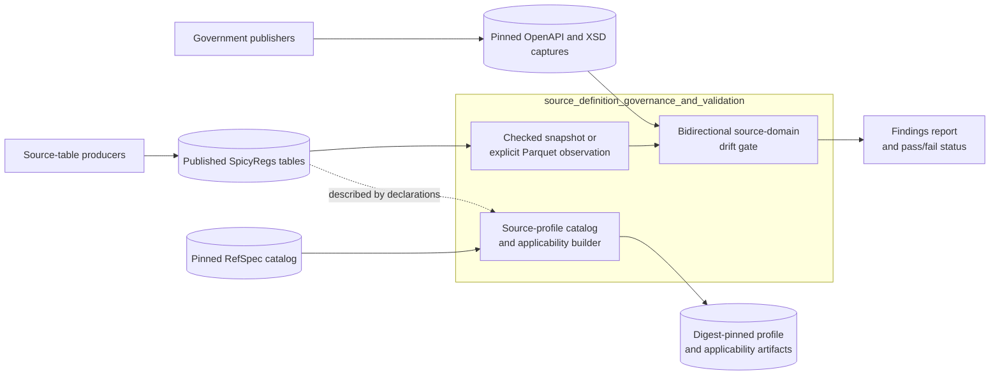
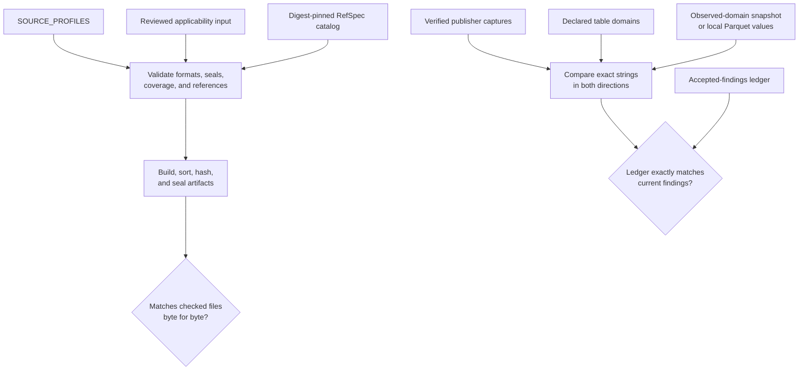

> Generated reference snapshot; see [current architecture](../docs/architecture.md),
> [operator commands](../docs/cli.md), and [reference maintenance](../docs/documentation.md).

# Source definition governance and validation

## Purpose

The `source_definition_governance_and_validation` module governs how SpicyDocs describes published SpicyRegs source tables and detects changes in selected source-defined values.

It has two independent parts:

- The source-profile catalog publishes deterministic, digest-pinned descriptions of table identities, processing modes, access rules, evidence fields, and relationships to RefSpec resources.
- The source-domain drift gate compares selected table values with pinned government documentation and requires a written acceptance for every difference.

The module does not acquire records, build tables, validate complete table schemas, interpret source values, define search policy, or publish source-native releases.

| Question | Answer |
| --- | --- |
| What goes in? | Source-profile declarations, reviewed applicability data, a pinned RefSpec catalog, pinned publisher documents, observed table-value snapshots, and accepted drift findings. |
| What happens? | The catalog branch validates and seals source definitions. The drift branch compares documented and observed values in both directions. |
| What comes out? | Digest-pinned catalog artifacts and a pass-or-fail drift report with traceable findings. |
| How do we check it? | Regenerate catalog artifacts byte for byte, run the offline drift gate, and run each component’s focused tests. |

## Architecture

The catalog branch describes tables without opening them. The drift branch inspects only declared closed-value domains, either through a checked snapshot or an explicit local Parquet observation. Neither branch imports source connectors, source-native profiles, release machinery, or sibling-product runtimes.

### Validation paths

Catalog validation proves deterministic content, complete profile coverage, and valid RefSpec references. Drift validation proves that every current documented-versus-observed difference has an active explanation and that no obsolete exception remains. These checks do not prove publisher authenticity, semantic correctness, deployment, or publication.

## Core component documentation

- [Source-profile catalog artifacts](source_profile_catalog_artifacts.md) — source declarations, applicability policy, RefSpec validation, canonical JSON, content identities, artifact generation, and deterministic regeneration checks.
- [Source-domain drift gate](source_domain_drift_gate.md) — publisher-capture verification, domain parsing, Parquet observation, bidirectional comparison, accepted-findings governance, and command-line verification.