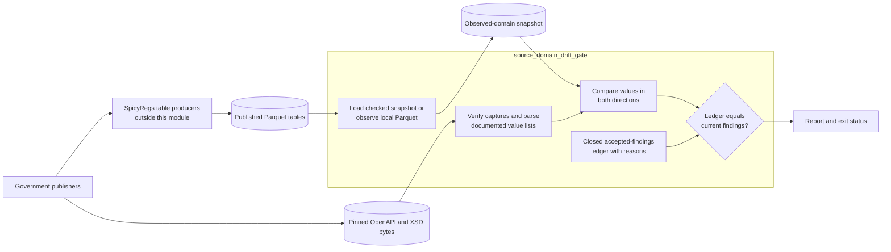
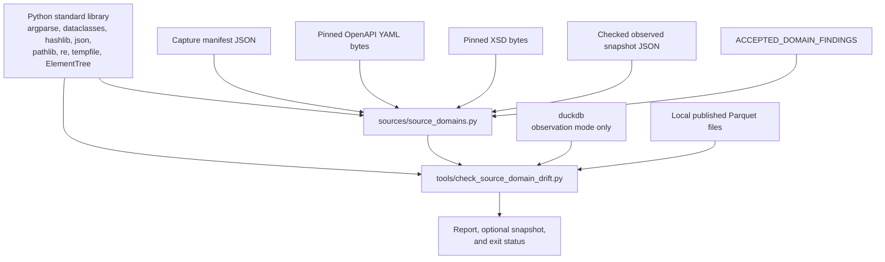
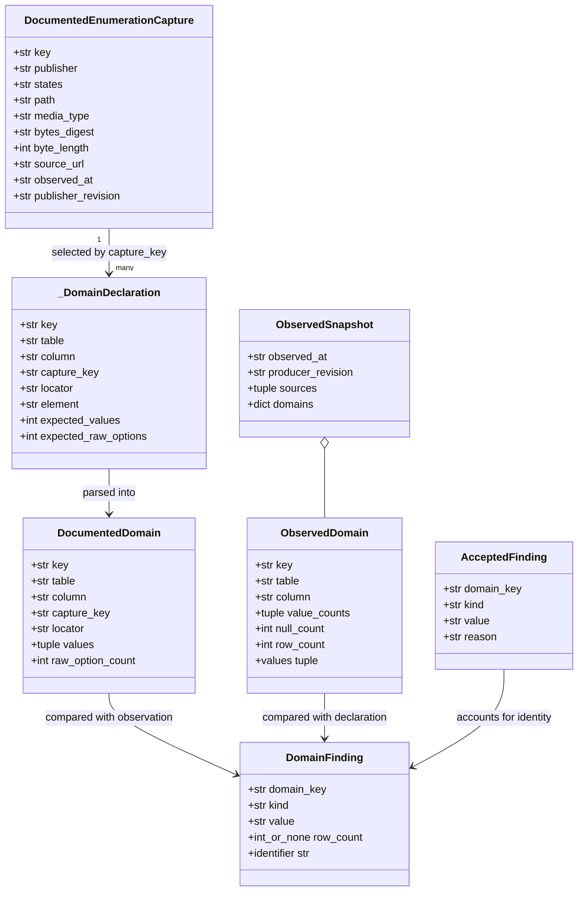
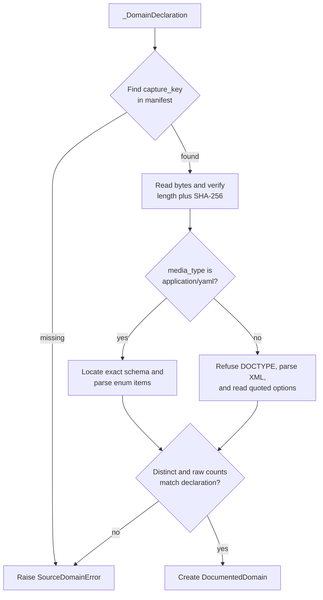
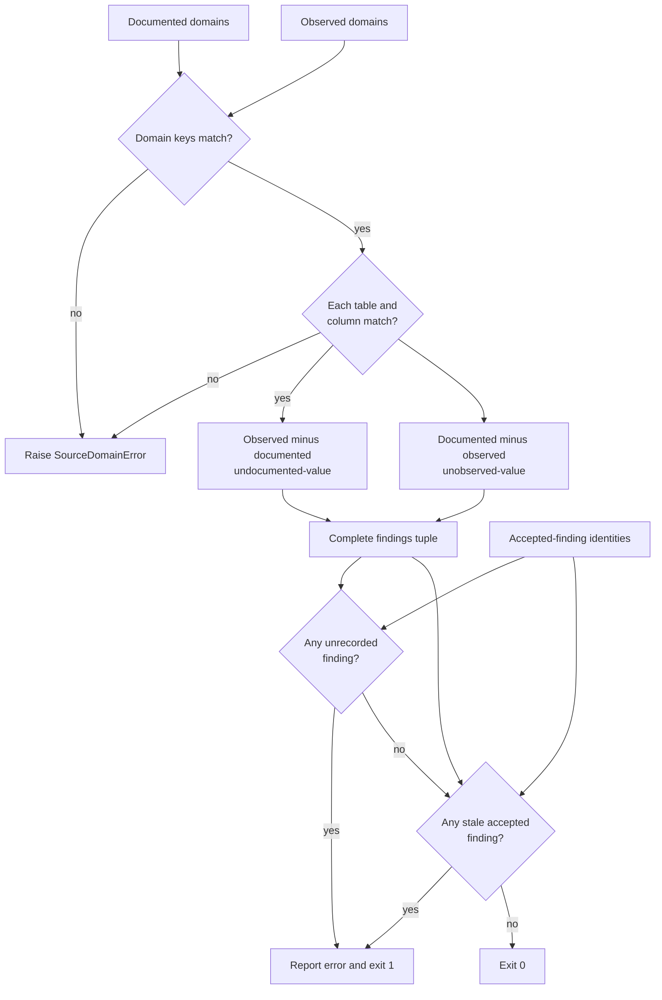
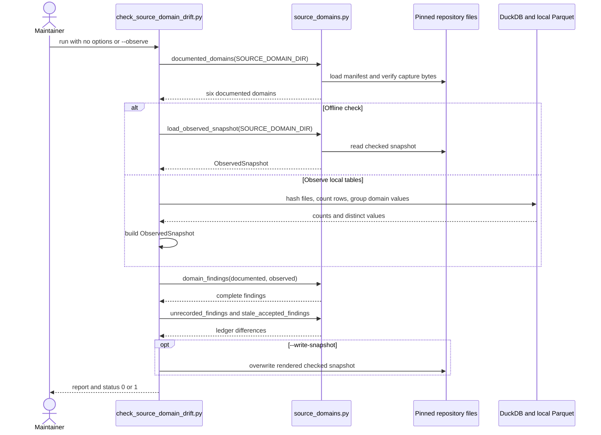

> Generated reference snapshot; see [current architecture](../docs/architecture.md),
> [operator commands](../docs/cli.md), and [reference maintenance](../docs/documentation.md).

# Source-domain drift gate

The `source_domain_drift_gate` module checks whether selected values in published SpicyRegs tables still agree with the closed value lists documented by their government publishers. It parses those lists from digest-pinned Regulations.gov OpenAPI and reginfo.gov XML Schema (XSD) captures, compares them with a dated summary of observed Parquet values, and requires every difference to have a current, written explanation.

The gate is deliberately bidirectional. It reports values present in data but absent from publisher documentation and values documented by a publisher but absent from the observed data. A checked-in acceptance ledger must match the complete set of current findings: a new difference fails, and an obsolete exception also fails.

## Purpose and system role

| Question | Answer |
| --- | --- |
| What goes in? | Exact publisher-document captures plus their manifest, six in-code domain declarations, a checked observed-domain snapshot or local published Parquet tables, and the `ACCEPTED_DOMAIN_FINDINGS` ledger. |
| What happens? | The module verifies captured bytes, parses documented values, loads or computes observed values and row counts, compares each domain in both directions, and checks the result against the ledger. |
| What comes out? | A human-readable findings report, an optional deterministic JSON snapshot, and process status 0 when the ledger exactly accounts for the findings or status 1 when it does not. |
| How do we check it? | Run the default offline gate, then run `tests/test_source_domain_drift.py`. Changes to publisher captures or table observations also require a reviewed re-observation and focused parser tests. |

This module belongs to source-definition governance. It checks facts about already published tables; it does not acquire source records, build those tables, validate their full schemas, publish releases, or interpret their values. The source-profile catalog describes table roles and downstream applicability instead; see [source-profile catalog artifacts](source_profile_catalog_artifacts.md). Flat Regulations.gov projections that produce `docket_type` and `document_type` are described in [source connector contracts and projections](source_connector_contracts_and_projections.md).

## System context and boundaries



The default path is hermetic: it reads repository files and uses the Python standard library. It makes no network request and opens no Parquet file. Observation is an explicit maintenance path. It reads local Parquet files through DuckDB but still performs no download; operators must obtain the intended table files separately.

The module compares exact strings. It does not lowercase, trim, alias, or otherwise reconcile source values, except for two parser-specific rules tied to the captured publisher formats:

- the OpenAPI parser removes trailing whitespace from plain YAML enum scalars;
- the XSD parser trims quoted options and folds literal duplicate options while retaining their original count.

This exact comparison makes spelling and case changes visible. For example, the checked snapshot treats `First Time Published in The Unified Agenda` and `First time published in the Unified Agenda` as different values.

## Code and data layout

| Path | Responsibility |
| --- | --- |
| [`src/spicy_docs/sources/source_domains.py`](../src/spicy_docs/sources/source_domains.py) | Defines capture, domain, snapshot, finding, and accepted-finding values; verifies and parses publisher captures; loads snapshots; computes drift; and checks the acceptance ledger. |
| [`tools/check_source_domain_drift.py`](../tools/check_source_domain_drift.py) | Implements offline checking, local Parquet observation, snapshot rendering and writing, reporting, and command-line status behavior. |
| [`sample-data/source-domains/documented-enumeration-capture-manifest-v1.json`](../sample-data/source-domains/documented-enumeration-capture-manifest-v1.json) | Records each publisher capture's path, media type, SHA-256 digest, byte length, publisher URL, observation time, and publisher revision. |
| [`sample-data/source-domains/regulations-gov-openapi-v4-2026-08-03.yaml`](../sample-data/source-domains/regulations-gov-openapi-v4-2026-08-03.yaml) | Exact Regulations.gov OpenAPI v4 capture used for documented API enum values. |
| [`sample-data/source-domains/reginfo-rin-data-ver10262011.xsd`](../sample-data/source-domains/reginfo-rin-data-ver10262011.xsd) | Exact reginfo.gov XSD capture whose documentation prose states Unified Agenda options. |
| [`sample-data/source-domains/observed-domain-snapshot-2026-08-03.json`](../sample-data/source-domains/observed-domain-snapshot-2026-08-03.json) | Dated summary of distinct non-null values, support counts, null counts, table row counts, and source-file identities. |
| [`sample-data/source-domains/README.md`](../sample-data/source-domains/README.md) | Capture provenance, publisher-document details, and observation background. |
| [`tests/test_source_domain_drift.py`](../tests/test_source_domain_drift.py) | Focused gate, mutation, parser, provenance, snapshot-accounting, security, and command-line tests. |

## Dependency architecture



`source_domains.py` has no third-party dependency. The command-line tool imports `duckdb` only inside `_connect()`, so default checking does not require it. The current project dependencies do not declare DuckDB; an environment that runs `--observe` must provide a compatible `duckdb` package.

No runtime component in this module imports a source connector, a source-native profile, the release engine, DocSpec, RefSpec, or a published-table builder. Preserve this dependency direction. Bring publisher definitions and observations into the gate as pinned data rather than importing another product's runtime.

## Domain model and component relationships



All seven data classes are frozen. Freezing prevents field reassignment but does not recursively freeze the `sources` mappings or `domains` dictionary inside `ObservedSnapshot`. Callers should treat every instance as immutable evidence.

### Publisher-capture values

`DocumentedEnumerationCapture` represents one manifest entry. `load_capture_manifest()` requires the root format `spicyregs-source-domains/capture-v1`, requires each capture row to have exactly the expected ten fields, rejects repeated capture keys, and requires at least one capture. It converts values to the annotated scalar types but does not validate timestamp syntax, URL ownership, MIME syntax, publisher identity, or digest shape at manifest-load time.

`read_capture()` opens the path relative to the supplied root, checks the exact byte length, recomputes a `sha256:` digest, and returns bytes only when both pins match. The manifest itself is version-controlled but is not separately signed or content-digested by this module.

### Domain declarations and documented domains

`_DomainDeclaration` is the private registry row. It binds a stable domain key and published table column to one capture, one parser element, a human-readable source locator, and expected distinct and raw option counts. `_DECLARATIONS` is the authoritative scope of the gate, and `DOMAIN_KEYS` preserves its declaration order.

`documented_domains()` loads the manifest, reads each used capture once, dispatches `application/yaml` captures to the OpenAPI parser and every other current media type to the XSD parser, and checks both pinned option counts. It returns `DocumentedDomain` values keyed by domain key. The method refuses a missing capture reference or any parsed count change.

`DocumentedDomain` records the source table and column, capture key, capture path and locator, parsed values in publisher order, and the raw option count. It is the verified publisher side of the comparison.

### Observations

`ObservedDomain` records one table column's distinct non-null strings with row support, its null count, and the full table row count. Its `values` property removes counts without changing order.

`ObservedSnapshot` groups all observed domains with an observation timestamp, the producing SpicyRegs revision, and source-file metadata. `load_observed_snapshot()` requires format `spicyregs-source-domains/observed-v1`, rejects repeated domain keys, and requires at least one domain. It does not re-open or re-hash the source Parquet files during the offline check; source identities in the JSON remain recorded provenance.

The snapshot loader is less structurally strict than the capture-manifest loader. It assumes required fields and value-count pairs exist, and it preserves `sources` as opaque mappings. Malformed nested data can therefore raise ordinary `KeyError`, `TypeError`, or conversion errors instead of `SourceDomainError`. Keep snapshot generation on the module's `render_snapshot()` path and cover format changes with tests.

### Findings and accepted findings

`DomainFinding` represents one exact value disagreement. `kind` is either:

- `undocumented-value`: the observed data contains a value absent from the documented list; or
- `unobserved-value`: the documented list contains a value absent from the observation.

`row_count` carries support for an undocumented observed value. It is `None` for an unobserved documented value. `identifier` joins the domain key, kind, and exact value with `/` for reports and tests.

`AcceptedFinding` records the same identity plus a human-written reason. Ledger matching uses only `(domain_key, kind, value)`. A change in row support alone does not create an unrecorded finding, although reports and snapshots expose the changed count for review.

## Declared scope

The current declarations cover six published columns selected because this repository has both a pinned publisher document stating a credible closed list and an observed table column.

| Domain key | Published column | Publisher declaration | Distinct values | Raw options |
| --- | --- | --- | ---: | ---: |
| `regulations-gov-document-type` | `documents.document_type` | `DocumentType.enum` in Regulations.gov OpenAPI v4 | 5 | 5 |
| `regulations-gov-docket-type` | `dockets.docket_type` | `DocketType.enum` in Regulations.gov OpenAPI v4 | 2 | 2 |
| `unified-agenda-rule-stage` | `unified_agenda.rule_stage` | `RULE_STAGE` documentation in the reginfo.gov XSD | 6 | 6 |
| `unified-agenda-priority-category` | `unified_agenda.priority_category` | `PRIORITY_CATEGORY` documentation in the reginfo.gov XSD | 6 | 7 |
| `unified-agenda-rin-status` | `unified_agenda.rin_status` | `RIN_STATUS` documentation in the reginfo.gov XSD | 2 | 2 |
| `unified-agenda-major` | `unified_agenda.major` | `MAJOR` documentation in the reginfo.gov XSD | 3 | 3 |

The documented values are:

| Domain | Values in publisher order |
| --- | --- |
| Regulations.gov document type | `Notice`; `Rule`; `Proposed Rule`; `Supporting & Related Material`; `Other` |
| Regulations.gov docket type | `Rulemaking`; `Nonrulemaking` |
| Unified Agenda rule stage | `Prerule Stage`; `Proposed Rule Stage`; `Final Rule Stage`; `Long-Term Actions`; `Completed Actions`; `No Stage` |
| Unified Agenda priority category | `Economically Significant`; `Other Significant`; `Substantive, Nonsignificant`; `Routine and Frequent`; `Info./Admin./Other`; `Not Major` |
| Unified Agenda RIN status | `First time published in the Unified Agenda`; `Previously published in the Unified Agenda` |
| Unified Agenda major | `Yes`; `No`; `Undetermined` |

Three plausible fields remain outside the registry by design:

- Regulations.gov `submitterType` documents `comments.category`, but the checked observed snapshot contains no comments table.
- Unified Agenda `TTBL_ACTION` documents 34 values, but `timetable_json` carries 1,139 distinct action strings across 10,533 entries in the referenced source data. Treating that publisher field as closed would create noise rather than a useful gate.
- `federal_register.document_type` has no pinned publisher document in this module that states a closed list.

`PUBLISHED_TABLE_URLS` also lists a Federal Register URL, but `observe()` derives the tables to scan from `_DECLARATIONS`. It therefore reads only `dockets.parquet`, `documents.parquet`, and `unified_agenda.parquet` under the current registry.

## Publisher-document parsing

### Regulations.gov OpenAPI YAML

`openapi_schema_enum(payload, schema_name)` is a narrow parser for the pinned OpenAPI document, not a general YAML or OpenAPI reader. It relies on the captured two-space layout:

- schema names start at indentation 4;
- schema keys start at indentation 6;
- enum list items start at indentation 8.

The parser requires exactly one matching schema header, enters the exact `enum:` key, rejects non-list content inside that enum, requires at least one value, and rejects duplicate values. It right-strips each plain scalar because trailing whitespace is not part of an unquoted YAML scalar. It performs no other normalization, so the literal ampersand in `Supporting & Related Material` remains intact.

The layout checks turn a publisher format change into a refusal. If the publisher rewrites the same values with another YAML layout, contributors must review the new shape and change the parser deliberately.

### reginfo.gov XSD documentation prose

The reginfo.gov XSD contains no `xs:enumeration` facets for the covered elements. Each element is an unrestricted `xs:string`; its `xs:documentation` sentence states the options. `xsd_documented_options(payload, element_name)` therefore parses publisher prose with two strict rules:

1. the sentence must begin with `One of the following options:`; and
2. each option must appear inside double quotes.

`_parse_xsd()` refuses a `DOCTYPE` in the XML prolog before using `xml.etree.ElementTree`. This blocks the document type declaration used by XML external-entity and entity-expansion payloads. The option parser then requires one matching XSD element, one nonblank documentation node, and at least one quoted option.

The parser removes surrounding whitespace and folds repeated literal values in first-seen order. It also returns the raw number of quoted options. This distinction preserves the known `PRIORITY_CATEGORY` defect: the publisher writes `Not Major` twice, so that domain has six distinct values and seven raw options.



## Observation and snapshot format

### Checked snapshot

The checked snapshot summarizes a source data set observed at `2026-08-03T22:35:00Z` and produced by SpicyRegs revision `f1fcb8c9c8838071e9c45462799db788971baca4`.

| Table | Rows | Role in this gate |
| --- | ---: | --- |
| `dockets` | 276,326 | Supplies `docket_type`. |
| `documents` | 1,990,136 | Supplies `document_type`. |
| `unified_agenda` | 3,954 | Supplies `rule_stage`, `priority_category`, `rin_status`, and `major`. |

Each source row in the snapshot records the table, public R2 URL, exact Parquet byte length, SHA-256 digest, and row count. Each domain row records its table and column, descending-frequency value counts, null count, and table row count. The focused tests require every domain's value counts plus null count to equal its table row count.

Null is observation metadata, not a domain value. `domain_findings()` compares only the strings in `value_counts`; it does not report null as documented or undocumented. The checked snapshot contains two null `priority_category` rows and no nulls in the other five domains.

### Live observation

`observe(data_dir, observed_at, producer_revision)` derives the required tables from `documented_domains()`. For each table, it:

1. requires a recorded URL in `PUBLISHED_TABLE_URLS`;
2. requires `<data_dir>/<table>.parquet` to exist;
3. hashes the complete file in 1 MiB chunks and records its byte length;
4. uses DuckDB to count all rows; and
5. groups each declared column by exact value, ordering results by descending support and then by value.

It separates null support from non-null value counts and returns an in-memory `ObservedSnapshot`. It does not download tables, compare the table digest with an external catalog, validate unrelated columns, or verify that `observed_at` and `producer_revision` use a particular syntax.

`render_snapshot()` converts that value into stable, readable JSON. It sorts domain objects by domain key, preserves each domain's value-count order and the source-table order, sorts JSON object keys, indents by two spaces, and appends one newline.

Observation performs one full SHA-256 pass over each table, one DuckDB row-count scan per table, and one grouped scan per declared domain. Under the current declarations, DuckDB scans `dockets` and `documents` twice each and `unified_agenda` five times. A snapshot remains small because it stores distinct values and counts rather than table rows.

## Comparison and decision logic

`domain_findings(documented, observed)` first requires exact domain-key coverage. It then requires every observation to name the same table and column as its declaration. These checks prevent a missing domain, extra domain, or column substitution from appearing as a clean comparison.

For each domain key in sorted order, the function emits:

1. one `undocumented-value` finding for every observed value absent from `DocumentedDomain.values`, preserving snapshot value-count order; then
2. one `unobserved-value` finding for every documented value absent from the observation, preserving publisher order.

`unrecorded_findings()` subtracts ledger identities from current finding identities. `stale_accepted_findings()` performs the reverse subtraction. The gate passes only when both results are empty.



### Current accepted findings

The checked inputs produce seven findings, and the ledger records all seven.

| Domain | Kind | Exact value | Observed support | Reason in brief |
| --- | --- | --- | ---: | --- |
| Regulations.gov document type | Undocumented | `Public Submission` | 373 | The API and web interface emit it, but the pinned OpenAPI enum omits it. |
| Unified Agenda RIN status | Undocumented | `Previously Published in The Unified Agenda` | 2,835 | Published data uses title case where the XSD prose uses sentence case. |
| Unified Agenda RIN status | Undocumented | `First Time Published in The Unified Agenda` | 1,119 | Published data uses title case where the XSD prose uses sentence case. |
| Unified Agenda RIN status | Unobserved | `First time published in the Unified Agenda` | — | The exact documented spelling occurs on no observed row. |
| Unified Agenda RIN status | Unobserved | `Previously published in the Unified Agenda` | — | The exact documented spelling occurs on no observed row. |
| Unified Agenda rule stage | Unobserved | `No Stage` | — | One semiannual edition need not exercise every documented stage. |
| Unified Agenda priority category | Unobserved | `Not Major` | — | The observed edition omits it; the publisher's prose also repeats it. |

These entries acknowledge source conditions; they do not normalize published data or declare the publisher documentation correct. A consumer that switches on the documented list still needs to handle exact source values.

## Command-line workflows

Run commands from the repository root. The tool is a repository script, not a declared `pyproject.toml` console entry point.

### Offline check

```bash
uv run python tools/check_source_domain_drift.py
```

With no options, `main()` parses documented domains from pinned captures, loads the checked snapshot, computes both finding directions, prints all findings, and checks the closed ledger. The command's prose calls this check mode, but `build_parser()` does not expose a `--check` option; use the option-free command.

### Preview current local Parquet data

Provide a directory containing exactly named table files:

```bash
uv run python tools/check_source_domain_drift.py \
  --observe \
  --data-dir /path/to/published-tables \
  --observed-at 2026-09-02T12:00:00Z \
  --producer-revision <full-producing-commit>
```

`--observe` requires `--data-dir`. The timestamp and producer revision are optional for a preview, but supplying them makes the report traceable. The environment must provide DuckDB; default project installation currently supports the offline check but does not install the observation dependency.

### Re-pin the checked observation

After reviewing a preview against the intended Parquet files, add `--write-snapshot`:

```bash
uv run python tools/check_source_domain_drift.py \
  --observe \
  --data-dir /path/to/published-tables \
  --observed-at 2026-09-02T12:00:00Z \
  --producer-revision <full-producing-commit> \
  --write-snapshot
```

Writing requires nonempty `--observed-at` and `--producer-revision`. The tool overwrites the fixed checked snapshot with `Path.write_text()`; the write is neither atomic nor create-once. It writes before reporting unrecorded or stale findings and before returning status 1. A failed gate can therefore still modify the snapshot. Always inspect the file diff and ledger result after this command.

### Command interaction



## Failure behavior and guarantees

| Condition | Behavior |
| --- | --- |
| Unreadable or wrong-version capture manifest | Raise `SourceDomainError`; script reports `source-domain error` and exits 1. |
| Capture entry has missing or extra fields, repeated key, or no entries | Raise `SourceDomainError`. |
| Capture file is missing or differs in length or digest | Raise `SourceDomainError` before parsing. |
| OpenAPI schema is missing, repeated, empty, duplicated, or outside the pinned enum shape | Raise `SourceDomainError`. |
| XSD has a prolog `DOCTYPE`, malformed XML, missing/repeated element, or unrecognized option prose | Raise `SourceDomainError`. |
| Parsed distinct or raw option count changes | Raise `SourceDomainError` until a declaration change is reviewed. |
| Snapshot is unreadable, has the wrong format, repeats a domain key, or contains no domains | Raise `SourceDomainError`. |
| Documented and observed domain keys differ, or a table/column binding differs | Raise `SourceDomainError`. |
| Any finding lacks a ledger entry | Print an error and exit 1. |
| Any ledger entry is absent from current findings | Print an error and exit 1. |
| Invalid option combination | `argparse` reports usage and exits 2. |
| Observation lacks DuckDB | The lazy import raises `ModuleNotFoundError`; this path is outside the script's `SourceDomainError` handler. |

For the same repository inputs, the offline gate is deterministic. It verifies capture-byte integrity, parser shape, domain coverage, table-column identity, exact value differences, and ledger closure.

The gate does not prove:

- that a publisher capture is the newest available document or came from the stated URL;
- that the capture manifest or observed snapshot has an external signature;
- that recorded Parquet source identities still describe current public R2 objects;
- that every table column has a documented domain;
- that nullability is valid for a source schema;
- that an accepted reason remains semantically persuasive;
- that changed row counts are acceptable when the finding identity stays the same;
- that the published table schema, build, source-native release, or downstream consumers pass their own checks; or
- that any local result has been published or deployed.

## Contribution guide

### Add a documented domain

1. Confirm that a publisher document states a closed value list and that a published table preserves the source strings without normalization.
2. Pin the exact publisher document under `sample-data/source-domains/` and add a complete manifest entry with observed provenance, byte length, and SHA-256 digest.
3. Add one `_DomainDeclaration` with a unique key, exact table and column, capture key, source locator, parser element, distinct count, and raw count.
4. If the document has a new media type or shape, add a narrow parser that refuses unrecognized structure. Do not silently route an unrelated format through the XSD path.
5. Re-observe the complete domain set from the intended published Parquet build. The comparison requires exact documented and observed key coverage.
6. Review every new or removed finding. Fix invalid source production, update the pinned publisher capture when documentation changed, or record a specific evidence-based reason in `ACCEPTED_DOMAIN_FINDINGS`.
7. Add positive, mutation, provenance, and parser-refusal tests before updating the checked snapshot.

Do not add a domain merely because a field appears categorical. The gate needs a publisher-stated closed list, a pinned source for that claim, and a column whose exact values can be observed meaningfully.

### Refresh a publisher capture

1. Acquire exact bytes from the intended authoritative location outside the offline gate.
2. Record the source URL, observation timestamp, publisher revision, byte length, and `sha256:` digest in the manifest.
3. Review the byte diff and confirm that the parser still recognizes the intended source location rather than a coincidental block with the same name.
4. Update `expected_values` or `expected_raw_options` only after reviewing additions, removals, ordering, whitespace, duplicate prose, and format changes.
5. Run the gate. Treat changed findings as decisions that require a data fix, a documented acceptance reason, or removal of a stale ledger entry.
6. Keep a mutation test that proves an unreviewed byte or parser-shape change fails.

Changing a manifest digest only restores byte verification. It does not review the new publisher meaning by itself.

### Refresh the observed snapshot

1. Obtain `dockets.parquet`, `documents.parquet`, and `unified_agenda.parquet` from the exact release or build under review.
2. Preserve the producing revision and observation time before scanning.
3. Ensure the execution environment supplies DuckDB.
4. Run `--observe` without `--write-snapshot`; review table identities, row counts, null counts, value counts, and all findings.
5. Resolve unrecorded and stale findings in code or source data.
6. Run the command with `--write-snapshot`, then inspect the complete JSON diff. Remember that status 1 does not roll back the write.
7. Run the focused test suite and default offline command from a clean view of the intended changes.

The snapshot records what one build contained. It does not become the authority for what a publisher allows; publisher captures remain the documented side of the comparison.

### Change parsing or comparison behavior

Preserve exact source evidence and make any normalization explicit. A parser change can alter every downstream finding even when captured bytes and tables remain unchanged. Add tests for:

- the accepted source shape;
- missing, repeated, malformed, and duplicate values;
- the exact normalization rule;
- expected distinct and raw counts;
- an undocumented observed value;
- an unobserved documented value;
- an obsolete ledger entry;
- domain-key and table-column coverage; and
- malicious or unsafe XML prolog content when XSD parsing changes.

If comparison semantics expand beyond exact strings, version the snapshot format or otherwise prevent old and new results from being confused. Do not hide publisher casing or spelling drift behind an undocumented normalization rule.

### Review an accepted finding

Every acceptance reason should identify the exact source behavior, its evidence, its scope, and why changing data would be less correct than recording the discrepancy. Avoid reasons such as “expected” or “known issue.”

When a finding disappears, delete its ledger entry in the same change. When its row count changes but its identity remains, the gate still passes; reviewers must inspect the reported support and decide whether the existing reason remains adequate.

## Verification

Run the offline gate and focused tests from the repository root:

```bash
uv run python tools/check_source_domain_drift.py
uv run pytest -q tests/test_source_domain_drift.py
uv run ruff check \
  src/spicy_docs/sources/source_domains.py \
  tools/check_source_domain_drift.py \
  tests/test_source_domain_drift.py
uv run ruff format --check \
  src/spicy_docs/sources/source_domains.py \
  tools/check_source_domain_drift.py \
  tests/test_source_domain_drift.py
```

The focused suite covers the current seven-finding result, accepted-reason quality, two clean domains, forward and reverse drift, stale-ledger detection, exact domain and column coverage, capture hashing, parser shape, XSD `DOCTYPE` refusal, documented option values, duplicate XSD prose, snapshot provenance and accounting, null handling, command success, argument validation, and snapshot size.

Observation-mode verification requires separately obtained Parquet data and DuckDB. Record the exact source-file digests and producing revision in the review; a successful offline gate only verifies the checked snapshot.

## Component reference

| Component | Role |
| --- | --- |
| `DocumentedEnumerationCapture` | Immutable description of one pinned publisher document. |
| `load_capture_manifest()` | Loads the versioned, exact-field capture registry. |
| `read_capture()` | Reads one capture after exact byte-length and SHA-256 verification. |
| `openapi_schema_enum()` | Parses one enum from the pinned Regulations.gov OpenAPI layout. |
| `xsd_documented_options()` | Parses quoted options from one XSD documentation sentence and retains the raw count. |
| `_DomainDeclaration` | Private binding from domain key and table column to capture element and expected counts. |
| `documented_domains()` | Verifies captures and builds all documented domains. |
| `DocumentedDomain` | Parsed publisher list plus its table-column binding and source locator. |
| `ObservedDomain` | Distinct observed values with support, null count, and table row count. |
| `ObservedSnapshot` | Dated set of observations plus producer and source-file provenance. |
| `load_observed_snapshot()` | Loads the checked versioned snapshot. |
| `DomainFinding` | Exact undocumented or unobserved value difference. |
| `domain_findings()` | Enforces coverage and location, then computes both comparison directions. |
| `AcceptedFinding` | Ledger identity plus the reason a current difference is accepted. |
| `unrecorded_findings()` | Returns current differences absent from the ledger. |
| `stale_accepted_findings()` | Returns ledger entries absent from current differences. |
| `observe()` | Hashes local Parquet tables and computes exact value counts through DuckDB. |
| `render_snapshot()` | Renders an `ObservedSnapshot` as deterministic, readable JSON text. |
| `build_parser()` | Defines observation, provenance, and snapshot-write options. |
| `main()` | Selects check or observation mode, reports results, optionally writes the snapshot, and returns gate status. |

## Related documentation

- [Source-profile catalog artifacts](source_profile_catalog_artifacts.md) — the sibling source-definition governance module that describes source tables and their applicability without inspecting values.
- [Source connector contracts and projections](source_connector_contracts_and_projections.md) — flat Regulations.gov projections and the table-column names observed by this gate.
- [Connector ingestion and record projection](connector_ingestion_and_record_projection.md) — the parent connector workflow that acquires and projects source records.
- [Source-native acquisition profiles](source_native_acquisition_profiles.md) — source-specific exact-evidence acquisition and replay rules, separate from published-table domain checking.
- [Source-native release lifecycle](source_native_release_lifecycle.md) — immutable source-native publication and verification, which this gate neither invokes nor replaces.
- [Regulations.gov source native](regulations_gov_source_native.md) and [SpicyRegs public table source native](spicy_regs_public_table_source_native.md) — source-specific preservation paths whose evidence boundaries differ from this table-level drift check.
