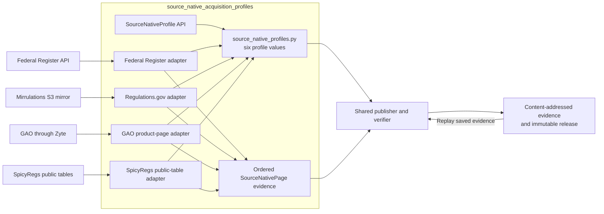
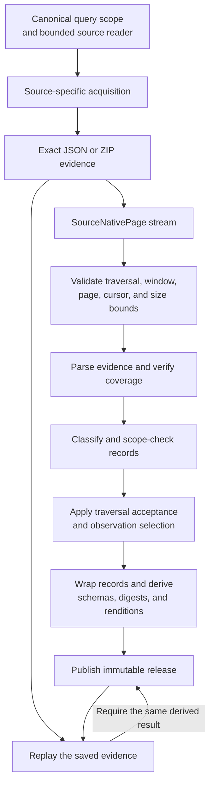

> Generated reference snapshot; see [current architecture](../docs/architecture.md),
> [operator commands](../docs/cli.md), and [reference maintenance](../docs/documentation.md).

# Source-native acquisition profiles

## Purpose

The `source_native_acquisition_profiles` module defines how SpicyDocs acquires, preserves, and interprets evidence from each supported source. It combines a shared `SourceNativeProfile` API with adapters for the Federal Register, Regulations.gov, GAO product pages, and SpicyRegs public tables.

Each adapter:

- Validates a closed query scope.
- Acquires bounded source evidence.
- Preserves the exact response bytes.
- Proves page, partition, or object coverage.
- Classifies source-shaped records without flattening them.
- Defines record identity, version selection, schemas, digests, and renditions.

The adapters produce ordered `SourceNativePage` values. The shared release engine stores their evidence, derives immutable release records, and verifies the result by replaying the same profile callbacks against the saved bytes.

## Architecture

The registry creates six profiles because the Regulations.gov adapter exposes separate document, docket, and comment profiles.

### Source acquisition models

| Source | Evidence and coverage model | State claim |
| --- | --- | --- |
| Federal Register | Exact JSON API pages, bounded date windows, recursive result-cap splitting, pagination checks, and matching consecutive crawls | `observed-crawl` |
| Regulations.gov | Complete ordered Mirrulations object enumeration packaged into deterministic ZIP files; separate document, docket, and comment profiles | `complete-snapshot` |
| GAO product pages | One validated HTML page and deterministic evidence ZIP for every explicitly requested product ID | `complete-snapshot` of the requested ID set |
| SpicyRegs public tables | Complete contiguous Parquet partition discovery for each requested agency, with each partition sealed into deterministic ZIP evidence | `complete-snapshot` |

### Publication and verification flow

Source adapters own acquisition meaning and source validation. The shared release lifecycle owns blob storage, record partitioning, artifact construction, admission, and independent replay.

## Core component documentation

- [Source-native profile API](source_native_profile_api.md) — `SourceNativePage`, `SourceNativeProfile`, callback interfaces, coverage checks, traversal acceptance, and profile composition.
- [Federal Register source-native acquisition](federal_register_source_native.md) — paginated date-window acquisition, result-cap splitting, reconciliation crawls, document selection, and renditions.
- [Regulations.gov source-native acquisition](regulations_gov_source_native.md) — complete Mirrulations enumeration, deterministic object packs, and separate document, docket, and comment profiles.
- [GAO product-page source native](gao_product_page_source_native.md) — explicit product scopes, Zyte transport, HTML identity checks, deterministic evidence ZIPs, and literal publisher topics.
- [SpicyRegs public-table source-native acquisition](spicy_regs_public_table_source_native.md) — Parquet partition discovery, faithful logical-row reconstruction, attachment renditions, and exact agency coverage.