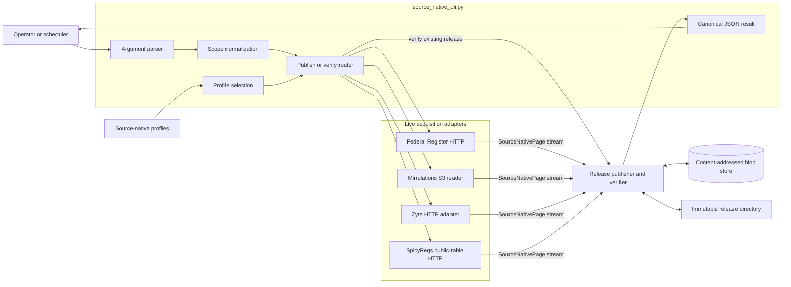
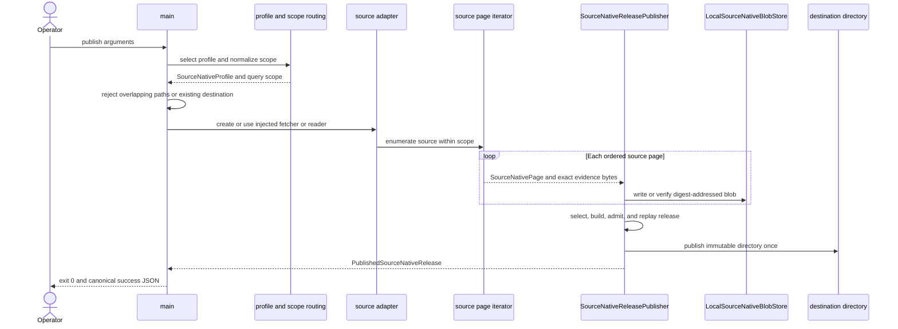
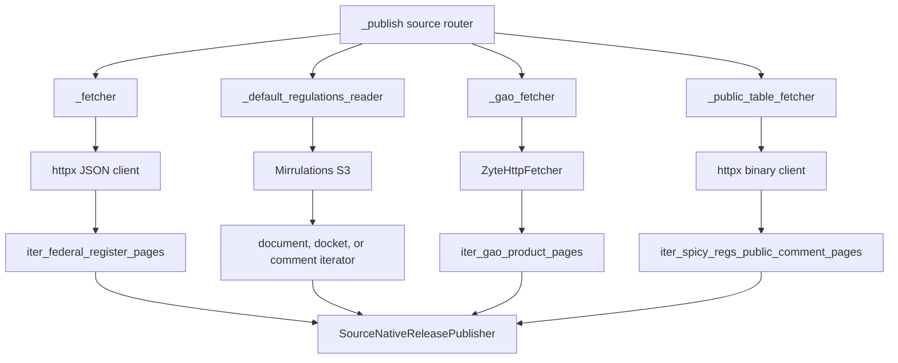
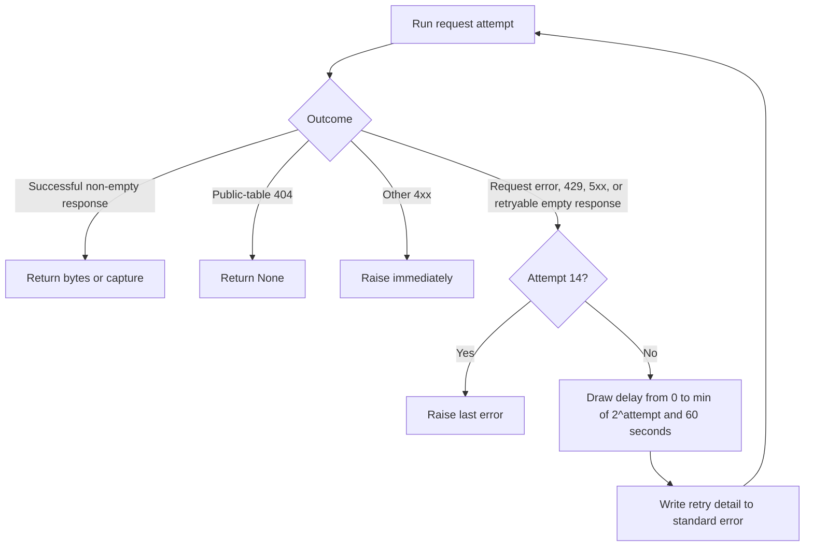
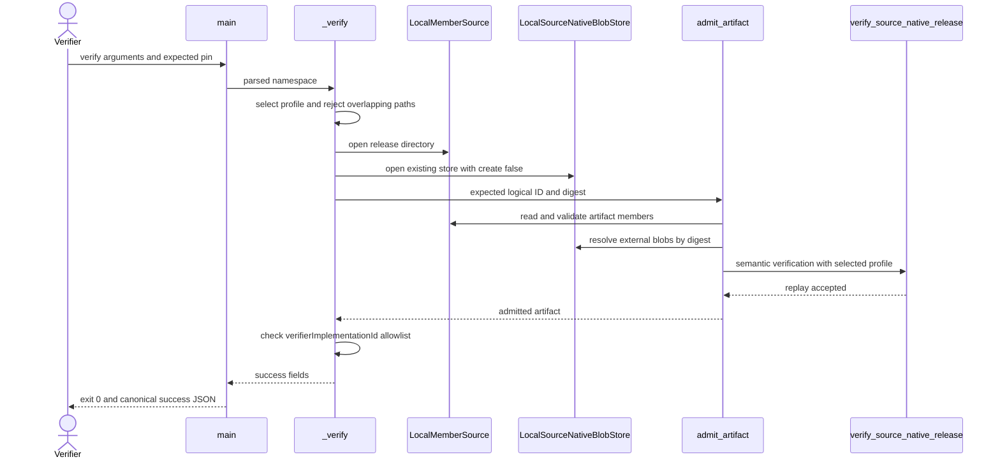

# Source-native operator CLI

The source-native operator command is the supported shell boundary for publishing or independently verifying one SpicyRegs source-native release. It validates operator input, selects one source profile and acquisition adapter, delegates release construction or replay to the shared engine, and emits one canonical JSON result.

The implementation lives in [`source_native_cli.py`](../src/spicy_docs/source_native_cli.py). The installed command is `spicy-docs-source-native`; `python -m spicy_docs.source_native_cli` reaches the same `main()` function. The CLI does not define source meaning, release layout, or storage rules. Those responsibilities belong to the linked source modules, the [source-native release engine](source_native_release_engine.md), and [source-native storage and publication](source_native_storage_and_publication.md).

## Purpose and system role

| Question | Answer |
| --- | --- |
| What goes in? | A `publish` or `verify` command, one supported source name, source-specific scope arguments, distinct release and blob-store paths, and producer or verifier identity values. Publication also receives live source data through HTTP, Zyte, or Mirrulations S3. |
| What happens? | The CLI parses and normalizes the scope, selects a `SourceNativeProfile`, creates the appropriate live adapter, and calls the shared publisher or verifier. |
| What comes out? | One canonical JSON object on standard output after success, or one structured JSON error on standard error for handled operational failures. Publication also creates an immutable release directory and content-addressed blobs. |
| How do we check it? | The publish path verifies the staged release before it becomes visible. The verify path checks an expected artifact pin, replays saved evidence through the selected profile, and checks the recorded verifier implementation against an operator allowlist. |

The CLI is deliberately thin. Source adapters decide how to enumerate, parse, and validate source evidence. The release engine decides how to select observations, compute digests, write members, and replay a release. This module owns operator-facing argument rules, live transport setup, top-level routing, error classification, and machine-readable results.

## Architecture



Publication is the only path that contacts a live source. Verification reads the release directory and external blobs, then replays the preserved evidence without reacquiring it. Both paths select the profile from `--source`, so a verifier must name the same source family that produced the release.

The CLI supports four acquisition families. It does not expose the CourtListener bulk connector because no CourtListener source-native profile or release route appears in this command. See [connector ingestion and record projection](connector_ingestion_and_record_projection.md) for that separate connector layer.

## Supported sources and query scopes

`_query_scope()` converts command arguments into the canonical mapping passed to the profile and sealed into the release. Date windows are inclusive source fields; each source module owns their semantic validation.

| `--source` | Required scope arguments | Rejected scope arguments | Canonical scope fields | Acquisition documentation |
| --- | --- | --- | --- | --- |
| `federal-register` | `--since`, `--until` | `--agency`, `--product-id` | `publishedFrom`, `publishedThrough` | [Federal Register source-native](federal_register_source_native.md) |
| `regulations-documents` | `--since`, `--until`, one or more `--agency` | `--product-id` | sorted unique `agencies`, `publishedFrom`, `publishedThrough` | [Regulations.gov source-native](regulations_gov_source_native.md) |
| `regulations-dockets` | `--since`, `--until`, one or more `--agency` | `--product-id` | sorted unique `agencies`, `modifiedFrom`, `modifiedThrough` | [Regulations.gov source-native](regulations_gov_source_native.md) |
| `regulations-comments` | `--since`, `--until`, one or more `--agency` | `--product-id` | sorted unique `agencies`, `postedFrom`, `postedThrough` | [Regulations.gov source-native](regulations_gov_source_native.md) |
| `gao-product-pages` | One or more `--product-id` | `--since`, `--until`, `--agency` | sorted distinct `productIds` | [GAO product-page source-native](gao_product_page_source_native.md) |
| `spicy-regs-public-comments` | One or more `--agency` | `--since`, `--until`, `--product-id` | sorted unique `agencies`, `table: comments` | [SpicyRegs public-table source-native](spicy_regs_public_table_source_native.md) |

Repeated agency values collapse to a sorted set. Repeated GAO product IDs fail before acquisition because that scope must name a distinct, closed list. `_date()` accepts only the canonical `YYYY-MM-DD` spelling; malformed dates fail during argument parsing.

The public comment table is the preferred supply rung for data it can carry. The three Regulations.gov routes use the Mirrulations community mirror for origin-shaped documents, dockets, and comments. The [Regulations.gov source-native documentation](regulations_gov_source_native.md) explains their scope and source-record rules; the [Mirrulations connector](mirrulations_connector.md) explains S3 discovery and download behavior.

## Command interface

### Publish

```text
spicy-docs-source-native publish \
  --source SOURCE \
  [--since YYYY-MM-DD --until YYYY-MM-DD] \
  [--agency CODE ...] \
  [--product-id ID ...] \
  --destination NEW_RELEASE_DIRECTORY \
  --blob-store PERSISTENT_BLOB_DIRECTORY \
  --implementation-id IMPLEMENTATION_ID
```

`--implementation-id` identifies the producer implementation. The CLI records the same value as `verifierImplementationId` because publication includes producer-side verification. Use a durable value that identifies the exact build, such as a repository URL plus commit digest.

The destination must be new. The CLI refuses an existing file, directory, or symbolic link before it acquires source data. The blob store may already exist and should persist independently of any one release.

Example Federal Register release:

```sh
spicy-docs-source-native publish \
  --source federal-register \
  --since 2026-08-01 \
  --until 2026-08-31 \
  --destination /releases/federal-register-2026-08 \
  --blob-store /var/lib/spicy-docs/source-native-blobs \
  --implementation-id 'git+https://github.com/civictechdc/spicy-docs@<commit>'
```

Example public-table release for two agencies:

```sh
spicy-docs-source-native publish \
  --source spicy-regs-public-comments \
  --agency EPA \
  --agency DOT \
  --destination /releases/public-comments-epa-dot \
  --blob-store /var/lib/spicy-docs/source-native-blobs \
  --implementation-id 'git+https://github.com/civictechdc/spicy-docs@<commit>'
```

GAO publication requires `ZYTE_TOKEN` in the process environment when the production fetcher is used. The token stays in the transport adapter and must never appear in a command argument, locator, artifact, or log.

### Verify

```text
spicy-docs-source-native verify \
  --source SOURCE \
  --release RELEASE_DIRECTORY \
  --blob-store PERSISTENT_BLOB_DIRECTORY \
  --logical-id LOGICAL_ID \
  --artifact-digest ARTIFACT_DIGEST \
  --accepted-verifier-implementation-id IMPLEMENTATION_ID \
  [--accepted-verifier-implementation-id IMPLEMENTATION_ID ...]
```

Use the `logicalId` and `artifactDigest` returned by publication as the expected pin. Repeat `--accepted-verifier-implementation-id` to create an allowlist during a controlled implementation transition.

```sh
spicy-docs-source-native verify \
  --source federal-register \
  --release /releases/federal-register-2026-08 \
  --blob-store /var/lib/spicy-docs/source-native-blobs \
  --logical-id 'urn:spicy:artifact:spicyregs-source-native-release:<id>' \
  --artifact-digest 'sha256:<digest>' \
  --accepted-verifier-implementation-id \
    'git+https://github.com/civictechdc/spicy-docs@<commit>'
```

## Publication process



`_publish()` performs these steps:

1. `_profile()` selects the registered `SourceNativeProfile` for `--source`.
2. `_query_scope()` checks source-specific options and creates the canonical scope.
3. `_require_separate_paths()` rejects equal, parent, or child relationships between the destination and blob store. The destination-exists check then protects immutable publication before any source request.
4. `_instant()` records a timezone-aware, UTC, whole-second start time. The command builds a `Producer` and `SourceNativeReleaseBuild` from the scope, time, and implementation ID.
5. The source branch creates an injected or production adapter and yields the matching page iterator.
6. `SourceNativeReleasePublisher.publish()` stores evidence and payload blobs, constructs the release, verifies it, and publishes the directory once.
7. `_success()` extracts the artifact pin and source-state fields for the operator result.

The [source-native release engine](source_native_release_engine.md) documents selection, partitioning, digests, admission, and replay. The [storage and publication module](source_native_storage_and_publication.md) documents content-addressed writes and publish-once behavior.

## Acquisition adapters



| Route | Production adapter behavior |
| --- | --- |
| Federal Register | `_fetcher()` opens one redirect-following `httpx.Client` with `Accept: application/json`, the SpicyDocs user agent, a 30-second connect timeout, and a 60-second general timeout. `_fetch_with_retries()` returns non-empty response bytes. |
| Regulations.gov documents, dockets, and comments | `_default_regulations_reader()` maps the collection to `DOCUMENT`, `DOCKET`, or `COMMENT`, then creates a fail-fast `MirrulationsReader`. It does not use a processed-key filter or a coarse `since_year` filter; the source-native iterator enforces the canonical scope. |
| GAO product pages | `_gao_fetcher()` builds `ZyteHttpFetcher` from the environment and applies the GAO module's timeout and maximum-page-byte settings to every request. |
| SpicyRegs public comments | `_public_table_fetcher()` opens one redirect-following `httpx.Client` with `Accept: application/octet-stream`, the SpicyDocs user agent, a 30-second connect timeout, and a 120-second general timeout. A `404` means that the numbered partition is absent. A successful response becomes `PublicTableCapture` with exact bytes, fetch time, ETag, and Last-Modified metadata. |

The source modules own page construction and completeness checks. The CLI never converts live response data directly into release rows.

## HTTP retry process

Federal Register and public-table HTTP requests share `_retry_http()`. GAO and Mirrulations use their own adapters and do not pass through this helper.



The policy allows 14 attempts and 13 sleeps. The deterministic delay ceilings are 2, 4, 8, 16, 32, and then 60 seconds for each remaining retry. Full jitter draws a random delay from zero through the current ceiling, so simultaneous workers do not retry in lockstep. The maximum total sleep is 542 seconds.

The helper retries these outcomes:

- `httpx.RequestError`, including connection and timeout failures;
- HTTP `429` and every `5xx`, represented by `_RetryableHTTPStatusError`;
- an empty Federal Register response; and
- an empty or oversized public-table partition.

A non-`429` `4xx` fails on the first attempt, except for public-table `404`, which is the iterator's missing-partition signal. Every scheduled retry writes its attempt number, chosen delay, ceiling, exception type, and message to `sys.stderr`.

## Independent verification process



`_verify()` is local and read-only:

1. It selects the source profile and rejects overlapping release and blob-store paths.
2. It creates the expected `ArtifactPin` from `--logical-id` and `--artifact-digest`.
3. It opens the release as `LocalMemberSource` and the existing blob store with `create=False`.
4. `admit_artifact()` checks the expected pin and calls `verify_source_native_release()` as its semantic verifier. Full verification replays the saved source evidence through the selected profile.
5. After successful admission, the CLI requires the artifact's `producer.verifierImplementationId` to appear in the supplied allowlist.

Verification therefore proves both content identity and acceptable verifier provenance. A valid release fails this command when the operator supplies the wrong source profile, expected pin, blob store, or implementation allowlist.

## Results, errors, and exit status

### Success object

`_emit()` uses `rulespec_artifacts.canonical_json_bytes()` and appends one newline. Both commands return the same field set on standard output:

```json
{"artifactDigest":"sha256:<digest>","command":"publish","logicalId":"urn:spicy:artifact:spicyregs-source-native-release:<id>","ok":true,"release":"/absolute/path/to/release","source":"federal-register","sourceNativeSchemaSetDigest":"sha256:<digest>","sourceStateDigest":"sha256:<digest>","sourceStateScope":"<scope>","sourceSystemId":"<source-id>","sourceSystemVersion":"<version>"}
```

| Field | Meaning |
| --- | --- |
| `command` | `publish` or `verify`. |
| `source` | The selected CLI source name. |
| `release` | The resolved absolute release-directory path. |
| `logicalId`, `artifactDigest` | The admitted artifact pin required for later verification. |
| `sourceNativeSchemaSetDigest` | Digest of the source-native schemas declared by the release. |
| `sourceStateDigest` | Digest of the selected source state. |
| `sourceStateScope` | The completeness statement made by that source profile. |
| `sourceSystemId`, `sourceSystemVersion` | The stable source identity recorded in the release. |

### Handled error object

Handled failures return exit status `1`, write no success object, and emit this shape on standard error:

```json
{"command":"publish","error":{"code":"release-invalid","message":"<specific reason>"},"ok":false}
```

| Error code | Exception classes and practical meaning |
| --- | --- |
| `destination-exists` | `FileExistsError` or `ImmutablePublicationError`; publication refused to replace an existing destination or lost a publish-once race. |
| `acquisition-failed` | A source-specific Federal Register, GAO, Regulations.gov, or public-table error; the source evidence could not support a release. |
| `release-invalid` | `SourceNativeReleaseError`; scope, path separation, artifact structure, replay, or verifier acceptance failed. |
| `transport-failed` | `httpx.HTTPError` or `ZyteTransportError`; a live transport request failed or exhausted its retry budget. |
| `operation-failed` | A caught `OSError`, `ValueError`, or other caught exception not assigned above. |

Argument-parser failures differ from operational failures. `_parser().parse_args()` runs before the structured error handler, so a missing required flag, unknown option, invalid choice, or malformed `_date` produces argparse's human-readable standard-error message and exit status `2`. `KeyboardInterrupt`, `SystemExit` outside normal argparse handling, and unexpected programming errors are not converted into the JSON error shape.

Retry progress also writes directly to `sys.stderr`; a command that retries before succeeding or failing may therefore produce human-readable retry lines in addition to the final JSON result. Automation should use standard output for success and treat the last structured JSON line on standard error as the handled failure record.

## Component map

| Responsibility | Components | Implementation detail |
| --- | --- | --- |
| Argument parsing | `_date`, `_parser` | Defines the two subcommands, common source choices, repeatable selectors, strict date spelling, and required artifact identity values. |
| Source and profile routing | `_profile`, `_query_scope`, `_regulations_pages` | Maps a source name to one profile, one canonical scope shape, and the matching Regulations.gov iterator when needed. |
| Time | `_now`, `_instant` | Supplies UTC time and rejects an injected clock that returns a naive datetime. Serialized instants omit microseconds and use the `Z` UTC suffix. |
| Shared retry policy | `_RetryableHTTPStatusError`, `_retry_http` | Separates retryable status responses from terminal `4xx` responses and applies capped exponential backoff with full jitter. |
| Federal Register HTTP | `_fetch_with_retries`, `_fetcher` | Owns the JSON client lifetime, status classification, non-empty-response check, and injectable fetch seam. |
| Public-table HTTP | `_fetch_public_table`, `_public_table_fetcher` | Owns binary fetches, missing-partition handling, capture byte bounds, response metadata, retries, and injectable fetch seam. |
| GAO HTTP | `_gao_fetcher` | Chooses an injected fetch function or the environment-backed, bounded Zyte adapter. |
| Regulations.gov mirror | `_default_regulations_reader` | Maps logical collection names to schema record types and constructs the production Mirrulations reader. |
| Publication | `_publish` | Enforces preconditions, records producer identity, chooses acquisition, and delegates to `SourceNativeReleasePublisher`. |
| Verification | `_verify` | Checks the expected pin, opens existing members and blobs, runs full replay, and enforces the verifier implementation allowlist. |
| Paths and output | `_require_separate_paths`, `_success`, `_emit`, `_error_code` | Protects independent storage roots and presents stable machine-readable success and error records. |
| Top-level execution | `main` | Supports normal command-line streams and injected test adapters, returns `0` or `1` for handled execution, and leaves argparse to return `2`. |

## Dependency graph

```mermaid
flowchart TB
    Stdlib["Python standard library"]
    Httpx["httpx"]
    Rulespec["rulespec_artifacts"]
    Profiles["source_native_profiles"]
    ProfileAPI["source_native_profile"]
    Federal["federal_register_source_native"]
    Regulations["regulations_gov_source_native"]
    GAO["gao_product_pages_source_native"]
    PublicTables["spicy_regs_public_tables_source_native"]
    Mirrulations["sources.mirrulations"]
    Zyte["sources.zyte"]
    Engine["source_native"]
    Publication["publication"]
    Store["source_native_store"]
    CLI["source_native_cli"]
    Shell["spicy-docs-source-native"]

    Stdlib --> CLI
    Httpx --> CLI
    Rulespec --> CLI
    Profiles --> CLI
    ProfileAPI --> CLI
    Federal --> CLI
    Regulations --> CLI
    GAO --> CLI
    PublicTables --> CLI
    Mirrulations --> CLI
    Zyte --> CLI
    Engine --> CLI
    Publication --> CLI
    Store --> CLI
    CLI --> Shell
```



The most important dependencies are:

- [`source_native_profiles.py`](../src/spicy_docs/source_native_profiles.py) supplies the six configured profiles; the [acquisition-profile overview](source_native_acquisition_profiles.md) describes their composition.
- [`source_native_profile.py`](../src/spicy_docs/source_native_profile.py) supplies `SourceNativeProfile` and `SourceNativePage`; the [profile API](source_native_profile_api.md) documents those extension points.
- [`source_native.py`](../src/spicy_docs/source_native.py) supplies build, publish, and replay verification services; see the [release engine](source_native_release_engine.md).
- [`source_native_store.py`](../src/spicy_docs/source_native_store.py) supplies the local content-addressed blob store; see [storage and publication](source_native_storage_and_publication.md).
- `rulespec_artifacts` supplies producer and artifact-pin types, admission, local member access, and canonical JSON encoding.
- `httpx` supplies the Federal Register and public-table clients. The GAO path uses [`sources/zyte.py`](../src/spicy_docs/sources/zyte.py), and the Regulations.gov paths use [`sources/mirrulations.py`](../src/spicy_docs/sources/mirrulations.py).

## Testing and dependency injection

`main()` accepts production-independent adapters for every external edge:

| Parameter | Test or embedding use |
| --- | --- |
| `fetch` | Supplies Federal Register response bytes without HTTP. |
| `fetch_gao` | Supplies bounded `ZyteHttpResponse` values without Zyte or credentials. |
| `fetch_public_table` | Supplies `PublicTableCapture` values or `None` without HTTP. |
| `read_regulations` | Supplies a Mirrulations-compatible reader without S3. |
| `clock` | Makes build and capture times deterministic and tests timezone rejection. |
| `stdout`, `stderr` | Captures final JSON results. Retry progress remains on process-level `sys.stderr`. |

The focused test suites prove command routing, machine output, immutable destination refusal, path separation, profile mismatch rejection, GAO scope checks, public-table routing, Regulations.gov comment routing, and the complete retry classification. Run them from the repository root:

```sh
uv run pytest -q \
  tests/test_source_native_cli.py \
  tests/test_source_native_cli_retry.py \
  tests/test_gao_source_native_cli.py \
  tests/test_regulations_gov_comments_source_native.py \
  tests/test_spicy_regs_public_tables_source_native.py
```

Run the repository checks before merging a CLI change:

```sh
uv run pytest -q
uv run ruff check .
uv run ruff format --check .
```

## Contribution guidance

Preserve these rules when changing the command:

- Validate scope and path safety before creating clients, reading S3, or issuing HTTP requests.
- Keep the release directory and blob store disjoint. They may not be equal or contain one another.
- Refuse an existing destination; never add an overwrite option to immutable publication.
- Use the same selected profile for publication and independent verification.
- Keep credentials inside transport adapters and out of arguments, locators, errors, and artifacts.
- Preserve canonical one-line JSON and the existing error-code meanings because schedulers may parse them.
- Keep deterministic parsing and replay in the source modules. The CLI should create transports and route data, not interpret records.
- Add an injected adapter for every new external dependency so unit tests stay hermetic.

To add a source to this CLI:

1. Implement and test its page iterator and `SourceNativeProfile` callbacks under the [profile API](source_native_profile_api.md).
2. Register the profile in `source_native_profiles.py` and document it in the appropriate acquisition-module page.
3. Add a source constant, `SOURCE_CHOICES` entry, `_profile()` branch, canonical `_query_scope()` branch, and `_publish()` route. Add the source to `DATED_SOURCES` only when both dates define its CLI scope.
4. Isolate live I/O in a context-managed fetcher or reader and expose an injection parameter through `main()`.
5. Add the source-specific error to `_error_code()` and the handled exception list when the command should return structured failure JSON.
6. Test valid publication and verification, every incompatible option, acquisition failure without a partial release, path preconditions before I/O, and source-profile mismatch.

Review changes to retry counts, timeout values, byte bounds, query-field names, output fields, or error codes as operator-interface changes. Review changes to source identity, evidence parsing, completeness, or record selection in the owning source module and profile documentation rather than hiding them in this outer command.

## Related documentation

- [Source-native acquisition profiles](source_native_acquisition_profiles.md): registry-level view of all profiles and source-specific rules.
- [Source-native profile API](source_native_profile_api.md): callback and page interfaces implemented by acquisition modules.
- [Source-native release engine](source_native_release_engine.md): immutable build, selection, digest, admission, and replay behavior.
- [Source-native storage and publication](source_native_storage_and_publication.md): blob-store and publish-once mechanics.
- [Federal Register source-native](federal_register_source_native.md): dated API enumeration and Federal Register record rules.
- [Regulations.gov source-native](regulations_gov_source_native.md): Mirrulations-backed documents, dockets, and comments.
- [GAO product-page source-native](gao_product_page_source_native.md): closed product-ID capture through Zyte.
- [SpicyRegs public-table source-native](spicy_regs_public_table_source_native.md): complete agency-partition capture for public comment tables.
- [Mirrulations connector](mirrulations_connector.md): S3 listing, download, and reader mechanics used by the Regulations.gov routes.
