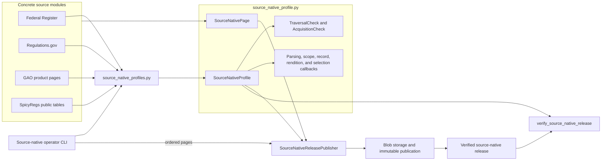
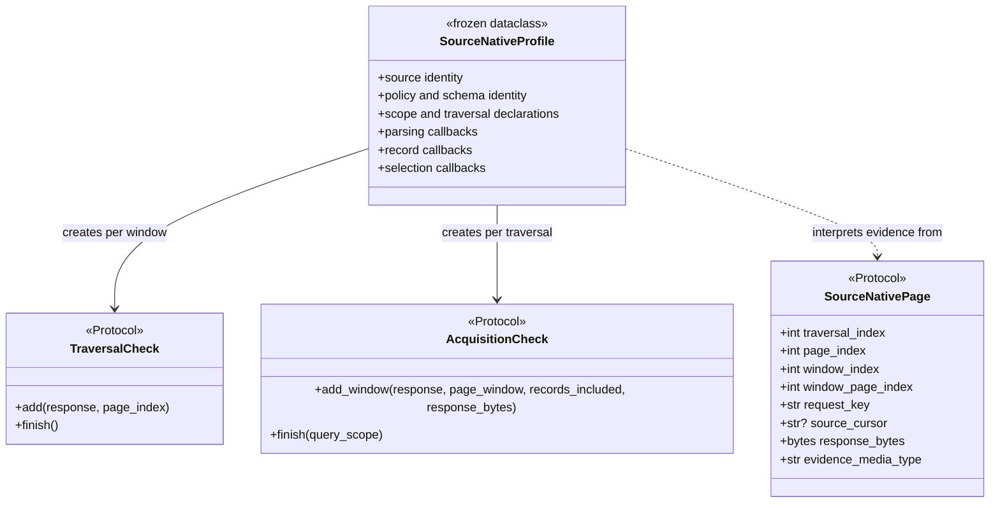
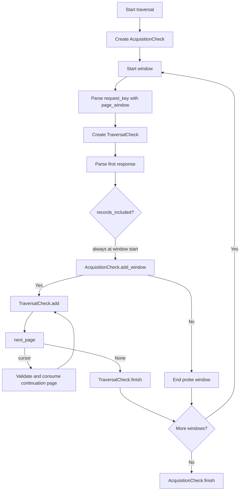
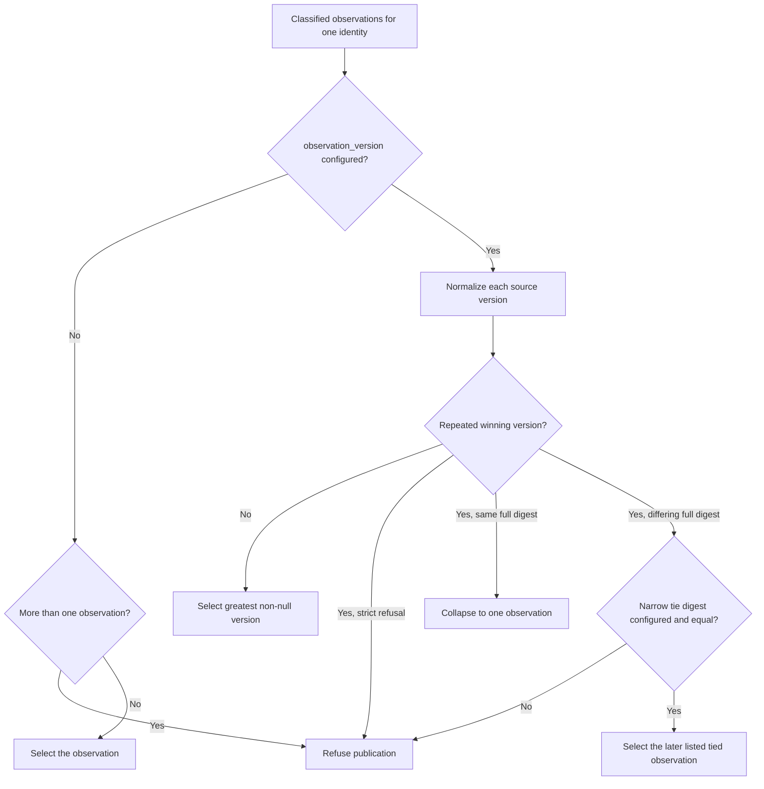
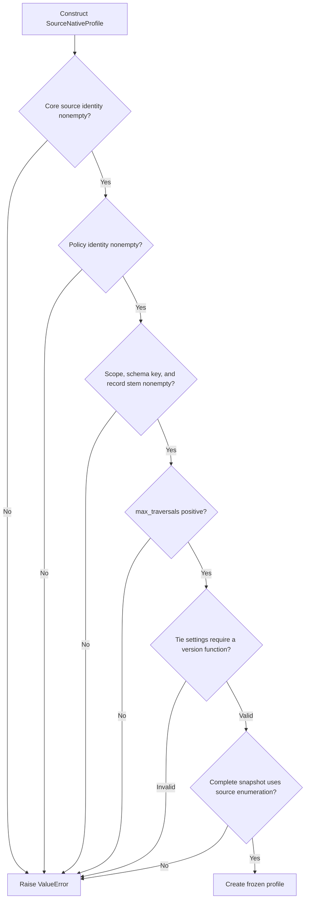
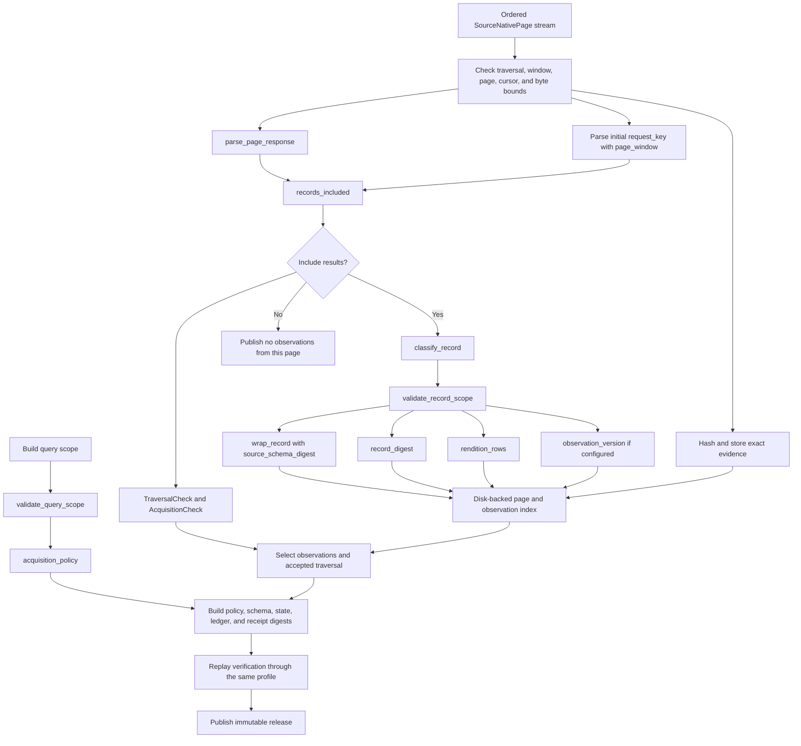
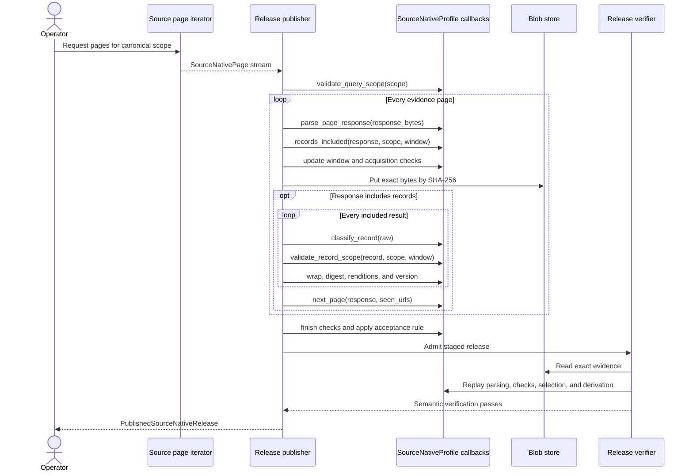

# Source-native profile API

The source-native profile API is the source-specific plug-in point for one shared release publisher. A `SourceNativeProfile` identifies a source and supplies the functions that parse preserved evidence, prove acquisition coverage, classify records, enforce scope, select observations, and derive published rows. `SourceNativePage` describes the exact evidence pages that a source iterator gives the publisher.

The API contains no network client, source schema implementation, or publication code. Concrete source modules acquire bytes and implement the callbacks; the release engine applies those callbacks during both publication and independent verification. This separation lets every source keep its own meaning without duplicating artifact storage, partitioning, admission, or replay logic.

## Purpose and system role

| Question | Answer |
| --- | --- |
| What goes in? | A source-specific `SourceNativeProfile`, a canonical query scope, and an ordered iterable of objects that satisfy `SourceNativePage`. |
| What happens? | The release engine validates page structure, parses exact evidence bytes, checks page and acquisition coverage, classifies in-scope records, selects one observation per source identity, and derives wrapped records and rendition rows. |
| What comes out? | Source-native release records, rendition rows, acquisition ledgers, page inventories, evidence references, schemas, digests, and a publication receipt. This module itself returns none of those artifacts; it defines the source behavior used to build them. |
| How do we check it? | Profile construction rejects incompatible declarations. The release engine checks callback results while publishing, then replays the preserved evidence through the same profile and compares the derived release content. |

This module answers one design question: **which facts and rules belong to a source?** The [source-native release engine](source_native_release_engine.md) answers how those rules become an immutable, verified release. The source adapters implement the rules; see [Federal Register source native](federal_register_source_native.md), [Regulations.gov source native](regulations_gov_source_native.md), [GAO product page source native](gao_product_page_source_native.md), and [SpicyRegs public table source native](spicy_regs_public_table_source_native.md).

## Architecture



The source module owns acquisition and interpretation. The profile registry composes those functions into immutable profile values. The operator chooses a profile and produces pages. The release engine owns the shared mechanics and refuses publication when the supplied source rules cannot prove the release.

### Direct dependencies and consumers

[`source_native_profile.py`](../src/spicy_docs/source_native_profile.py) uses only Python's standard-library `collections.abc`, `dataclasses`, and `typing` modules. It imports no source adapter and no release implementation.

| Relationship | Components | Meaning |
| --- | --- | --- |
| Defined here | `SourceNativePage`, seven callable or stateful protocols, and `SourceNativeProfile` | Small structural interfaces and one profile value carry source behavior into generic code. |
| Composed by | [`source_native_profiles.py`](../src/spicy_docs/source_native_profiles.py) | The registry wires concrete source functions into named profile values. |
| Consumed by | [`source_native.py`](../src/spicy_docs/source_native.py) | The publisher and verifier execute the callbacks and use the profile metadata in release artifacts. |
| Selected by | [`source_native_cli.py`](../src/spicy_docs/source_native_cli.py) | The command-line interface maps a source name to a profile and the matching page iterator. |
| Implemented by | Federal Register, Regulations.gov, GAO, and public-table source modules | Each module supplies page classes, checks, parsers, classifiers, schema functions, and source-specific errors. |

Keep this dependency direction one-way. The API may describe source behavior, but it must not import a concrete source, transport library, storage backend, or release format implementation.

### Component relationships

Python `Protocol` classes use structural typing: an implementation satisfies a protocol by exposing the required properties or methods. It does not need to inherit from that protocol.



The protocols are not decorated with `runtime_checkable`. Static type checkers can verify implementations, but `isinstance(value, SourceNativePage)` is not a supported runtime test. The publisher checks the specific values and relationships it needs as it consumes the page stream.

## `SourceNativePage`: preserved acquisition evidence

[`SourceNativePage`](../src/spicy_docs/source_native_profile.py#L10-L33) defines the input item accepted by `SourceNativeReleasePublisher.publish()`. Concrete source modules normally implement it as a frozen dataclass.

| Property | Required meaning |
| --- | --- |
| `traversal_index` | Zero-based acquisition pass. Repeated passes support reconciliation when a source cannot provide an authoritative enumeration. |
| `page_index` | Zero-based page position within the traversal. It increases across all windows in that traversal. |
| `window_index` | Zero-based logical acquisition window within the traversal. A window may be a date interval, source object pack, product ID, or table partition. |
| `window_page_index` | Zero-based page position inside the current window. A value of `0` starts a window. |
| `request_key` | Exact request URL or canonical synthetic locator represented by the evidence bytes. On a continuation page, it must equal `source_cursor`. |
| `source_cursor` | Cursor returned by the previous page, or `None` at a window boundary. |
| `response_bytes` | Exact preserved evidence that `parse_page_response` will interpret. |
| `evidence_media_type` | Media type for the preserved bytes. The current release engine accepts `application/json` and `application/zip`. |

The protocol declares property types but no constructor or validation rules. The source page class should reject negative indexes, empty request keys, empty evidence, and source-specific cursor contradictions before yielding a page. The publisher adds these cross-page rules:

- The first page starts at traversal `0`, page `0`, window `0`, and window page `0`.
- Page indexes stay contiguous within each traversal.
- A new window starts only after the prior window has no next cursor.
- Continuation pages stay in the same window, increment `window_page_index`, and use the prior callback result as both `source_cursor` and `request_key`.
- A new traversal starts at page `0`, window `0`, and window page `0` only after the previous traversal terminates.
- Every page stays below `max_traversals` and the release engine's evidence-byte bound.

These rules make the acquisition sequence replayable without access to live source state.

## Stateful validation protocols

Two stateful protocols validate different levels of the page hierarchy. Their names are similar, but their lifetimes differ.

### `TraversalCheck`: one window's page inventory

[`TraversalCheck`](../src/spicy_docs/source_native_profile.py#L36-L39) is created by `profile.traversal_check()` at the start of every window.

```python
def add(response: Mapping[str, Any], *, page_index: int) -> None: ...
def finish() -> None: ...
```

The publisher calls `add` for each record-bearing page and passes `window_page_index`, not the traversal-wide `page_index`. It calls `finish` when `next_page` returns `None`. A check normally reconciles source-declared counts, page counts, page order, and any per-window inventory.

A page for which `records_included` returns `False` is a terminal decision or probe page. The publisher does not add its results to `TraversalCheck`; the wider `AcquisitionCheck` must account for that evidence.

### `AcquisitionCheck`: all windows in one traversal

[`AcquisitionCheck`](../src/spicy_docs/source_native_profile.py#L80-L90) is created once for each traversal.

```python
def add_window(
    response: Mapping[str, Any],
    *,
    page_window: object | None,
    records_included: bool,
    response_bytes: bytes,
) -> None: ...

def finish(*, query_scope: Mapping[str, Any]) -> None: ...
```

The publisher calls `add_window` once, on the first page of each window. The check receives the parsed response, the value derived from the initial `request_key`, the record-disposition decision, and the exact bytes. At traversal end, `finish` proves that the windows collectively match the canonical query scope.

Typical acquisition-wide proofs include exact agency coverage, contiguous source object packs, an ordered partition list, one terminal item per agency, or a complete date-window split tree. Source-specific proof rules belong in the concrete source documentation rather than this API reference.

### Lifecycle



## Callable protocols

The remaining named protocols document callback signatures. The profile also contains plain `Callable` fields where a separate protocol would add little information.

| API | Input | Output and responsibility |
| --- | --- | --- |
| [`NextPage`](../src/spicy_docs/source_native_profile.py#L42-L48) | Parsed response and the mutable set of request URLs already seen in the window | Return the next trusted cursor or `None`. A paginated source should validate the locator, refuse cycles, and add each returned locator to `seen_urls`. |
| [`WrapRecord`](../src/spicy_docs/source_native_profile.py#L51-L57) | Classified source record and the source schema digest | Return the published source-native wrapper. The release engine requires a nonempty text `sourceRecordId`. |
| [`ValidateRecordScope`](../src/spicy_docs/source_native_profile.py#L60-L67) | Classified record, canonical query scope, and parsed window | Return `None` or raise when the record falls outside the requested source slice. |
| [`RecordsIncluded`](../src/spicy_docs/source_native_profile.py#L70-L77) | Parsed response, canonical query scope, and parsed window | Return a real `bool` stating whether `response["results"]` participates in record processing. The publisher rejects non-Boolean values. |
| [`ObservationVersion`](../src/spicy_docs/source_native_profile.py#L93-L96) | Classified record | Return a canonical, sortable, nonempty source version string or `None`. The release engine uses it only to select one observation per identity. |

`NextPage`, `WrapRecord`, and `ValidateRecordScope` remain available for explicit imports, but they are absent from the module's `__all__`. Star imports export only `AcquisitionCheck`, `ObservationVersion`, `RecordsIncluded`, `SourceNativePage`, `SourceNativeProfile`, and `TraversalCheck`.

## `SourceNativeProfile` reference

[`SourceNativeProfile`](../src/spicy_docs/source_native_profile.py#L99-L158) is a frozen, slotted dataclass. It binds stable source declarations to executable source behavior.

### Identity, schema, and policy fields

| Field | Purpose | Release-engine use |
| --- | --- | --- |
| `name` | Human-readable source name used in diagnostic messages. | Error context only. |
| `source_system_id` | Stable identifier for the external or published source. | Scope row, artifact specification, receipt, and admission checks. |
| `source_system_version` | Version of the source interface or source definition. | Artifact specification and admission checks. |
| `acquisition_policy_id` | Stable identifier for the acquisition procedure. | Artifact specification and admission checks. |
| `acquisition_policy_version` | Version of that procedure. | Artifact specification and admission checks. |
| `scope_id` | Identifier for the source collection scope. | Published scope row and replay checks. |
| `source_schema_key` | Release-relative object key for the installed source JSON Schema. | Manifest membership, schema storage, and verification. |
| `source_schema` | Source JSON Schema mapping written into the release. | Stored as canonical JSON and compared during admission. |
| `record_stem` | Nonempty source record naming stem reserved by the profile definition. | The current release engine does not read this field; treat it as declared profile metadata, not as a generated path guarantee. |

Changing an identifier or version changes the meaning a verifier assigns to a release. Treat those fields as durable public identifiers, not display configuration.

### Source-state and traversal fields

| Field | Allowed values | Meaning |
| --- | --- | --- |
| `max_traversals` | Positive integer | Hard upper bound on acquisition passes. Both publication and replay enforce it. |
| `source_state_scope` | `complete-snapshot` or `observed-crawl` | Claim attached to the released state. A complete snapshot says the source supplied an authoritative enumeration for the bounded scope; an observed crawl says the evidence proves only the accepted crawl. |
| `traversal_acceptance` | `single-observed-traversal`, `source-enumeration`, or `stable-consecutive-traversals` | Rule that selects the accepted traversal. |

Acceptance behavior is exact:

| Acceptance rule | Runtime rule |
| --- | --- |
| `single-observed-traversal` | Require exactly one traversal and accept traversal `0`. |
| `source-enumeration` | Require exactly one traversal and accept traversal `0`; the source-specific `AcquisitionCheck` must prove enumeration. |
| `stable-consecutive-traversals` | Find the first adjacent pair with equal observation count, order, source identities, and record digests; accept the second traversal. Refuse if no pair stabilizes. |

`complete-snapshot` can pair only with `source-enumeration`. Stable crawls remain `observed-crawl` because repeated agreement does not prove that the source exposed every record.

### Acquisition and parsing callbacks

| Field | Signature | Responsibility |
| --- | --- | --- |
| `acquisition_policy` | `(query_scope) -> Mapping` | Build the canonical policy object whose framed digest is recorded in the release. |
| `validate_query_scope` | `(query_scope) -> Mapping` | Validate and canonicalize the closed query scope. Publication and verification require the returned mapping to equal the stored input mapping. |
| `parse_page_response` | `(response_bytes) -> Mapping` | Parse and validate exact JSON or ZIP evidence into the common page shape used by later callbacks. Record-bearing responses must expose `results`. |
| `page_window` | `(request_key) -> object`, optional | Parse and validate a window's initial canonical locator. With `None`, the engine permits only window `0` and passes `None` to scope callbacks. |
| `records_included` | See protocol above | Decide whether the parsed results become observations. |
| `next_page` | See protocol above | Validate and return the next source cursor. |
| `traversal_check` | `() -> TraversalCheck` | Create fresh mutable state for one window's page inventory. |
| `acquisition_check` | `() -> AcquisitionCheck` | Create fresh mutable state for one traversal's window and coverage proof. |

Factories must return a new check for each lifecycle. Reusing state between windows, traversals, publication, or replay makes verification dependent on call history and will produce incorrect results.

### Record and schema callbacks

| Field | Signature | Responsibility |
| --- | --- | --- |
| `classify_record` | `(object) -> Mapping` | Validate the raw source value, reject unrecognized shape or types, and return the preserved source record mapping. It may run again on a record already stored in a wrapper during rendition replay, so it should be idempotent for a valid classified record. |
| `validate_record_scope` | See protocol above | Prove that the classified record belongs to the canonical query scope and current window. |
| `wrap_record` | See protocol above | Add source identity, scope, schema references, diagnostics, and the preserved record to the published wrapper. |
| `record_digest` | `(record) -> str` | Return the deterministic digest used in page inventories, traversal comparison, observation ties, and acquisition ledgers. It must cover every substantive preserved record field. |
| `rendition_rows` | `(record) -> Sequence[Mapping]` | Derive source-stated rendition locators. The engine requires unique, nonempty `(sourceRecordId, renditionId)` pairs and sorts rows by that pair. |
| `source_schema_declaration` | `() -> Mapping` | Return the schema metadata row included in the source schema-set digest. |
| `source_schema_digest` | `() -> str` | Return the schema digest embedded by `wrap_record`. |

The API does not check at construction time that `source_schema`, `source_schema_declaration()`, and `source_schema_digest()` agree. The engine stores the schema and recomputes each callback output during replay, but it does not derive the callback digest from `source_schema`. A wrong but deterministic combination can therefore replay successfully. A focused profile test must compare these values directly.

### Observation-selection fields

| Field | Default | Meaning |
| --- | --- | --- |
| `observation_version` | `None` | Without a version function, a traversal must contain at most one record per `sourceRecordId`. With one, the engine selects the greatest returned version per identity. |
| `refuse_equal_observation_versions` | `False` | If `True`, any repeated identity and version is an unresolved tie. If `False`, identical full record digests may collapse. Differing full digests still refuse unless `tie_comparison_digest` proves the difference volatile. |
| `tie_comparison_digest` | `None` | Optional narrower digest used only to judge a same-version tie. It may omit fields derived at read time, but it must not replace or weaken `record_digest`. |

The release engine compares version strings lexically in SQLite. An `observation_version` implementation must therefore normalize instants or source sequence values into one canonical string representation whose lexical order matches source order. It may return `None`; any non-null version outranks null, and null is valid when it is the only available version for an identity.



The narrow tie digest never appears in the release. The preserved record, full record digest, evidence, and discarded-observation accounting remain unchanged.

## Construction-time validation

`SourceNativeProfile.__post_init__` checks only inexpensive declarations that must hold before any source data exists.



Construction does not call callbacks, validate mappings deeply, prove schema digests, or inspect a page class. It also relies on type checking for the two `Literal` fields: Python can still receive an unsupported string at runtime, and `__post_init__` does not reject every unsupported literal. The release engine's acceptance code will not give an unknown traversal rule useful semantics. Keep static type checking and focused construction tests in the contribution gate.

`frozen=True` prevents field reassignment, and `slots=True` prevents adding arbitrary attributes. Immutability is shallow: a mutable mapping passed as `source_schema` can still change, and a callback can close over mutable state. Supply stable mappings and deterministic functions.

## Publication data flow

The profile converts exact source evidence into deterministic release rows. Storage and artifact assembly remain generic.



The engine stores every page's exact bytes by SHA-256 content identity before publication. It keeps discarded observations in evidence and counts them in the receipt even though only selected records reach the public record partitions.

## Component interaction



Callback exceptions stop the operation. The API defines no warning or partial-success channel. Concrete callbacks should raise a source-specific `ValueError` subclass with a precise refusal reason; the release engine raises `SourceNativeReleaseError` for generic sequencing, identity, and artifact failures.

## Current profile compositions

The registry currently builds six profiles. This table shows how they use the API; follow the links for each source's evidence shape, bounds, and field rules.

| Profile | State claim | Traversal acceptance | Window model | Observation selection |
| --- | --- | --- | --- | --- |
| GAO product pages | `complete-snapshot` | `source-enumeration` | One explicit product request per window | No local version selection; repeated identity refuses. |
| Federal Register | `observed-crawl` | `stable-consecutive-traversals` | Paginated date windows, including capped split probes | Newest normalized publication date; differing same-date records refuse. |
| Regulations.gov documents | `complete-snapshot` | `source-enumeration` | One Mirrulations evidence pack per window | Newest source-issued version; identical full ties collapse, and one narrow digest handles read-time-only differences. |
| Regulations.gov dockets | `complete-snapshot` | `source-enumeration` | One Mirrulations evidence pack per window | Newest source-issued version; identical full ties collapse. |
| Regulations.gov comments | `complete-snapshot` | `source-enumeration` | One Mirrulations evidence pack per window | Newest normalized modification time; every equal-version repeat refuses. |
| SpicyRegs public comments | `complete-snapshot` | `source-enumeration` | One captured table partition per window | No local version selection because the upstream table already selected rows; repeated identity refuses. |

The [source-native acquisition profiles](source_native_acquisition_profiles.md) overview explains how these adapters fit together. Regulations.gov acquisition also depends on the [Mirrulations connector](mirrulations_connector.md), but the profile API itself has no connector dependency.

## Adding or changing a profile

A new profile changes what a release claims about a source. Implement it as a source adapter first, then compose it in the registry.

1. **Define the bounded scope.** Write a closed `validate_query_scope` function and decide what each acquisition window represents.
2. **Preserve exact evidence.** Implement a concrete `SourceNativePage` and a bounded iterator. Make `request_key` identify the bytes without relying on mutable local state.
3. **Parse closed shapes.** Make `parse_page_response` reject malformed evidence, unexpected members or fields, and source-specific bound violations. Return a deterministic `results` sequence for included pages.
4. **Prove page and acquisition coverage.** Implement fresh `TraversalCheck` and `AcquisitionCheck` objects. Account for empty and excluded windows explicitly.
5. **Validate navigation.** Parse initial requests with `page_window`; validate continuation locators and cycles with `next_page`.
6. **Classify and scope records.** Preserve source-native values, reject unknown semantic shapes, and prove every record belongs to both the query and its evidence window.
7. **Define stable output.** Implement the wrapper, full record digest, schema declaration and digest, and sorted rendition identity. Do not let a tie-only digest weaken the full record digest.
8. **Choose state and selection claims.** Use `complete-snapshot` only with a source-issued enumeration. Define canonical observation versions and exact tie behavior when a source can repeat identities.
9. **Compose the profile.** Add one explicit `SourceNativeProfile` value to `source_native_profiles.py`; add the corresponding operator mapping separately.
10. **Test publication and replay.** Exercise valid data, tampered bytes, missing and reordered pages, incomplete coverage, schema drift, scope violations, navigation cycles, duplicate identities, version ties, and maximum bounds.

Keep callbacks deterministic and free of network or filesystem reads. Verification may run later, on another machine, with only the profile code, the admitted artifact, and its content-addressed evidence. A callback that consults current source state makes old releases unverifiable.

### Compatibility and versioning

Review these changes as compatibility changes, not internal refactors:

- source identity, scope identity, or acquisition policy identity;
- query canonicalization or acquisition coverage;
- page parsing, record classification, or field preservation;
- record identity, observation version, or tie disposition;
- source schema, schema declaration, or digest framing;
- rendition derivation; and
- source-state or traversal-acceptance claims.

Update the appropriate source-system, policy, or schema version when a change alters meaning. A renamed Python function alone does not require a semantic version change if its behavior and all published identifiers remain identical.

## Verification and contribution checks

Run the release-engine tests plus the focused suite for every source whose profile wiring changed:

```bash
uv run pytest -q \
  tests/test_source_native_release.py \
  tests/test_gao_product_pages_source_native.py \
  tests/test_gao_source_native_cli.py \
  tests/test_regulations_gov_source_native.py \
  tests/test_regulations_gov_comments_source_native.py \
  tests/test_spicy_regs_public_tables_source_native.py \
  tests/test_source_native_cli.py
```

For a new source, add tests that prove both the publisher path and `verify_source_native_release()` reconstruct the same records and renditions from saved bytes. Network tests can detect upstream drift, but deterministic byte fixtures remain the required regression evidence.

Static checks should verify the structural protocols and literal values. Runtime tests should cover the gaps that `SourceNativeProfile.__post_init__` deliberately leaves to the release engine.

## Related documentation

- [Source-native acquisition profiles](source_native_acquisition_profiles.md) — parent module and source-adapter overview.
- [Source-native release lifecycle](source_native_release_lifecycle.md) — publication, storage, verification, and operator workflow.
- [Source-native release engine](source_native_release_engine.md) — exact callback invocation, observation selection, artifact construction, and replay rules.
- [Source-native storage and publication](source_native_storage_and_publication.md) — content-addressed evidence and immutable directory publication.
- [Source-native operator CLI](source_native_operator_cli.md) — source selection, acquisition entry points, publishing, and verification commands.
- [Federal Register source native](federal_register_source_native.md), [Regulations.gov source native](regulations_gov_source_native.md), [GAO product page source native](gao_product_page_source_native.md), and [SpicyRegs public table source native](spicy_regs_public_table_source_native.md) — concrete implementations of this API.
