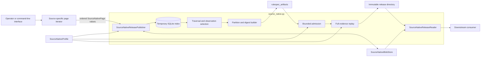
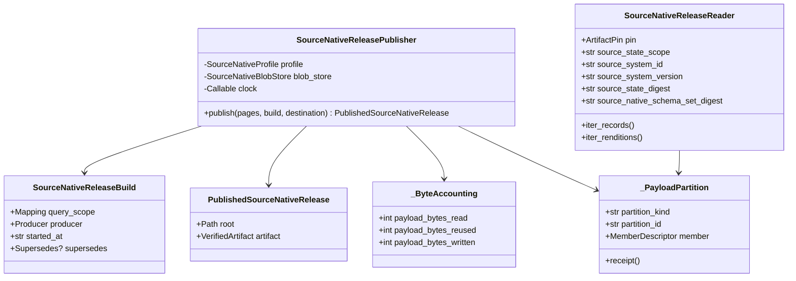
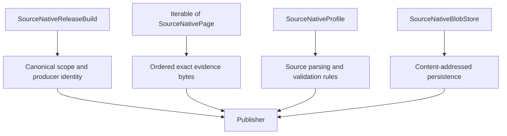
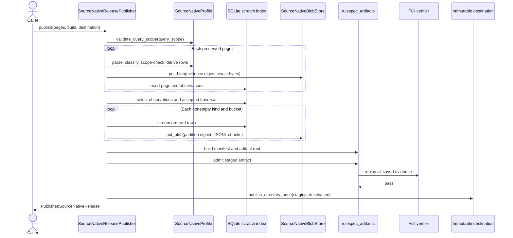
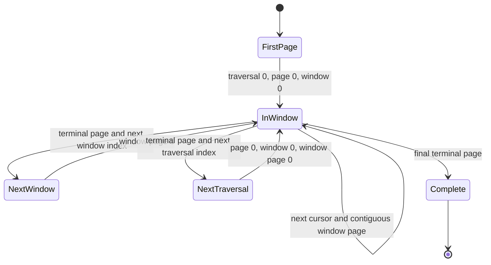
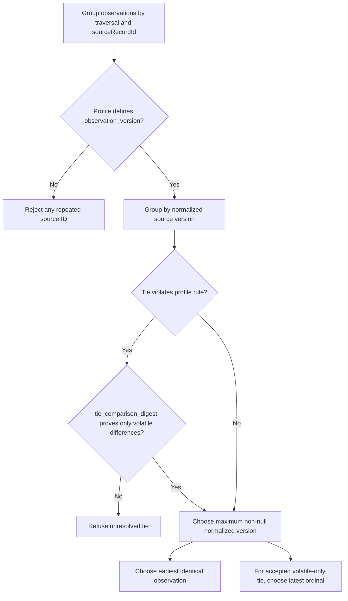
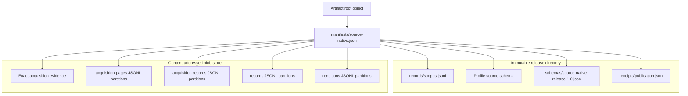
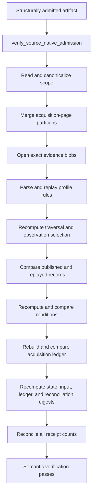

# Source-native release engine

The source-native release engine turns an ordered stream of preserved source pages into one immutable, digest-pinned release. It applies source-specific rules through an injected `SourceNativeProfile`, selects an acceptable traversal and one observation per source identity, stores evidence and payload partitions by content digest, writes the small release directory, and replays the saved evidence before publication.

The implementation lives in [`source_native.py`](../src/spicy_docs/source_native.py). Source-specific parsing, scope, paging, schema, and record rules belong to the [source-native acquisition profiles](source_native_acquisition_profiles.md) and the [source-native profile API](source_native_profile_api.md).

## Purpose and system role

| Question | Answer |
| --- | --- |
| What goes in? | Ordered `SourceNativePage` values, a canonical query scope and producer record in `SourceNativeReleaseBuild`, one `SourceNativeProfile`, a content-addressed blob store, and a new destination path. |
| What happens? | The engine validates the page chain, preserves exact evidence bytes, indexes observations in SQLite, reconciles traversals, selects records, builds deterministic partitions and digests, verifies the staged artifact, and publishes the directory once. |
| What comes out? | `PublishedSourceNativeRelease`, which contains the immutable directory path and the admitted `VerifiedArtifact`. The release directory points to external evidence and newline-delimited JSON payload blobs. |
| How do we check it? | Bounded admission checks the artifact, receipt, roles, schemas, counts, and byte accounting. Full verification also replays every saved page through the profile and compares records, renditions, ledger rows, counts, and digests. |

The engine publishes source facts and acquisition proof. It does not fetch live sources, define source meaning, flatten records for search, interpret documents, or replace an existing release.

## Architecture and ownership boundaries



The dependency direction keeps shared mechanics separate from source rules:

| Owner | Responsibility | Relationship to the engine |
| --- | --- | --- |
| [Source-native profile API](source_native_profile_api.md) | Defines `SourceNativePage`, validation protocols, profile metadata, and callback signatures. | The engine imports and executes this API. |
| [Source-native acquisition profiles](source_native_acquisition_profiles.md) | Compose parsers, scope checks, inventory checks, record wrappers, digests, and traversal policies for each source. | Callers inject exactly one profile into the publisher, verifier, and reader. |
| Source-specific modules | Acquire and classify Federal Register, Regulations.gov, GAO, or SpicyRegs public-table evidence. | They yield pages and implement the profile behavior; the engine contains no source-specific branches. |
| [`source_native_store.py`](../src/spicy_docs/source_native_store.py) | Defines the read/write blob-store boundary and the append-only local implementation. | The engine writes and reopens evidence and payload blobs through this interface. |
| [`publication.py`](../src/spicy_docs/publication.py) | Provides durable create-once file writes and no-replace directory publication. | The engine uses it only after the staged artifact passes full verification. |
| `rulespec_artifacts` | Owns canonical JSON, member descriptions, manifests, root objects, artifact pins, structural admission, and framed digests. | The engine adds product-specific roles, receipt rules, source replay, and consumer checks. |
| [`source_native_cli.py`](../src/spicy_docs/source_native_cli.py) | Selects profiles and transports, handles retries, and maps operator arguments to publication or verification. | It is a caller, not part of the release format. |

For concrete source rules, see [Federal Register](federal_register_source_native.md), [Regulations.gov](regulations_gov_source_native.md), [GAO product pages](gao_product_page_source_native.md), and [SpicyRegs public tables](spicy_regs_public_table_source_native.md). This page documents only the shared release engine.

## Public API and principal internal components



### `SourceNativeReleaseBuild`

`SourceNativeReleaseBuild` carries publication evidence that the caller must supply:

- `query_scope` is the exact source slice to publish. `publish()` runs `profile.validate_query_scope()` and requires the returned canonical mapping to equal the supplied mapping.
- `producer` identifies the product and verifier implementation. The format accepts the historical `spicy-regs` product and the current `spicy-docs` product.
- `started_at` must use canonical UTC spelling, such as `2026-09-02T14:05:00Z`. Fractional seconds remain valid only when Python's canonical ISO rendering reproduces the input exactly.
- `supersedes` optionally links the new root to a predecessor through the shared artifact model. The engine does not infer this relationship from directories, worktrees, or blob reuse.

The producer must name verifier ID `urn:spicy-regs:source-native-release-verifier` and verifier version `1.0`. `verifierImplementationId` remains caller-controlled evidence and becomes a reader allowlist decision.

### `SourceNativeReleasePublisher`

The publisher owns the complete build transaction. Its constructor receives a profile, a `SourceNativeBlobStore`, and an optional timezone-aware clock. `publish()` consumes the page iterable once and either returns a verified release or raises without publishing the destination.

### `PublishedSourceNativeRelease`

The return value contains:

- `root`: the newly published directory;
- `artifact`: the `VerifiedArtifact` produced while admitting the staged release.

The return value proves that publication completed in this process. A directory found later must be admitted again before use.

### `SourceNativeReleaseReader`

The reader admits a release for streaming. Its constructor requires:

- a local `MemberSource` for the release directory;
- a `BlobSource` for every external member;
- the expected source profile;
- a nonempty set of accepted verifier implementation IDs; and
- optionally, an exact `ArtifactPin`.

Construction performs structural artifact admission and `verify_source_native_admission()`. It does not rerun the full source replay. `iter_records()` and `iter_renditions()` then merge partition streams in canonical order and recheck row ordering, partition assignment, and record counts as they read.

### Supporting value types

`_ByteAccounting` records payload bytes read, reused, and newly written. `_PayloadPartition` binds one partition kind and two-digit bucket ID to its external member description and emits the matching receipt row. `_ClosedObjectShape` keeps JSON Schema generation, writer validation, and parser validation aligned for acquisition-page and publication-receipt objects.

## Format identity and compatibility

The engine fixes the following product identities:

| Field | Value |
| --- | --- |
| Artifact `kind` | `spicyregs-source-native-release` |
| Receipt `format` | `spicyregs-source-native-release` |
| Format version | `1.0` |
| Release schema ID | `urn:spicy-regs:schema:source-native-release:1.0` |
| Verifier ID | `urn:spicy-regs:source-native-release-verifier` |
| Verifier version | `1.0` |
| Current producer product | `spicy-docs` |
| Accepted producer products | `spicy-docs`, `spicy-regs` |

Changing any format constant, closed object shape, member role, partition rule, digest framing domain, or canonical ordering rule can break existing artifacts. Treat such a change as a format migration rather than a local refactor.

## Inputs and admission prerequisites

The publication call has four independent inputs:



The engine requires these preconditions before it can publish:

- The query scope is already canonical.
- The page iterable contains at least one page and no more traversals than the profile permits.
- Every page carries `application/json` or `application/zip` evidence no larger than 24 MiB.
- Page, window, cursor, and traversal indexes form one contiguous sequence.
- The profile can parse every saved response and validate all included records against the scope.
- The destination path does not exist and is not a symbolic link.
- The blob store can safely create or verify content-addressed blobs.
- The publisher clock returns a timezone-aware instant at or after `started_at`.

## Publication process

`SourceNativeReleasePublisher.publish()` uses private staging and scratch directories beside the destination. It removes both in a `finally` block, whether publication succeeds or fails.



### 1. Validate the build and reserve private work areas

The publisher canonicalizes the query scope through the profile and compares the result with the caller's mapping. This equality check prevents the release from recording noncanonical keys or value spellings that the source rules silently corrected.

The publisher refuses an existing destination before creating a staging directory and a separate SQLite scratch directory. The final directory remains absent during indexing and verification.

### 2. Index pages and evidence

`_index_pages()` creates two SQLite tables:

| Table | Stored data | Purpose |
| --- | --- | --- |
| `pages` | Traversal and page indexes, window position, cursor chain, record disposition, evidence reference, media type, and partition ID. | Proves acquisition order and later creates the acquisition-page partitions. |
| `observations` | Traversal ordinal, source record ID, normalized version, record digest, wrapped record bytes, rendition-row bytes, evidence reference, partition ID, and selection flag. | Supports bounded selection, ordered output, and digest generation without holding the corpus in memory. |

For every page, the engine performs this work in order:

1. Check the evidence-size and traversal bounds.
2. Validate the traversal, page, window, and cursor sequence.
3. Start a per-window `TraversalCheck` and parse the optional page window.
4. Parse the exact response bytes through the profile.
5. Ask `records_included()` whether the response contributes records.
6. Add the first response in each window to the traversal-wide `AcquisitionCheck`.
7. Add included pages to the window inventory and derive the next cursor.
8. Store the exact evidence bytes under their SHA-256 digest.
9. Classify, scope-check, wrap, digest, and index every included record.
10. Derive and sort each record's rendition rows.

Identical evidence bytes share one evidence blob and one manifest member, even when multiple acquisition pages refer to them. Each page still receives its own acquisition-page row, so deduplication never erases page position or discovery context.

### Page-chain state machine



A record-excluding response can only start and end a window. It cannot continue a cursor chain. At every included window's terminal page, `TraversalCheck.finish()` validates the page inventory. After indexing all pages, `AcquisitionCheck.finish()` validates the complete set of windows for each traversal.

### 3. Select observations

`_select_observations()` chooses one record per source identity within each traversal. Selection runs against a SQLite index ordered by traversal, source ID, source version, record digest, and ordinal.



The normalized observation version must sort lexically in source recency order. Source profiles therefore return canonical dates, timestamps, or another sortable representation. SQLite's `max()` selects the newest non-null version; a null version wins only when every version for that identity is null.

Tie handling follows the profile:

- Without `observation_version`, a traversal may contain each source ID only once.
- With `refuse_equal_observation_versions=True`, any repeated source ID and version is a tie.
- Otherwise, identical record digests at one version collapse to the earliest ordinal; differing digests refuse publication.
- A profile may supply `tie_comparison_digest` to show that differing full records vary only in fields derived at read time. If every member of the tied group shares that narrower digest, the latest ordinal wins when that version is the newest version.

The volatile-only exception is bounded to one source identity, traversal, and version. It does not weaken record comparison across the corpus.

### 4. Choose the accepted traversal

`_accepted_traversal()` applies `profile.traversal_acceptance`:

| Mode | Acceptance rule |
| --- | --- |
| `single-observed-traversal` | Exactly one traversal must exist; traversal `0` wins. |
| `source-enumeration` | Exactly one traversal must exist; traversal `0` wins because the profile proves enumeration coverage. |
| `stable-consecutive-traversals` | The first traversal in the first pair of adjacent, identical indexed observations does not win; the right-hand traversal of that stable pair wins. |

Two traversals match when they contain the same number of indexed observations and the same source ID and record digest at every ordinal. If no adjacent pair matches, publication fails with `observed crawl lacks two stable consecutive traversals`.

The engine retains acquisition-page rows and evidence for every supplied traversal. Record, rendition, and acquisition-record partitions contain only the accepted traversal's selected observations. This distinction preserves reconciliation evidence without publishing rejected observations as source state.

### 5. Partition payloads

The engine creates up to 64 buckets for each of four partition kinds. It writes only nonempty buckets.

| Partition kind | Rows | Partition identity | Manifest role |
| --- | --- | --- | --- |
| `records` | Selected wrapped source records from the accepted traversal. | `sourceRecordId` | `source-native-records` |
| `renditions` | Profile-derived rendition index rows for selected records. | `sourceRecordId` | `rendition-index` |
| `acquisition-records` | One evidence link for each selected record. | `sourceRecordId` | `source-acquisition-ledger` |
| `acquisition-pages` | Page inventory rows for every traversal. | `traversalIndex:pageIndex` | `source-acquisition-ledger` |

`_partition_id()` computes:

```text
int(sha256(identity.encode("utf-8")), 16) mod 64
```

The result is a zero-padded decimal ID from `00` through `63`. The receipt fixes the algorithm as `sha256-utf8-modulo`, the identity encoding as `utf-8`, and the bucket count as `64`.

Within each bucket, records and acquisition-record rows sort by `sourceRecordId`; rendition rows sort by `(sourceRecordId, renditionId)`; page rows sort by `(traversalIndex, pageIndex)`. `_stage_partition()` writes canonical JSON plus one newline per row, computes the SHA-256 digest while writing, flushes the temporary file, and passes its chunks to the blob store.

Each JSONL row may contain at most 4 MiB of canonical JSON. The parser also requires a terminating newline and refuses an oversized or non-object row.

### 6. Compute release digests and counts

The engine uses domain-separated `framed_section_digest()` values. A digest therefore commits to its domain, section name, declared row count, canonical row order, and row content.

| Digest | Commits to |
| --- | --- |
| `acquisitionPolicyDigest` | The profile's policy for the canonical query scope. |
| `sourceNativeSchemaSetDigest` | The profile's source-schema declaration. |
| `sourceStateDigest` | Scope row, schema declaration, selected records, and rendition rows. |
| `inputObservationDigest` | All wrapped observations in the accepted traversal, before record selection discards older versions or duplicate observations. |
| `acquisitionLedgerDigest` | Selected record identities and their evidence blob references. |
| `reconciliationDigest` | Acquisition-page rows for the accepted traversal. |
| `releaseSchemaDigest` | The complete installed release-schema bundle. |

The receipt also reconciles these counts:

```text
inputObservationCount = publishedRecordCount + discardedObservationCount
discoveredRecordCount = inputObservationCount + failedRecordCount
failedRecordCount = 0
acquisition-record partition rows = publishedRecordCount
record partition rows = publishedRecordCount
rendition partition rows = renditionIndexCount
acquisition-page partition rows = all indexed pages
```

The current engine fails on record errors instead of recording failure rows, so every publishable receipt has `failedRecordCount: 0` and `semanticVerdict: "pass"`.

### 7. Build the receipt, manifest, and root

The publisher serializes local members, describes all local and external members, builds one global manifest, and then builds the artifact root. Because the receipt contains `publicationBytesWritten` and its own byte size affects that value, the engine iterates receipt, manifest, and root construction until the measurement stabilizes. It allows eight iterations and fails if the value does not converge.

Every external member must have a distinct `blobRef`, including evidence and payload partitions. This keeps the manifest-to-receipt mapping unambiguous.

### 8. Verify before making the directory visible

The publisher writes the complete staging directory with create-once durable writes. It then calls shared artifact admission with `verify_source_native_release()` as the semantic verifier. Only a passing staged artifact reaches `publish_directory_once()`.

The final operation uses no-replace publication. Concurrent publishers can race, but they cannot replace the winner. Failed work leaves no final destination; the `finally` block removes private scratch and staging directories.

## Release layout and member roles

The release splits small control files from large, reusable payloads.



| Role | Location | Cardinality and meaning |
| --- | --- | --- |
| `source-native-scopes` | Local `records/scopes.jsonl` | Exactly one member and one scope row. |
| `source-native-schema` | Local profile-defined schema key | Exactly one source schema. |
| `release-schema` | Local `schemas/source-native-release-1.0.json` | Exactly one generated bundle of release schemas. |
| `source-publication-receipt` | Local `receipts/publication.json` | Exactly one closed publication receipt. |
| `source-acquisition-evidence` | External blobs | One member per distinct evidence digest. |
| `source-acquisition-ledger` | External blobs | Nonempty page partitions plus nonempty selected-record ledger partitions. |
| `source-native-records` | External blobs | Zero or more nonempty record partitions. The role may be absent for a zero-record release. |
| `rendition-index` | External blobs | Zero or more nonempty rendition partitions. The role may be absent when no renditions exist. |

The manifest itself and the artifact root use shared `rulespec_artifacts` keys and schemas. The receipt's `payloadPartitions` array maps every payload partition to its `blobRef`, byte size, kind, bucket ID, and record count. Evidence members do not appear in `payloadPartitions`; acquisition-page rows account for their exact use.

## Verification model

The module exposes two verification levels for different call sites.

### Bounded admission: `verify_source_native_admission()`

Bounded admission supports consumer open. It checks release-wide declarations without replaying every evidence page or comparing every record:

- exact artifact kind, root-spec fields, source identity, profile version, policy identity, and source-state scope;
- required and allowed member roles, locations, singleton members, and external blob-source availability;
- the closed receipt shape, UTC times, count equations, semantic verdict, warning shape and order, and format identity;
- exact agreement among root spec, receipt, and producer fields;
- partition policy, order, member role, size, record count, distinct reference, and complete receipt coverage;
- payload and publication byte accounting;
- exact installed release schemas and the selected profile's source schema; and
- the source-schema-set digest.

`SourceNativeReleaseReader` adds an application trust decision: the producer's `verifierImplementationId` must appear in the caller's nonempty allowlist. An optional expected artifact pin can bind open to one exact root.

### Full verification: `verify_source_native_release()`

Full verification first runs bounded admission, then rebuilds the source result from saved evidence.



`_replay_acquisition()` processes globally ordered page rows with one active window in memory. It rechecks:

1. traversal, page, window, and cursor continuity;
2. the evidence member's digest reference and media type;
3. the 24 MiB evidence bound;
4. response parsing and record-inclusion decisions;
5. acquisition-wide and per-window checks;
6. terminal markers and next cursors;
7. each page's ordered `discoveredRecords` inventory;
8. record classification, scope, wrapping, identity, digest, and observation version;
9. exact evidence membership; and
10. accepted-traversal flags.

The verifier then streams the admitted partitions and replayed expectations through `zip_longest()`. A missing, extra, reordered, or changed record, rendition, or ledger row fails at the first difference. It finally recomputes all semantic digests and receipt counts.

### Reader streaming checks

`_partition_rows()` opens at most one stream per selected bucket and performs a heap merge. As it reads, it checks:

- every partition in the merge has the same kind;
- each row has the required identity fields;
- each row hashes to the declared bucket;
- rows increase strictly within each bucket and across the merged stream; and
- the observed row count equals the manifest member's `recordCount`.

These checks catch blob replacement, wrong bucket assignment, duplicate identities, ordering changes, and count drift before or while rows reach the consumer. Full replay remains a separate producer or operator gate.

## Schema generation and drift control

`release_schema_bundle()` is the sole in-code generator for nine closed schemas:

- source-native record;
- scope;
- source-schema declaration;
- rendition index;
- acquisition ledger;
- acquisition page;
- failure;
- publication receipt; and
- release root spec.

`installed_release_schema_bundle()` loads the package resources from `spicy_docs/schemas/source_native_release/1.0`, requires exact filename membership, and compares every file byte-for-byte with the canonical JSON generated in code. Publication and admission both call this function, so a hand-edited, missing, extra, or stale installed schema blocks the release.

`_ClosedObjectShape` gives acquisition-page and receipt objects one definition for three operations:

1. expose a closed Draft 2020-12 JSON Schema;
2. validate objects built by the publisher; and
3. validate objects parsed by admission or replay.

All declared properties are required, and `additionalProperties` is false. Additive field changes therefore require coordinated format, schema, writer, reader, verifier, fixture, and compatibility work.

## Safety, bounds, and failure behavior

The engine fails closed. `SourceNativeReleaseError` reports product-rule violations; shared artifact, blob-store, publication, JSON Schema, SQLite, and filesystem errors can also surface when their boundary fails.

| Invariant | Failure prevented |
| --- | --- |
| Canonical query scope | Two spellings of the same request producing different release identities. |
| Canonical UTC start and completion times | Ambiguous or nonreproducible receipt timestamps. |
| No existing or symlink destination | Replacement of an immutable release. |
| Contiguous page, window, and traversal indexes | Missing, reordered, or forked acquisition evidence. |
| Exact cursor-to-request chaining | A page stream that does not represent the source's pagination path. |
| Supported evidence media type and 24 MiB page limit | Unbounded or uninterpretable replay input. |
| Profile inventory and acquisition checks | Partial windows or incomplete scope coverage. |
| Closed record identity and unique rendition identity | Ambiguous selection or output ordering. |
| Refusal of unresolved source-version ties | Silent choice between conflicting same-version source records. |
| Stable traversal or proven enumeration | Publication from an unstable observed crawl. |
| 4 MiB JSONL row limit and required newline | Unbounded parsing and ambiguous framing. |
| Fixed 64-bucket policy | Reader and writer disagreement about payload placement. |
| Distinct external content identities | Ambiguous manifest and receipt membership. |
| Count and byte equations | Incomplete or misleading publication receipts. |
| Exact installed schemas | Runtime behavior drifting from shipped format declarations. |
| Full prepublication replay | Records, renditions, or ledger rows that cannot be derived from saved evidence. |
| Reader verifier allowlist and optional artifact pin | Trusting an unknown implementation or opening the wrong release. |

The engine does not publish partial output. Evidence blobs written before a later failure may remain in the append-only blob store as safe, unreferenced content. The destination remains absent, and later releases may reuse those blobs after verifying their digest and size.

## Performance and resource use

The design bounds working memory independently of corpus size:

- SQLite stores pages, wrapped records, rendition groups, selection flags, and replay state on disk.
- The publisher streams one page iterable, although each page's evidence bytes already exist as one bounded `bytes` value.
- Partition staging handles one kind and bucket at a time.
- Blob writes and reads use chunks.
- Replay keeps one active acquisition window plus SQLite state.
- Partition merge opens at most 64 streams for one kind and holds at most one row per open stream in the heap.

The dominant work is linear in evidence and row bytes, plus SQLite index and ordering costs. Partition merging costs `O(n log b)` for `n` rows and at most `b = 64` nonempty buckets. The fixed bucket count also bounds file descriptors during reader iteration.

Blob reuse avoids rewriting unchanged payload buckets across successor releases. Receipt accounting separates payload bytes examined, payload bytes reused, payload bytes newly written, and local publication bytes written.

## Contribution guide

### Put changes in the owning module

Use this file for source-independent release mechanics: artifact shape, shared selection, partitioning, digest construction, admission, replay, and streaming. Put source URL rules, response parsing, field classification, query-scope rules, observation versions, and rendition derivation in the relevant source profile. See the [profile API](source_native_profile_api.md) before adding a callback.

Keep storage races, filesystem hardening, and content-addressed layout in [`source_native_store.py`](../src/spicy_docs/source_native_store.py). Keep durable no-replace writes in [`publication.py`](../src/spicy_docs/publication.py). Keep transport, retry, and command-line choices in [`source_native_cli.py`](../src/spicy_docs/source_native_cli.py).

### Preserve deterministic behavior

When changing the engine:

- Serialize data with `canonical_json_bytes()`.
- Preserve explicit ordering before hashing or writing rows.
- Keep digest domains and section names stable unless introducing a new format version.
- Derive bucket identity from the same closed row identity on write and read.
- Keep receipt counts and byte measurements derived from emitted members.
- Reject ambiguity instead of choosing from conflicting evidence.
- Retain the staging-verify-publish order and no-replace destination rule.

### Treat schema changes as format changes

Edit the schema generator and installed schema resources together. A passing `installed_release_schema_bundle() == release_schema_bundle()` check is necessary, but compatibility also depends on the root spec, receipt parser, member roles, verifier behavior, fixtures, and existing release readers.

### Test the affected trust path

The core regression suite is [`tests/test_source_native_release.py`](../tests/test_source_native_release.py). It covers stable publication, historical producer compatibility, evidence deduplication, failed acquisition cleanup, blob reuse and mutation, concurrent publication, traversal reconciliation, page-chain refusal, bucket streaming, schema drift, source-version selection, and tie refusal.

Use source-specific suites when a profile changes, and use [`tests/test_source_native_release_real.py`](../tests/test_source_native_release_real.py) for the pinned real-evidence publication and replay path. The repository's standard checks are:

```sh
uv run pytest -q
uv run ruff check .
uv run ruff format --check .
```

For a focused engine change, start with:

```sh
uv run pytest -q tests/test_source_native_release.py
```

Add refusal tests for malformed artifacts and success tests for the intended canonical path. A writer-only test is insufficient when a change affects admission, replay, or reader streaming.

## Implementation map

| Area | Components | Purpose |
| --- | --- | --- |
| Public lifecycle | `SourceNativeReleaseBuild`, `PublishedSourceNativeRelease`, `SourceNativeReleasePublisher`, `SourceNativeReleaseReader` | Build input, publication result, producer transaction, and consumer streaming. |
| Closed structures | `_ClosedObjectShape`, `_PAGE_SHAPE`, `_RECEIPT_SHAPE`, `release_schema_bundle()`, `installed_release_schema_bundle()` | Keep JSON writers, parsers, and installed schemas aligned. |
| Acquisition index | `SourceNativeReleasePublisher._index_pages()`, `_observation_version()`, `_ordered_rendition_rows()` | Validate the page stream and store source-derived observations. |
| Selection | `_select_observations()`, `_tie_group_is_volatile_only()`, `_accepted_traversal()`, `_same_traversal()` | Choose records and the acceptable traversal without loading the corpus. |
| Partition writing | `_partition_id()`, `_partition_policy()`, `_stage_partition()`, `_PayloadPartition`, `_ByteAccounting` | Build deterministic external JSONL payloads and account for blob reuse. |
| Partition reading | `_payload_partitions()`, `_partition_row_identity()`, `_identity_bucket_for_row()`, `_partition_rows()` | Bind receipt rows to members and stream a globally ordered, checked merge. |
| Policy and digest input streams | `_policy()`, `_policy_for_scope()`, `_policy_digest()`, `_query_mappings()`, `_query_renditions()`, `_ledger_rows()`, `_page_rows()`, `_source_state_digest()`, `_digest_records()` | Rebuild the scoped acquisition policy and produce canonical rows for release digests and comparisons. |
| Artifact membership | `_member_index()`, `_descriptor_rows()`, `_open_descriptor()`, `_validate_evidence_media_type()` | Index roles, open and parse local or external members through explicit sources, and restrict evidence types. |
| Verification | `verify_source_native_admission()`, `_replay_acquisition()`, `verify_source_native_release()` | Separate bounded consumer admission from full producer replay. |

## Maintainer checklist

Before merging an engine change, confirm:

- The change belongs in shared release mechanics rather than a source profile, storage module, or CLI.
- Existing artifacts remain readable, or the change introduces an explicit new format and migration policy.
- Writer, receipt, manifest, schema, admission, replay, and reader rules still agree.
- Ordering, partition identity, framed digest inputs, and count equations remain deterministic.
- The full verifier derives every published row from preserved evidence.
- The reader still requires an explicit verifier implementation allowlist.
- Failure leaves the immutable destination absent and preserves safe blob-store reuse.
- Focused source-native tests and repository lint and format checks pass.
