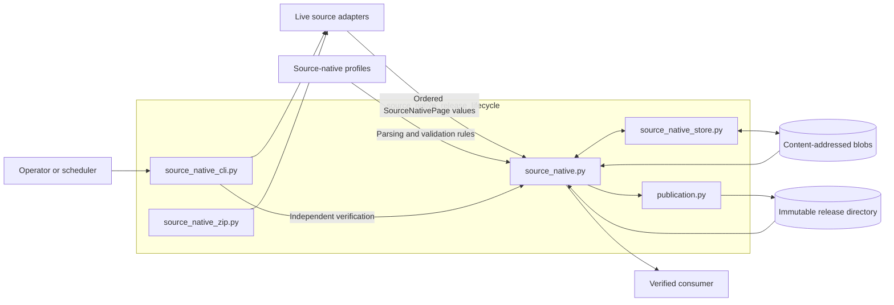
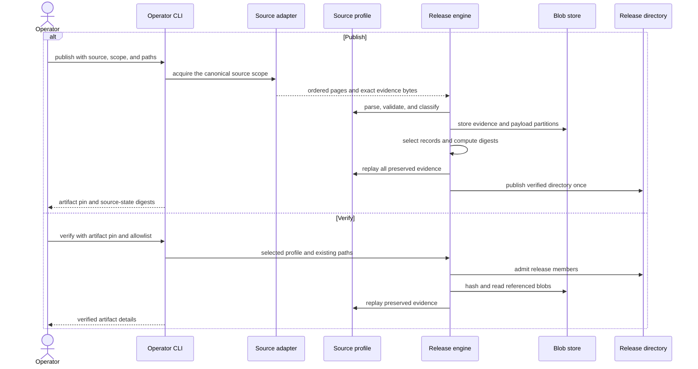

> Generated reference snapshot; see [current architecture](../docs/architecture.md),
> [operator commands](../docs/cli.md), and [reference maintenance](../docs/documentation.md).

# Source-native release lifecycle

## Purpose

The `source_native_release_lifecycle` module turns preserved source pages into immutable, digest-pinned releases and verifies those releases from saved evidence.

It coordinates three responsibilities:

- The operator CLI selects a source profile, normalizes its scope, and routes publication or verification.
- The release engine validates pages, selects records, builds deterministic partitions and digests, and replays the evidence.
- The storage layer preserves content-addressed blobs and publishes the verified release directory without replacing existing content.

Source profiles define source-specific meaning and completeness rules. This module owns the shared release lifecycle.

## Architecture

Publication contacts live sources; verification does not. Verification reads the release and blob store, checks the expected artifact pin and verifier identity, and rebuilds the published result from preserved evidence.

## Core component documentation

- [Source-native release engine](source_native_release_engine.md) — record selection, deterministic partitions, artifact construction, admission, replay, and streaming reads.
- [Source-native storage and publication](source_native_storage_and_publication.md) — content-addressed blobs, create-once writes, deterministic ZIP metadata, and no-replace directory publication.
- [Source-native operator CLI](source_native_operator_cli.md) — source routing, scope arguments, acquisition adapters, retries, publication, verification, and machine-readable results.