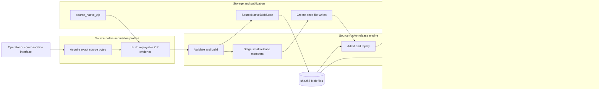
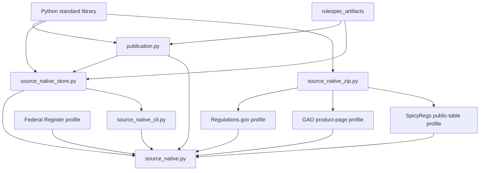
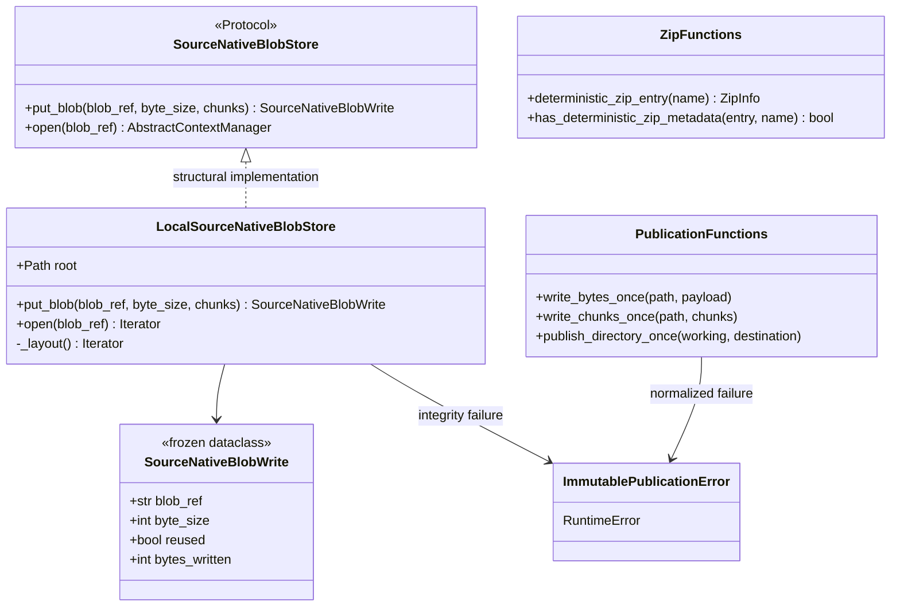
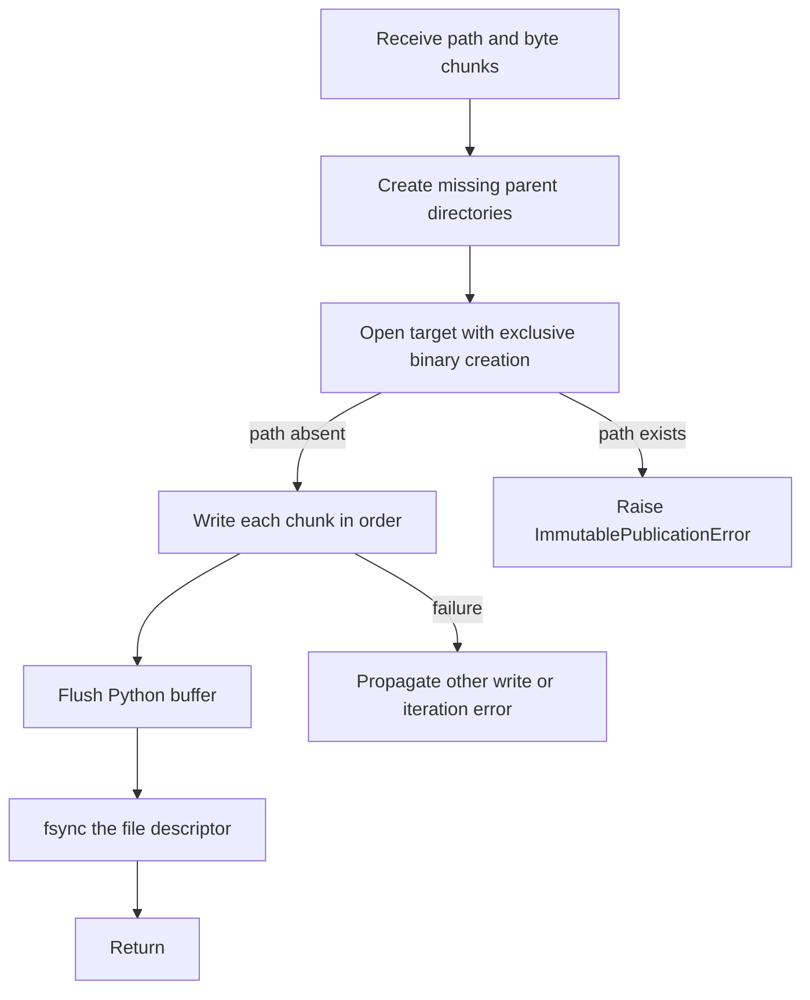
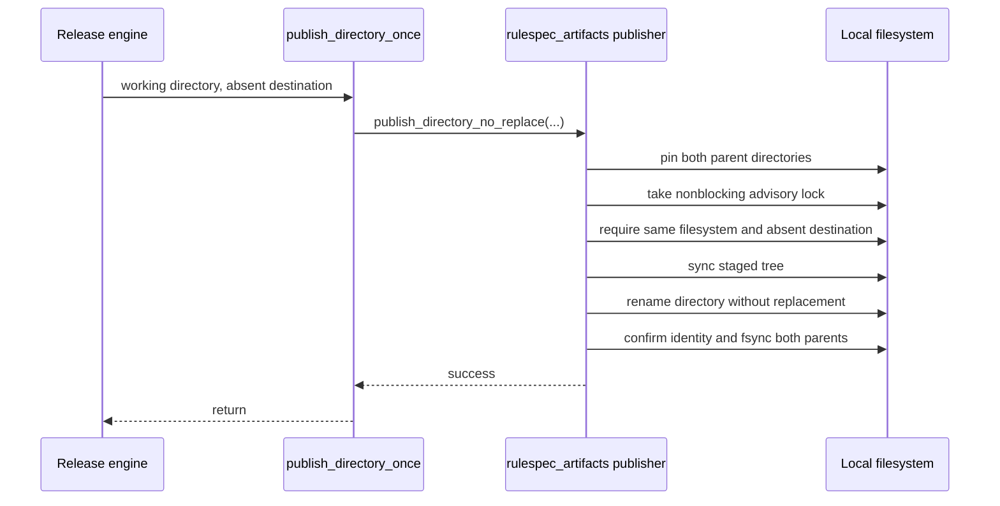
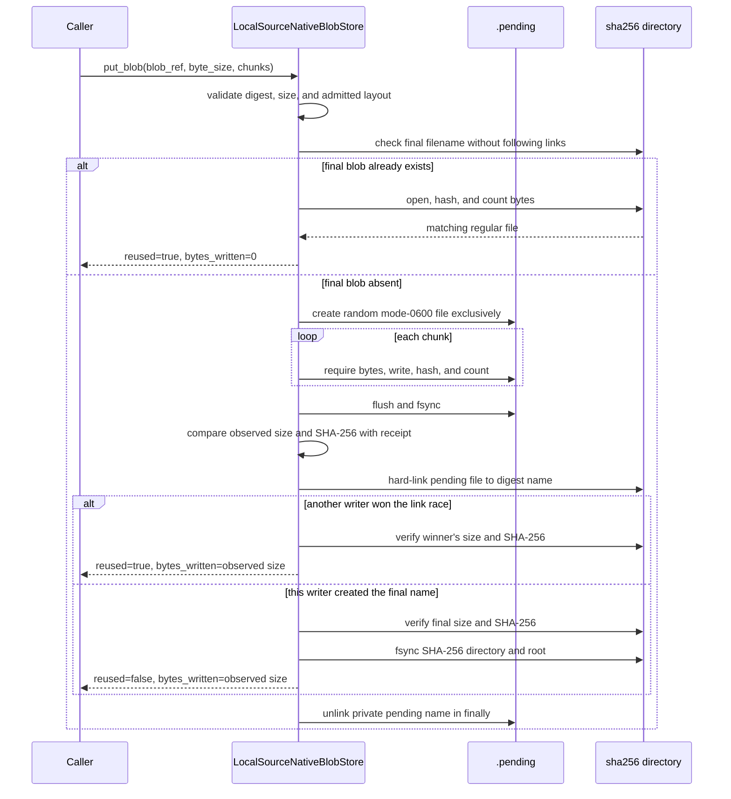
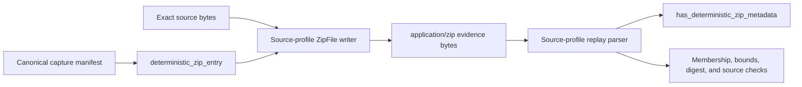
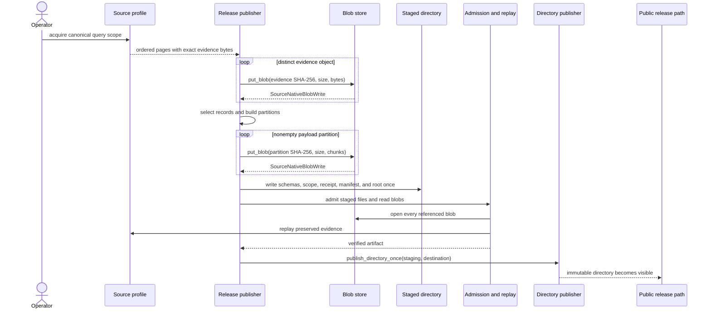

# Source-native storage and publication

The source-native storage and publication module provides the filesystem boundary for immutable source evidence. It gives the release engine three shared capabilities: create small files and directories once, store large payloads under their SHA-256 content identity, and give generated ZIP members one stable metadata shape.

These components preserve bytes; they do not decide what a source record means or whether a release is complete. The [source-native acquisition profiles](source_native_acquisition_profiles.md) own source rules, and the [source-native release engine](source_native_release_engine.md) owns selection, artifact construction, admission, and replay.

## Purpose and system role

| Question | Answer |
| --- | --- |
| What goes in? | Exact evidence or partition bytes, a declared `sha256:<64 lowercase hex digits>` reference and byte size, staged release files, and source-profile ZIP member names. |
| What happens? | The module validates content identity, writes through private pending files, resolves concurrent writes without replacing a winner, flushes immutable files, publishes a verified directory with no replacement, and normalizes ZIP member metadata. |
| What comes out? | Reusable content-addressed blobs, one immutable release directory, `SourceNativeBlobWrite` accounting, readable blob streams, and `ZipInfo` values suitable for source evidence archives. |
| How do we check it? | Blob writes recompute size and SHA-256 before and after linking; existing blobs receive the same verification. Reads hash the stored bytes before yielding them. Directory publication uses a no-replace rename after syncing the staged tree. Source replay can compare ZIP metadata with the shared expected shape. |

The module has three narrow responsibilities:

1. [`publication.py`](../src/spicy_docs/publication.py) provides durable, create-once file and directory operations.
2. [`source_native_store.py`](../src/spicy_docs/source_native_store.py) defines the injected blob-store interface and its append-only local implementation.
3. [`source_native_zip.py`](../src/spicy_docs/source_native_zip.py) defines and checks shared ZIP member metadata.

It does not fetch source data, parse records, generate release schemas, select observations, delete blobs, collect orphaned content, or authorize a consumer to trust a release.

## System context



The release format deliberately separates payload storage from release publication:

| Surface | Contents | Identity and lifecycle |
| --- | --- | --- |
| Blob store | Exact source evidence and generated newline-delimited JSON partitions. | A flat SHA-256 content identity under `sha256/`. Blobs can be reused by many releases and are never replaced by this module. |
| Release directory | Schemas, scope declarations, manifest, receipt, and artifact root. | A release-specific path published once only after staged admission and full replay succeed. |
| Pending area | Private files used to validate a proposed blob write. | Random names under `.pending/`; normal completion removes them. They are never valid blob references. |

See the [source-native release engine](source_native_release_engine.md) for the artifact members, partition rules, byte equations, and verification sequence. This page documents only the persistence boundary used by that engine.

## Dependency direction



| Dependency or consumer | Use |
| --- | --- |
| Python standard library | Exclusive file creation, descriptor-relative directory access, symbolic-link refusal, SHA-256 hashing, hard links, file and directory syncing, random pending names, ZIP metadata, protocols, context managers, and immutable data classes. |
| `rulespec_artifacts` | `publish_directory_no_replace` performs the same-filesystem no-replace directory move; `LocalBlobSource` opens local SHA-256 blobs and verifies their digest before returning a stream. The repository pins this package as a vendored wheel. |
| [Source-native release engine](source_native_release_engine.md) | Injects `SourceNativeBlobStore`, writes evidence and partition blobs, creates the small staged files, verifies the staged release, and publishes its directory. |
| [`source_native_cli.py`](../src/spicy_docs/source_native_cli.py) | Chooses `LocalSourceNativeBlobStore`, requires separate release and blob-store paths, creates the layout for publication, and opens an existing layout with `create=False` for verification. |
| [Regulations.gov](regulations_gov_source_native.md), [GAO product pages](gao_product_page_source_native.md), and [SpicyRegs public tables](spicy_regs_public_table_source_native.md) | Use `deterministic_zip_entry()` when sealing source evidence. GAO replay also calls `has_deterministic_zip_metadata()` to require the exact shared shape. |

The storage module imports no source profile or release implementation. The release engine depends on the `SourceNativeBlobStore` protocol, so another backend can replace the local store without adding backend branches to release construction.

## Component relationships



### Public API

| Component | Role | Important behavior |
| --- | --- | --- |
| `ImmutablePublicationError` | Common local immutability failure. | Wraps file-exists publication failures, conflicting directory publication, blob identity mismatch, and selected shared-artifact or filesystem failures. |
| `write_bytes_once()` | Convenience function for one `bytes` payload. | Delegates to `write_chunks_once()` with one chunk. |
| `write_chunks_once()` | Streams one new file. | Creates parent directories, opens the target with exclusive binary creation, writes all chunks, flushes, and calls `fsync()` on the file descriptor. It refuses an existing path. |
| `publish_directory_once()` | Publishes one private staged directory. | Delegates to the shared same-filesystem, no-replace directory publisher and converts its expected failures to `ImmutablePublicationError`. |
| `SourceNativeBlobWrite` | Reports the observed effect of `put_blob()`. | Separates declared size, reuse, and actual bytes streamed by this attempt. |
| `SourceNativeBlobStore` | Structural read/write interface injected into the engine. | Requires conditional content-addressed writes and context-managed binary reads. `@runtime_checkable` permits runtime structural checks. |
| `LocalSourceNativeBlobStore` | Append-only local implementation. | Pins the admitted directory layout, writes through `.pending`, publishes with a hard link, verifies every destination, and reads through `LocalBlobSource`. |
| `deterministic_zip_entry()` | Builds the shared ZIP member description. | Fixes the timestamp, compression method, and regular-file permissions. |
| `has_deterministic_zip_metadata()` | Checks replayed ZIP member metadata. | Rebuilds the expected entry and compares all relevant `ZipInfo` fields exactly. |

## Create-once file and directory publication

### File writes

`write_chunks_once()` is the primitive used for the small staged release members. Its process is intentionally short:



The function preserves chunk order and never opens an existing file for update. It catches only `FileExistsError`; type errors, iterator failures, disk errors, and other operating-system errors retain their original exception types.

A failure after exclusive creation can leave a partial target file. The function does not unlink that path because doing so could race with diagnosis or recovery. Callers should therefore write only inside private staging directories that they can discard as a unit. The release engine follows this rule and removes its staging directory after failure.

`write_bytes_once()` has the same guarantees and failure behavior. It only adapts one complete `bytes` value to the chunked interface.

### Directory publication

`publish_directory_once()` is the final transition from a private staged tree to the public immutable release name.



The vendored `rulespec_artifacts` implementation uses the kernel no-replace rename as the authority. A nonblocking POSIX advisory lock coordinates cooperating publishers, but the destination absence check and rename protect the immutable name. Publication requires distinct source and destination paths on the same filesystem.

The wrapper presents one product-level error type:

| Lower-level failure | `ImmutablePublicationError` meaning |
| --- | --- |
| `FileExistsError` | The immutable destination already exists. |
| `BlockingIOError` | Another cooperating publication currently holds the destination-parent lock. |
| `ArtifactVerificationError` or `MemberSourceError` | The shared artifact primitive rejected or could not read the staged tree. |
| `OSError` or `ValueError` | The directory move, path shape, identity check, sync, or another filesystem precondition failed. |

The operation never merges directories and never updates a published tree. A retry must use a new absent destination unless the earlier attempt failed before the final rename.

## Local content-addressed blob store

Content-addressed storage (CAS) names each blob by the SHA-256 digest of its bytes. Equal bytes therefore share one stored file across releases; different bytes cannot legitimately share a path.

### On-disk layout

```text
<root>/
├── sha256/
│   └── <64 lowercase hexadecimal digits>
└── .pending/
    └── blob-<32 random hexadecimal digits>
```

The public reference contains the algorithm prefix, for example `sha256:0123...cdef`. The final filename omits `sha256:`. Pending names have no semantic meaning and never appear in manifests or receipts.

`LocalSourceNativeBlobStore(root, create=True)` creates the root and both child directories when needed. With `create=False`, all three directories must already exist; verification therefore cannot silently create a missing store.

### Layout admission and path hardening

Construction opens the root as a real directory with `O_DIRECTORY | O_NOFOLLOW`, resolves its path, and confirms that the open descriptor and resolved path identify the same device and inode. It then opens `sha256/` and `.pending/` relative to the pinned root and records each child directory's device and inode.

Every `put_blob()` call reopens the three directories and compares their current identities with the admitted identities. The operation refuses a replaced root, a replaced child, a symbolic link, a missing directory, or a nondirectory component. Descriptor-relative `open`, `stat`, `mkdir`, `link`, and `unlink` calls keep path lookup under the admitted parents.

`open()` validates the digest spelling and delegates to `rulespec_artifacts.LocalBlobSource`. That reader pins the local member source, hashes the complete blob before yielding it, seeks back to the start, and refuses bytes that differ from the requested content address.

### Conditional write process



The hard link makes the verified pending inode visible under its content name without copying it. `FileExistsError` from the link is a normal race result: the loser verifies the winner instead of replacing it.

### Input validation

`put_blob()` requires:

- `blob_ref` to be exactly `sha256:` followed by 64 lowercase hexadecimal digits;
- `byte_size` to be a nonnegative `int`, excluding `bool`; and
- every item yielded by `chunks` to be `bytes`.

The method streams all chunks once. It computes the observed size and digest while writing, then compares both with the declaration. A mismatched receipt raises `ImmutablePublicationError` and the normal `finally` path removes the pending name.

`_verify_blob()` opens the final name with `O_NOFOLLOW`, requires a regular file, reads in 1 MiB blocks, and compares both byte count and digest. The store uses it for a pre-existing blob, a race winner, and a newly linked blob.

### Write receipt semantics

| Result | `reused` | `bytes_written` | Meaning |
| --- | ---: | ---: | --- |
| Matching blob existed before streaming began | `True` | `0` | The store verified existing bytes and consumed no input chunks. |
| This call created the final content name | `False` | `byte_size` | The call streamed and published the proposed bytes. |
| This call wrote a pending file but lost the hard-link race | `True` | `byte_size` | Another writer published the same verified content; this call still performed local write work. |

The release receipt uses these values to distinguish payload bytes examined, reused, and physically streamed. `reused=True` therefore does not always imply `bytes_written == 0` under concurrency.

### Failure and recovery behavior

The local store fails closed:

- A final nonregular file or symbolic link is invalid.
- Existing content with the wrong size or digest raises `ImmutablePublicationError` rather than being repaired.
- A changed directory identity raises `ValueError` rather than following the new path.
- Normal success and exception paths unlink the private pending name.
- A process or host crash can leave an unreferenced file in `.pending`; construction does not reclaim it.
- A release failure can leave verified, unreferenced blobs in `sha256/`. They are safe to reuse after the normal identity check.

This module implements no garbage collector. Any cleanup policy must distinguish final content from pending work, coordinate with active writers, and preserve every blob referenced by every retained release.

The implementation assumes local POSIX filesystem behavior, including `O_DIRECTORY`, `O_NOFOLLOW`, descriptor-relative operations, hard links, advisory locks, and directory `fsync()`. A remote object-store implementation should satisfy the protocol's observable guarantees with native conditional creation and integrity checks instead of copying these filesystem steps.

## Deterministic ZIP member metadata

Some source profiles must preserve multiple exact objects in one bounded evidence page. `source_native_zip.py` gives those profiles one shared member shape.

`deterministic_zip_entry(name)` returns a `ZipInfo` with:

| Field | Value |
| --- | --- |
| `filename` | Caller-supplied member name. |
| `date_time` | `1980-01-01 00:00:00`, the earliest ordinary ZIP timestamp. |
| `compress_type` | `ZIP_DEFLATED`. |
| `external_attr` | Unix regular file with mode `0644`, encoded as `0o100644 << 16`. |
| Remaining metadata | The `ZipInfo` defaults created by the running Python implementation. |

`has_deterministic_zip_metadata(entry, name=...)` builds the expected entry and compares the filename, original filename, timestamp, compression type, create and extract versions, external attributes, creating system, flag bits, internal attributes, volume, reserved value, comment, and extra data.



The helper standardizes member metadata only. The source profile still owns member order, membership, archive compression level, size bounds, encryption refusal, manifest schema, and the digest relationship between the manifest and payload. The helper also does not prove that two entire ZIP archives are byte-for-byte equal across Python or compression-library versions.

The current profile uses are source-specific:

- [Regulations.gov](regulations_gov_source_native.md) writes a manifest followed by ordered exact Mirrulations objects.
- [GAO product pages](gao_product_page_source_native.md) writes `manifest.json` and `product.html`, then requires the exact shared metadata during replay.
- [SpicyRegs public tables](spicy_regs_public_table_source_native.md) writes a manifest and exact Parquet partition bytes.

Source parsers should reject malformed evidence through their source-specific error type. Do not add source-specific member names or parsing rules to `source_native_zip.py`.

## End-to-end interaction

The storage boundary participates in publication only after a source iterator has produced a page. The complete transaction remains owned by the release engine.



Publication order matters. Blobs may exist before a release references them, but the public release directory appears only after full verification. This order prevents a consumer from observing a release that points to absent, corrupt, or unreplayable payloads.

For selection, partitioning, artifact identity, schemas, admission, and reader behavior, see the [source-native release engine](source_native_release_engine.md). For live transport and operator arguments, see [`source_native_cli.py`](../src/spicy_docs/source_native_cli.py).

## Guarantees and limits

| Invariant | Enforced by | Prevented failure |
| --- | --- | --- |
| Existing immutable path is never opened for update | Exclusive file creation and no-replace directory publication | Silent replacement of a release member or release directory. |
| Blob name matches bytes | Streaming SHA-256 plus `_verify_blob()` and `LocalBlobSource` | Reuse or consumption of corrupt content. |
| Declared size matches bytes | Streaming byte count plus `_verify_blob()` | A receipt or manifest describing truncated or extended content. |
| Competing blob writers converge | Hard-link conditional publication plus winner verification | Last-writer-wins replacement or acceptance of a corrupt race winner. |
| Competing directory publishers have one winner | Advisory coordination plus kernel no-replace rename | Merged or overwritten release directories. |
| Store directories remain the admitted directories | Device-and-inode pinning and symbolic-link refusal | Redirecting writes through path replacement or internal symlinks. |
| Verification is read-only | `create=False` requires the existing layout | A verification command repairing or creating missing storage. |
| ZIP member metadata has one expected shape | Shared constructor and exact comparison | Timestamp, permission, flag, or extra-field drift in checked evidence. |

These guarantees have deliberate limits:

- `write_chunks_once()` syncs the file but does not itself sync the parent directory; final release publication performs the directory-tree and parent syncs through `rulespec_artifacts`.
- The blob store validates individual content objects; the release verifier proves that a manifest references the correct set of objects.
- A successful `put_blob()` proves local content identity, not source authenticity or record correctness.
- Deterministic member metadata does not replace source-specific ZIP validation.
- Append-only behavior prevents replacement but does not provide retention policy, replication, backup, access control, or disaster recovery.

## Extending the blob-store boundary

Implement a new backend against `SourceNativeBlobStore` when the release engine must use storage other than the local filesystem. Keep backend selection at the composition root instead of branching inside `source_native.py`.

A conforming implementation should preserve these observable behaviors:

- accept only qualified SHA-256 references and nonnegative byte sizes;
- consume byte chunks in order and reject nonbytes;
- create content conditionally without replacing an existing object;
- verify that both new and reused objects match the declared digest and size;
- return accurate `SourceNativeBlobWrite` accounting, including race work;
- expose context-managed binary reads whose bytes match the requested reference; and
- make concurrent equal writes converge on one immutable object.

The protocol does not prescribe a filesystem layout. An object-store backend can use conditional requests, provider checksums, and a private upload area, but it must not weaken content verification or reuse reporting.

## Contribution guide

### Put changes in the owning file

- Change generic create-once file or directory behavior in `publication.py`.
- Change the storage protocol, local layout, race handling, or blob verification in `source_native_store.py`.
- Change only shared ZIP member metadata in `source_native_zip.py`.
- Keep artifact shape, receipts, byte equations, partitioning, and replay in the [release engine](source_native_release_engine.md).
- Keep source ZIP membership, manifests, bounds, and parsing in the relevant [acquisition profile](source_native_acquisition_profiles.md).
- Keep path selection, retries, credentials, and operator messages in [`source_native_cli.py`](../src/spicy_docs/source_native_cli.py).

### Treat persistence changes as compatibility changes

Review these changes beyond their local function:

- A new blob-reference grammar or directory layout must remain readable by `LocalBlobSource` and every retained release.
- A change to `SourceNativeBlobWrite` affects release byte accounting and receipt validation.
- A change to ZIP metadata changes evidence bytes and can change source-state and artifact digests.
- A weaker `fsync`, no-replace, identity-pinning, or integrity rule changes the release durability model.
- Cleanup code can destroy evidence unless it accounts for all retained manifests and active writers.

Preserve the existing fail-closed behavior. Never repair an immutable destination in place, follow a symbolic link to make progress, or accept content because its filename alone looks correct.

### Test the affected trust path

The main storage and publication coverage lives in [`tests/test_source_native_release.py`](../tests/test_source_native_release.py). It exercises blob creation and reuse, corrupt existing content, read-only layout admission, replaced roots and internal directories, symbolic links, concurrent release publication, refusal of a stale legacy lock filename, failed-build cleanup, and end-to-end publication and replay.

ZIP behavior is covered in the source suites, especially [`tests/test_gao_product_pages_source_native.py`](../tests/test_gao_product_pages_source_native.py), which mutates timestamps and less visible `ZipInfo` fields to prove exact metadata refusal. Regulations.gov and public-table suites exercise evidence creation, membership, digest binding, and replay.

Run the focused storage and publication path with:

```sh
uv run pytest -q tests/test_source_native_release.py
```

When ZIP metadata changes, also run:

```sh
uv run pytest -q \
  tests/test_gao_product_pages_source_native.py \
  tests/test_regulations_gov_source_native.py \
  tests/test_spicy_regs_public_tables_source_native.py
```

Then run the repository checks:

```sh
uv run pytest -q
uv run ruff check .
uv run ruff format --check .
```

Add both success and refusal tests. Storage changes need a reuse or race case, a corrupt-content case, and an interrupted or replaced-path case where relevant. ZIP changes need a canonical archive and a mutation that changes only the field under test.

## Implementation map

| Area | Components | Purpose |
| --- | --- | --- |
| Error normalization | `ImmutablePublicationError` | Gives callers one error type for expected immutable publication and blob-integrity failures. |
| File publication | `write_bytes_once()`, `write_chunks_once()` | Create and sync small immutable staged files. |
| Directory publication | `publish_directory_once()` | Publish one verified staged tree without replacing a destination. |
| Store interface | `SourceNativeBlobStore`, `SourceNativeBlobWrite` | Separate release logic from storage implementation and report write effects. |
| Store admission | `_open_directory()`, `_open_child_directory()`, `_directory_identity()`, `_require_directory_identity()`, `_prepare_child_directory()`, `LocalSourceNativeBlobStore.__init__()`, `_layout()` | Admit and later recheck the real local directory layout. |
| Reference and object validation | `_digest_name()`, `_blob_exists()`, `_verify_blob()` | Enforce reference spelling, regular final files, byte size, and SHA-256 identity. |
| Conditional local write | `_pending_file()`, `LocalSourceNativeBlobStore.put_blob()` | Stream into a private file, publish with a hard link, resolve races, sync, and clean up. |
| Verified read | `LocalSourceNativeBlobStore.open()` and `rulespec_artifacts.LocalBlobSource` | Hash a referenced local blob before yielding its binary stream. |
| ZIP metadata | `deterministic_zip_entry()`, `has_deterministic_zip_metadata()` | Create and compare the shared source-evidence member shape. |

## Maintainer checklist

Before merging a storage or publication change, confirm:

- The release engine still depends only on `SourceNativeBlobStore`, not a concrete backend.
- Existing blob references and retained release manifests remain readable.
- New and reused blobs receive complete digest and size verification.
- Concurrent writers cannot replace a blob or release winner.
- Root and child directory replacement and symbolic-link attacks still fail closed.
- Normal errors clean private pending work without deleting final content.
- Crash leftovers remain unreferenced and cannot be mistaken for published blobs.
- Directory publication still follows stage, verify, sync, and no-replace publication order.
- ZIP metadata changes have matching writer, replay, digest, compatibility, and source-suite coverage.
- Focused tests, the full suite, lint, and format checks pass.
