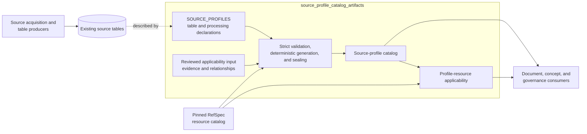
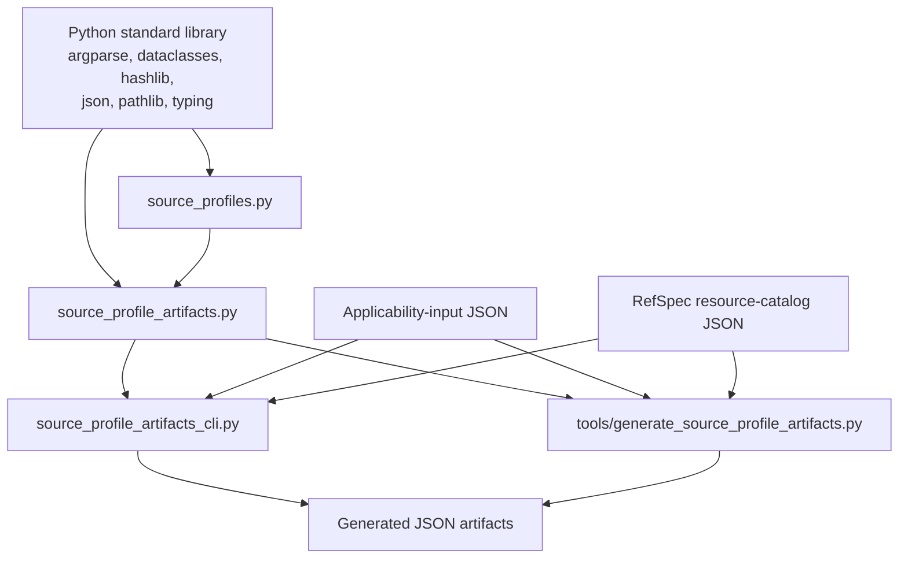
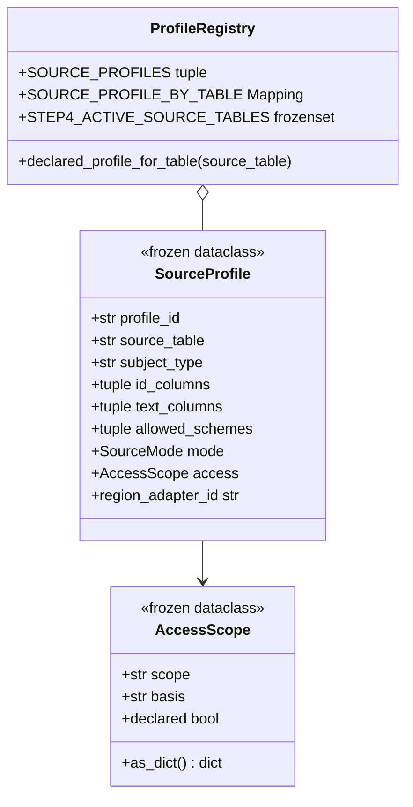
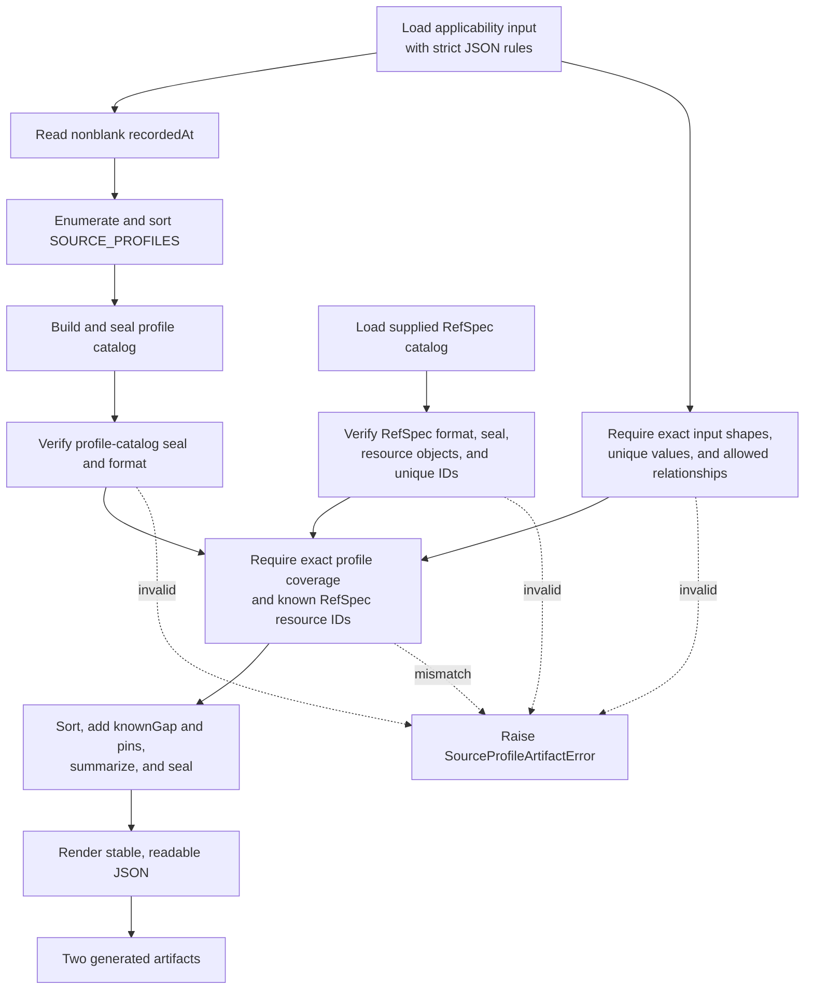
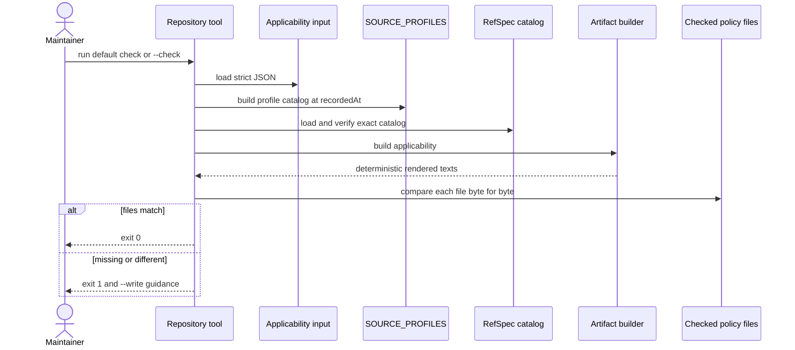

> Generated reference snapshot; see [current architecture](../docs/architecture.md),
> [operator commands](../docs/cli.md), and [reference maintenance](../docs/documentation.md).

# Source-profile catalog artifacts

The `source_profile_catalog_artifacts` module publishes a deterministic description of SpicyRegs source tables and their relationships to RefSpec controlled resources. It turns side-effect-free Python declarations and a reviewed applicability input into two digest-pinned JSON artifacts: a source-profile catalog and a profile-resource applicability document.

This module describes existing table identities, text fields, processing modes, access, and source-native evidence relationships. It does not acquire records, inspect table contents, interpret documents, choose search candidates, rank results, or publish a source-native release.

## Purpose and system role

| Question | Answer |
| --- | --- |
| What goes in? | The in-code `SOURCE_PROFILES` declarations, a reviewed applicability-input JSON object, one exact RefSpec resource catalog, and a caller-supplied `recordedAt` value. |
| What happens? | The builder validates the inputs, requires complete profile coverage, checks every referenced RefSpec resource, orders the generated data, computes canonical SHA-256 digests, and derives content-based identifiers. |
| What comes out? | `source-profile-catalog` JSON and `profile-resource-applicability` JSON. The applicability artifact pins the exact profile catalog and RefSpec catalog used to create it. |
| How do we check it? | Regenerate both documents from the declarations and pinned inputs, compare them with the checked files byte for byte, and run the focused tests for closure, tamper detection, policy boundaries, and import isolation. |

The module forms the catalog branch of source-definition governance. The separate source-domain drift gate checks observed column values against publisher documentation; it does not build these artifacts.

## Boundaries and terminology

`SourceProfile` in this module describes how an existing SpicyRegs table can enter later document and concept processing. It differs from `SourceNativeProfile`, which defines source acquisition, evidence replay, and release construction. See [source-native acquisition profiles](source_native_acquisition_profiles.md) for that separate API and [source-native release lifecycle](source_native_release_lifecycle.md) for publication and verification.

The source-profile catalog starts after a producer has created a source table. Connector record shapes and flat projections belong to [source connector contracts and projections](source_connector_contracts_and_projections.md). RefSpec owns the resource catalog and its resource meanings. This module imports no RefSpec code; it validates a supplied RefSpec JSON artifact and records its identity.



The dotted edge is descriptive: artifact generation does not open or validate the source tables.

## Code and data layout

| Path | Responsibility |
| --- | --- |
| [`src/spicy_docs/source_profiles.py`](../src/spicy_docs/source_profiles.py) | Defines access values, profile fields, processing modes, the immutable profile registry, exclusions, and table lookup. |
| [`src/spicy_docs/source_profile_artifacts.py`](../src/spicy_docs/source_profile_artifacts.py) | Loads strict JSON, canonicalizes and seals data, validates applicability and RefSpec inputs, builds both artifacts, and checks deterministic regeneration. |
| [`src/spicy_docs/source_profile_artifacts_cli.py`](../src/spicy_docs/source_profile_artifacts_cli.py) | Implements the installed `build-source-profile-artifacts` command for caller-selected inputs and output directories. |
| [`tools/generate_source_profile_artifacts.py`](../tools/generate_source_profile_artifacts.py) | Checks or rewrites the repository's versioned policy artifacts. |
| [`policies/profile-resource-applicability-input-v0.json`](../policies/profile-resource-applicability-input-v0.json) | Reviewed, hand-maintained evidence fields and RefSpec relationships for every declared profile. |
| [`policies/source-profile-catalog-v0.json`](../policies/source-profile-catalog-v0.json) | Checked deterministic profile catalog. |
| [`policies/profile-resource-applicability-v0.json`](../policies/profile-resource-applicability-v0.json) | Checked deterministic applicability result. |
| [`tests/test_source_profile_artifacts.py`](../tests/test_source_profile_artifacts.py) | Focused regeneration, closure, tamper, policy-boundary, and import-isolation tests. |

## Dependency architecture

The core has a narrow dependency surface. `source_profiles.py` uses only standard-library types. `source_profile_artifacts.py` imports the two profile registries it needs and otherwise uses only the standard library. RefSpec enters as data, not executable code.



The focused import-isolation test starts a fresh Python process and checks that importing `spicy_docs.source_profile_artifacts` does not initialize `spicy_docs.docpipeline`, `spicy_docs.ontology`, or `refspec`. Preserve this direction when adding features: pass external catalogs in as data instead of importing a sibling product's runtime.

## Source declarations

### `AccessScope`

[`AccessScope`](../src/spicy_docs/source_profiles.py#L18) is a frozen data class with two values:

- `scope` states who may see the source state.
- `basis` states why that access is allowed.

Construction rejects a blank `scope` or `basis`. `as_dict()` returns the JSON-ready two-field representation. `declared` returns `False` only for the value-equal `UNDECLARED_ACCESS` declaration.

The module defines two shared values:

| Value | `scope` | `basis` | Meaning |
| --- | --- | --- | --- |
| `UNDECLARED_ACCESS` | `unknown` | `undeclared` | The profile has no stated access basis. |
| `PUBLIC_RECORD_ACCESS` | `public` | `us-federal-public-record` | The profile describes a United States federal public record. |

The `_profile()` helper assigns `PUBLIC_RECORD_ACCESS`. A future profile with another access basis must construct `SourceProfile` directly or use a purpose-specific helper.

### `SourceProfile`

[`SourceProfile`](../src/spicy_docs/source_profiles.py#L51) is a frozen data class that binds one versioned profile to one source table.

| Field | Meaning | Validation in this module |
| --- | --- | --- |
| `profile_id` | Stable, versioned profile name used to join all three inputs. | Type annotation only; contributors must keep it nonempty and unique. |
| `source_table` | Existing source-table name. | Type annotation only; lookup construction assumes uniqueness. |
| `subject_type` | Downstream subject represented by one row. | Type annotation only. |
| `id_columns` | Ordered columns that identify the subject. | Must contain at least one entry. |
| `text_columns` | Ordered text-bearing or descriptive fields available to later processing. | Type annotation only. |
| `allowed_schemes` | Concept schemes that later processing may apply. | Type annotation only. |
| `mode` | Source shape used to select a region adapter. | Must occur in `REGION_ADAPTER_IDS`. |
| `access` | Explicit access scope and basis. | `AccessScope` validates its own values. |

The runtime checks are intentionally small. Frozen values and tuple fields prevent normal mutation, but the class does not check blank identifiers, duplicate columns, duplicate profile IDs, duplicate tables, or whether named columns exist in published data. Contributors must cover those rules through review and tests.

### Processing modes and adapter identities

`mode` maps to a versioned `regionAdapterId`. The catalog records both values so a consumer can select a known algorithm without inferring it from the table name.

| Mode | Generated adapter ID | Intended source shape |
| --- | --- | --- |
| `atomic-record` | `atomic-fields:source-elements-v2` | Treat selected fields as one record-level unit. |
| `structured-children` | `structured-children:source-elements-v2` | Preserve repeated or nested child facts. |
| `hierarchical-document` | `hierarchical-text:source-elements-v2` | Preserve document or text hierarchy during later segmentation. |

Changing `REGION_ADAPTER_VERSION` changes every generated adapter ID and therefore changes the profile-catalog digest.

### Registry and lookup

`SOURCE_PROFILES` is the canonical ordered tuple of declarations. The current checked catalog contains 19 profiles: 11 hierarchical documents, 7 atomic records, and 1 structured-children profile. All 19 currently declare public-record access.

`SOURCE_PROFILE_BY_TABLE` wraps the table-to-profile dictionary in `MappingProxyType`, which prevents callers from changing the lookup. [`declared_profile_for_table()`](../src/spicy_docs/source_profiles.py#L132) returns the mapped profile and raises `KeyError` for an undeclared table.

`EXCLUDED_SOURCE_TABLES` records why two known tables do not become independent subjects:

- `comments_index` contains aggregate partition metadata.
- `fr_docket_links` represents relationships between endpoint records.

`STEP4_ACTIVE_SOURCE_TABLES` contains every declared source table except `comments`. Generation converts membership in that set into each catalog row's `active` Boolean. The current artifact therefore contains 18 active profiles and 1 deferred profile, `regulations-comment-v1`.

For the complete current profile roster and its columns, use the checked [`source-profile-catalog-v0.json`](../policies/source-profile-catalog-v0.json) rather than copying the declaration list into consumer code.



## Artifact formats

All three SpicyRegs formats are explicitly experimental:

| Document | Format value |
| --- | --- |
| Applicability input | `spicyregs-profile-resource-applicability-input/experimental-v0` |
| Source-profile catalog | `spicyregs-source-profile-catalog/experimental-v0` |
| Profile-resource applicability | `spicyregs-profile-resource-applicability/experimental-v0` |

The accepted external RefSpec format is `refspec-resource-catalog/experimental-v0`. A format change is an interface change: update producers, validators, fixtures, checked artifacts, and downstream readers together.

### Source-profile catalog

`build_source_profile_catalog(recorded_at=...)` sorts declarations by `profileId` and copies these values into each profile row:

| Output field | Source |
| --- | --- |
| `profileId`, `sourceTable`, `subjectType`, `idColumns`, `textColumns`, `allowedSchemes`, `mode` | The `SourceProfile` declaration. |
| `access` | `SourceProfile.access.as_dict()`. |
| `regionAdapterId` | The mode-to-adapter mapping. |
| `active` | Membership in `STEP4_ACTIVE_SOURCE_TABLES`. |

The top-level object adds `experimental`, `format`, `recordedAt`, summary counts, `profileCatalogDigest`, and `profileCatalogId`.

The builder only requires `recordedAt` to be a nonblank string. It does not parse or normalize a timestamp. Callers must supply the intended canonical value; changing it changes the catalog digest and identifier even when every profile stays the same.

### Applicability input

The applicability input is reviewed policy data. Its root must contain exactly `format`, `profiles`, and `recordedAt`. Each declared profile must appear exactly once with exactly these fields:

| Field | Meaning | Rules |
| --- | --- | --- |
| `profileId` | Join key to `SOURCE_PROFILES` and the generated profile catalog. | Nonblank and unique across input rows. |
| `evidenceFields` | Source-native fields that support the stated relationships. | Nonempty list of nonblank, distinct strings; input order is preserved. |
| `resourceRelationships` | RefSpec resources and the ways source evidence relates to them. | May be empty; each resource may occur once per profile. |

Each resource relationship contains exactly `resourceId` and `relationships`. The relationship list must be nonempty and distinct and may contain only:

| Relationship | Meaning at this boundary |
| --- | --- |
| `nativeCodeOrClassification` | A source field carries a publisher-assigned code or classification related to the resource. |
| `nativeIdentifier` | A source field carries an identifier governed or described by the resource. |
| `nativeStructure` | A source field preserves structure governed or described by the resource. |
| `sourceAssignedVocabulary` | The source assigns a value from a vocabulary represented by the resource. |

These relationships state the available source evidence. They do not select concepts, expand mappings, create tags, define facets, or set ranking policy. The test suite explicitly rejects search-policy fields in the generated applicability artifact.

### RefSpec resource catalog input

`_verify_refspec_catalog()` accepts a supplied RefSpec catalog only when:

- its `format` matches the supported experimental format;
- `catalogDigest` is a lowercase `sha256:` digest;
- that digest equals the canonical digest of the object without `catalogDigest` and `catalogId`;
- `catalogId` equals `urn:ref:resource-catalog:<digest-hex>`;
- `resources` is a list of objects with nonblank, unique `resourceId` values.

The builder checks that every resource named by the applicability input occurs in that verified catalog. It pins the identity of the whole RefSpec catalog, so any accepted catalog change changes the applicability artifact even when the referenced resource IDs remain present.

Digest validation proves content consistency, not publisher authenticity. Callers must obtain the RefSpec file from the intended repository, release, or other trusted channel.

### Profile-resource applicability

`build_profile_resource_applicability()` joins the three sources of truth:

1. the declared profile-ID set from `SOURCE_PROFILES`;
2. the profile-ID set in the applicability input;
3. the profile-ID set in the supplied, sealed profile catalog.

All three sets must match exactly. The builder also requires every referenced RefSpec resource to exist, sorts profiles by `profileId`, sorts each profile's resources by `resourceId`, and sorts each relationship vocabulary list.

Each output profile retains `profileId`, `evidenceFields`, and `resourceRelationships` and gains `knownGap`:

- An empty relationship list produces `No source-native controlled-resource relationship is declared for this profile.`
- A nonempty list states that evidence is limited to the declared fields and that the pinned RefSpec catalog states distribution availability.

The top-level output records summary counts and exact `{id, digest}` pins for both input catalogs. `_seal(..., kind="applicability")` then adds `applicabilityDigest` and `applicabilityId`.

The current checked result contains 19 profile rows, 47 profile-to-resource entries, and 26 distinct referenced resources. Treat the artifact, not these documentation counts, as authoritative after a change.

## Canonical JSON and content identities

The code separates hashing from human-readable rendering:

| Function | Representation |
| --- | --- |
| `canonical_json_bytes(value)` | UTF-8 JSON, recursively sorted object keys, compact `,` and `:` separators, unescaped Unicode, and no non-finite numbers. It adds no trailing newline. |
| `canonical_sha256(value)` | SHA-256 of the canonical bytes, returned as `sha256:<64 lowercase hexadecimal digits>`. |
| `render_json(value)` | UTF-8-compatible text with sorted keys, two-space indentation, unescaped Unicode, and one trailing newline. |

`_seal()` hashes the payload before adding identity fields. `_verify_seal()` removes the expected digest and ID fields, recomputes the payload digest, and checks the derived Uniform Resource Name (URN).

| Artifact | Digest field | Identifier pattern |
| --- | --- | --- |
| Profile catalog | `profileCatalogDigest` | `urn:spicy-regs:profile-catalog:<digest-hex>` |
| Applicability | `applicabilityDigest` | `urn:spicy-regs:applicability:<digest-hex>` |
| RefSpec input | `catalogDigest` | `urn:ref:resource-catalog:<digest-hex>` |

List order remains part of the canonical content. The builders sort profile rows, resources, and relationship names, but preserve declaration order inside column and scheme tuples and preserve applicability `evidenceFields` order. Reordering a preserved list changes the digest.


## Generation and validation flow



### Strict JSON loading

`load_json()` reads UTF-8 text and requires one JSON object at the root. Its `object_pairs_hook` rejects duplicate object keys at every nesting level, and `parse_constant` rejects `NaN`, `Infinity`, and `-Infinity`. Syntax errors remain `JSONDecodeError`, a `ValueError` subclass caught by both command-line entry points.

### Deterministic checked-artifact validation

[`validate_source_profile_artifacts()`](../src/spicy_docs/source_profile_artifacts.py#L308) provides the strongest in-process check. It rebuilds the profile catalog using the applicability input's `recordedAt`, requires exact object equality with the supplied catalog, rebuilds applicability from that catalog and the supplied RefSpec catalog, and requires exact equality with the supplied applicability object.

Calling `build_profile_resource_applicability()` alone verifies the supplied profile catalog's seal, format, and profile-ID coverage, but it does not require every catalog row to equal the current `SourceProfile` declaration. Use `validate_source_profile_artifacts()` or the repository check workflow when admitting checked artifacts.



## Command-line entry points

### Installed builder

The `build-source-profile-artifacts` entry point accepts explicit paths:

```bash
uv run build-source-profile-artifacts \
  --applicability-input /path/to/profile-resource-applicability-input.json \
  --refspec-catalog /path/to/resource-catalog.json \
  --output /path/to/generated-directory
```

It creates the output directory and writes:

- `source-profile-catalog.json`;
- `profile-resource-applicability.json`.

The command returns status 0 on success. `argparse` reports input, validation, and file-system errors and exits with status 2. Writes use ordinary `Path.write_text()` calls in catalog-then-applicability order; they are neither atomic nor create-once. Use a private or disposable output directory when a partial write would matter.

### Repository check and rewrite tool

From the repository root, the default mode and explicit `--check` mode both regenerate the expected text in memory and compare it with the checked `policies/*-v0.json` files:

```bash
uv run python tools/generate_source_profile_artifacts.py --check \
  --refspec-catalog /path/to/resource-catalog-v0.json
```

The tool defaults the RefSpec path to `RefSpec/portfolio/resource-catalog-v0.json` inside the SpicyDocs repository. In the current adjacent-repository checkout, RefSpec instead lives beside SpicyDocs, so callers must pass `--refspec-catalog ../RefSpec/portfolio/resource-catalog-v0.json` from the SpicyDocs root. Always pass the option when reviewing a specific catalog.

After reviewing the input and declaration changes, rewrite both checked outputs with:

```bash
uv run python tools/generate_source_profile_artifacts.py --write \
  --refspec-catalog /path/to/resource-catalog-v0.json
```

`--write` overwrites the two versioned outputs sequentially and exits with status 0. Check failures and caught validation or file-system errors exit with status 1.

The current success message in `tools/generate_source_profile_artifacts.py` is hard-coded as `17 profiles, 16 active`; the current checked artifact and focused test contain 19 profiles and 18 active. Do not parse those message counts. Read the generated `summary` or derive the count from `profiles` until the message is corrected.

## Failure behavior and guarantees

`SourceProfileArtifactError`, a `ValueError` subclass, represents incomplete or inconsistent artifact data. Common failures include:

- duplicate JSON keys or non-finite values;
- unsupported format identifiers;
- blank strings, duplicate list values, or unexpected object keys;
- malformed SHA-256 digests or content-derived IDs;
- a modified profile or RefSpec catalog with a stale digest;
- missing or extra applicability profiles;
- duplicate resources within a profile;
- unsupported relationship names;
- references to absent RefSpec resources;
- checked artifacts that differ from deterministic regeneration.

The module provides these guarantees:

- deterministic output for the same declarations and exact inputs;
- explicit, content-derived identity for both generated artifacts;
- exact profile-ID closure across declarations, catalog, and applicability input;
- reference integrity against one digest-pinned RefSpec catalog;
- no runtime import of document-processing, ontology, or RefSpec code.

The module does not guarantee:

- that a declared table or column exists;
- that `evidenceFields` name real fields or prove the stated semantic relationship;
- that a RefSpec catalog came from a trusted publisher;
- that an `active` profile has been deployed or adopted by a consumer;
- that a generated artifact has been published externally;
- atomic or immutable output-file writes;
- search, ranking, mapping, or concept-selection behavior.

These distinctions matter during review: a valid schema and matching digest prove internal consistency, not semantic correctness or downstream adoption.

## Contribution guide

### Add or change a source profile

1. Update `SOURCE_PROFILES` with a unique versioned `profile_id`, a unique source table, stable identity columns, source text columns, permitted schemes, the correct mode, and an explicit access basis.
2. Add or update exactly one matching row in `profile-resource-applicability-input-v0.json`.
3. Decide whether the table belongs in `STEP4_ACTIVE_SOURCE_TABLES` or needs a documented exclusion or deferral.
4. Set `recordedAt` to the reviewed policy-recording value. The code checks only that it is nonblank.
5. Regenerate both checked artifacts against the intended, exact RefSpec catalog.
6. Review the profile row, applicability relationships, catalog pins, summary changes, and both new content identities.
7. Run the focused tests and the repository check.

Do not hand-edit the two generated policy artifacts. Fix the declaration or applicability input, then regenerate them.

When the profile's meaning changes incompatibly, issue a new versioned `profile_id`. Moving a declaration within `SOURCE_PROFILES` alone does not change generated profile order because the builder sorts by ID. Reordering columns, schemes, or evidence fields does change canonical content.

### Change an applicability relationship

1. Confirm that each `evidenceField` identifies preserved source evidence rather than a derived search value.
2. Choose only relationships defined in `RESOURCE_RELATIONSHIPS`.
3. Confirm each `resourceId` in the exact RefSpec catalog selected for generation.
4. Keep search policy out of this artifact.
5. Regenerate and review the changed relationships, RefSpec pin, summary, digest, and identifier.

An empty resource list is valid and produces an explicit `knownGap`; an empty `evidenceFields` list or empty relationship-name list is invalid.

### Update the RefSpec catalog

1. Obtain the intended catalog from a trusted RefSpec checkout or release.
2. Verify its own digest and identifier through the generation command.
3. Resolve every removed or renamed resource referenced by applicability input.
4. Regenerate applicability even when the source-profile declarations did not change; the artifact pins the whole RefSpec catalog.
5. Coordinate consumer updates if the new pin has not yet reached their allowed catalog set.

### Change an artifact format

Treat an `experimental-v0` change as a cross-product interface change. Update the format constant, builder, validator, policy filenames where appropriate, tests, command documentation, and known consumers together. Retain strict loading and deterministic generation so old and new artifacts cannot be confused silently.

## Verification

Run these checks from the repository root:

```bash
uv run pytest -q tests/test_source_profile_artifacts.py
uv run python tools/generate_source_profile_artifacts.py --check \
  --refspec-catalog /path/to/resource-catalog-v0.json
uv run ruff check \
  src/spicy_docs/source_profiles.py \
  src/spicy_docs/source_profile_artifacts.py \
  src/spicy_docs/source_profile_artifacts_cli.py \
  tools/generate_source_profile_artifacts.py \
  tests/test_source_profile_artifacts.py
```

The focused test suite checks:

- exact deterministic equality of both checked artifacts;
- the current profile totals and exact profile-set closure;
- absence of search-policy fields;
- rejection of unknown RefSpec resources;
- detection of RefSpec catalog tampering;
- import isolation from document-pipeline, ontology, and RefSpec runtimes.

For a review that changes only documentation, the focused artifact test and repository check confirm the documented current behavior without rewriting any policy file.
