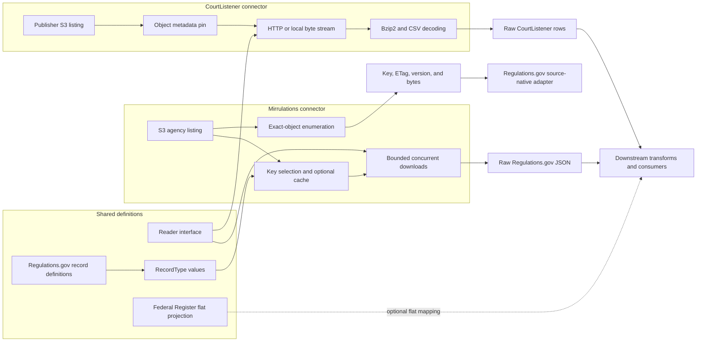
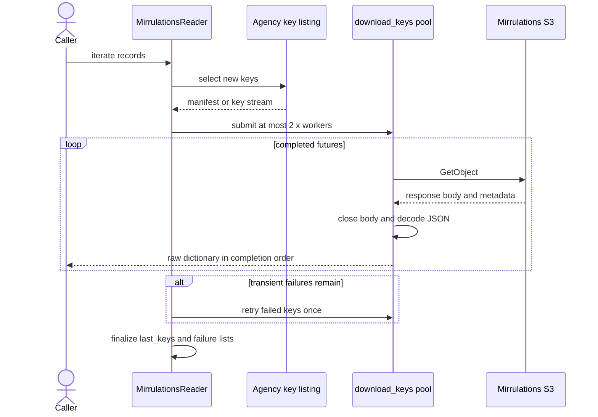
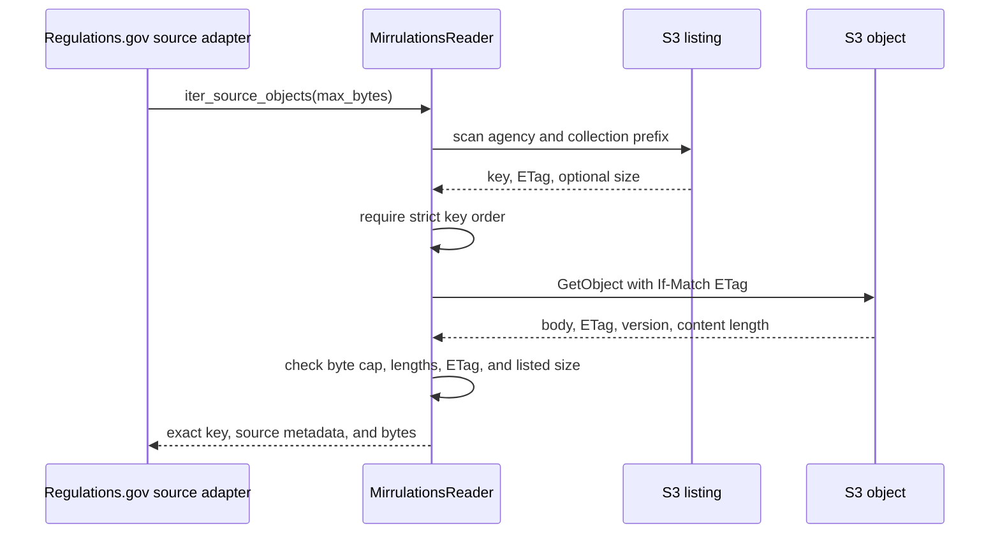
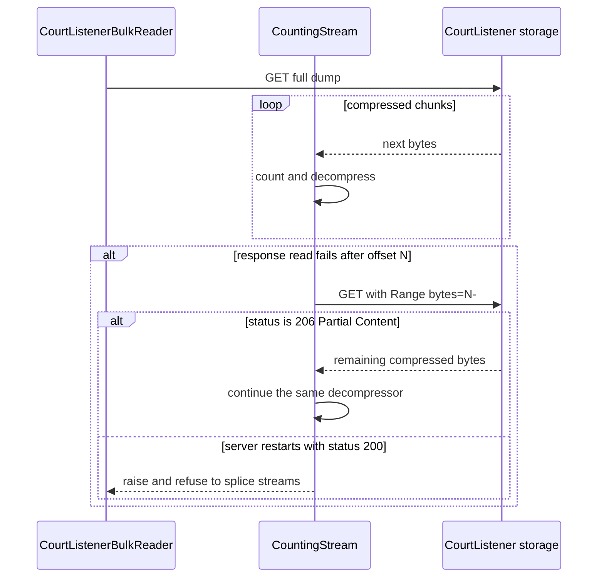

# Source connectors

The source-connector layer reads publisher data without interpreting it. It owns external listing, transport, bounded streaming, retry behavior, and raw decoding. Callers own later transformation, joins, and publication decisions.

This document covers the interfaces and schemas in [`sources/base.py`](../src/spicy_docs/sources/base.py), [`schemas/base.py`](../src/spicy_docs/schemas/base.py), [`schemas/regulations.py`](../src/spicy_docs/schemas/regulations.py), and [`schemas/federal_register.py`](../src/spicy_docs/schemas/federal_register.py), plus the Mirrulations and CourtListener implementations. See the [main module overview](spicy-docs.md) for the source-native release engine and the wider product boundary.

## Purpose and system boundary

The package owns two connector families:

| Connector | Input | Processing | Output | Main check |
| --- | --- | --- | --- | --- |
| [`MirrulationsReader`](../src/spicy_docs/sources/mirrulations.py) | Regulations.gov JSON objects in the public Mirrulations S3 bucket | Select keys by agency and `RecordType`, fetch objects, decode JSON, and classify failures | Raw JSON dictionaries, or exact object bytes with S3 metadata | Incremental mode reconciles failed keys; exact-object mode requires ordered listing metadata, matching ETags, and matching sizes |
| [`CourtListenerBulkReader`](../src/spicy_docs/sources/courtlistener_bulk.py) | A local or remote `.csv.bz2` bulk dump | Stream compressed bytes, decompress inline, parse CSV, normalize blank fields, and apply an optional row filter | Raw row dictionaries and run measurements | Publisher listing metadata identifies the dump; range resumes must continue at the exact compressed offset |

Both readers are pure acquisition components. They do not flatten source records into a product model, choose preferred text, or join records from different publishers.

## Architecture and dependencies



The two connectors share only the small `Reader` interface. Their source guarantees differ:

- Mirrulations exposes addressable S3 objects. It can track each key for incremental work or pin each listed object for complete-snapshot evidence.
- CourtListener publishes large keyless CSV dumps. It streams one dump sequentially and reports how much of that stream it read.

## Shared interfaces and record definitions

### `Reader` and `Writer`

[`Reader`](../src/spicy_docs/sources/base.py) requires one method: `iter_records() -> Iterator[dict]`. Each implementation owns pagination, batching, retries, and deduplication. A keyed reader should expose final key disposition through `last_keys` and `failed_keys`.

[`Writer`](../src/spicy_docs/sources/base.py) requires `write(records)`. No concrete writer lives in this repository; it remains an extension point for an external sink.

The base key lists are class defaults. A keyed implementation should assign instance lists during construction, as `MirrulationsReader` does, to avoid shared mutable state. Treat all post-run lists and counters as final only after exhausting the iterator.

### `RecordType`

[`RecordType`](../src/spicy_docs/schemas/base.py) is a frozen value object, not a base class. It groups five facts about one flat record shape:

| Field | Meaning |
| --- | --- |
| `name` | Stable record-type name used by registries and staging paths |
| `schema` | Column-to-type mapping for the flat record |
| `dedup_key` | Primary identity used by later deduplication |
| `extract` | Function that maps one raw JSON dictionary to the flat shape |
| `path_pattern` | Optional source path fragment; Mirrulations requires it |

Construction fails when `dedup_key` is absent from `schema` or when the schema lacks `modify_date`. Contributors add a shape by constructing a value and registering it, not by subclassing `RecordType`.

[`schemas/regulations.py`](../src/spicy_docs/schemas/regulations.py) defines three values:

| Value | Mirrulations path | Deduplication key | Extraction notes |
| --- | --- | --- | --- |
| `DOCKET` | `/docket/` | `docket_id` | Selects docket identity, agency, title, type, modified date, abstract, and RIN |
| `DOCUMENT` | `/documents/` | `document_id` | Preserves downloadable formats as JSON, retains the first URL for compatibility, and leaves downstream text fields null |
| `COMMENT` | `/comments/` | `comment_id` | Collects included attachment formats as JSON and leaves downstream text-extraction fields null |

`RECORD_TYPES` preserves the default processing order: dockets, documents, then comments. The three path patterns must remain mutually exclusive because `list_agency_files_by_type()` assigns each S3 key to the first matching pattern.

`MirrulationsReader.iter_records()` deliberately does **not** call `RecordType.extract`. It uses the record type to locate files, then yields decoded source JSON. A flat-record caller must apply `record_type.extract(payload)` itself or pass the payload to a downstream transform. The source-native path uses its own closed source classifier instead.

### Federal Register flat projection

[`schemas/federal_register.py`](../src/spicy_docs/schemas/federal_register.py) provides `FEDERAL_REGISTER_COLUMNS` and `project_federal_register_document()`. The helper maps an exact API result onto stable public columns, serializes arrays as JSON, derives comma-separated agency slugs, converts scalar values to text, and sets `modify_date` to null because the API exposes no update instant.

Neither connector calls this helper. It is an optional downstream mapping, separate from the Federal Register source-native classifier. No current in-repository caller imports it.

## Mirrulations connector

The implementation lives in [`sources/mirrulations.py`](../src/spicy_docs/sources/mirrulations.py). It uses unsigned S3 access to bucket `mirrulations`, prefix `raw-data`, in `us-east-1`.

| Component | Responsibility |
| --- | --- |
| `MirrulationsReader` | Configure one agency and record type, expose raw-record and exact-object iteration, and publish final key disposition |
| `DownloadedObject` | Carry the bytes and response metadata from one checked S3 GET |
| `MirrulationsSourceObject` | Carry the exact key, listed ETag, response version, and bytes required by source-native acquisition |
| `DownloadFailures` | Separate retryable transport keys from deterministic parse-failure keys |
| `_AgencyListingCache` | Reuse one materialized multi-type agency scan across sequential readers |
| `download_keys()` | Keep a bounded set of serial or threaded GET-and-decode tasks in flight |

### Listing and key selection

`discover_agencies()` calls the S3 client with `Delimiter="/"` and returns sorted top-level agency names. The current helper reads one `list_objects_v2` response; it does not paginate agency discovery.

Record listing has two forms:

- `iter_json_files()` streams matching keys for one agency and one path pattern.
- `list_json_files()` materializes that stream for a reusable manifest.
- `list_agency_files_by_type()` scans one agency prefix once and places each matching key into a record-type list.

A key must contain `/text-`, contain the selected `path_pattern`, and end in `.json`. `since_year` reads a four-digit year from the docket-style path prefix and skips older matches. Keys with no matching year remain eligible. A truthy `processed_keys` object acts as a membership index for incremental exclusion.

`reader_factory()` binds common options and creates one reader per agency and record type. Its default `_AgencyListingCache` lets sequential readers for the same agency reuse one materialized scan. The cache protects stored values with a lock, but it is not a single-flight scan: concurrent first readers for the same agency can both scan before either stores a result.

### Three read modes

| Mode | Entry point | Listing memory | Downloads | Failure policy | Intended use |
| --- | --- | --- | --- | --- | --- |
| Manifest-producing incremental read | `iter_records()` with `retain_keys=True` | Materialized in `last_keys` | Concurrent | Collect failures, then retry transient failures once | Incremental ingestion with processed-key tracking |
| Bounded raw read | `reader_factory(..., bounded=True)` then `iter_records()` | Streams keys; `last_keys` stays empty | Concurrent, with at most `2 * workers` submitted | Retry each transient failure once, then raise any remaining download or parse failure | Bounded-memory, fail-closed processing |
| Exact-object enumeration | `iter_source_objects()` | Streams the ordered S3 listing | Serial | Fail immediately on any listing, metadata, size, or GET problem | Complete-snapshot source-native evidence |

#### Incremental interaction



`download_keys()` defaults to 16 workers and caps queued futures at twice the active worker count. This limit lets it consume a large key iterator gradually. Output follows completion order, not S3 listing order.

`s3_resource()` sizes botocore's connection pool to the requested concurrency and configures 30-second connect and read timeouts plus standard retries. A factory creates a resource per reader; the reader shares that resource across its download threads. If a caller raises `download_workers` above 16, it should also create the resource with at least that many pool connections.

### Failure and retry semantics

`download_object_bytes()` closes the response body in a `finally` block. This protects the shared connection pool when a read fails.

`download_and_parse()` then classifies failures by stage:

| Stage | Exception | Meaning | Incremental key treatment |
| --- | --- | --- | --- |
| S3 object creation, GET, or body read | `TransientDownloadError` | The bytes were not acquired reliably; another attempt may succeed | Retry once in the same run; if it still fails, add to `failed_keys` and remove from `last_keys` |
| JSON decode or supplied extraction | `PayloadParseError` | The fetched bytes cannot produce a record without a code or data change | Add to `parse_failed_keys` and keep in `last_keys` so every incremental run does not retry the same deterministic payload |
| Successful GET and decode | none | Raw payload is available | Yield the dictionary and keep the key in `last_keys` |

This parse-failure rule intentionally differs from the base reader's usual “successfully consumed keys” description. The key is considered processed to stop an endless automatic retry, while `parse_failed_keys` preserves the replay obligation.

When `fail_fast=True`, `download_keys()` records the failure and re-raises it. The bounded factory also requests one transient retry inside each task. With `failures=None`, the lower-level helper logs and drops classified failures; production callers that need complete accounting should always pass a `DownloadFailures` collector or use `MirrulationsReader`.

### Exact-object mode

`iter_source_objects(max_bytes=...)` supports complete Mirrulations evidence. It yields `MirrulationsSourceObject(key, etag, version_id, content)` and performs these checks before each yield:

1. The record type has a `path_pattern`, and no nonempty `processed_keys` set can hide listing members.
2. Matching listing keys increase strictly.
3. Each listing row carries a nonempty ETag and, when present, a valid nonnegative size.
4. The GET uses `IfMatch` with the listed ETag.
5. The response does not exceed `max_bytes`, its declared `ContentLength` matches the bytes read, and its returned ETag matches the condition.
6. When the listing provides a size, that size matches the downloaded body.



This path does not decode JSON and does not use the concurrent download pool. [`source_native_cli.py`](../src/spicy_docs/source_native_cli.py) constructs the reader, and [`regulations_gov_source_native.py`](../src/spicy_docs/regulations_gov_source_native.py) classifies the exact bytes and seals them into bounded evidence packs. Keeping byte capture separate from classification lets independent replay inspect the same source object.

## CourtListener bulk connector

The implementation lives in [`sources/courtlistener_bulk.py`](../src/spicy_docs/sources/courtlistener_bulk.py). It complements docket-oriented API acquisition by reading the publisher's periodic full-table dumps, including opinion text.

| Component | Responsibility |
| --- | --- |
| `BulkObject` | Describe one listed publisher object and derive its dataset, date, filename, and download URL |
| `CourtListenerBulkReader` | Select a local or remote dump, parse rows, apply bounds and filtering, and expose run measurements |
| `_CountingStream` | Count compressed and decompressed bytes, decompress incrementally, and resume a dropped remote stream |
| `_LocalBz2Stream` | Reuse the counting and decompression logic for a local handle without network resume |
| `_UnrangeableResume` | Stop a resume when the server returns a restarted full stream instead of partial content |

### Publisher enumeration and object identity

`list_bulk_dumps()` paginates the bucket's S3 v2 listing under `bulk-data/`. Each `BulkObject` carries the key, exact compressed size, and `LastModified` text. Its properties derive the filename, dataset name, optional ISO dump date, and public download URL.

`latest_dump_date()` and `find_dump()` select a published object from an already-fetched listing. `published_object_pin()` produces receipt-ready metadata and can require expected byte size and last-modified text before a long read starts. This pin detects a changed listing object, but it is not a content digest and the subsequent HTTP stream does not use an ETag precondition.

All network requests use the module's identifying `User-Agent`. `_open()` applies a 180-second timeout, makes at most five open attempts, and uses bounded exponential backoff. The reader intentionally uses one download connection rather than parallel range reads.

### Streaming pipeline


`CourtListenerBulkReader` chooses a local file when `local_file` is set. Otherwise, it requires `dump_date` and opens `{dataset}-{date}.csv.bz2` from the public bulk endpoint.

`_CountingStream` reads compressed data in 4 MiB chunks, feeds one `BZ2Decompressor`, and exposes decompressed bytes through `io.BufferedReader`. If the input contains concatenated bzip2 streams, it starts a new decompressor and carries `unused_data` across the boundary. `TextIOWrapper` decodes UTF-8 with replacement for invalid byte sequences. `csv.DictReader` supports embedded newlines and uses `escapechar="\\"` because CourtListener escapes embedded quotes with backslashes.

Each parsed row becomes a dictionary. Empty strings become `None`; other values remain strings. Entries under a `None` CSV key, which represent columns beyond the header, are omitted. The optional `row_filter` runs after CSV parsing and blank normalization but before the row is counted as yielded or returned to the caller.

### Bounds and run measurements

| Field or option | Behavior |
| --- | --- |
| `max_records` | Stops after this many rows pass the filter; the bound applies to yielded rows, not scanned rows |
| `max_compressed_bytes` | Stops before requesting another compressed chunk once the running count reaches the budget |
| `rows_scanned` | Number of CSV rows parsed, including filtered rows |
| `rows_yielded` | Number of rows that passed the filter and were yielded |
| `compressed_bytes` / `decompressed_bytes` | Bytes consumed and produced by the counting stream |
| `stopped_early` | Records that a configured bound ended the iteration, subject to the caveat below |
| `source_url` | Remote URL or local file path selected for the run |
| `resumes` | Number of accepted ranged reopen attempts recorded by the stream |

The constructor does not validate either bound. Callers should pass positive integers; in particular, `max_records` is checked after a row is yielded, so zero does not mean “yield no rows.”

The compressed-byte check occurs before a chunk read, so the final count can pass the requested budget by one 4 MiB chunk. The decompressor then drains that chunk's output. In the current implementation, `stopped_early` is true whenever a compressed-byte limit was supplied and the stream reached `_exhausted`; `_exhausted` also marks natural end-of-file, so the flag does not distinguish a reached budget from a file that ended below the budget.

As with Mirrulations, callers must exhaust the iterator before they treat counters as final. An exception closes the original handle but can leave the public counters at their prior values because the assignments occur after the CSV loop.

### Resume and failure behavior



For a remote stream, a read error triggers a ranged reopen at the exact compressed byte count. A nonzero resume must return HTTP `206`; status `200` would restart at byte zero and is rejected because splicing the restarted stream could produce plausible but corrupt rows. Resume opens use the same bounded retry policy as initial opens. A local-file read has no reopen callback, so its read error propagates immediately.

The connector raises when initial network retries or resume retries are exhausted. CSV parsing and text decoding do not have a separate failure ledger. Consumers that make coverage claims should record the listing pin, bounds, counters, `stopped_early`, and resume count with their own receipt.

## Integration boundaries

The connector layer feeds two kinds of caller:

- A raw ingestion caller consumes `iter_records()`, then applies a transform or a `RecordType.extract` function. Mirrulations and CourtListener both return source-shaped dictionaries.
- The Regulations.gov source-native path consumes `iter_source_objects()`. It validates and classifies JSON from pinned bytes, builds evidence packs, and sends those pages to the common release publisher.

The connector layer does not own:

- Regulations.gov flattening and text enrichment beyond the optional `RecordType.extract` helpers.
- CourtListener table builders or cross-table joins; those remain in downstream or sibling products.
- Federal Register page acquisition; that source has a dedicated source-native adapter.
- Artifact manifests, content-addressed storage, replay verification, or immutable directory publication.

## Extension guide

### Add a new flat `RecordType`

1. Define a frozen `RecordType` value in the appropriate schema module.
2. Include the deduplication key and `modify_date` in its schema.
3. Add a `path_pattern` when Mirrulations addresses the records by path.
4. Make the extractor return exactly the declared flat columns and preserve source values unless the mapping explicitly documents a conversion.
5. Add the value to the registry in the required processing order.
6. Prove that its path pattern cannot collide with another pattern used by `list_agency_files_by_type()`.

### Add a raw connector

1. Subclass `Reader` and inject external clients, handles, or fetch functions so tests can remain hermetic.
2. Yield raw dictionaries and leave domain interpretation to the next layer.
3. Bound pagination, queued work, object size, or stream size according to the source.
4. Close every response body and file on success and failure.
5. Separate retryable transport failures from deterministic payload failures.
6. If the source is keyed, expose per-key final disposition on instance fields after complete iteration.
7. Add explicit progress and run measurements when one iteration can take hours.

### Change Mirrulations behavior

- Preserve the distinction between incremental, bounded, and exact-object modes.
- Keep the HTTP connection pool at least as large as the thread pool.
- Keep submitted work bounded for streaming listings, and never promise input order from the concurrent path.
- Preserve `IfMatch`, strict key order, byte limits, and size checks in exact-object mode.
- Add tests for both `workers=1` and threaded execution when changing failure accounting.

### Change CourtListener behavior

- Preserve the identifying `User-Agent` and single-connection policy.
- Keep the custom CSV escape rule and embedded-newline support.
- Continue the same decompressor only after an exact `206` range response.
- Test both normal bzip2 and concatenated bzip2 streams.
- Distinguish scanned rows, yielded rows, compressed bytes, decompressed bytes, bounds, and resumes in any receipt-facing change.

## Verification and tests

The focused tests are hermetic and use in-memory S3 objects, temporary bzip2 files, and fake HTTP responses.

| Test file | Verified behavior |
| --- | --- |
| [`tests/test_mirrulations_reader.py`](../tests/test_mirrulations_reader.py) | Raw payload output; processed-key and year filtering; actual thread concurrency; single-scan type bucketing; agency listing reuse; bounded pending work; bounded-mode key streaming; body closure; transport-versus-parse failure classification; transient retry; manifest key disposition; S3 retry and pool configuration; ETag-pinned exact-object reads |
| [`tests/test_courtlistener_bulk.py`](../tests/test_courtlistener_bulk.py) | Dataset/date parsing; listing-object pin checks; dump selection; blank normalization; record bounds; filtering; backslash-escaped quotes; embedded newlines; exact-offset resume; refusal of status `200` on resume; concatenated bzip2; local read failure propagation |
| [`tests/test_regulations_gov_source_native.py`](../tests/test_regulations_gov_source_native.py) and [`tests/test_regulations_gov_comments_source_native.py`](../tests/test_regulations_gov_comments_source_native.py) | Integration of an `iter_source_objects()`-compatible reader with Regulations.gov evidence packing, scope checks, and source-native publication |

Run the connector suite from the repository root:

```bash
uv run pytest -q tests/test_mirrulations_reader.py tests/test_courtlistener_bulk.py
```

The current focused suite does not directly test S3 agency-list pagination, `list_bulk_dumps()` XML pagination, the `max_compressed_bytes` end-state distinction, invalid `RecordType` declarations, or the Federal Register flat projection. Add focused tests when changing those areas.

## Maintainer checklist

Before merging a connector change, confirm:

- Inputs remain explicit and bounded.
- Raw source values survive unchanged except for documented decoding or null normalization.
- Every open body or file closes on failure.
- Retry logic cannot turn a restarted stream into accepted data.
- Incremental keys, parse failures, and retryable failures remain distinguishable.
- Complete-snapshot paths fail closed on missing or changed source metadata.
- Output ordering is documented: completion order for concurrent downloads, source order for streaming CSV, and strict key order for exact-object enumeration.
- Tests cover the serial path, concurrent path, and relevant failure path.
