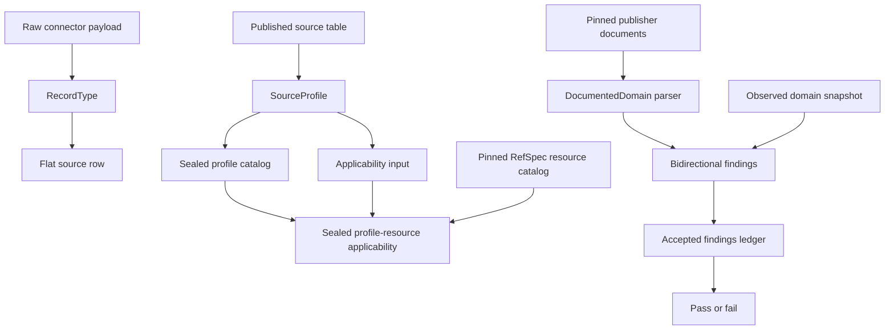
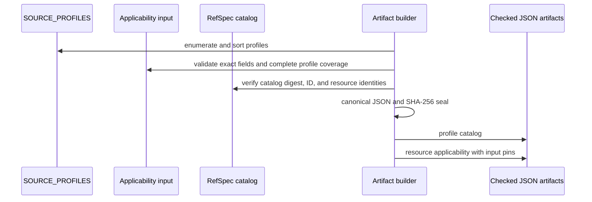
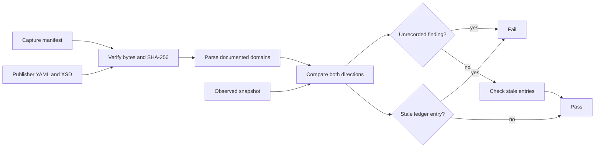

# Source definitions, profile artifacts, and domain drift

This sub-module holds the small, side-effect-free declarations that describe source records outside the source-native release engine. It answers three separate questions:

| Definition | Question it answers | Primary consumer |
| --- | --- | --- |
| `RecordType` | How does a connector flatten one raw payload, and which field identifies a duplicate? | Connector and table-building code |
| `SourceProfile` | How does an existing source table become a downstream document or subject? | Document-processing and tagging adapters |
| `DocumentedDomain` | Do observed column values agree with the values a publisher documents? | The source-domain drift gate |

These declarations preserve source facts. They do not define source-native acquisition completeness, artifact layout, semantic search, ranking, or cross-source joins. See [source-native profiles](spicy-docs_source-native-profiles.md) for acquisition rules and [source-native releases](spicy-docs_source-native-release.md) for publication mechanics.

## Component relationships



The three branches can change independently. For example, adding a `SourceProfile` for an existing table does not change how that table was acquired, and documenting a new value domain does not change its column's stored bytes.

## Connector record shapes

[`RecordType`](../src/spicy_docs/schemas/base.py) is a frozen value object. Contributors construct instances rather than subclass it. Each instance binds:

- `name`: the stable record-type name;
- `schema`: the expected flat columns and their types;
- `dedup_key`: the source identity used by later merge code;
- `extract`: a function from a parsed raw dictionary to the flat row;
- `path_pattern`: an optional source-specific locator, used by Mirrulations listing.

Construction checks two minimum invariants: the deduplication key must occur in the schema, and every schema must contain `modify_date`. The latter gives table-building code a common version-selection field even when a source can only supply `None`.

[`schemas/regulations.py`](../src/spicy_docs/schemas/regulations.py) defines three current instances:

| Record type | Mirrulations path | Identity | Extraction notes |
| --- | --- | --- | --- |
| `dockets` | `/docket/` | `docket_id` | Copies docket metadata and preserves the Regulations.gov modification value. |
| `documents` | `/documents/` | `document_id` | Preserves every direct file format in `attachments_json`; the first locator remains in `file_url` for compatibility. |
| `comments` | `/comments/` | `comment_id` | Compacts included attachment renditions into `attachments_json` and preserves comment metadata. |

Document and comment extraction leaves `text_content` and `text_extraction_status` empty. Text extraction remains a downstream SpicyRegs or DocSpec responsibility; the source connector does not imply that a PDF or attachment was parsed.

Two projection helpers serve adjacent publication paths:

- [`schemas/federal_register.py`](../src/spicy_docs/schemas/federal_register.py) maps one exact Federal Register record to stable public columns. It serializes arrays and nested values as JSON text and preserves a null `modify_date` because the API supplies no update instant.
- [`schemas/spicy_regs_public_tables.py`](../src/spicy_docs/schemas/spicy_regs_public_tables.py) defines the closed public-comment column order and projects a Parquet row while restoring `agency_code` from its Hive partition directory.

These flat projections differ from the source-native schemas, which preserve the original source record inside a wrapped record.

## Downstream source profiles

[`source_profiles.py`](../src/spicy_docs/source_profiles.py) declares how each published table enters downstream document and concept processing. It contains data and validation only, so artifact generators can import it without initializing parsers, providers, ontology code, or another product's runtime.

### `AccessScope`

`AccessScope` records who may see a source state and the stated basis. It rejects blank values and serializes to a two-field dictionary. Current profiles use `PUBLIC_RECORD_ACCESS`, whose scope is `public` and whose basis is `us-federal-public-record`. `UNDECLARED_ACCESS` exists as an explicit unknown value; its `declared` property is false.

### `SourceProfile`

A `SourceProfile` declares:

- a versioned `profile_id` and source table;
- the downstream subject type;
- one or more identity columns;
- text-bearing columns;
- permitted concept schemes;
- a source mode;
- an access declaration.

The source mode selects a stable region-adapter identifier:

| Mode | Adapter ID prefix | Intended shape |
| --- | --- | --- |
| `atomic-record` | `atomic-fields` | A record whose selected fields can be treated as one unit. |
| `structured-children` | `structured-children` | A record with repeated or nested child facts that keep their structure. |
| `hierarchical-document` | `hierarchical-text` | A document whose headings or text hierarchy should survive segmentation. |

All adapter IDs currently use `source-elements-v2`. Construction rejects an unknown mode or a profile with no identity columns.

`SOURCE_PROFILES` currently covers regulatory dockets, documents, and comments; Federal Register and Unified Agenda rows; Code of Federal Regulations sections; Congress bills; System for Award Management entities; lobbying and Federal Election Commission records; Government Accountability Office and Congressional Research Service reports; court dockets, clusters, opinions, and opinion bodies; USAspending recipients; and Federal Communications Commission proceedings and filings.

`SOURCE_PROFILE_BY_TABLE` provides read-only lookup by source table. `EXCLUDED_SOURCE_TABLES` records why relationship or aggregate tables do not become independent subjects. `STEP4_ACTIVE_SOURCE_TABLES` marks every declared table except `comments` active; that distinction is emitted as data in the profile catalog.

## Sealed profile artifacts

[`source_profile_artifacts.py`](../src/spicy_docs/source_profile_artifacts.py) turns the declarations into two deterministic, experimental JSON artifacts:

1. `source-profile-catalog.json` records every profile, its access, source columns, adapter, permitted schemes, and active status.
2. `profile-resource-applicability.json` records which source-native fields provide evidence for which exact RefSpec resources and relationships.

The artifact formats are explicitly `experimental-v0`. They are not the source-native release format.



The builder uses strict JSON loading, rejects duplicate keys and non-finite numbers, requires exact object fields, sorts repeated values, and checks complete profile coverage. It verifies the RefSpec catalog's canonical digest and content-derived identifier before accepting a referenced resource. Each output carries its own SHA-256 digest and identifier; the applicability artifact also pins the exact profile and RefSpec catalogs it used.

The allowed relationship vocabulary is limited to:

- `nativeCodeOrClassification`;
- `nativeIdentifier`;
- `nativeStructure`;
- `sourceAssignedVocabulary`.

The applicability artifact deliberately contains no candidate selection, mapping expansion, ranking, or search policy. It says which source facts support a resource relationship, not how a product should search or rank that resource.

Two entry points serve different workflows:

- `build-source-profile-artifacts` writes generated files to a caller-selected directory from explicit applicability and RefSpec catalog paths.
- [`tools/generate_source_profile_artifacts.py`](../tools/generate_source_profile_artifacts.py) checks or rewrites the repository's checked files under [`policies/`](../policies/).

[`tests/test_source_profile_artifacts.py`](../tests/test_source_profile_artifacts.py) verifies deterministic regeneration, exact profile coverage, RefSpec tamper detection, rejection of unknown resources, absence of search policy, and import isolation.

## Publisher-domain drift gate

[`sources/source_domains.py`](../src/spicy_docs/sources/source_domains.py) compares what publishers document with what published tables carry. Both directions matter:

- An `undocumented-value` occurs in data but not in the publisher's list. Consumers generated from the documented list may mishandle it.
- An `unobserved-value` appears in the publisher's list but not in the snapshot. The source may have retired it, or the bounded observation may not exercise it.

Neither condition passes by default. `ACCEPTED_DOMAIN_FINDINGS` is a closed ledger: every current finding needs a reason, and every ledger entry must still be produced by the current snapshot.

### Inputs

The checked [`sample-data/source-domains/`](../sample-data/source-domains/) directory contains:

- a manifest that pins each publisher document by SHA-256, byte length, publisher URL, observation time, media type, and publisher revision;
- an exact Regulations.gov OpenAPI YAML capture;
- an exact reginfo.gov Unified Agenda XSD capture;
- a compact observed-domain snapshot with source table identities, row counts, null counts, and distinct value counts.

`read_capture` verifies every capture's length and digest before parsing. The code never trusts a transcribed enum.

### Parsing

`openapi_schema_enum` parses only the pinned two-space-indented OpenAPI shape and rejects an unexpected line inside an enum. `xsd_documented_options` refuses a `DOCTYPE`, parses XML, and extracts quoted values from a recognized `xs:documentation` sentence. The Unified Agenda XSD uses unrestricted `xs:string` elements, so its documented lists exist in prose rather than `xs:enumeration` nodes.

The register currently checks six domains:

| Source table | Column | Publisher declaration |
| --- | --- | --- |
| `documents` | `document_type` | Regulations.gov `DocumentType` enum |
| `dockets` | `docket_type` | Regulations.gov `DocketType` enum |
| `unified_agenda` | `rule_stage` | `RULE_STAGE` documentation sentence |
| `unified_agenda` | `priority_category` | `PRIORITY_CATEGORY` documentation sentence |
| `unified_agenda` | `rin_status` | `RIN_STATUS` documentation sentence |
| `unified_agenda` | `major` | `MAJOR` documentation sentence |

The declarations pin both distinct value counts and raw option counts. This preserves the publisher's duplicate `Not Major` entry while treating it as one semantic string. Deliberate omissions are documented in code: `submitterType` lacks a matching observed comments table, `TTBL_ACTION` behaves as free text in published data, and no pinned Federal Register document states a closed `document_type` list.

### Comparison and gate



`domain_findings` first requires exact domain-key coverage and matching table-column locations. It then retains observed row support on undocumented values and emits unobserved documented values. `unrecorded_findings` catches new differences; `stale_accepted_findings` catches explanations that no longer describe the data.

[`tools/check_source_domain_drift.py`](../tools/check_source_domain_drift.py) runs this check without network or Parquet access by default. Its observation mode scans caller-supplied published Parquet files and can write a new snapshot only when the caller supplies an observation time and producer revision.

## Contribution workflows

### Add or change a `RecordType`

1. Define the complete flat schema, including `modify_date` and the deduplication key.
2. Keep extraction deterministic and preserve source values unless the existing public table explicitly requires a stable representation such as JSON text.
3. Add a `path_pattern` only when a source addresses the type by path.
4. Test the raw-payload projection, null behavior, attachment preservation, and connector selection.

### Add or change a `SourceProfile`

1. Choose a versioned profile ID, one source table, stable identity columns, source text columns, permitted schemes, mode, and explicit access basis.
2. Add or revise its applicability input so every declared profile remains covered exactly once.
3. Regenerate the checked profile catalog and applicability artifact against the intended RefSpec catalog.
4. Review the diff as a policy-data change. A successful digest regeneration proves consistency, not product adoption or search behavior.

### Add or refresh a documented domain

1. Capture the exact publisher document and record its digest, length, URL, media type, observation time, and revision in the manifest.
2. Add a narrow parser or declaration with pinned distinct and raw option counts. Reject shapes the parser does not understand.
3. Re-observe the published tables with exact input provenance.
4. Review every new and removed finding. Fix real data errors or add a specific ledger reason; remove stale ledger entries.
5. Run the gate and focused tests before accepting the new pins.

Do not edit captured publisher values or the observed snapshot by hand to make the gate pass.

## Verification commands

From the repository root:

```bash
uv run pytest -q tests/test_source_profile_artifacts.py tests/test_source_domain_drift.py
uv run python tools/generate_source_profile_artifacts.py --check --refspec-catalog /path/to/resource-catalog-v0.json
uv run python tools/check_source_domain_drift.py
```

To create a new observed snapshot, first obtain the exact published Parquet inputs, then run:

```bash
uv run python tools/check_source_domain_drift.py \
  --observe \
  --data-dir /path/to/published-tables \
  --observed-at 2026-01-01T00:00:00Z \
  --producer-revision <full-commit-id> \
  --write-snapshot
```

Review the input digests and all ledger changes before committing the snapshot.
