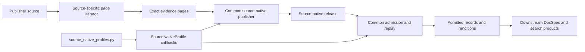
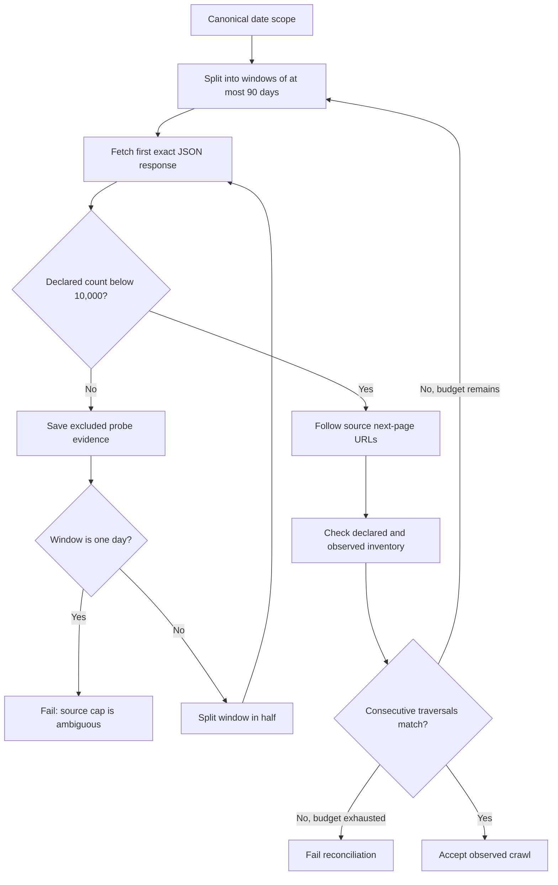
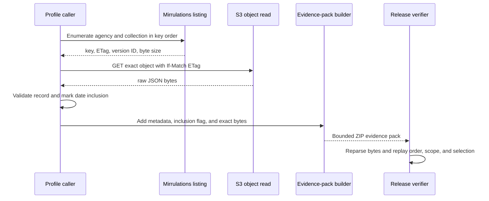
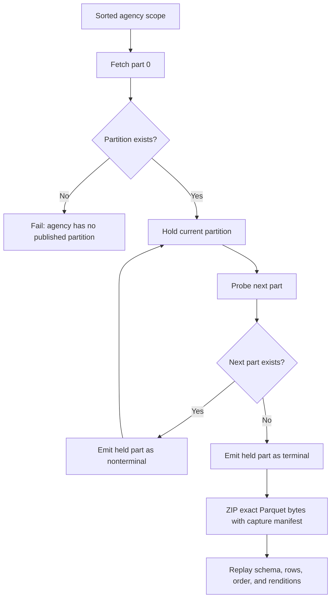

# Source-native profiles

Source-native profiles define how `spicy-docs` acquires, validates, and interprets evidence from a particular publisher. They keep source-specific rules beside the source while the common publisher handles storage, digests, manifests, receipts, and replay.

This guide covers the five profiles registered in [`source_native_profiles.py`](../src/spicy_docs/source_native_profiles.py#L38-L195): Federal Register documents, Regulations.gov documents, dockets, and comments, and SpicyRegs public-table comments. See [source-native release mechanics](spicy-docs_source-native-release.md) for the common publication and admission path. See [source definitions](spicy-docs_source-definitions.md) for the later mapping from published tables to searchable document artifacts.

## Purpose and boundary

A profile answers four source-specific questions:

| Question | Profile responsibility |
| --- | --- |
| What goes in? | A closed query scope and exact source pages, objects, or partition files. |
| What happens? | The profile parses evidence, checks traversal completeness, classifies source records, applies source scope, and identifies renditions. |
| What comes out? | Schema-tagged source records, rendition index rows, and enough evidence to replay the result. |
| How do we check it? | The same profile reparses the saved evidence and recomputes inventory, selection, record digests, renditions, and source-state claims. |

[`SourceNativeProfile`](../src/spicy_docs/source_native_profile.py#L84-L135) is an injected set of source-owned functions and identifiers. It does not fetch data and it does not define the release file layout. A source iterator produces `SourceNativePage` values; the common publisher and verifier call the profile while publishing and replaying those pages.

Do not confuse this type with [`SourceProfile`](../src/spicy_docs/source_profiles.py#L44-L67). `SourceNativeProfile` proves acquisition and source fidelity. `SourceProfile` describes how an admitted table becomes a later document artifact.



### Supply precedence

Acquisition starts with data already published by SpicyRegs when that public table can supply the needed facts. The `spicy-regs-public-comments` profile captures that community mirror without silently returning to Regulations.gov. Origin profiles cover source collections or facts the public tables cannot supply. This is the accepted supply order described in the [repository overview](../README.md#L27-L38) and in the [public-table source module](../src/spicy_docs/spicy_regs_public_tables_source_native.py#L1-L22).

The command line makes the choice explicit through `--source`; it does not run an automatic fallback chain. Callers select one of the five [source choices](../src/spicy_docs/source_native_cli.py#L68-L87). This preserves provenance: a public-table capture and a direct Mirrulations capture remain different source states even when they describe the same comment.

## Profile interface and registry

The profile interface groups source behavior into four areas:

| Area | Important members | Meaning |
| --- | --- | --- |
| Identity | `source_system_id`, `source_system_version`, acquisition policy ID and version, `scope_id`, `record_stem` | Names the source, policy, collection, and output member family. |
| Acquisition proof | `validate_query_scope`, `page_window`, `parse_page_response`, `next_page`, `traversal_check`, `acquisition_check`, `records_included` | Defines valid requests, evidence parsing, page continuity, whole-acquisition checks, and which evidence contains publishable records. |
| Record meaning | `classify_record`, `validate_record_scope`, `wrap_record`, `record_digest`, `observation_version` | Refuses source drift, checks scope, preserves source identity, and selects an observation when the source exposes versions. |
| Schema and files | `source_schema`, schema declaration and digest functions, `rendition_rows` | Pins the source shape and records source-stated file locators. |

The dataclass rejects empty identity values, a non-positive traversal limit, and version-tie refusal without a version function. It also permits `source_state_scope="complete-snapshot"` only with `traversal_acceptance="source-enumeration"` ([validation](../src/spicy_docs/source_native_profile.py#L122-L135)).

### Profile matrix

| CLI source | Closed query scope | Evidence unit | Acceptance proof and state claim | Observation rule | Renditions |
| --- | --- | --- | --- | --- | --- |
| `federal-register` | `publishedFrom`, `publishedThrough` | Exact JSON API response | Stable consecutive traversals; `observed-crawl` | One record per `document_number` in the accepted traversal | Body HTML, public HTML page, and PDF locator rows |
| `regulations-documents` | Sorted agencies plus `publishedFrom`, `publishedThrough` | ZIP of Mirrulations listing metadata and exact JSON object bytes | One source enumeration; `complete-snapshot` | One raw document per source ID | Direct document formats and attachment formats |
| `regulations-dockets` | Sorted agencies plus `modifiedFrom`, `modifiedThrough` | Same Mirrulations ZIP format | One source enumeration; `complete-snapshot` | One raw docket per source ID | None |
| `regulations-comments` | Sorted agencies plus `postedFrom`, `postedThrough` | Same Mirrulations ZIP format | One source enumeration; `complete-snapshot` | Newest normalized `modifyDate`; equal versions are refused | Direct comment formats and attachment formats |
| `spicy-regs-public-comments` | Sorted agencies and `table="comments"` | ZIP of capture manifest and one exact Parquet partition | One partition enumeration; `complete-snapshot` | Upstream selection is reported; repeated `comment_id` is refused | Valid locators parsed from `attachments_json` |

The registry composes these callbacks explicitly; importing it has no network side effects ([registry](../src/spicy_docs/source_native_profiles.py#L1-L12)).

## Federal Register documents

[`federal_register_source_native.py`](../src/spicy_docs/federal_register_source_native.py) treats the Federal Register application programming interface (API) as a changing, paginated source. It can prove what two matching crawls observed, but the API does not provide a complete immutable enumeration. The profile therefore claims `observed-crawl`, not `complete-snapshot`, even after reconciliation.

### Scope and reconciliation proof

The query scope contains only canonical ISO dates `publishedFrom` and `publishedThrough`; reversed ranges and extra fields fail ([scope validation](../src/spicy_docs/federal_register_source_native.py#L159-L174)). The iterator divides the range into windows of at most 90 calendar days and sends deterministic queries containing the complete requested field list, newest-first order, and a page size of at most 1,000.

The API caps a query at 10,000 results. A response at or above that cap is evidence of ambiguity, not an inventory to publish. The iterator saves the probe, excludes its records, and recursively splits the date window. A single capped day cannot be split and fails. Every publishable window must reconcile the source-declared record and page counts with the pages actually read ([traversal check](../src/spicy_docs/federal_register_source_native.py#L126-L156)).



The iterator defaults to two traversals and permits at most three ([page iteration](../src/spicy_docs/federal_register_source_native.py#L371-L475)). The release verifier refuses a lone traversal and accepts only stable consecutive observations; the focused tests exercise both behavior and the retained `observed-crawl` claim ([reconciliation tests](../tests/test_source_native_release.py#L673-L692)).

### Evidence, fields, and records

Each [`FederalRegisterPage`](../src/spicy_docs/federal_register_source_native.py#L99-L123) carries the exact response bytes, deterministic request URL, publisher cursor, traversal index, and window index. Replay validates the split tree as well as the pages. This prevents a publisher or producer from omitting a capped probe, a split branch, or a terminal page.

Parsing rejects invalid UTF-8, malformed JSON, duplicate keys, floating-point or non-finite numbers, unsafe next-page URLs, unknown response fields, invalid inventory values, and oversized result pages ([response parser](../src/spicy_docs/federal_register_source_native.py#L495-L527)). Classification then checks a closed document field set and validates:

- strict ASCII `document_number` identity;
- canonical `publication_date` inside the page window;
- scalar, array, agency, and Code of Federal Regulations reference types; and
- source-schema order by `/document_number`.

The wrapper preserves the classified record and source schema reference. Malformed Regulation Identifier Number (`regulation_id_numbers`) values remain in the record and produce field diagnostics; they do not cause the source row to disappear. The rendition builder emits stable rows for `body_html_url`, `html_url`, and `pdf_url`, including an explicit null locator when the source did not state one ([record and rendition functions](../src/spicy_docs/federal_register_source_native.py#L530-L657)).

### Federal Register bounds and refusals

| Bound | Value |
| --- | --- |
| Results per page | 1,000 |
| API result cap | 10,000 |
| Initial date-window size | 90 days |
| Reconciliation traversals | At most 3; stable publication normally needs 2 |
| Evidence pages per traversal | 10,000 |

Publication fails for a cyclic or unsafe cursor, changing count declarations, missing or reordered windows, a false split decision, a capped single day, schema drift, an out-of-window record, or traversals that never stabilize. Tests cover the cap split tree and excluded probes ([cap tests](../tests/test_source_native_release.py#L926-L1013)) and window/inventory failures ([acquisition tests](../tests/test_source_native_release.py#L1023-L1054)).

## Regulations.gov through Mirrulations

[`regulations_gov_source_native.py`](../src/spicy_docs/regulations_gov_source_native.py) publishes documents, dockets, and comments as separate source collections. It reads the public Mirrulations mirror because Mirrulations exposes an ordered Amazon S3 object-storage listing and exact raw Regulations.gov responses. Downstream products may join the separate releases through preserved source keys; this layer does not prejoin them.

### Complete enumeration and evidence

For each requested agency and collection, the reader walks every matching S3 key in strict order. The listing supplies an ETag, the server's object validator. [`MirrulationsReader.iter_source_objects`](../src/spicy_docs/sources/mirrulations.py#L496-L561) fetches the object with an `If-Match` condition, checks the listed and downloaded byte sizes, and fails if the object changed after listing.

The source iterator classifies every object before applying the date scope. It records the object in evidence whether or not the record falls inside the requested dates. This makes the date decision replayable against the complete agency/collection enumeration.



Each ZIP pack starts with `manifest.json`, followed by ordered `objects/000000.json` entries. A manifest row states the key, ETag, version ID, byte size, exact ZIP entry, and whether the record is in the date scope. Parsing checks exact member order, sizes, collection, agency, record shape, and inclusion decision ([pack writer and parser](../src/spicy_docs/regulations_gov_source_native.py#L937-L1116)).

Synthetic `mirrulations://` request keys identify the collection, agency, pack number, and terminal flag. [`MirrulationsAcquisitionCheck`](../src/spicy_docs/regulations_gov_source_native.py#L1228-L1298) requires:

- exactly the sorted agency list named by the scope;
- pack numbering that starts at zero and has no gaps;
- exactly one terminal pack per agency;
- globally sorted, distinct object keys under the correct agency path; and
- request metadata that agrees with the ZIP bytes.

This source-issued listing supports `source-enumeration`, so all three profiles claim `complete-snapshot`.

### Collection differences

| Collection | Date field used for scope | Required raw attributes | Record identity and version behavior | Renditions |
| --- | --- | --- | --- | --- |
| Documents | `postedDate` | `agencyId`, `postedDate` | `data.id`; no cross-object version collapse | Direct `fileFormats` plus included attachment formats |
| Dockets | `modifyDate` | `agencyId`, `modifyDate` | `data.id`; no cross-object version collapse | None |
| Comments | `postedDate` | `agencyId`, `postedDate` | `data.id`; choose newest `modifyDate` after UTC normalization | Direct `fileFormats` plus included attachment formats |

The external scope names use `publishedFrom`/`publishedThrough` for documents, `modifiedFrom`/`modifiedThrough` for dockets, and `postedFrom`/`postedThrough` for comments. Every scope also requires a nonempty, ASCII, sorted, distinct agency list. A range must span fewer than 14,640 day boundaries, which permits at most 14,640 calendar dates inclusive (~40 years, widened from 366 by the 2026-09-02 amendment to the 2026-08-25 source-native release spec) ([scope functions](../src/spicy_docs/regulations_gov_source_native.py#L328-L381)).

### Closed source schemas and renditions

The classifiers preserve the raw Regulations.gov `{data, included, meta}` shape. They refuse unknown top-level, relationship, attachment, attribute, and metadata fields; wrong scalar or array types; invalid source IDs; invalid dates; and an agency that differs from the object path. The per-collection JSON Schemas repeat those closed shapes and order records by `/data/id` ([classification](../src/spicy_docs/regulations_gov_source_native.py#L531-L695), [schemas](../src/spicy_docs/regulations_gov_source_native.py#L1686-L1910)).

Document and comment rendition rows preserve every direct and included attachment `fileUrl`, media type, and stated nonnegative size. The source does not provide a content digest, so `expectedSha256` remains null. Dockets declare no renditions ([rendition functions](../src/spicy_docs/regulations_gov_source_native.py#L819-L909)).

### Comment observation selection

Comments are the only Mirrulations profile with `observation_version`. The profile keeps the exact source `modifyDate` in the record, normalizes valid offset timestamps to UTC microseconds only for comparison, and selects the newest observation per `data.id`. A null version loses to a nonnull version but remains valid when it is the only observation. Equal normalized versions fail, including two differently offset timestamps that denote the same instant and two null versions ([version functions](../src/spicy_docs/regulations_gov_source_native.py#L710-L759), [selection tests](../tests/test_regulations_gov_comments_source_native.py#L210-L307)).

This refusal avoids silently choosing between observations for which the source supplies no ordering fact.

### Mirrulations bounds and refusals

| Bound | Value |
| --- | --- |
| Traversals | 1 |
| Objects per evidence pack | 1,000 |
| Raw object bytes per pack | 16 MiB |
| Bytes per object | 16 MiB |
| Date range | Fewer than 14,640 day boundaries (14,640 inclusive calendar days, ~40 years; 2026-09-02 amendment) |

Publication fails if listing metadata is missing, an ETag-pinned read changes, an object is empty or oversized, keys or packs are missing/reordered/repeated, an agency or collection path differs, the terminal pack is absent, the scope drifts, the ZIP is altered, source JSON or schema fields drift, or comment versions tie. Focused tests show that out-of-date-scope objects remain in evidence ([document tests](../tests/test_regulations_gov_source_native.py#L366-L399)) and that documents and dockets remain separate releases ([collection tests](../tests/test_regulations_gov_source_native.py#L306-L363)).

## SpicyRegs public comments

[`spicy_regs_public_tables_source_native.py`](../src/spicy_docs/spicy_regs_public_tables_source_native.py) captures the community's already-collected comments table before any origin fallback. Its unit of acquisition is one whole Hive-style agency partition, such as `comments/agency/agency_code=EPA/part-0.parquet`. Parquet is the columnar file format used by the published table.

### Scope and partition proof

The scope contains exactly `table="comments"` and a nonempty, ASCII, sorted, distinct list of at most 512 agencies. It deliberately has no date range: filtering rows from a pinned partition would make the source state differ from the bytes it claims to preserve ([scope validation](../src/spicy_docs/spicy_regs_public_tables_source_native.py#L178-L200)).

For each agency, acquisition starts at `part-0.parquet` and probes consecutive part numbers. The first missing part proves that the preceding existing part was terminal. Part indexes are limited to 0 through 63; a capture that reaches all 64 without finding a terminal boundary fails ([page iterator](../src/spicy_docs/spicy_regs_public_tables_source_native.py#L815-L867)). Empty partitions remain evidence pages even though they publish no record.

[`PublicTableAcquisitionCheck`](../src/spicy_docs/spicy_regs_public_tables_source_native.py#L680-L739) requires the exact scoped agencies in order, contiguous part indexes, unique locators, and a terminal part for each agency.



### Evidence and Parquet validation

One evidence ZIP contains exactly:

- `manifest.json`, which pins the source locator, byte length, SHA-256 digest, fetch time, ETag, `Last-Modified`, agency, part index, and terminal flag; and
- `partition.parquet`, the exact downloaded partition bytes.

The parser rejects additional or reordered ZIP members, an invalid or incomplete manifest, changed length or digest, or a locator that does not match the requested partition ([capture and parsing](../src/spicy_docs/spicy_regs_public_tables_source_native.py#L286-L490)).

The partition file must carry the 15 expected columns, in the declared order, all as Polars `String` values. The directory name supplies the sixteenth logical column, `agency_code`. The parser reads the row count from Parquet metadata before materializing text, caps it at 250,000, and checks the materialized count against that metadata ([column and row validation](../src/spicy_docs/spicy_regs_public_tables_source_native.py#L409-L450)).

The shared schema definition names all 16 logical columns, the 15 file columns, `comment_id` as identity, and `modify_date` as the version field ([column declarations](../src/spicy_docs/schemas/spicy_regs_public_tables.py#L21-L52)). The helper restores `agency_code` without trimming, cleaning, or dropping nulls. Values such as `See attached` remain source facts.

### Records, versions, and renditions

Every logical column must be text or null; `comment_id` and `agency_code` must be nonempty, and the row agency must match the partition. Unknown, missing, reordered, or retyped file columns fail closed. The source schema orders records by `comment_id` and records that the partition key came from the directory.

The upstream SpicyRegs pipeline has already selected its current row per `comment_id`, reportedly by `modify_date DESC NULLS LAST`. This profile records that provenance but does not run the selection again. `observation_version` is therefore `None`; a repeated `comment_id` fails instead of being collapsed. The exact `modify_date`, including null, remains in the record ([profile wiring](../src/spicy_docs/source_native_profiles.py#L161-L195), [selection policy](../src/spicy_docs/spicy_regs_public_tables_source_native.py#L793-L812)).

`attachments_json` is publisher-authored text. The profile preserves it exactly. Valid format entries become rendition rows with source locator, media type, and optional size. Malformed JSON, attachment groups, or formats produce nonfatal field diagnostics and no invented locator; they do not remove the comment ([attachment handling](../src/spicy_docs/spicy_regs_public_tables_source_native.py#L554-L647)).

### Public-table bounds and refusals

| Bound | Value |
| --- | --- |
| Traversals | 1 |
| Agencies per scope | 512 |
| Part indexes per agency | 0–63, with a missing next part required to prove termination |
| Partition bytes | 16 MiB |
| Rows per partition | 250,000 |

Publication fails for a missing first partition, an unproven terminal part, missing/reordered/retyped columns, a nontext cell, a repeated source identity, an agency mismatch, a changed digest or size, noncanonical request metadata, or incomplete/reordered agency coverage. Tests cover exact column preservation and drift refusal ([schema tests](../tests/test_spicy_regs_public_tables_source_native.py#L200-L331)), terminal and multipart enumeration ([enumeration tests](../tests/test_spicy_regs_public_tables_source_native.py#L363-L487)), and independent replay from saved bytes ([replay test](../tests/test_spicy_regs_public_tables_source_native.py#L564-L604)).

## Source-state claims

The state label is a claim about evidence coverage, not a quality grade.

| Claim | Meaning in this module | Current profiles |
| --- | --- | --- |
| `observed-crawl` | Evidence proves the accepted bounded traversal. It does not prove that the publisher exposed every possible record. | Federal Register |
| `complete-snapshot` | Evidence proves the source-issued enumeration for the named bounded scope. | All three Mirrulations collections and SpicyRegs public comments |

Stable consecutive API traversals do not become a complete snapshot. Conversely, a complete-snapshot profile cannot use a weaker acceptance mode because `SourceNativeProfile.__post_init__` refuses that composition.

## Failure behavior

Profiles fail closed when an uncertainty would change membership, identity, ordering, or bytes. They keep a diagnostic only when the original source fact remains unambiguous.

| Situation | Result | Reason |
| --- | --- | --- |
| Unknown source field, changed type, invalid identity, or wrong scope | Fail | The profile cannot classify the row under its pinned schema. |
| Missing, repeated, reordered, or unterminated page, pack, partition, or key | Fail | Enumeration or traversal coverage is unproved. |
| Digest, ETag, byte size, request key, or evidence metadata differs | Fail | Saved evidence no longer identifies the fetched source object. |
| Federal Register never stabilizes or one day reaches the result cap | Fail | The crawl cannot establish a bounded accepted observation. |
| Regulations.gov comment versions compare equal | Fail | The source supplies no deterministic winner. |
| Public-table capture repeats `comment_id` | Fail | Upstream promised one selected row per identity; this layer does not choose again. |
| Malformed Federal Register RIN value | Preserve record and add field diagnostic | The source value is still known; only its expected format is wrong. |
| Malformed public-table `attachments_json` member | Preserve record and add field diagnostic | The raw text is evidence, but no safe rendition locator can be derived. |

The generic publisher's behavior after a source refusal belongs to [source-native release mechanics](spicy-docs_source-native-release.md). Profiles do not weaken errors into partial releases.

## Add or modify a source-native profile

Treat a new profile as a new source claim, not only a new parser.

1. **Define the source's evidence boundary.** State what the publisher can enumerate, whether the result is a complete snapshot or an observed crawl, and what bounded query scope makes that statement true. If the source cannot prove enumeration, do not claim `complete-snapshot`.
2. **Create a source module.** Implement the page type and iterator, closed scope validator, canonical request parser, exact evidence parser, page inventory check, acquisition-wide check, record classifier, scope check, wrapper, rendition builder, source schema, and digest functions. Follow the `SourceNativePage` and protocol definitions in [`source_native_profile.py`](../src/spicy_docs/source_native_profile.py#L10-L81).
3. **Preserve source bytes before interpretation.** Evidence must allow replay without a live source. Pin source-issued validators and sizes when available. Keep selection flags or probe pages when they explain why a fetched record was included or excluded.
4. **Choose identity and version rules explicitly.** Name the source record ID. If the source publishes multiple observations, define `observation_version`, null ordering, and tie behavior. If an upstream table already selected rows, record that fact and refuse repeated identities rather than inventing a local winner.
5. **Declare bounds.** Bound traversal count, pages or parts, records per page, evidence bytes, and any source-specific recursion or date span. Ensure a bound failure stops publication rather than truncating silently.
6. **Compose the profile in [`source_native_profiles.py`](../src/spicy_docs/source_native_profiles.py).** Give source system, acquisition policy, schema, scope, and record member identities stable versioned values. Wire every callback explicitly.
7. **Expose the source deliberately.** Add a CLI source name, profile mapping, scope arguments, and page/fetch adapter in [`source_native_cli.py`](../src/spicy_docs/source_native_cli.py). If it changes supply precedence, update the repository policy and make the caller's choice visible.
8. **Test publish and independent replay.** Cover the happy path, byte tampering, schema drift, missing/reordered evidence, wrong scope, bound exhaustion, version ties, rendition derivation, and the exact source-state label. Add a focused CLI test. Network integration tests may supplement these cases but cannot replace byte-pinned unit fixtures.
9. **Check ownership boundaries.** Source modules should not import DocSpec, RefSpec, or SpicySearch. Focused boundary tests enforce this for Regulations.gov comments ([boundary test](../tests/test_regulations_gov_comments_source_native.py#L381-L397)) and public-table comments ([boundary test](../tests/test_spicy_regs_public_tables_source_native.py#L679-L693)). Keep generic artifact partitioning, storage, admission, and receipt rules in the release module.

When modifying an existing profile, treat any change to identity, scope, evidence interpretation, selection, schema, or completeness as a compatibility decision. Update the relevant source system, acquisition policy, or schema version instead of silently changing the meaning under an existing identifier.

## Verification

The focused test suites are the executable examples for this sub-module:

```bash
uv run pytest -q \
  tests/test_source_native_release.py \
  tests/test_regulations_gov_source_native.py \
  tests/test_regulations_gov_comments_source_native.py \
  tests/test_spicy_regs_public_tables_source_native.py \
  tests/test_source_native_cli.py
```

[`tests/test_source_native_release_real.py`](../tests/test_source_native_release_real.py) is an optional network integration check for a pinned Federal Register observation. Use it to detect real-source drift; keep deterministic unit fixtures as the normal contribution gate.
