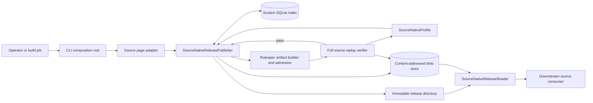
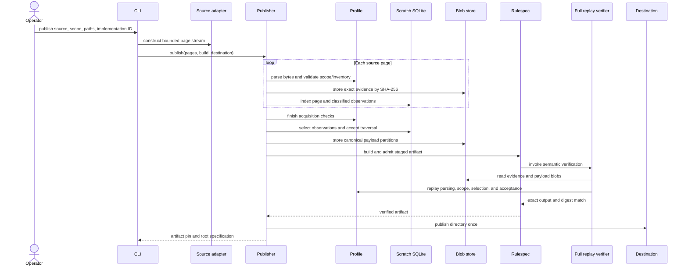
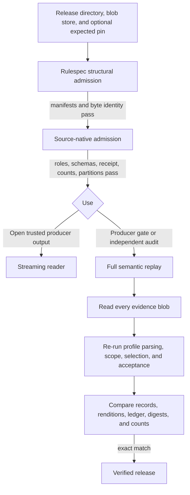

# Source-native release engine

The source-native release engine turns exact publisher responses into an immutable, independently checkable release. It preserves source records before downstream document parsing or enrichment changes their meaning. A release states what source was read, which scope was requested, which observations were selected, and which exact bytes support each result.

The engine is generic. Source-specific rules enter through a `SourceNativeProfile` and a stream of source pages; the engine owns storage, selection, partitioning, receipts, verification, and reading. See [Source-native profiles](spicy-docs_source-native-profiles.md) for the registered publishers and their acquisition rules.

The format keeps the historical protocol name `spicyregs-source-native-release` at version `1.0` for compatibility. `spicy-docs` is the current producer, while the verifier also recognizes historical `spicy-regs` artifacts. The [source-native release specification](../docs/superpowers/specs/2026-08-25-source-native-release-spec.md) records that adoption boundary and the work that remains outside this local implementation.

## At a glance

| Question | Answer |
| --- | --- |
| What goes in? | A validated query scope, a `SourceNativeProfile`, a stream of `SourceNativePage` objects containing exact response bytes, producer metadata, an explicit content-addressed blob store, and a new destination path. |
| What happens? | The publisher validates page order and scope, pins evidence bytes, indexes observations in SQLite, selects one observation per source identity, accepts a traversal, writes 64-bucket payload partitions, builds a Rulespec artifact, and replays the staged release. |
| What comes out? | A small immutable release directory, shared content-addressed evidence and payload blobs, and an artifact pin containing a logical identifier and artifact digest. |
| How is it checked? | Rulespec checks byte identity and manifests. The product admission check reconciles roles, schemas, counts, and receipts. Full verification replays every evidence page through the same profile and compares the recomputed records, renditions, ledgers, digests, and counts. |

## Architecture and system boundary



The responsibilities divide cleanly:

| Component | Responsibility |
| --- | --- |
| [`source_native.py`](../src/spicy_docs/source_native.py) | Generic publication, SQLite indexing, observation selection, traversal acceptance, partitioning, receipt construction, admission, full replay, and streaming reader. |
| [`source_native_profile.py`](../src/spicy_docs/source_native_profile.py) | The source behavior interface. It defines the callbacks and identity values that the generic engine requires. |
| [`source_native_store.py`](../src/spicy_docs/source_native_store.py) | The injected blob-store interface and hardened local SHA-256 implementation. |
| [`publication.py`](../src/spicy_docs/publication.py) | Exclusive file writes and no-replace directory publication. |
| [`source_native_cli.py`](../src/spicy_docs/source_native_cli.py) | Operator interface and the only place that chooses a concrete source adapter and profile from command-line input. |
| [`source_native_profiles.py`](../src/spicy_docs/source_native_profiles.py) | Side-effect-free registry of the supported profiles. |
| [`rulespec-artifacts` dependency](../pyproject.toml) | Canonical JSON, artifact roots, manifests, member descriptors, framed digests, structural admission, and artifact pins. |

Rulespec proves the artifact's generic byte structure. This module proves the meaning of a source-native release. Source adapters prove publisher-specific scope and record rules through profiles. Downstream parsing, document construction, and enrichment remain outside this layer.

## Inputs and the profile seam

### Build metadata

`SourceNativeReleaseBuild` carries the canonical query scope, a Rulespec `Producer`, a canonical UTC start time, and an optional `supersedes` reference. The constructor accepts the current `spicy-docs` producer identity and the historical `spicy-regs` identity, but it requires the source-native verifier identifier and version defined by this format. The publisher records its own completion time through the injected clock.

### Source pages

A `SourceNativePage` is the engine's acquisition unit. It carries:

- traversal, page, window, and window-page indexes;
- the canonical request key and optional source cursor;
- the publisher response as exact bytes; and
- the evidence media type, currently `application/json` or `application/zip`.

The publisher limits one evidence object to 24 MiB and one canonical JSON or JSON Lines row to 4 MiB. A source adapter must divide larger source populations into bounded pages or evidence packs before calling the engine.

A traversal is one complete attempt to observe the requested scope. A window is a source-defined unit inside a traversal, such as a date interval, partition, or evidence pack. The engine enforces contiguous indexes and cursor chains; the profile explains what makes each window and the whole acquisition complete.

### `SourceNativeProfile`

The profile injects source meaning without changing the release machinery.

| Profile area | Supplied values and callbacks |
| --- | --- |
| Identity | Profile name, source-system and policy identifiers and versions, scope identifier, source schema key, record stem, and schema. |
| Scope and policy | Query-scope validation and canonicalization, acquisition-policy construction, source-state scope, traversal limit, and traversal acceptance rule. |
| Pages | Response parser, next-page rule, optional request-window parser, per-window traversal check, record-inclusion decision, and whole-acquisition check. |
| Records | Classification, scope validation, source-record wrapping, record digest, rendition extraction, and source-schema declaration and digest. |
| Observation selection | Optional source-version extraction and an option to refuse repeated equal versions. |

The profile constructor rejects inconsistent declarations. In particular, a `complete-snapshot` profile must use `source-enumeration` acceptance, and a profile cannot refuse equal observation versions without supplying a version function. These checks prevent a stable crawl from being mislabeled as complete source state.

Profile callbacks should be deterministic and side-effect free. Full verification calls them again against stored evidence, possibly on another machine. Any dependence on wall-clock time, mutable globals, unordered output, or live source state makes a release unreplayable.

## Publication process



The publisher follows these steps:

1. It canonicalizes the query scope through the profile and requires the returned value to equal the supplied value. It refuses an existing destination before acquisition.
2. It creates private staging and scratch directories next to the destination and opens a file-backed SQLite database.
3. For each page, it checks traversal, page, window, and cursor continuity. The profile parses the exact response, decides whether it contributes records, checks its inventory, and validates every classified record against the query scope.
4. It stores each distinct response in the blob store under its SHA-256 digest. Page rows retain the evidence reference even when identical response bytes appear more than once.
5. It indexes wrapped records, record digests, optional source versions, rendition rows, and evidence references in SQLite.
6. It selects observations, applies the declared traversal acceptance rule, and writes canonical JSON Lines partitions for the accepted source state and acquisition history.
7. It builds local schemas, scope, receipt, manifest, and artifact-root files. It computes byte accounting to a fixed point because the receipt includes the publication's own byte total.
8. It runs full semantic verification against the staged artifact and external blobs.
9. Only a passing artifact is published to the destination with no replacement. Staging and scratch directories are removed on every exit path.

If publication fails, the destination remains absent. Content-addressed blobs written before the failure may remain. They are verified, immutable, and reusable by a later run; they are not evidence that a release was published.

## SQLite indexing and observation selection

SQLite bounds memory use and makes large acquisitions deterministic. The temporary database has two central tables:

- `pages` keys each row by traversal and page, enforces unique traversal/window/window-page coordinates, and records requests, cursors, evidence, disposition, and partition assignment.
- `observations` keys each discovered record by traversal and ordinal and stores its source identity, optional source version, selected flag, record digest, wrapped canonical record, canonical renditions, evidence reference, and partition.

An index on traversal, source identity, source version, record digest, and ordinal supports grouped selection without loading the acquisition into memory.

### Selection rules

| Profile declaration | Selection behavior |
| --- | --- |
| No `observation_version` callback | A source identity may appear only once in a traversal. A duplicate is ambiguous and fails publication. |
| Version callback, equal versions allowed | The greatest non-null comparable version wins; null sorts last. Equal identity/version rows must have the same record digest, and the earliest ordinal represents identical repeats. |
| Version callback with `refuse_equal_observation_versions=True` | Any repeated identity/version pair, including a repeated null version, fails. Different versions remain valid observations and the greatest non-null version wins. |

The profile owns version normalization. If a publisher uses timestamps or compound versions, the callback must return strings whose comparison order matches the publisher's intended order. Selection keeps all accepted-traversal observations in the input digest, including those discarded in favor of a newer version.

The receipt enforces:

```text
inputObservationCount = publishedRecordCount + discardedObservationCount
discoveredRecordCount = inputObservationCount + failedRecordCount
```

The current publisher emits only passing releases, so `failedRecordCount` is zero. A record that cannot be classified, scoped, wrapped, or digested aborts the release instead of appearing as a successful partial result.

## Traversal acceptance

| `traversal_acceptance` | Required evidence | Accepted traversal |
| --- | --- | --- |
| `single-observed-traversal` | Exactly one complete traversal | Traversal 0 |
| `source-enumeration` | Exactly one traversal whose profile checks prove complete source enumeration | Traversal 0 |
| `stable-consecutive-traversals` | At least one adjacent pair with the same full ordered observation sequence | The second traversal in the first stable pair |

Stable comparison uses every observation in traversal order, with source identity and record digest. It does not compare only the final selected records. This catches changes hidden by later deduplication. If no consecutive pair matches before `max_traversals`, publication fails.

Acceptance and state scope answer different questions. Stability can prove that two observations agreed; it cannot prove that the publisher exposed every record. Only a profile backed by source enumeration may declare `complete-snapshot`. Other profiles publish `observed-crawl`.

## Artifact and blob layout

The release directory contains compact publication metadata. Evidence and payload partitions live in the explicit blob store.

```text
release/
├── artifact.json
├── manifests/
│   └── source-native.json
├── receipts/
│   └── publication.json
├── records/
│   └── scopes.jsonl
└── schemas/
    ├── source-native-release-1.0.json
    └── <profile source schema>

blob-store/
├── sha256/
│   └── <64 lowercase hexadecimal characters>
└── .pending/
```

`schemas/source-native-release-1.0.json` contains the installed release schema bundle. Its source files are checked in under [`schemas/source_native_release/1.0`](../src/spicy_docs/schemas/source_native_release/1.0). The bundle covers source records, scopes, source-schema declarations, rendition rows, acquisition-ledger rows, acquisition pages, failures, publication receipts, and the root release specification.

### The 64-bucket payload layout

Every payload family uses 64 stable bucket identifiers, `00` through `63`. The engine computes:

```text
bucket = unsigned-big-endian-integer(SHA-256(UTF-8(identity))) mod 64
```

Only nonempty buckets become members. The receipt's `payloadPartitions` array maps each partition kind and bucket to a blob reference, byte size, and record count.

| Partition kind | Contents | Bucket identity | Sort order |
| --- | --- | --- | --- |
| `records` | Selected wrapped source records from the accepted traversal | `sourceRecordId` | Source record identity |
| `renditions` | Source-stated file or attachment locators for selected records | `sourceRecordId` | Source record identity, then `renditionId` |
| `acquisition-records` | One evidence reference and disposition row per selected record | `sourceRecordId` | Source record identity |
| `acquisition-pages` | Every page from every traversal, including acceptance flags and discovered-record inventories | `traversalIndex:pageIndex` | Traversal, then page |

All partitions use canonical newline-delimited JSON. Records, renditions, and both acquisition partition kinds are external blob members. Source scope, source schema, release schema, and receipt remain local release members. Empty record or rendition families may be absent; acquisition and metadata roles remain required.

The 64-way split gives readers a fixed concurrency and file-handle bound while keeping identities deterministically placed across rebuilds. A reader performs a heap merge over at most 64 streams for one payload family and checks local order, global order, bucket assignment, and declared record counts as it goes.

### What the digests prove

| Digest or reference | Meaning |
| --- | --- |
| Evidence `blobRef` | Pins the exact bytes of one distinct source response or evidence pack. |
| `sourceStateDigest` | Commits to the canonical scope, source-schema declaration, selected records, and renditions. |
| `inputObservationDigest` | Commits to all observations in the accepted traversal before version selection discards older rows. |
| `acquisitionLedgerDigest` | Commits to the selected record-to-evidence mapping. |
| `reconciliationDigest` | Commits to accepted acquisition-page rows. |
| Artifact pin | Identifies the Rulespec logical release and the exact physical artifact. |

A rebuild can retain the same logical identifier while receiving a different artifact digest when physical publication details, such as receipt times, change. Consumers that require one exact publication should pin both values.

## Content-addressed storage and immutable publication

`SourceNativeBlobStore` is an injected interface with `put_blob` and `open`. The repository supplies `LocalSourceNativeBlobStore`; an external object-store implementation is not part of the current local code.

The local store:

- accepts only `sha256:` references with 64 lowercase hexadecimal characters;
- pins the resolved root and the device/inode identity of the root, `sha256`, and `.pending` directories;
- refuses symbolic links and replaced storage directories;
- streams new bytes into a mode-`0600`, exclusively created pending file;
- verifies the digest and size before a no-replace hard link makes the blob visible;
- verifies an existing or concurrently written winner before reporting reuse; and
- synchronizes files and directories before returning.

A corrupt existing blob fails closed. Opening a blob delegates to Rulespec's digest-checking source, so mutation after reader construction is detected before a row is yielded.

Publication uses the same no-replace rule. Local metadata files are opened exclusively, synchronized, and never overwritten. The complete staging directory becomes visible only after verification. The CLI also rejects a release path and blob-store path that are equal, nested, or contain one another.

## Admission, full replay, and reading

Verification has three layers. Each later layer includes the earlier ones.



| Layer | What it checks | Where it is used |
| --- | --- | --- |
| Rulespec structural admission | Root and manifest framing, member byte identity, blob references, and an optional expected artifact pin. | Publisher, verifier, and reader. |
| `verify_source_native_admission` | Exact product roles and locations; supported source, policy, and producer identities; receipt/root agreement; verifier identity; count equations; partition membership; byte accounting; warnings; installed release schemas; profile source schema; and schema-set digest. | Reader construction and the first stage of full verification. |
| `verify_source_native_release` | Canonical scope and policy; every stored evidence response; page and cursor chains; profile acquisition checks; record classification and scope; observation selection; accepted traversal; exact records, renditions, and ledger; all semantic digests and counts. | Producer gate before publication and CLI `verify`. |

Admission is intentionally cheaper than full replay. It establishes that a release produced by an accepted verifier has a coherent, bounded shape. It does not independently prove that stored evidence yields the published records. Operators use full replay when creating a release or independently auditing it.

### Reader behavior

`SourceNativeReleaseReader` requires:

- a Rulespec `MemberSource` for the release directory;
- a `BlobSource` for external members;
- the matching `SourceNativeProfile`;
- a nonempty allowlist of accepted verifier implementation identifiers; and
- optionally, an expected artifact pin.

Construction performs structural and source-native admission, then checks the producer's verifier implementation against the allowlist. The reader exposes the admitted pin, source-system identity and version, state scope, state digest, and source-schema-set digest. `iter_records()` and `iter_renditions()` stream globally ordered mappings from the 64-bucket payloads. They do not replay evidence or expose live source adapters.

## CLI composition

The installed command is `spicy-docs-source-native`. It supports `publish` and `verify`. Current `--source` values are `federal-register`, `regulations-documents`, `regulations-dockets`, `regulations-comments`, and `spicy-regs-public-comments`. Source-specific scope requirements are documented in [Source-native profiles](spicy-docs_source-native-profiles.md).

Example publication:

```bash
spicy-docs-source-native publish \
  --source regulations-documents \
  --since 2026-08-01 \
  --until 2026-08-31 \
  --agency EPA \
  --destination releases/regulations-documents-2026-08 \
  --blob-store source-native-blobs \
  --implementation-id "$VERIFIER_IMPLEMENTATION_ID"
```

Example independent replay:

```bash
spicy-docs-source-native verify \
  --source regulations-documents \
  --release releases/regulations-documents-2026-08 \
  --blob-store source-native-blobs \
  --logical-id "$LOGICAL_ID" \
  --artifact-digest "$ARTIFACT_DIGEST" \
  --accepted-verifier-implementation-id "$VERIFIER_IMPLEMENTATION_ID"
```

`verify` requires both parts of the expected pin and at least one accepted verifier implementation identifier. It opens the blob store with `create=False`, so verification cannot silently create a missing store.

Success writes one canonical JSON object to standard output. Failure writes one canonical JSON error to standard error and returns status 1. Stable error codes distinguish an existing destination, acquisition failure, invalid release, transport failure, and other operation failure. The CLI checks path separation and an existing destination before starting network acquisition.

## Important invariants and failure modes

| Invariant | Failure meaning and outcome |
| --- | --- |
| Query scope is canonical | A profile returned a different representation or the caller supplied unsupported fields. Publication stops before producing a release. |
| Traversal, page, window, and cursor chains are contiguous | Evidence is missing, reordered, forked, cyclic, or attached to the wrong request. Publication or replay fails. |
| Page and row bounds hold | The adapter failed to produce a bounded acquisition unit, or an admitted blob exceeds the format limit. |
| Records match the closed source schema and requested scope | The publisher changed shape, the adapter used the wrong profile, or evidence falls outside the declared request. The engine does not drop or repair it. |
| Observation selection is unambiguous | A source identity repeats without a version, or equal versions disagree or are forbidden. Publication fails rather than choosing silently. |
| Traversal acceptance succeeds | A required enumeration was incomplete or a stable crawl never produced a matching consecutive pair. No snapshot is published. |
| Blob digest, size, and directory identity remain stable | Storage is corrupt, replaced, or redirected through a symbolic link. Store access fails closed. |
| Receipt, manifest, schemas, roles, counts, and byte totals agree | The staged or stored artifact was built by incompatible code or was changed. Admission fails. |
| Replayed output equals admitted output | Evidence, profile behavior, or payload bytes differ from the publication claim. Full verification fails. |
| Destination is new and separate from the blob store | An immutable release already exists or path containment could mix metadata with shared blobs. Publication refuses replacement. |
| Verifier implementation is allowlisted | The artifact may be structurally sound, but the consumer has not approved its producer implementation. Reader or CLI verification refuses it. |

Warnings are a closed, sorted list in the receipt. Unknown warning shapes fail admission. Published releases must state a semantic verdict of `pass`; the implementation does not admit a partially successful release.

## Contributing and testing

When adding a source, keep source behavior outside the generic engine:

1. Implement a bounded page adapter and source-specific classification functions.
2. Construct a `SourceNativeProfile` from deterministic callbacks.
3. Register it in [`source_native_profiles.py`](../src/spicy_docs/source_native_profiles.py).
4. Compose it at the CLI edge if operators should invoke it.
5. Add source fixture tests for scope, drift, pagination or enumeration, selection, evidence packing, and replay.

Change [`source_native.py`](../src/spicy_docs/source_native.py) only for behavior shared by every profile. A format change requires deliberate compatibility work: update format or schema identity as needed, treat `release_schema_bundle()` as the source of truth, update the checked-in canonical schema files in lockstep, update the normative specification, and add old/new compatibility tests. `installed_release_schema_bundle()` refuses missing, extra, or byte-different schema files.

Run the focused unit suites:

```bash
uv run pytest -q tests/test_source_native_release.py tests/test_source_native_cli.py
```

These suites cover incomplete publication, blob reuse and corruption, symbolic-link and directory replacement attacks, concurrent destination publication, observation selection, traversal stability, cursor chains, source and schema drift, evidence and payload tampering, the 64-stream reader bound, verifier allowlists, schema generation, path separation, and machine-readable CLI output.

Run the source-specific suites when changing a profile or adapter:

```bash
uv run pytest -q \
  tests/test_regulations_gov_source_native.py \
  tests/test_regulations_gov_comments_source_native.py \
  tests/test_spicy_regs_public_tables_source_native.py
```

The real-network release test is opt-in:

```bash
uv run pytest -q -m integration tests/test_source_native_release_real.py
```

It reads pinned live source data and should not replace fixture tests. Before submitting a change, also run the repository checks:

```bash
uv run pytest -q
uv run ruff check .
uv run ruff format --check .
```

## Code and specification map

- Generic engine: [`src/spicy_docs/source_native.py`](../src/spicy_docs/source_native.py)
- Profile interface: [`src/spicy_docs/source_native_profile.py`](../src/spicy_docs/source_native_profile.py)
- Local blob store: [`src/spicy_docs/source_native_store.py`](../src/spicy_docs/source_native_store.py)
- Immutable publication helpers: [`src/spicy_docs/publication.py`](../src/spicy_docs/publication.py)
- CLI composition: [`src/spicy_docs/source_native_cli.py`](../src/spicy_docs/source_native_cli.py)
- Registered profiles: [`src/spicy_docs/source_native_profiles.py`](../src/spicy_docs/source_native_profiles.py)
- Installed schemas: [`src/spicy_docs/schemas/source_native_release/1.0`](../src/spicy_docs/schemas/source_native_release/1.0)
- Normative target and adoption status: [`2026-08-25-source-native-release-spec.md`](../docs/superpowers/specs/2026-08-25-source-native-release-spec.md)
- Generic release tests: [`tests/test_source_native_release.py`](../tests/test_source_native_release.py)
- CLI tests: [`tests/test_source_native_cli.py`](../tests/test_source_native_cli.py)
- Optional real-source test: [`tests/test_source_native_release_real.py`](../tests/test_source_native_release_real.py)
