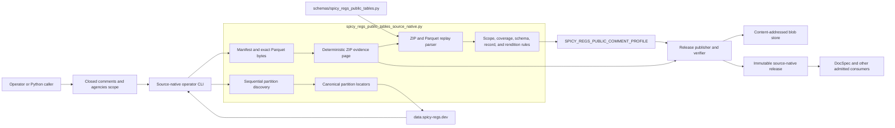
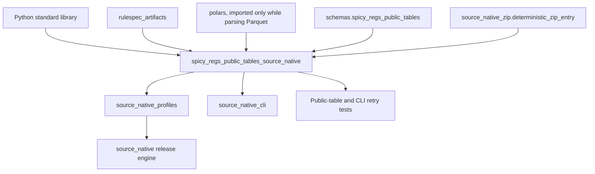
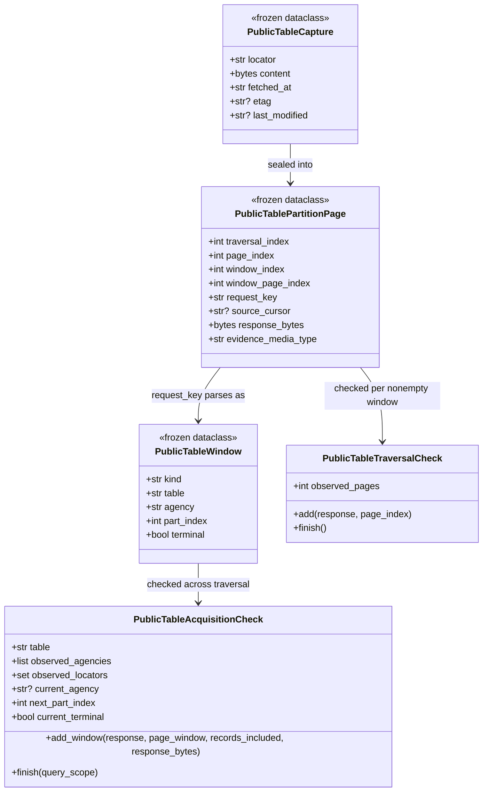
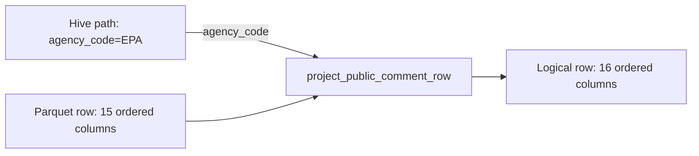
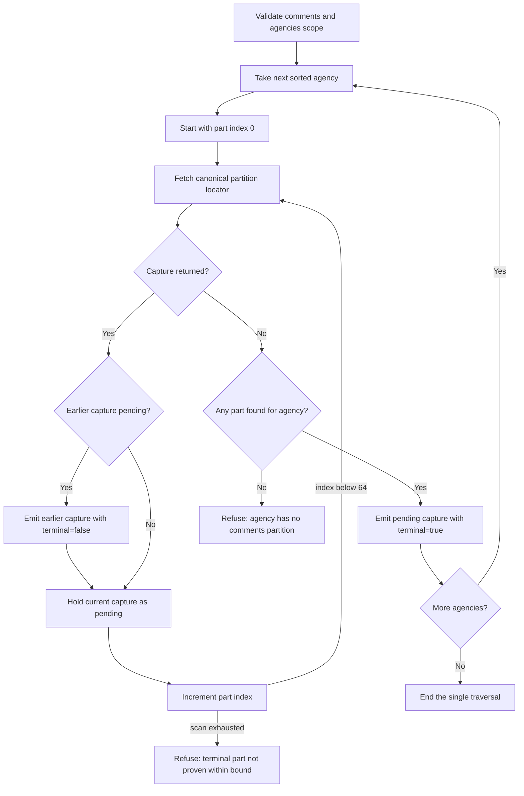
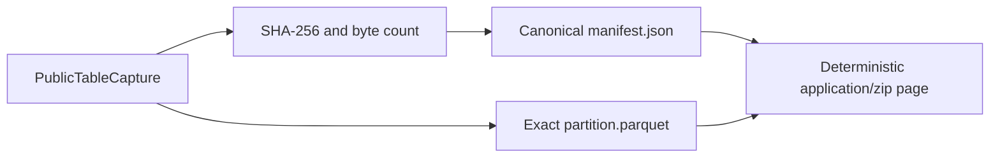
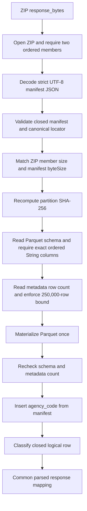
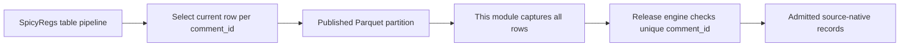
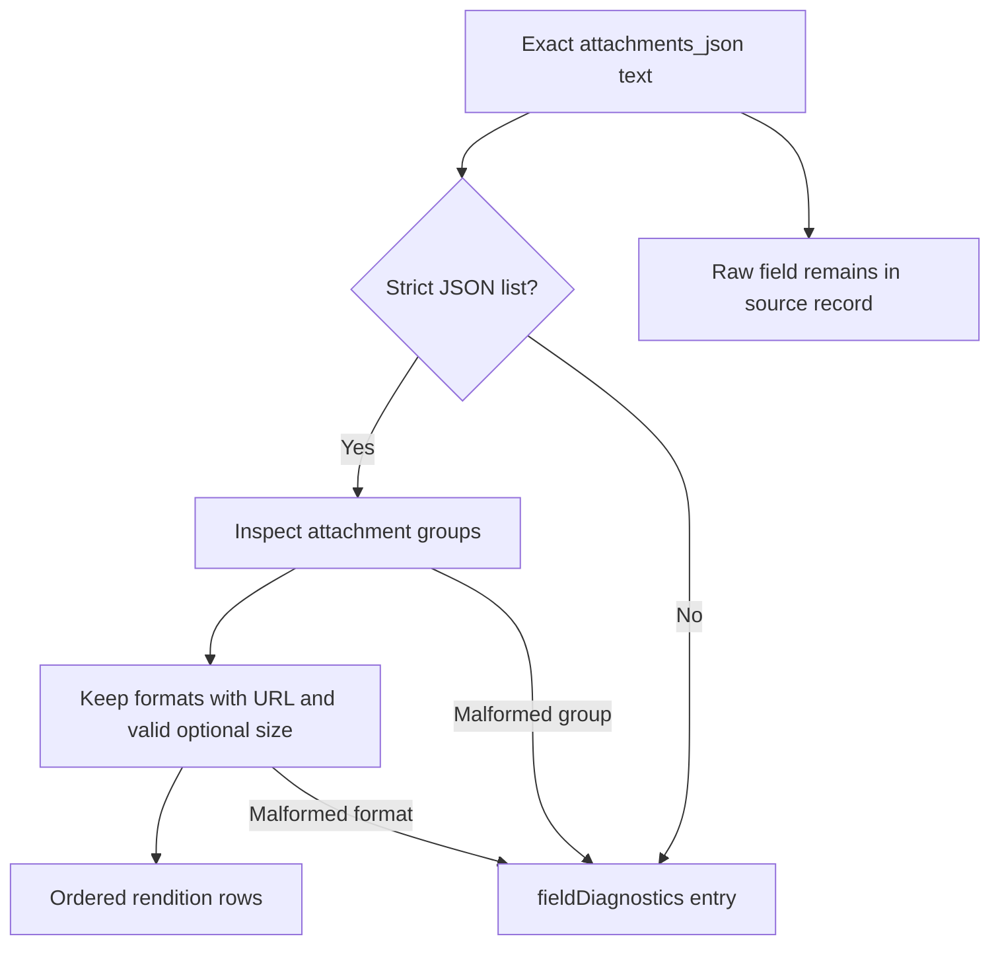
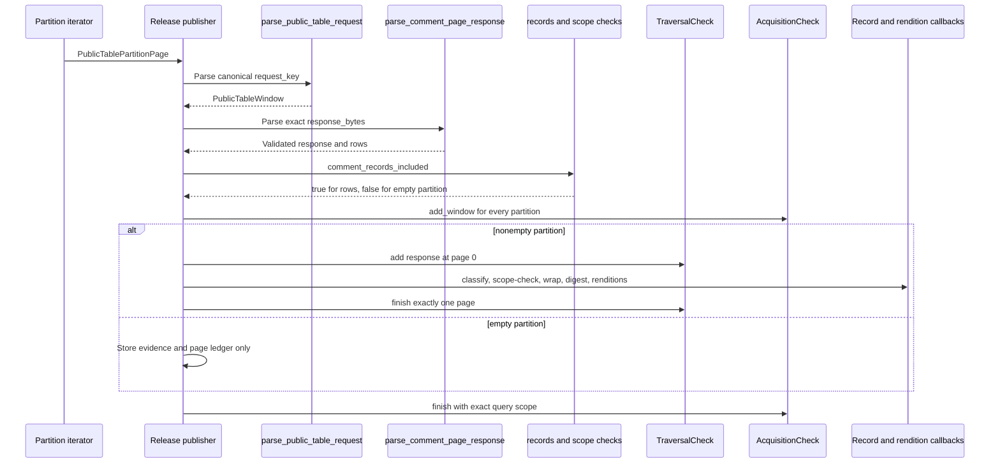

# SpicyRegs public table source-native acquisition

The SpicyRegs public-table source-native module captures the community's published Regulations.gov comment table as exact, replayable evidence. It fetches each requested agency's complete Hive-partitioned Parquet tree, pins every partition by SHA-256, seals the bytes and capture metadata into a deterministic ZIP, and reconstructs faithful logical comment rows during publication and independent verification.

This module is the first acquisition rung for comment data already available from SpicyRegs. It preserves the table as published: every declared column survives, null values remain null, and source text such as `See attached` is not cleaned or interpreted. The module reaches no origin application programming interface (API); the [Regulations.gov source-native module](regulations_gov_source_native.md) covers the Mirrulations-backed origin-source path when the public tables cannot supply the required data.

## Purpose and system role

| Question | Answer |
| --- | --- |
| What goes in? | A closed query scope containing the `comments` table and a sorted list of agency codes, plus an injected `PublicTableFetch` function that returns a complete `PublicTableCapture` or `None` for a missing partition. |
| What happens? | The iterator discovers each agency's contiguous `part-{n}.parquet` sequence, captures whole objects, records their identity and freshness metadata, and yields one ZIP evidence page per partition. Profile callbacks replay each ZIP, validate its manifest and Parquet schema, restore `agency_code`, classify rows, prove coverage, and derive records and attachment renditions. |
| What comes out? | Ordered `PublicTablePartitionPage` objects with `application/zip` evidence. The shared release engine turns those pages into immutable source-native records, rendition rows, page and acquisition ledgers, schemas, digests, and a publication receipt. |
| How do we check it? | Capture-time checks bind each object to its expected locator. Publication and independent verification parse the saved ZIP again, recompute the partition digest, enforce the exact column order and types, confirm every row belongs to its partition, and prove exact ordered agency and partition coverage. |

The [source-native profile API](source_native_profile_api.md) defines the callback shapes implemented here. The [source-native release engine](source_native_release_engine.md) consumes those callbacks, stores the evidence, selects observations, writes the release, and replays it. The [source-native operator CLI](source_native_operator_cli.md) owns live HTTP behavior and command-line validation.

## Architecture and ownership boundaries



SpicyDocs owns acquisition, preservation, source-shaped classification, and release evidence. It does not interpret comment meaning, repair attachment metadata, join comments to dockets or documents, extract attachment bodies, or create search concepts. Downstream products perform those tasks after they admit the source-native release.

The source tree is a community mirror, but the capture still receives source treatment. A live query never supplies release rows. Both publication and verification derive rows from the exact `partition.parquet` bytes carried by each evidence ZIP.

### Direct dependencies and consumers



| Dependency or consumer | Use |
| --- | --- |
| Python standard library | Immutable data classes, URL construction and parsing, SHA-256 hashing, strict JSON decoding, ZIP creation and reading, timestamps, and bounded in-memory byte streams. |
| `rulespec_artifacts` | Canonical JSON bytes, source-schema bundle identity, and the framed ordered-record digest. |
| `polars` | Reads the Parquet schema and metadata count, enforces `String` columns, and materializes bounded rows. The module imports Polars inside Parquet functions so profile import and ordinary release verification do not require eager Parquet initialization. |
| [`schemas/spicy_regs_public_tables.py`](../src/spicy_docs/schemas/spicy_regs_public_tables.py) | Declares physical and logical comment columns, identity and version columns, and the pure partition-key projection. |
| [`source_native_zip.py`](../src/spicy_docs/source_native_zip.py) | Supplies deterministic ZIP entry metadata for newly created capture packs. |
| [`source_native_profiles.py`](../src/spicy_docs/source_native_profiles.py#L223-L257) | Binds the module's declarations and callbacks into `SPICY_REGS_PUBLIC_COMMENT_PROFILE`. |
| [`source_native_cli.py`](../src/spicy_docs/source_native_cli.py) | Creates the production HTTP fetcher, classifies missing and failed responses, builds the query scope, and gives the page iterator to the release publisher. |
| [`source_native.py`](../src/spicy_docs/source_native.py) | Checks the generic page sequence, stores evidence, refuses duplicate source identities, writes release members, and independently replays the capture. |

The module and its schema helper intentionally import no `spicy_regs`, DocSpec, RefSpec, or SpicySearch package. That restriction keeps public-table acquisition usable without a sibling product and prevents source preservation from depending on downstream interpretation.

## Stable identities and resource bounds

The constants near the top of [`spicy_regs_public_tables_source_native.py`](../src/spicy_docs/spicy_regs_public_tables_source_native.py#L55-L79) define the durable source, policy, schema, and evidence identities.

| Concern | Value |
| --- | --- |
| Public base URL | `https://data.spicy-regs.dev` |
| Supported table | `comments` |
| Source system ID | `urn:spicy-regs:source:spicy-regs-public-tables:comments` |
| Source-system version | `spicy-regs-public-tables-comments-hive-agency-v1` |
| Scope ID | `spicy-regs-public-comments` |
| Schema | `spicy-regs-public-comment` version `1.0` |
| Installed schema key | `schemas/spicy-regs-public-comment-1.0.schema.json` |
| Acquisition policy | `urn:spicy-regs:acquisition:spicy-regs-public-comment-partition-capture`, version `1.0` |
| Evidence type | `spicy-regs-public-table-capture-v1` |
| Evidence media type | `application/zip` |
| Captured payload media type | `application/vnd.apache.parquet` |
| Traversal model | One source enumeration |

| Bound | Current value | Enforcement point |
| --- | ---: | --- |
| Agencies per query scope | 512 | `spicy_regs_public_comment_query_scope` |
| Part indexes considered per agency | `0` through `63` | Locator construction, request parsing, and acquisition loop |
| Partition bytes | 16 MiB | Production fetch, capture manifest creation, manifest replay, and ZIP member size checks |
| Rows per partition | 250,000 | Parquet metadata count before full row materialization |
| Traversals | 1 | Page construction, profile declaration, and release engine |

The iterator must see a missing part before the 64-index scan ends. If all indexes `0` through `63` exist, it refuses the agency as exceeding the bound because it cannot prove that index `63` is terminal without probing beyond the declared range.

These constants appear in the acquisition-policy object recorded by the release. Treat a changed identity, bound, schema, locator shape, or selection statement as a compatibility decision. Update the relevant version when the change alters what a verifier should accept.

## Component map

[`spicy_regs_public_tables_source_native.py`](../src/spicy_docs/spicy_regs_public_tables_source_native.py) groups its components by responsibility.

| Group | Main components | Responsibility |
| --- | --- | --- |
| Scope and location | `spicy_regs_public_comment_query_scope`, `comment_partition_locator`, `_partition_request`, `parse_public_table_request`, `PublicTableWindow` | Define the closed agency scope and map each physical partition to one canonical public URL and one canonical synthetic request key. |
| Transport boundary | `PublicTableCapture`, `PublicTableFetch` | Represent one whole fetched object, its request locator, capture time, and optional HTTP freshness headers without embedding networking in the source rules. |
| Evidence construction | `capture_manifest`, `capture_pack_bytes`, `_page`, `PublicTablePartitionPage` | Bind exact partition bytes to their digest and location, then expose one partition as one source-native evidence page. |
| Evidence replay | `_decode_json`, `_validated_manifest`, `validate_partition_columns`, `_partition_rows`, `parse_comment_page_response` | Validate ZIP membership, manifest identity, digest, Parquet shape, row count, and logical projection from exact saved bytes. |
| Logical row model | `project_public_comment_row`, `classify_comment_row` | Restore the Hive partition key and enforce a closed 16-column, text-or-null record. |
| Attachments | `_attachment_groups`, `field_diagnostics`, `_media_type`, `comment_rendition_rows` | Preserve raw publisher JSON, report malformed structures without dropping the record, and derive usable attachment locators. |
| Completeness and scope | `public_table_next_page`, `PublicTableTraversalCheck`, `PublicTableAcquisitionCheck`, `_record_in_scope`, `comment_records_included`, `validate_comment_record_scope` | Prove one page per partition window, contiguous parts, terminality, exact agency coverage, and row-to-partition membership. |
| Release derivation | `comment_source_issued_version`, `comment_source_record`, `comment_source_record_digest` | Expose the table's stated version value, wrap a faithful row with schema identity, and compute its ordered digest. |
| Declarations | `comment_acquisition_policy`, `SPICY_REGS_PUBLIC_COMMENT_SCHEMA`, `comment_source_schema_digest`, `comment_source_schema_declaration` | State the capture method, schema, source provenance, and stable identities sealed into a release. |

`PublicTableSourceError` is the module's fail-closed exception. It subclasses `ValueError` and represents source evidence that the module cannot publish safely. The operator maps it to a structured command error; the module itself does not log, retry, or suppress it.

## Core data types



### `PublicTableCapture`

`PublicTableCapture` is the only input accepted from a fetcher. `capture_manifest` adds source-specific validation rather than trusting the data class alone:

- `content` must be nonempty `bytes` no larger than 16 MiB;
- `locator` must equal the canonical locator for the requested agency and part index;
- `fetched_at` must be an ISO-formatted UTC instant ending in `Z`;
- `etag` and `last_modified` must each be printable, nonempty text or `None`; and
- `terminal` must be a real Boolean supplied by discovery.

The optional freshness headers record only what the HTTP object stated. They do not replace the SHA-256 content pin.

### `PublicTablePartitionPage`

Every page describes one explicit partition window:

- all indexes are nonnegative;
- `traversal_index` is always `0`;
- `window_index` equals the traversal-wide `page_index`;
- `window_page_index` is always `0`;
- `source_cursor` is always `None`;
- `request_key` is a nonempty canonical synthetic locator; and
- `response_bytes` contains a nonempty ZIP capture pack.

The page's `evidence_media_type` property always returns `application/zip`. The module separately exports `PARTITION_MEDIA_TYPE == "application/vnd.apache.parquet"` for the captured payload; the ZIP member itself carries no release-level media-type declaration.

### `PublicTableWindow`

`parse_public_table_request` produces a `PublicTableWindow` from the page's synthetic request key. It gives later callbacks a typed, already-validated table, agency, part index, and terminal marker. The request key identifies acquisition structure; the manifest's HTTPS `locator` identifies the fetched public object.

## Physical and logical comment rows

The public Hive tree stores agency membership in the directory name:

```text
comments/agency/agency_code=EPA/part-0.parquet
```

The physical Parquet file therefore contains 15 columns. The logical source row contains 16 because `project_public_comment_row` inserts `agency_code` at its publisher-defined position.



The logical column order is:

```text
comment_id
docket_id
agency_code
first_name
last_name
organization
category
title
comment
document_type
posted_date
modify_date
receive_date
attachments_json
text_content
text_extraction_status
```

`PUBLIC_COMMENT_FILE_COLUMNS` derives the physical order by removing only `agency_code` from this sequence. `PUBLIC_COMMENT_IDENTITY_COLUMN` is `comment_id`; `PUBLIC_COMMENT_VERSION_COLUMN` is `modify_date`.

The projection performs no cleanup or inference. It copies every physical value and inserts the supplied agency code. `classify_comment_row` then requires the exact logical column set, requires every cell to be `str` or `None`, and requires nonempty text for `comment_id` and `agency_code`. The agency must match `^[A-Za-z0-9._-]+$`.

Runtime classification requires all 16 columns even though the JSON Schema's `required` array names only `comment_id` and `agency_code`. The remaining properties are nullable, not optional in captured rows. The runtime check preserves the closed physical table shape; the schema describes the admitted record family and forbids unknown properties.

## Query scope and canonical identity

The public Python scope contains exactly two fields:

```python
query_scope = {
    "agencies": ["EPA", "FDA"],
    "table": "comments",
}
```

`spicy_regs_public_comment_query_scope` requires:

- exactly `agencies` and `table`, with no date or filter fields;
- `table == "comments"`;
- between 1 and 512 agency codes;
- agency codes that match `^[A-Za-z0-9._-]+$`; and
- a list already sorted in ASCII order with no duplicates.

The validator returns a new mapping with a copied agency list. Direct callers must supply canonical order. The operator accepts repeated `--agency` arguments, removes duplicates, and sorts them before publication.

The scope names whole agency partitions. It deliberately has no date window because row filtering would make the released record set differ from the pinned partition bytes. The operator rejects `--since` and `--until` for this source.

### Public partition locator

`comment_partition_locator("EPA", 0)` returns:

```text
https://data.spicy-regs.dev/comments/agency/agency_code=EPA/part-0.parquet
```

The function accepts integer indexes from `0` through `63`, rejects `bool`, validates the agency code, and percent-encodes the Hive partition segment while keeping `=._-` readable.

### Synthetic request key

Each evidence page uses a canonical request key such as:

```text
spicy-regs-tables://public/comments/partition?agency=EPA&partIndex=0&terminal=true
```

`parse_public_table_request` accepts only this exact scheme, authority, path, field set, field order, and serialization. It rejects credentials, fragments, missing or repeated fields, another table, an out-of-range index, a noncanonical Boolean, and a reordered query string. Re-serializing the parsed values must reproduce the original string byte for byte.

`terminal` is capture structure, not a field published by the remote object. The iterator determines it with one-partition look-ahead: a part becomes terminal only after the fetcher reports that the next index is missing.

## Acquisition process

`iter_spicy_regs_public_comment_pages` validates the scope, processes agencies in canonical order, and discovers each contiguous part sequence from index `0`.



The one-item `pending` buffer prevents the iterator from marking a partition terminal before it knows whether another part exists. A successful agency with `P` captured partitions therefore makes `P + 1` fetch calls: one for each object and one missing-part probe. Across `A` agencies and `P` total partitions, discovery makes `P + A` calls.

The iterator fails when:

- part `0` is missing for any scoped agency;
- the fetcher returns an object other than `PublicTableCapture` or `None`;
- the part scan reaches its bound without observing a missing next part;
- capture metadata or bytes fail `capture_manifest`; or
- page coordinates or evidence are invalid.

The iterator performs no concurrent fetching. It holds at most one pending capture for discovery, although ZIP construction temporarily holds both the partition bytes and compressed evidence in memory. Parquet replay later materializes one bounded partition at a time.

### Production HTTP behavior

The module receives an injected fetch function and knows nothing about HTTP status codes. The [operator CLI](source_native_operator_cli.md) supplies the production implementation:

- `404` returns `None` and terminates partition discovery for that agency;
- `429`, `5xx`, transport errors, empty successful responses, and oversized successful responses use the shared bounded retry policy;
- other `4xx` responses fail immediately;
- a successful response must be nonempty and no larger than 16 MiB;
- `ETag` and `Last-Modified` are copied when present; and
- the client requests `application/octet-stream`, follows redirects, and uses bounded timeouts.

Keep retry and transport behavior in the operator. Keep source identity, capture construction, and replay behavior in this module.

## Capture manifest and evidence ZIP

`capture_manifest` creates a closed metadata object for one partition. `capture_pack_bytes` writes that manifest and the exact partition into a deterministic, deflated ZIP in fixed member order.



The archive contains exactly:

```text
manifest.json
partition.parquet
```

The manifest contains exactly these fields:

| Field | Meaning and validation |
| --- | --- |
| `agency` | Validated agency code represented by the Hive directory. |
| `byteSize` | Exact uncompressed partition length, from 1 byte through 16 MiB. |
| `captureType` | Literal `spicy-regs-public-table-capture-v1`. |
| `etag` | Printable nonempty HTTP `ETag` text or `null`. |
| `fetchedAt` | Valid zero-offset instant ending in `Z`. |
| `lastModified` | Printable nonempty HTTP `Last-Modified` text or `null`. |
| `locator` | Exact canonical HTTPS public partition locator. |
| `partIndex` | Integer from `0` through `63`; Boolean values fail. |
| `sha256` | Lowercase `sha256:` digest of the exact Parquet bytes. |
| `table` | Literal `comments`. |
| `terminal` | Boolean set by the iterator's missing-part look-ahead. |

Manifest JSON uses Rulespec's canonical serializer. Capture ZIP creation uses `deterministic_zip_entry` for fixed entry metadata and writes `manifest.json` before `partition.parquet`. Identical capture inputs, including `fetchedAt` and freshness headers, therefore produce stable pack bytes.

The manifest digest pins the inner Parquet payload. The release engine separately addresses the complete ZIP evidence page by its own SHA-256. This two-level identity lets verification prove both the captured object and the exact evidence representation.

## Evidence replay and data flow

`parse_comment_page_response` interprets only saved evidence bytes. It does not consult the public host.



Replay proceeds in this order:

1. Open the evidence as ZIP and require the exact ordered membership `manifest.json`, `partition.parquet`.
2. Reject an oversized manifest member, invalid UTF-8, duplicate JSON fields, floating-point numbers, non-finite numeric constants, missing fields, and unknown fields.
3. Validate manifest identity, types, bounds, timestamp, freshness headers, digest syntax, and the canonical locator.
4. Require the Parquet ZIP member size and extracted byte length to match `byteSize`.
5. Recompute SHA-256 over the extracted bytes and compare it with `sha256`.
6. Read the Parquet schema and require the exact 15 physical columns in publisher order, all with Polars type `String`.
7. Read the row count from Parquet metadata and refuse more than 250,000 rows before materializing text.
8. Materialize the frame, recheck columns and types, and require the materialized height to equal the metadata count.
9. Convert rows to dictionaries, insert the manifest agency, and classify each 16-column logical record.

The parser returns the common response shape expected by the profile API:

| Field | Value |
| --- | --- |
| `_agency` | Manifest agency. |
| `_capture` | Fully validated capture manifest. |
| `_captureType` | `spicy-regs-public-table-capture-v1`. |
| `_partIndex` | Manifest part index. |
| `_table` | `comments`. |
| `_terminal` | Manifest terminal marker. |
| `count` | Number of classified logical rows. |
| `results` | List of complete source rows. |
| `next_page_url` | Always `None`. |
| `total_pages` | Always `1`. |

An empty Parquet frame remains valid evidence. Its response has `count == 0` and `results == []`; the release stores its evidence and acquisition row even though it creates no source records.

## Schema and source record derivation

`SPICY_REGS_PUBLIC_COMMENT_SCHEMA` uses JSON Schema draft 2020-12. It closes the property set with `additionalProperties: false`, declares every logical column, requires nonempty strings for `comment_id` and `agency_code`, and allows string or null for every other column.

The schema also records source-specific extensions:

- `x-spicy-record-order` defines `comment_id` as the sole ordered-record field, compared by UTF-16 code units with null forbidden;
- `x-spicy-source-provenance` records the community-mirror acquisition rung, table, locator pattern, partition key, partition-key source, identity column, version column, and upstream observation-selection statement.

`comment_source_schema_digest` computes a Rulespec schema-bundle digest over the schema at `sources/spicy-regs-public-comment-1.0.schema.json`. `comment_source_schema_declaration` returns the matching schema name, version, and digest.

`comment_source_record` wraps one classified row as:

```json
{
  "fieldDiagnostics": [],
  "record": {"comment_id": "EPA-...", "agency_code": "EPA"},
  "schemaDigest": "sha256:...",
  "schemaName": "spicy-regs-public-comment",
  "schemaVersion": "1.0",
  "scopeId": "spicy-regs-public-comments",
  "sourceRecordId": "EPA-..."
}
```

The abbreviated `record` above shows the wrapper shape only; a real wrapper carries all 16 columns, including nulls. `fieldDiagnostics` reports malformed publisher-authored attachment JSON but does not replace the raw `attachments_json` field.

`comment_source_record_digest` passes the complete classified row to Rulespec's framed digest under domain `spicyregs-public-table-comment-record/1`, section name `record`, and section version `1`. Consumers should use this function rather than inventing another JSON hash.

### Observation selection stays upstream

The public table states `comment_id` as identity and `modify_date` as the version column. `comment_source_issued_version` returns `modify_date` exactly as carried, accepting either nonempty text or null.

The registered profile deliberately sets `observation_version=None`. SpicyRegs' upstream table pipeline has already selected the current row per `comment_id` using its stated rule, `modify_date DESC NULLS LAST`. This module reports that selection and preserves `modify_date`; it does not select again. If a capture repeats a `comment_id`, the shared release engine refuses the traversal instead of choosing between rows.



Changing the upstream selection rule requires more than editing a comment. Review the source-system version, acquisition policy, schema provenance, duplicate-identity behavior, and retained-data compatibility together.

## Attachment renditions and nonfatal diagnostics

`attachments_json` is publisher-authored JSON stored as text in the Parquet row. The module always preserves that text exactly. `_attachment_groups` separately attempts a strict parse so `comment_rendition_rows` can expose usable attachment locations.



| Condition | Behavior |
| --- | --- |
| `attachments_json is None` | Produce no renditions and no diagnostics. |
| Invalid JSON, duplicate fields, unsupported numbers, or a non-list root | Add `malformed-attachments-json`; preserve the original field. |
| List member is not an object or has no `formats` list | Add `malformed-attachment`; preserve its group position with no usable formats. |
| Format lacks a nonempty URL or has an invalid size | Add `malformed-attachment-format`; skip that rendition only. |
| Valid format | Produce one rendition in declared usable order. |

Each rendition contains:

| Field | Derivation |
| --- | --- |
| `sourceRecordId` | Comment's `comment_id`. |
| `renditionId` | Zero-padded attachment-group and usable-format indexes, such as `attachment-0000-0001`. |
| `sourceField` | Path built from the original attachment-group index and the format's index after unusable formats have been removed. |
| `locator` | Publisher URL. |
| `expectedByteSize` | Publisher size or `None`. |
| `expectedSha256` | Always `None`; the table supplies no digest. |
| `mediaType` | Normalized declared media type, known format alias, URL suffix inference, or `application/octet-stream`. |

Known aliases cover `doc`, `docx`, `htm`, `html`, `pdf`, `txt`, and `xml`. A declared string containing `/` is lowercased and used as a media type. Otherwise the function checks the locator suffix before falling back to opaque binary.

Attachment diagnostics are deliberately nonfatal because malformed embedded JSON is itself a source observation. Partition corruption, schema drift, row type drift, and identity failure remain fatal.

## Coverage, scope, and component interaction

Three layers prove that the evidence matches the query scope.

### Row-level scope

`_record_in_scope` requires each reconstructed row's `agency_code` to equal the agency in the page window and to appear in the query's agency list. Both `comment_records_included` and `validate_comment_record_scope` apply this rule, so a misplaced row fails before publication.

`comment_records_included` returns `True` only when a validated partition contains at least one row. `False` means an empty partition, not ignored evidence. It also binds the response capture type, agency, part index, and terminal marker to the parsed request window.

### Window-level inventory

`PublicTableTraversalCheck` validates a nonempty partition window. It requires page index `0`, a list of at most 250,000 results, and `count == len(results)`, then requires exactly one observed page at finish. `public_table_next_page` returns `None` and refuses any response that claims a cursor.

The release engine does not run record inventory callbacks for an empty partition because `records_included` is false. Acquisition-wide validation still records and checks that window.

### Acquisition-wide enumeration

`PublicTableAcquisitionCheck` receives the first and only page of every partition window. It enforces:

- response metadata matches the parsed `PublicTableWindow`;
- `records_included` equals whether the response actually has rows;
- agencies appear once in strictly increasing ASCII order;
- each agency starts at part `0`;
- part indexes remain contiguous;
- no partition locator repeats;
- no part follows a terminal part;
- every agency ends with exactly one terminal part before the next agency begins; and
- the observed agency list equals the query scope exactly at `finish`.



This profile declares `source_state_scope="complete-snapshot"` and `traversal_acceptance="source-enumeration"`. “Complete” means every public-table partition for the explicitly named agencies, as proven by contiguous discovery and a missing-part terminal probe. It does not mean every agency in the public host, every historical version, or every Regulations.gov record.

## Profile wiring and release lifecycle

`SPICY_REGS_PUBLIC_COMMENT_PROFILE` in [`source_native_profiles.py`](../src/spicy_docs/source_native_profiles.py#L223-L257) supplies the generic release engine with:

| Profile concern | Module implementation |
| --- | --- |
| Query validation | `spicy_regs_public_comment_query_scope` |
| Acquisition statement | `comment_acquisition_policy` |
| Page-window parsing | `parse_public_table_request` |
| Evidence parsing | `parse_comment_page_response` |
| Page continuation | `public_table_next_page` |
| Window inventory | `PublicTableTraversalCheck` |
| Traversal coverage | `PublicTableAcquisitionCheck(COMMENT_TABLE)` |
| Record disposition | `comment_records_included` |
| Record classification | `classify_comment_row` |
| Record scope | `validate_comment_record_scope` |
| Record wrapper | `comment_source_record` |
| Record identity digest | `comment_source_record_digest` |
| Renditions | `comment_rendition_rows` |
| Schema identity | `comment_source_schema_declaration`, `comment_source_schema_digest` |
| Observation version | `None`, because upstream already selected current rows |

The complete publish and replay algorithm belongs to the [source-native release engine](source_native_release_engine.md). In summary, the engine validates generic page coordinates, stores each evidence ZIP by digest, indexes observations, refuses duplicate `comment_id` values, orders selected rows using the schema declaration, writes immutable release members, and verifies the resulting artifact. Independent verification reads the stored evidence and runs the same profile callbacks again.

## Operational use

Publish one or more agency trees with the shared command:

```sh
spicy-docs-source-native publish \
  --source spicy-regs-public-comments \
  --agency EPA \
  --agency FDA \
  --destination /new/immutable/release \
  --blob-store /persistent/source-native-blobs \
  --implementation-id 'git+https://example/spicy-docs@<commit>'
```

Do not pass `--since` or `--until`; the scope covers whole named agency partitions. The destination must not exist, and it must remain separate from the blob-store path. The operator sorts and deduplicates agency arguments before calling this module.

The command's release and verification flags, immutable-publication rules, receipts, and structured errors are documented in the [source-native operator CLI](source_native_operator_cli.md). Blob addressing and write verification belong to [source-native storage and publication](source_native_storage_and_publication.md).

For tests or another controlled transport, inject a `PublicTableFetch` callable. It must return:

```python
PublicTableCapture(
    locator=requested_locator,
    content=exact_parquet_bytes,
    fetched_at="2026-08-25T00:00:00Z",
    etag='"example-etag"',
    last_modified="Mon, 25 Aug 2026 00:00:00 GMT",
)
```

Return `None` only when the canonical locator does not exist. Raising a transport-specific exception remains the caller's responsibility.

## Failure model

The profile rejects uncertainty instead of changing source data to make it fit.

| Layer | Representative refusal |
| --- | --- |
| Query scope | Unknown field, wrong table, empty or oversized agency list, unsafe agency code, duplicate, or noncanonical order. |
| Locator and request | Invalid agency, Boolean or out-of-range index, wrong scheme or authority, credentials, fragment, field drift, or noncanonical serialization. |
| Capture | Empty or oversized bytes, locator mismatch, invalid UTC instant, invalid freshness header, or non-Boolean terminal marker. |
| ZIP | Invalid archive, added, removed, or reordered member, oversized manifest, partition-size mismatch, truncation, or digest mismatch. |
| Manifest | Invalid UTF-8 or JSON, duplicate field, unsupported number, unknown or missing field, identity mismatch, invalid digest, or noncanonical locator. |
| Parquet | Unreadable data, changed column set or order, included physical `agency_code`, non-String type, oversized row count, or metadata/materialized count mismatch. |
| Logical row | Added or missing column, non-text cell, empty identity or agency, or invalid agency code. |
| Scope | Row agency differs from the partition or falls outside the named agencies. |
| Coverage | Missing agency, missing or reordered part, repeated locator, missing terminal part, continuation after terminal, or more parts than the scan can prove. |
| Selection | Repeated `comment_id` within the accepted traversal; the release engine reports this refusal. |

Malformed `attachments_json` is the deliberate exception to fatal refusal. The raw field remains valid table evidence, and `fieldDiagnostics` records why some or all renditions could not be derived.

## Performance and memory behavior

For `A` agencies, `P` captured partition files, `B` total captured bytes, and `R` total rows:

- scope validation costs `O(A log A)` for the canonical-order comparison;
- successful discovery makes `P + A` fetch calls and otherwise runs in `O(P + A)` control work;
- hashing and ZIP creation cost `O(B)`;
- Parquet schema, count, materialization, and row classification cost `O(B + R)` plus Polars decoding work; and
- attachment parsing costs the total length of non-null `attachments_json` values.

Acquisition is sequential and keeps one pending partition capture. Evidence construction and replay use in-memory byte streams, and `_partition_rows` materializes one whole bounded partition as a Polars frame and then a list of dictionaries. The 16 MiB and 250,000-row limits are therefore memory-safety controls, not only source-policy metadata.

The release engine owns cross-page indexing and may spill record selection to SQLite. See the [source-native release engine](source_native_release_engine.md) for release-wide storage and ordering behavior.

## Contribution guide

Keep changes inside the component that owns the behavior:

- Change physical or logical table columns in [`schemas/spicy_regs_public_tables.py`](../src/spicy_docs/schemas/spicy_regs_public_tables.py). Preserve publisher order and the pure, lossless `project_public_comment_row` behavior.
- Change capture identity, validation, evidence format, source schema, or attachment derivation in [`spicy_regs_public_tables_source_native.py`](../src/spicy_docs/spicy_regs_public_tables_source_native.py).
- Change live HTTP status handling, retries, timeouts, or command arguments in [`source_native_cli.py`](../src/spicy_docs/source_native_cli.py).
- Change generic publication, observation selection, release artifacts, or independent replay in [`source_native.py`](../src/spicy_docs/source_native.py).
- Change callback signatures or profile invariants in the [source-native profile API](source_native_profile_api.md), then update every source profile.

### Safe change checklist

When the upstream table changes, update and test the full path:

1. Confirm the public file's exact column names, order, Polars types, Hive partition key, part naming, and row-selection behavior.
2. Update the logical column tuple and ensure the physical tuple still removes only the directory-carried key.
3. Update runtime classification, JSON Schema, schema provenance, record order, and digest expectations together.
4. Decide whether the source-system, schema, acquisition-policy, or capture-pack version must change.
5. Preserve raw values and nulls. Do not trim text, repair attachment JSON, drop boilerplate, or derive content meaning in this layer.
6. Keep capture and replay symmetric: every live assertion that affects release meaning must be reproducible from saved evidence.
7. Update exact refusal tests for added, removed, renamed, reordered, partitioned, or retyped columns.
8. Publish a fixture release and independently verify it through the registered profile.

If the partition locator or discovery rule changes, update `comment_partition_locator`, `_partition_request`, `parse_public_table_request`, the manifest validator, `PublicTableAcquisitionCheck`, the acquisition-policy declaration, and CLI tests as one change. These components jointly prove identity and completeness.

If attachment handling changes, keep `attachments_json` unchanged in the source record. Renditions and diagnostics are derived views; they must never become a reason to rewrite or discard the source row.

### Verification commands

Run the focused hermetic tests first:

```sh
uv run pytest -q \
  tests/test_spicy_regs_public_tables_source_native.py \
  tests/test_source_native_cli_retry.py
```

Then run the repository checks:

```sh
uv run pytest -q
uv run ruff check .
uv run ruff format --check .
```

The public-table tests use in-memory Parquet, ZIP, HTTP, and blob-store fixtures. They do not require network access. They cover faithful null and boilerplate preservation, inner-digest tampering, manifest relabeling, column and type drift, exact scope coverage, empty partitions, multipart terminality, canonical request keys, duplicate identities, attachment renditions and diagnostics, independent replay, CLI integration, date-scope refusal, and sibling-product import boundaries.

## Core component reference

### Scope, locator, and page construction

| Component | Role |
| --- | --- |
| `spicy_regs_public_comment_query_scope` | Validates and copies the closed `comments` plus sorted-agencies scope. |
| `comment_partition_locator` | Builds the canonical HTTPS locator for one agency and part index. |
| `parse_public_table_request` | Parses and round-trips one canonical synthetic partition request. |
| `PublicTableWindow` | Carries parsed table, agency, part index, and terminality into profile callbacks. |
| `iter_spicy_regs_public_comment_pages` | Discovers every contiguous partition with one-item look-ahead and yields ordered evidence pages. |
| `_page` | Builds the synthetic request and `PublicTablePartitionPage` for one capture. |
| `PublicTablePartitionPage` | Implements the source-native page shape for one explicit partition window. |

### Capture and replay

| Component | Role |
| --- | --- |
| `PublicTableCapture` | Carries exact fetched bytes and stated HTTP freshness. |
| `capture_manifest` | Validates capture identity and records digest, size, time, locator, headers, and terminality. |
| `capture_pack_bytes` | Writes canonical manifest JSON and exact Parquet into deterministic ZIP entries. |
| `_validated_manifest` | Enforces the closed replay-time manifest shape, identity, bounds, and locator. |
| `validate_partition_columns` | Requires the exact ordered physical columns and Polars `String` type. |
| `_partition_rows` | Reads bounded Parquet metadata and rows, checks consistency, and returns dictionaries. |
| `parse_comment_page_response` | Verifies the complete pack and returns classified rows in the common response shape. |

### Records and renditions

| Component | Role |
| --- | --- |
| `project_public_comment_row` | Inserts the Hive `agency_code` into the 15-column physical row without altering other values. |
| `classify_comment_row` | Enforces the complete 16-column text-or-null logical row. |
| `_attachment_groups` | Parses usable attachment groups and accumulates nonfatal diagnostics. |
| `field_diagnostics` | Returns only the diagnostic portion of attachment analysis. |
| `comment_rendition_rows` | Converts usable attachment formats into ordered release rendition rows. |
| `comment_source_issued_version` | Returns the exact `modify_date` value or null; the registered profile does not use it for reselection. |
| `comment_source_record` | Wraps the faithful row with source identity, schema identity, scope, and diagnostics. |
| `comment_source_record_digest` | Computes the Rulespec framed digest for the complete logical row. |

### Coverage and declarations

| Component | Role |
| --- | --- |
| `public_table_next_page` | Enforces that an explicit partition evidence page cannot paginate. |
| `PublicTableTraversalCheck` | Checks the one-page inventory of a nonempty partition window. |
| `PublicTableAcquisitionCheck` | Proves exact agency coverage, contiguous ordered parts, unique locators, and terminality. |
| `_record_in_scope` | Binds a logical row to its page agency and the query agency set. |
| `comment_records_included` | Validates response-to-window identity, checks every row's scope, and distinguishes empty partitions. |
| `validate_comment_record_scope` | Rechecks one classified row against its partition and query scope. |
| `comment_acquisition_policy` | Returns the canonical capture strategy, limits, scope, acquisition rung, and upstream selection statement. |
| `comment_source_schema_digest` | Computes the Rulespec identity of the source schema bundle. |
| `comment_source_schema_declaration` | Returns the schema name, version, and computed digest used by the release. |
